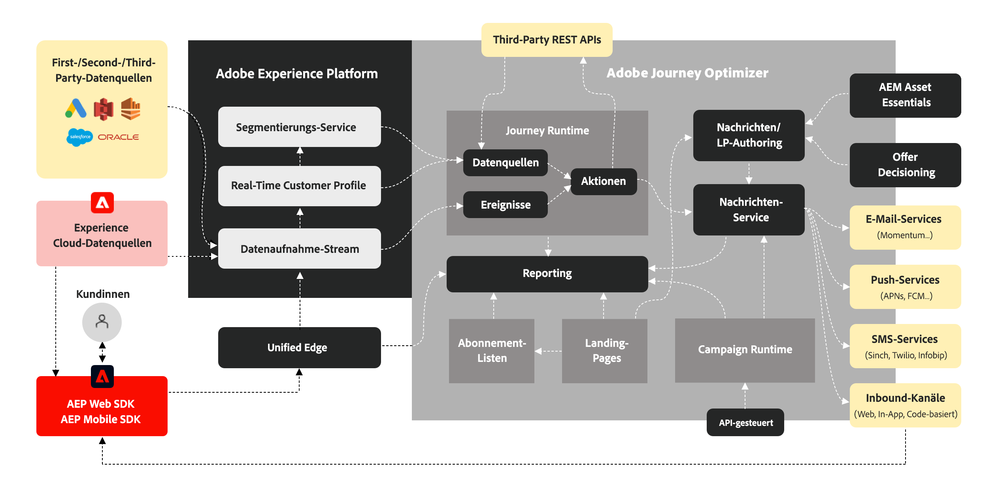

# Grundlegendes zu Journey Optimizer {#understanding-ajo}

Adobe Journey Optimizer und Adobe Experience Platform arbeiten zusammen, um eine datengesteuerte Personalisierung in jedem Maßstab zu ermöglichen. Auf dieser Seite wird erläutert, wie diese Systeme funktionieren und wie ihre wichtigsten Funktionsbereiche zusammenwirken, um außergewöhnliche Kundenerlebnisse zu schaffen. [Erfahren Sie mehr über die wichtigsten Funktionen](get-started.md) | [Wichtige Terminologie &#x200B;](terminology.md)

## Funktionsweise von Journey Optimizer {#how-it-works}

Adobe Journey Optimizer fungiert als kontinuierlicher Fluss, in dem Daten erfasst, analysiert und angewendet werden, um personalisierte Kunden-Journey zu erstellen.

### Adobe Experience Platform: The Foundation {#aep-foundation}

Adobe Experience Platform dient als Rückgrat, mit dem Marken Kundendaten zentralisieren und für personalisierte Erlebnisse aktivieren können:

* **Datenplattform** - Zentraler Knotenpunkt für die Erfassung, Verwaltung und Strukturierung von Kundendaten, um die systemübergreifende Konsistenz sicherzustellen. [Erfahren Sie mehr über Schemata und Datensätze](../data/get-started-schemas.md)
* **Datenaufnahme (Quellen)** - Importieren Sie Daten von CRM-Plattformen, Websites, Mobile Apps und Cloud-Speicher mithilfe vordefinierter Connectoren. [Erkunden von Datenquellen](../data/get-started-sources.md)
* **Echtzeit-Kundenprofil** - Erstellt einheitliche Profile, indem Daten aus verschiedenen Quellen (E-Mail-Interaktionen, In-Store-Käufe, Web-Verhalten) zusammengeführt werden. [Erfahren Sie mehr über Profile](../audience/get-started-profiles.md)
* **Governance-Ebene** - Steuert den Datenzugriff, die Einhaltung von Datenschutzbestimmungen und die Sicherheit bei gleichzeitiger Einhaltung von Vorschriften. [Datenschutzdokumentation anzeigen](../privacy/get-started-privacy.md)

### Adobe Journey Optimizer: Die Orchestrierungs-Engine {#ajo-orchestration}

Adobe Journey Optimizer wendet die Daten und Erkenntnisse aus Adobe Experience Platform an, um intelligente, personalisierte Kundenerlebnisse bereitzustellen:

* **Kundenverständnis** - Echtzeit-Kundenprofile ermöglichen die Segmentierung in Zielgruppen für zielgerichtetes Messaging. [Erstellen von Zielgruppen](../audience/about-audiences.md)
* **Inhalte und Angebote** - Tools zum Erstellen, Verwalten und Personalisieren von Inhalten; Echtzeit-Logik zur Auswahl des besten Angebots für jede Person. [Inhalte entwerfen](../content-management/get-started-content.md) | [Angebote verwalten](../offers/get-started/starting-offer-decisioning.md)
* **Journey- und Kampagnenverwaltung** Automatisiert Interaktionssequenzen (Journey) oder plant einmalige zielgerichtete Nachrichten (Kampagnen). [Journey erstellen](../building-journeys/journey-gs.md) | [Erstellen von Kampagnen](../campaigns/get-started-with-campaigns.md)
* **Versand (Verbindungen)** : Versendet Nachrichten über Kanäle wie E-Mail, SMS, Push-Benachrichtigungen und Briefpost; exportiert Daten in externe Systeme. [Konfigurieren der Kanäle](../configuration/get-started-configuration.md)
* **Messung und Analyse** - Verfolgt die Kundeninteraktion und die Kampagnenleistung mit Berichten zur kontinuierlichen Verbesserung. [Anzeigen von Berichten](../reports/campaign-global-report.md)

### Der kontinuierliche Optimierungszyklus {#optimization-cycle}

Dieses Ökosystem funktioniert als kontinuierlicher Optimierungszyklus. Daten fördern das Kundenverständnis, das in personalisierte Inhalte und Entscheidungen einfließt. Diese werden in Journeys orchestriert, kanalübergreifend bereitgestellt, auf Effektivität getestet und im Laufe der Zeit verfeinert.

## Wichtige Funktionsbereiche {#functional-areas}

Journey Optimizer umfasst sieben wichtige Funktionsbereiche, die nahtlos zusammenarbeiten:

| Funktionsbereich | Zweck | Schlüsselaktivitäten |
|-----------------|---------|----------------|
| **Daten-Management** | Kundendaten organisieren | Schemata definieren, Datensätze erstellen, Daten aus verschiedenen Systemen importieren. [Weitere Informationen](../data/get-started-schemas.md) |
| **Kundenverwaltung** | Verstehen, wer Ihre Kundschaft ist | Einheitliche Profile erstellen, Identitäten auflösen, Audiences erstellen. [Weitere Informationen](../audience/get-started-profiles.md) |
| **Content-Management** | Personalisierte Nachrichten erstellen | Entwerfen von E-Mails, Verwalten von Assets, Erstellen von Vorlagen und Fragmenten, Personalisieren von Inhalten [Weitere Informationen](../content-management/get-started-content.md) |
| **Entscheidungs-Management** | Auswahl des besten Angebots in Echtzeit | Angebotsbibliothek verwalten, Regeln definieren, Einschränkungen anwenden und Ranking-Logik einrichten. [Weitere Informationen](../offers/get-started/starting-offer-decisioning.md) |
| **Journey-Verwaltung** | Entwerfen automatisierter Kundenerlebnisse | Erstellen Sie Journey mit Visual Designer, legen Sie Trigger fest, fügen Sie Bedingungen hinzu und warten Sie Schritte. [Weitere Informationen](../building-journeys/journey-gs.md) |
| **Verbindungen** | Verbinden von Datenquellen und Kanälen | Quell-Connectoren konfigurieren, Kanäle einrichten, Verbindungen zu externen Plattformen herstellen. [Weitere Informationen](../configuration/get-started-configuration.md) |
| **Administration und Datenschutz** | Einrichtung und Konformität von Kontrollen | Benutzer verwalten, Sandboxes konfigurieren, Kanäle einrichten, Datenschutzanfragen bearbeiten. [Weitere Informationen](../administration/permissions.md) |

### So arbeiten diese Bereiche zusammen {#working-together}

Diese Funktionsbereiche arbeiten in einem kontinuierlichen Zyklus:

1. **Datenaufnahme** - Datenflüsse in Adobe Experience Platform, strukturiert nach Daten-Management
2. **Kundenverständnis** - Echtzeit-Kundenprofile vereinheitlichen Daten, Customer Management erstellt Zielgruppen
3. **Content- und Angebotsstrategie** - Content-Management erstellt Nachrichten; Entscheidungs-Management definiert Angebotslogik
4. **Orchestrierung** - Das Journey-Management ordnet Interaktionen kanalübergreifend mithilfe von Kundendaten, Inhalten und Entscheidungen zu
5. **Versand** - Verbindungen erleichtern den Nachrichtenversand über Kanäle oder geben Daten an externe Systeme weiter
6. **Messung** - Leistungsdaten liefern Einblicke zurück, um Zielgruppen, Inhalte, Entscheidungen und Journey zu verfeinern
7. **Governance** - Verwaltungs- und Datenschutzkontrollen sorgen für die Einhaltung von

## Architekturdetails {#architecture-details}

Für technische Teams finden Sie hier das detaillierte Architekturdiagramm, das zeigt, wie Journey Optimizer mit Adobe Experience Platform integriert wird. [Navigieren Sie in der Benutzeroberfläche](user-interface.md) um diese Komponenten in der Praxis zu erkunden.

Vier Programme basieren nativ auf Experience Platform: Adobe Real-Time Customer Data Platform, Journey Optimizer, Customer Journey Analytics und Adobe Mix Modeler. Journey Optimizer arbeitet nahtlos mit diesen Anwendungen zusammen, kann aber auch unabhängig voneinander arbeiten. [Lesen Sie Leitplanken und Einschränkungen](guardrails.md), um Überlegungen zur Implementierung anzuzeigen.

### Integrationspunkte {#integration-points}

Journey Optimizer lässt sich auf mehreren Ebenen mit Adobe Experience Platform integrieren:

* **Datenschicht**: Gibt dasselbe Echtzeit-Kundenprofil, Identitätsdiagramm und dieselben Datensätze frei
* **Service-Ebene** - Nutzt die Governance-, Datenschutz- und Abfrage-Services von Adobe Experience Platform
* **Anwendungsebene** - Bietet Journey-Orchestrierung, Entscheidungs-Management und Content-Management zusätzlich zu Adobe Experience Platform

Weitere Informationen zu [Adobe Journey Optimizer-Blueprints](https://experienceleague.adobe.com/de/docs/blueprints-learn/architecture/customer-journeys/journey-optimizer/journey-optimizer-overview){target="_blank"}.

## Datenschutz und Sicherheit {#privacy-security}

Die Datenschutz- und Sicherheitspraktiken von Adobe Experience Cloud gelten auch für Adobe Journey Optimizer. Diese Maßnahmen gewährleisten die Einhaltung von Datenschutzbestimmungen wie der DSGVO, sodass Sie personalisierte Erlebnisse bereitstellen und gleichzeitig das Vertrauen der Kunden bewahren können. [Erfahren Sie mehr über den Datenschutz in Journey Optimizer](../privacy/get-started-privacy.md)
