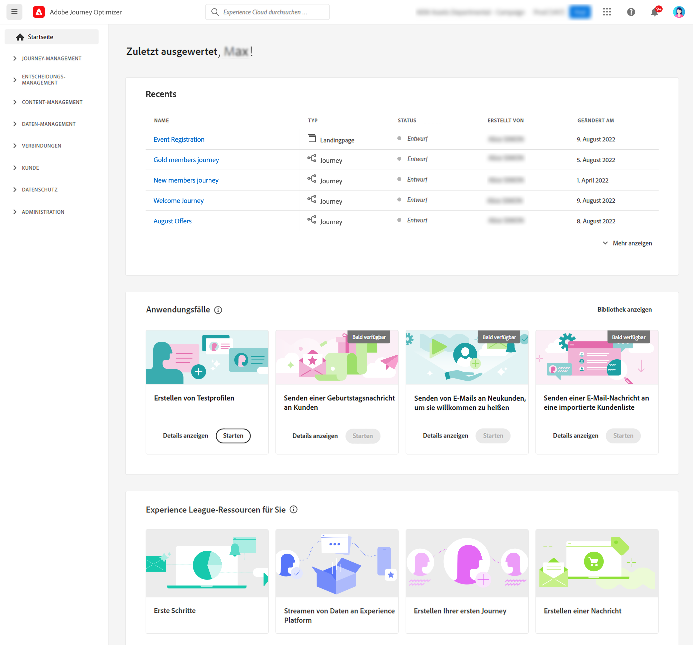
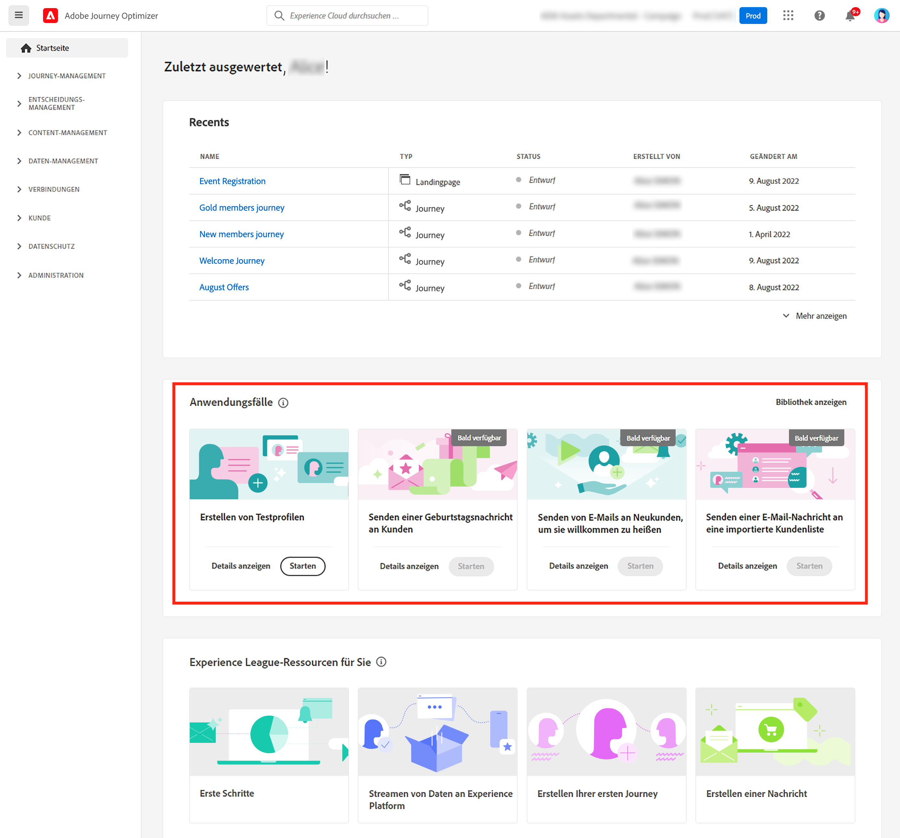
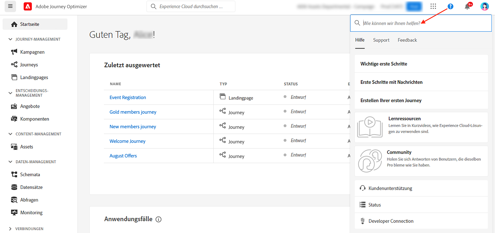
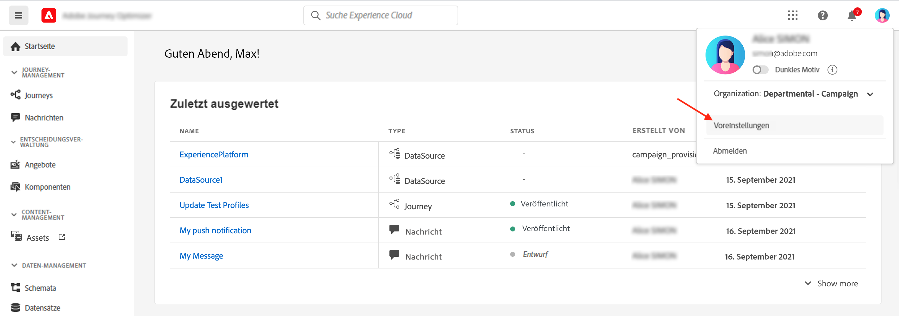
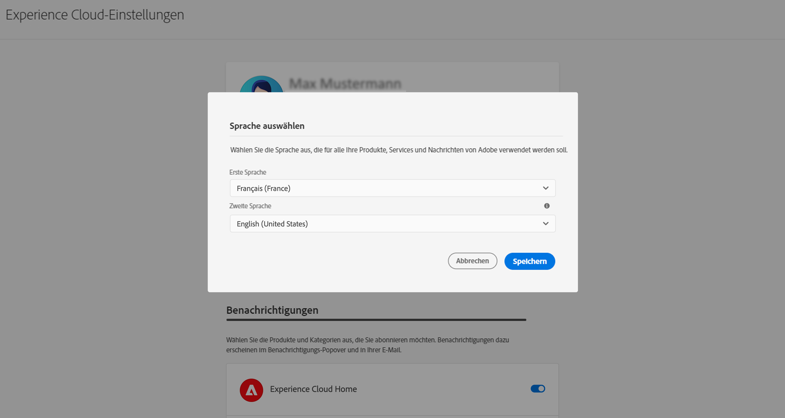
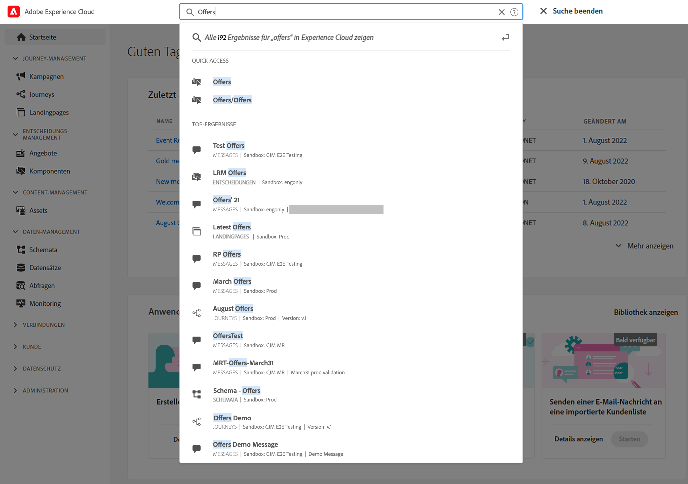
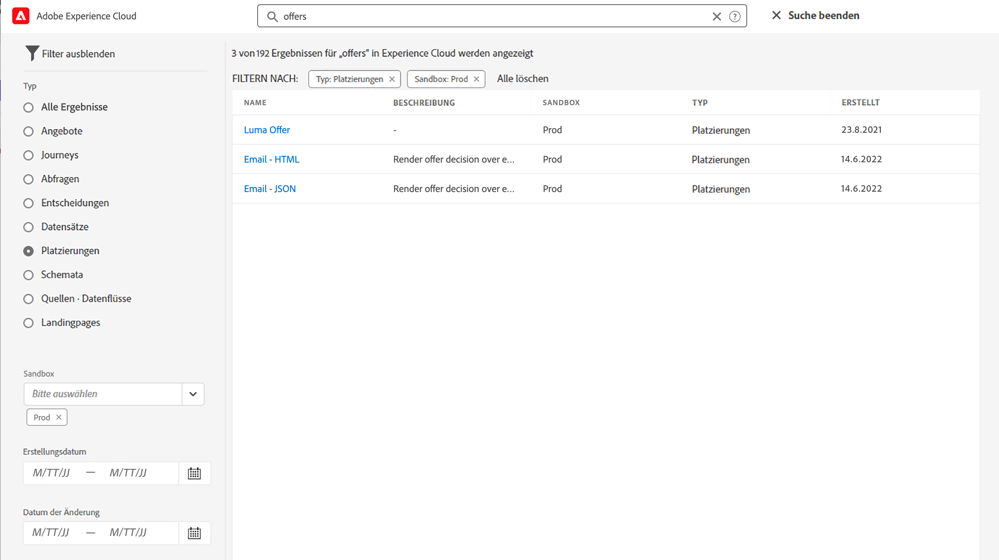
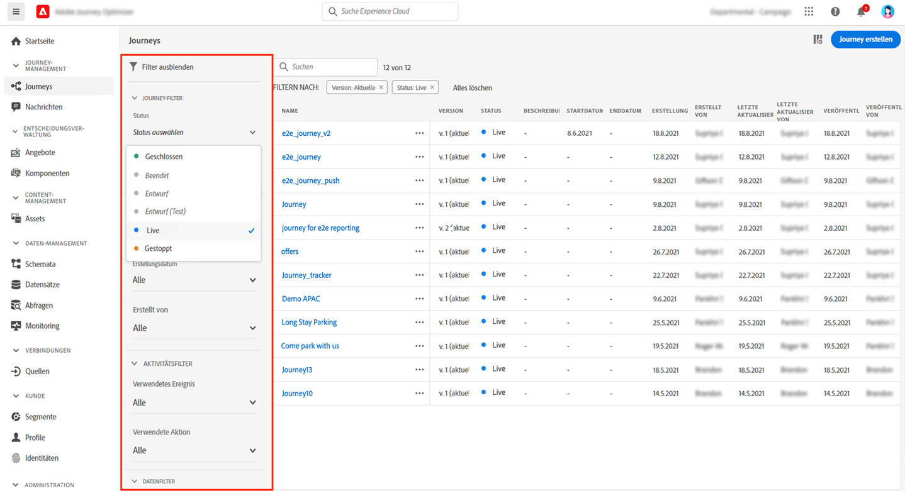
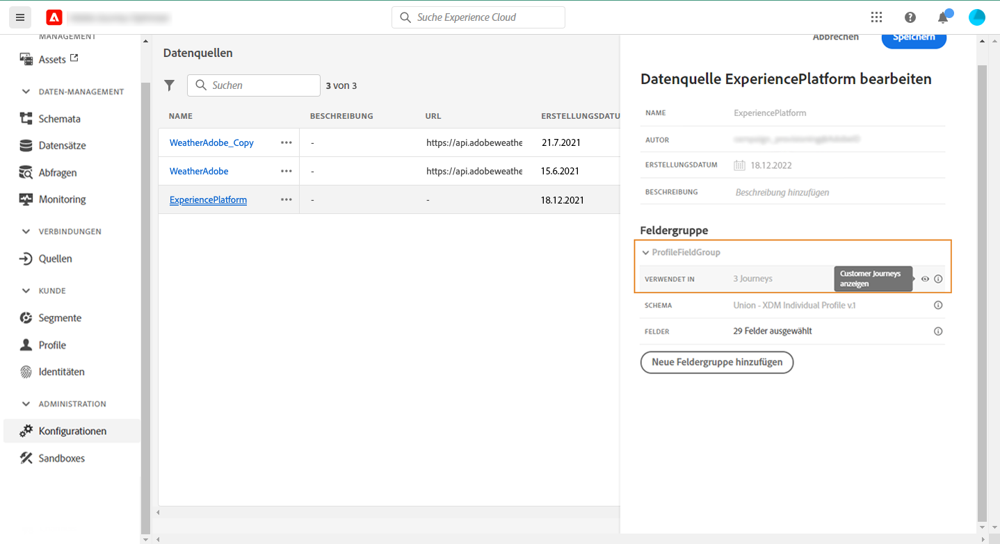
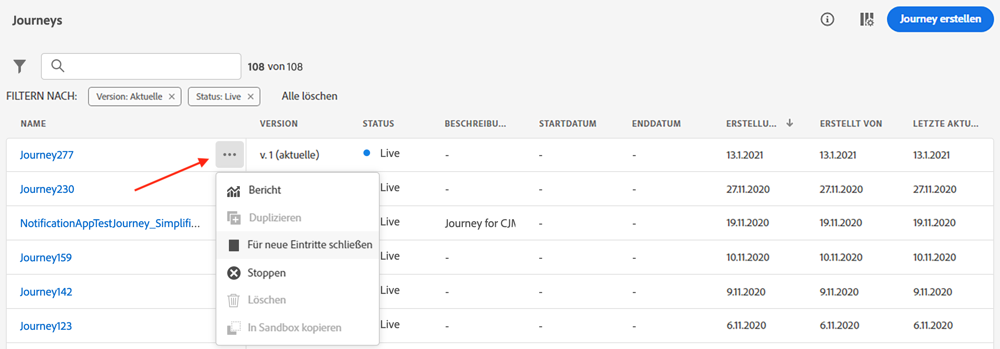

# Benutzeroberfläche {#cjm-user-interface}

Verbinden mit [Adobe Experience Cloud](http://experience.adobe.com) und navigieren Sie zu [!DNL Journey Optimizer].

Schlüsselkonzepte beim Durchsuchen der Benutzeroberfläche sind in Adobe Experience Platform üblich. Siehe [Dokumentation zu Adobe Experience Platform](https://experienceleague.adobe.com/docs/experience-platform/landing/platform-ui/ui-guide.html#adobe-experience-platform-ui-guide){target=&quot;_blank&quot;} für weitere Details.

Die in der Benutzeroberfläche verfügbaren Komponenten und Funktionen hängen von Ihrer [Berechtigungen](../administration/permissions.md) und auf [Lizenzpaket](https://helpx.adobe.com/legal/product-descriptions/adobe-journey-optimizer.html){target=&quot;_blank&quot;}. Wenden Sie sich bei Fragen an Ihren Adobe Customer Success Manager.

>[!NOTE]
>
>Diese Dokumentation wird häufig aktualisiert, um die neuesten Änderungen an der Benutzeroberfläche des Produkts widerzuspiegeln. Einige Screenshots können sich jedoch geringfügig von Ihrer Benutzeroberfläche unterscheiden.

## Linke Navigation {#left-nav}

Links links durchsuchen, um auf [!DNL Journey Optimizer] Funktionen.

>[!NOTE]
>
>Die verfügbaren Funktionen variieren je nach Ihren Berechtigungen und Lizenzvereinbarungen.

Unten finden Sie die vollständige Liste der im linken Navigationsbereich verfügbaren Dienste und Funktionen sowie Links zu den zugehörigen Hilfeseiten.

**Startseite**

[!DNL Journey Optimizer] Die Startseite enthält wichtige Links und Ressourcen, die gestartet werden sollen. Die **[!UICONTROL Recents]** -Liste enthält Verknüpfungen zu den kürzlich erstellten Ereignissen und Journeys. Diese Liste zeigt das Erstellungs- und Änderungsdatum und -status.

**[!UICONTROL JOURNEY MANAGEMENT]**

* **[!UICONTROL Journeys]** - Erstellen, konfigurieren und orchestrieren Sie Ihre Customer Journeys. [Weitere Infos](../building-journeys/journey-gs.md#jo-build)

* **[!UICONTROL Landing pages]** - Landingpages erstellen, entwerfen, testen und veröffentlichen. [Weitere Infos](../landing-pages/get-started-lp.md)

**[!UICONTROL DECISION MANAGEMENT]**

* **[!UICONTROL Offers]** - Greifen Sie über dieses Menü auf Ihre aktuellen Quellen und Datensätze zu. Verwenden Sie diesen Abschnitt, um neue Angebote zu erstellen. [Weitere Infos](../offers/offer-library/creating-personalized-offers.md)

* **[!UICONTROL Components]** - Erstellen Sie Platzierungen, Regeln und Tags. [Weitere Infos](../offers/offer-library/key-steps.md)

**[!UICONTROL CONTENT MANAGEMENT]**

* **[!UICONTROL Assets]** - [!DNL Adobe Experience Manager Assets Essentials] ist ein zentralisiertes Repository von Assets, mit dem Sie Ihre Nachrichten ausfüllen können. [Weitere Infos](../email/assets-essentials.md)

**[!UICONTROL DATA MANAGEMENT]**

* **[!UICONTROL Schemas]** - Verwenden Sie Adobe Experience Platform, um Experience-Datenmodell (XDM)-Schemas in einer interaktiven visuellen Arbeitsfläche namens Schema Editor zu erstellen und zu verwalten. [Weitere Infos](../data/get-started-schemas.md)

* **[!UICONTROL Datasets]** - Alle Daten, die in Adobe Experience Platform erfasst werden, werden im Data Lake als Datensätze persistiert. Ein Datensatz ist ein Speicher- und Verwaltungskonstrukt für eine Sammlung von Daten, normalerweise eine Tabelle, die ein Schema (Spalten) und Felder (Zeilen) enthält. [Weitere Infos](../data/get-started-datasets.md)

* **[!UICONTROL Queries]** - Verwenden Sie Adobe Experience Platform Query Service, um Abfragen zu schreiben und auszuführen, zuvor ausgeführte Abfragen anzuzeigen und auf Abfragen zuzugreifen, die von Benutzern in Ihrer Organisation gespeichert wurden. [Weitere Infos](../data/get-started-queries.md)

* **[!UICONTROL Monitoring]** - Verwenden Sie dieses Menü, um die Datenerfassung in der Benutzeroberfläche von Adobe Experience Platform zu überwachen. [Weitere Infos](https://experienceleague.adobe.com/docs/experience-platform/ingestion/quality/monitor-data-ingestion.html){target=&quot;_blank&quot;}

**[!UICONTROL CONNECTIONS]**

* **[!UICONTROL Sources]** - Verwenden Sie dieses Menü, um Daten aus verschiedenen Quellen zu erfassen - z. B. aus Adobe-Anwendungen, Cloud-basierten Speichern, Datenbanken und mehr - sowie eingehende Daten zu strukturieren, zu beschriften und zu erweitern. [Weitere Infos](get-started-sources.md)

**[!UICONTROL CUSTOMER]**

* **[!UICONTROL Segments]** - Erstellen und verwalten Sie Experience Platform-Segmentdefinitionen und nutzen Sie sie in Ihren Journeys. [Weitere Infos](../segment/about-segments.md)

* **[!UICONTROL Profiles]** - Das Echtzeit-Kundenprofil erstellt eine ganzheitliche Ansicht Ihrer einzelnen Kunden und kombiniert Daten aus verschiedenen Kanälen, einschließlich Online-, Offline-, CRM- und Drittanbieter-Daten. [Weitere Infos](../segment/get-started-profiles.md)

* **[!UICONTROL Identities]** - Adobe Experience Platform Identity Service verwaltet die geräteübergreifende, kanalübergreifende und nahe Echtzeit-Identifizierung Ihrer Kunden in einem so genannten Identitätsdiagramm innerhalb von Adobe Experience Platform. [Weitere Infos](../segment/get-started-identity.md)

**[!UICONTROL ADMINISTRATION]**

* **[!UICONTROL Journey Administration]** - Verwenden Sie dieses Menü, um [events](../event/about-events.md), [Datenquellen](../datasource/about-data-sources.md) und [Aktionen](../action/action.md) zur Verwendung in Ihren Journeys.

* **[!UICONTROL Sandboxes]** - Adobe Experience Platform bietet Sandboxes, die eine einzelne Instanz in separate virtuelle Umgebungen aufteilen, um die Entwicklung und Weiterentwicklung von Programmen für digitale Erlebnisse zu erleichtern. [Weitere Infos](../administration/sandboxes.md)

* **[!UICONTROL Alerts]** - In der Benutzeroberfläche können Sie einen Verlauf der empfangenen Warnungen anhand von Metriken anzeigen, die von Adobe Experience Platform Observability Insights bereitgestellt wurden. Über die Benutzeroberfläche können Sie auch verfügbare Warnhinweisregeln anzeigen, aktivieren und deaktivieren. [Weitere Infos](https://experienceleague.adobe.com/docs/experience-platform/observability/alerts/overview.html){target=&quot;_blank&quot;}

## Anwendungsfälle für das Produkt {#in-product-uc}

Nutzung [!DNL Adobe Journey Optimizer] Anwendungsfälle von der Startseite aus und stellen einige schnelle Eingaben bereit, um eine Customer Journey zu erstellen.

Verfügbare Anwendungsfälle sind:

* **Testprofile erstellen**, um mithilfe unserer CSV-Vorlage Testprofile zu erstellen und so personalisierte Nachrichten und Journeys zu testen. Erfahren Sie, wie Sie dieses Anwendungsbeispiel implementieren [auf dieser Seite](../segment/creating-test-profiles.md#use-case-1).
* **Geburtstagsnachricht an Kunden senden**, um Ihren Kunden automatisch eine E-Mail zum Geburtstag zu schicken. (in Kürze verfügbar)
* **E-Mails an neue Kunden senden**, um bis zu zwei E-Mails zu versenden, um Ihre neu registrierten Kunden willkommen zu heißen. (in Kürze verfügbar)
* **Push-Nachrichten an die importierte Kundenliste senden**, um eine Push-Benachrichtigung schnell an eine Liste von Kunden zu senden, die aus einer CSV-Datei importiert wurden. (in Kürze verfügbar)

Klicken **[!UICONTROL View details]** , um mehr über jeden Anwendungsfall zu erfahren.

Klicken Sie auf **[!UICONTROL Begin]** -Schaltfläche, um den Anwendungsfall zu starten.

Auf ausgeführte Anwendungsfälle können Sie über die **[!UICONTROL View use case library]** Schaltfläche.

## Zugänglichkeit{#accessibility}

Die Funktionen für Barrierefreiheit in [!DNL Adobe Journey Optimizer] von Adobe Experience Platform übernommen werden:

* Tastaturzugriff
* Farbkontrast
* Validierung erforderlicher Felder

[Weitere Infos](https://experienceleague.adobe.com/docs/experience-platform/accessibility/features.html){target=&quot;_blank&quot;} in der Adobe Experience Platform-Dokumentation.

Sie können die gängigen Tastaturbefehle in [!DNL Journey Optimizer]:

| Aktion | Tastaturbefehl |
| --- | --- |
| Zwischen Elementen, Abschnitten und Menügruppen der Benutzeroberfläche wechseln | Registerkarte |
| Zwischen Elementen, Abschnitten und Menügruppen der Benutzeroberfläche rückwärts wechseln | Umschalt + Tab |
| Verschieben innerhalb von Abschnitten zum Festlegen des Fokus auf einzelne Elemente | Pfeil |
| Element im Fokus auswählen oder löschen | Eingabe oder Leertaste |
| Abbrechen einer Auswahl, Reduzieren eines Bereichs oder Schließen eines Dialogfelds | Esc |

[Weitere Infos](https://experienceleague.adobe.com/docs/experience-platform/accessibility/custom.html){target=&quot;_blank&quot;} in der Adobe Experience Platform-Dokumentation.

Sie können diese Tastaturbefehle in bestimmten Teilen von Journey Optimizer verwenden:

<table>
  <thead>
    <tr>
      <th>Schnittstellenelement</th>
      <th>Aktion</th>
      <th>Tastaturbefehl</th>
    </tr>
  </thead>
  <tr>
    <td>Liste der Journeys, Aktionen, Datenquellen oder Ereignisse</td>
    <td>Erstellen einer Journey, einer Aktion, einer Datenquelle oder eines Ereignisses</td>
    <td>C</td>
  </tr>
  <tr>
    <td rowspan="3">Arbeitsfläche der Journey im Entwurfsstatus</td>
    <td>Aktivität von oben nach unten in der linken Palette an der ersten verfügbaren Position hinzufügen</td>
    <td>Doppelklicken Sie auf die Aktivität</td>
  </tr>
  <tr>
    <td>Alle Aktivitäten auswählen</td>
    <td>Strg + A (Windows) Befehl + A (Mac)</td>
  </tr>
  <tr>
    <td>Ausgewählte Aktivitäten löschen</td>
    <td>Löschen oder Rücktaste und anschließende Eingabe zur Bestätigung des Löschvorgangs</td>
  </tr>
  <tr>
  <td rowspan="3">

Konfigurationsbereich dieser Elemente:

<ul>
  <li>Aktivität in einer Journey</li>
  <li>Ereignis</li>
  <li>Datenquelle</li>
  <li>Aktion</li>
</ul>

</td>
    <td>Zum nächsten zu konfigurierenden Feld wechseln</td>
    <td>Registerkarte</td>
  </tr>
  <tr>
    <td>Speichern Sie die Änderungen und schließen Sie den Konfigurationsbereich</td>
    <td>Eingabe</td>
  </tr>
  <tr>
    <td>Verwerfen Sie Änderungen und schließen Sie den Konfigurationsbereich</td>
    <td>Esc</td>
  </tr>
  <tr>
    <td rowspan="4">Journey im Testmodus</td>
    <td>Testmodus aktivieren oder deaktivieren</td>
    <td>T</td>
  </tr>
  <tr>
    <td>Auslösen eines Ereignisses in einer ereignisbasierten Journey</td>
    <td>E</td>
  </tr>
  <tr>
    <td>

Lösen Sie ein Ereignis in einer segmentbasierten Journey aus, für die die **[!UICONTROL Single profile at a time]** Option ist aktiviert

</td>
    <td>P</td>
  </tr>
  <tr>
    <td>Testprotokolle anzeigen</td>
    <td>L</td>
  </tr>
<!-- //Ajouter ce raccourci quand il marchera (actuellement, le raccourci Ctrl/Cmd+F du navigateur a priorité sur celui de AJO).//
  <tr>
    <td>Page with a search bar</td>
    <td>Select the search bar</td>
    <td>Ctrl/Command + F</td>
  </tr>
-->
  <tr>
    <td>Textfeld</td>
    <td>Gesamten Text im ausgewählten Feld auswählen</td>
    <td>Strg + A (Windows) Befehl + A (Mac)</td>
  </tr>
  <tr>
    <td rowspan="2">Popup-Fenster</td>
    <td>Änderungen speichern oder die Aktion bestätigen</td>
    <td>Eingabe</td>
  </tr>
  <tr>
    <td>Fenster schließen</td>
    <td>Esc</td>
  </tr>
  <tr>
    <td>Einfacher Ausdruckseditor</td>
    <td>Feld auswählen und hinzufügen</td>
    <td>Doppelklicken Sie auf ein Feld</td>
  </tr>
  <tr>
    <td>Durchsuchen von XDM-Feldern</td>
    <td>Auswählen aller Felder eines Knotens</td>
    <td>Auswählen des übergeordneten Knotens</td>
  </tr>
  <tr>
    <td>Payload-Vorschau</td>
    <td>Auswählen der Payload</td>
    <td>Strg + A (Windows) Befehl + A (Mac)</td>
  </tr>
</table>

## Hilfe und Support suchen {#find-help}

Greifen Sie über den unteren Bereich der Startseite auf die wichtigsten Hilfeseiten von Adobe Journey Optimizer zu.

Verwenden Sie die **Hilfe** -Symbol, um auf Hilfeseiten zuzugreifen, den Support zu kontaktieren und Feedback zu teilen. Sie können Hilfe-Artikel und Videos aus dem Suchfeld suchen.

## Unterstützte Browser {#browsers}

Adobe [!DNL Journey Optimizer] -Schnittstelle ist so konzipiert, dass sie in der neuesten Version von Google Chrome optimal funktioniert. Bei der Verwendung bestimmter Funktionen in älteren Versionen oder anderen Browsern kann es zu Problemen kommen.

## Sprachvoreinstellungen {#language-pref}

Die Benutzeroberfläche ist derzeit in den folgenden Sprachen verfügbar:

* englisch
* französisch
* deutsch
* italienisch
* spanisch
* Portugiesisch (Brasilianisch)
* Japanisch
* Koreanisch

Die Standardsprache der Benutzeroberfläche wird von der in Ihrem Benutzerprofil angegebenen bevorzugten Sprache bestimmt.

So ändern Sie Ihre Sprache:

* Klicken **Voreinstellungen** von Ihrem Avatar, oben rechts.
   
* Klicken Sie dann auf die Sprache, die unter Ihrer E-Mail-Adresse angezeigt wird.
* Wählen Sie Ihre bevorzugte Sprache aus und klicken Sie auf **Speichern**. Sie können eine zweite Sprache auswählen, falls die von Ihnen verwendete Komponente nicht in Ihrer Muttersprache lokalisiert ist.
   

## Suche{#unified-search}

Nutzen Sie überall in der Benutzeroberfläche von Adobe Journey Optimizer die einheitliche Suchfunktion von Adobe Experience Cloud in der Mitte der oberen Leiste, um Assets, Journeys, Datensätze und mehr in Ihren Sandboxes zu finden.

Beginnen Sie mit der Eingabe des Inhalts, um die wichtigsten Ergebnisse anzuzeigen. Hilfe-Artikel über die eingegebenen Suchbegriffe werden auch in den Ergebnissen angezeigt.

Presse **Eingabe** , um auf alle Ergebnisse zuzugreifen und nach Geschäftsobjekt zu filtern.

## Filterlisten{#filter-lists}

In den meisten Listen können Sie über eine Suchleiste nach einem bestimmten Element suchen und Filterkriterien auswählen.

Der Zugriff auf Filter erfolgt über das Filtersymbol links oben in der Liste. Im Filtermenü können Sie die angezeigten Elemente nach unterschiedlichen Kriterien filtern. Sie können festlegen, dass nur Elemente eines bestimmten Typs oder Status, der von Ihnen erstellten Elemente oder der in den letzten 30 Tagen geänderten Elemente angezeigt werden. Die Optionen unterscheiden sich je nach Kontext.

In der Liste der Journeys können Sie Journeys nach ihrem Status, Typ und Version aus der **[!UICONTROL Status and version filters]**. Der Typ kann: **[!UICONTROL Unitary event]**, **[!UICONTROL Segment qualification]**, **[!UICONTROL Read segment]**, **[!UICONTROL Business event]** oder **[!UICONTROL Burst]**. Sie können festlegen, dass nur Journeys angezeigt werden, die ein bestimmtes Ereignis, eine bestimmte Feldergruppe oder eine bestimmte Aktion aus der **[!UICONTROL Activity filters]** und **[!UICONTROL Data filters]**. Die **[!UICONTROL Publication filters]** können Sie ein Veröffentlichungsdatum oder einen Benutzer auswählen. Sie können beispielsweise auswählen, ob die neuesten Versionen von Live-Journeys angezeigt werden sollen, die gestern veröffentlicht wurden. [Weitere Infos](../building-journeys/using-the-journey-designer.md).

>[!NOTE]
>
>Beachten Sie, dass die angezeigten Spalten mithilfe der Konfigurationsschaltfläche oben rechts in den Listen personalisiert werden können. Die Personalisierung wird für jeden Benutzer gespeichert.

Verwenden Sie die **[!UICONTROL Last update]** und **[!UICONTROL Last update by]** Spalten, die überprüfen sollen, wann das letzte Update Ihrer Journeys stattgefunden hat und wer sie gespeichert hat.

Im Konfigurationsbereich Ereignis, Datenquelle und Aktion wird die **[!UICONTROL Used in]** zeigt die Anzahl der Journeys an, die dieses bestimmte Ereignis, diese Feldergruppe oder diese Aktion verwenden. Sie können auf die **[!UICONTROL View journeys]** -Schaltfläche, um die Liste der entsprechenden Journeys anzuzeigen.

In den Listen können Sie für jedes Element grundlegende Aktionen durchführen. Sie können beispielsweise ein Element duplizieren oder löschen.

