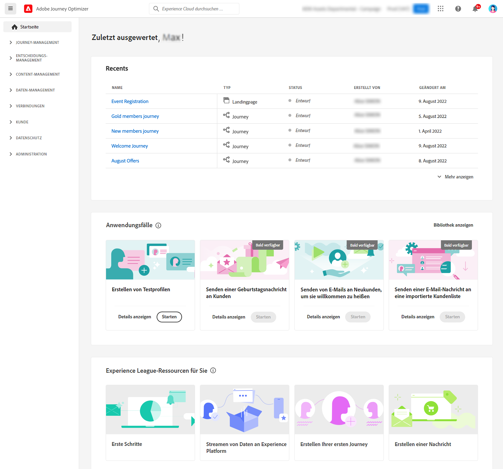
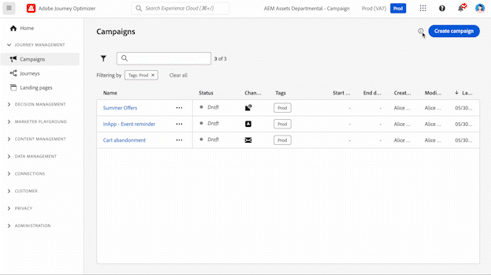

# Navigieren in der Benutzeroberfläche {#user-interface}

>[!BEGINSHADEBOX]

**Auf dieser Seite:** Machen Sie sich mit der Benutzeroberfläche von Adobe Journey Optimizer vertraut – der oberen Leiste, der Startseite und dem linken Navigationsbereich –, damit Sie schnell auf die benötigten Funktionen und Möglichkeiten zugreifen können.

>[!ENDSHADEBOX]

Um auf Adobe Journey Optimizer zuzugreifen, melden Sie sich bei [[!DNL Adobe CX Enterprise]](https://experience.adobe.com) mit Ihrer Adobe ID an und klicken Sie dann auf [!DNL Journey Optimizer].

>[!NOTE]
>
>* Welche Komponenten und Funktionen in Ihrer Umgebung verfügbar sind, hängt von Ihren [Berechtigungen](../administration/permissions.md) und Ihrem [Lizenzierungspaket](https://helpx.adobe.com/de/legal/product-descriptions/adobe-journey-optimizer.html){target="_blank"} ab.
>* Diese Dokumentation wird häufig aktualisiert. Einige Screenshots können leicht von Ihrer Benutzeroberfläche abweichen.

## Kurzer Überblick {#quick-tour}

Die Benutzeroberfläche von Journey Optimizer besteht aus vier Hauptbereichen:

1. **Linker Navigationsbereich**: Zugriff auf alle Funktionen, sortiert nach Funktion
2. **Obere Leiste**: Universelle Suche, Hilfe, Benachrichtigungen und Einstellungen
3. **Startseite**: Schnellzugriff auf kürzlich erstellte Elemente und hilfreiche Ressourcen
4. **Hauptarbeitsbereich**: Bereich zum Erstellen und Verwalten von Inhalten

**Tipp:** Neue Benutzende können von der **Startseite** aus auf die zuletzt verwendeten Elemente und Anwendungsfälle zugreifen oder über das Symbol **Hilfe** in der oberen Leiste eine kontextuelle Anleitung erhalten.

## Funktionen der oberen Leiste {#top-bar}

### Universelle Suche {#universal-search}

Verwenden Sie das Symbol „Suche“, um Journeys, Kampagnen, Assets und andere Objekte in Journey Optimizer schnell zu finden. Geben Sie Keywords ein, um relevante Ergebnisse aus allen Bereichen der Plattform anzuzeigen. [Erfahren Sie mehr über die universelle Suche](search-filter-categorize.md#unified-search).

### Hilfe und Support {#help}

Klicken Sie auf das Symbol **Hilfe**, um:

* Hilfeartikel und Videos zu suchen
* Auf die kontextuelle Hilfe für die aktuelle Seite zuzugreifen
* Den Adobe Support zu kontaktieren
* Feedback geben

Die kontextuelle Hilfe zeigt Anleitungen an, die für den aktuellen Bildschirm relevant sind, und verweist direkt auf die entsprechende Dokumentation, sodass Sie die richtigen Informationen erhalten, ohne Ihren Workflow verlassen zu müssen.

#### Support-Ticket-Richtlinien {#support-ticket-guidelines}

Wenn Sie sich an den Adobe-Support wenden, geben Sie die folgenden Informationen an, um die Analyse der Grundursache und die Lösungsfindung zu beschleunigen:

* **Umgebungsdetails**: Sandbox-Name, Organisations-ID und Produktbereich (z. B. Journeys, Kampagnen, Entscheidungsfindung)
* **Auswirkungsstufe**: Schweregrad des Problems (z. B. Produktion blockiert, eingeschränkte Funktionalität, oberflächliche Auswirkungen)
* **Replikationsschritte**: Klare, detaillierte Anweisungen zum Reproduzieren des Problems
* **Protokolle oder Screenshots**: Relevante Fehlermeldungen, Anfrage-IDs oder Screenshots, die das Problem veranschaulichen
* **Relevante IDs**: Journey-ID, Kampagnen-ID, Zielgruppen-ID oder andere Objektkennungen, die mit dem Problem zusammenhängen

### Benachrichtigungen {#in-product-uc}

Aktivieren Sie produktinterne und E-Mail-Benachrichtigungen, um über Folgendes auf dem Laufenden zu bleiben:

* **Warnhinweise**: Systemausfälle und Leistungsprobleme
* **Genehmigungen**: Anfragen, die von Ihnen überprüft werden müssen
* **Neue Versionen**: Produktaktualisierungen und neue Funktionen

So konfigurieren Sie Benachrichtigungen:

1. Klicken Sie auf Ihr Profilsymbol und wählen Sie **[!UICONTROL Voreinstellungen]** aus.
2. Suchen Sie unter **[!UICONTROL Benachrichtigungen]** den Eintrag **[!UICONTROL Journey Optimizer]**.
3. Aktivieren Sie die Benachrichtigungstypen, die Sie erhalten möchten.

{width="60%" align="center"}

### Sprachvoreinstellungen {#language}

Die Benutzeroberfläche ist in den Sprachen Englisch, Französisch, Deutsch, Italienisch, Spanisch, Portugiesisch (Brasilianisch), Japanisch, Koreanisch, Chinesisch (Traditionell) und Chinesisch (Vereinfacht) verfügbar.

Gehen Sie wie folgt vor, um Ihre Sprache zu ändern:

1. Klicken Sie in Ihrem Profilmenü auf **[!UICONTROL Voreinstellungen]**.
2. Wählen Sie Ihre bevorzugte Sprache aus.
3. Wählen Sie optional eine zweite Sprache als Fallback aus.
4. Klicken Sie auf **Speichern**.

Es stehen Tastaturbefehle und Funktionen für die Barrierefreiheit zur Verfügung. [Weitere Informationen](accessibility.md)

## Startseite {#home-page}

Die Startseite bietet:

* **Zuletzt ausgewertet**: Verknüpfungen zu kürzlich erstellten Ereignissen, Journeys, Kampagnen und anderen Objekten
* **Anwendungsfälle**: Vorkonfigurierte Szenarien für einen schnellen Einstieg (Erstellen von Testprofilen, Senden von Geburtstagsnachrichten usw.)
* **Ressourcen**: Links zu Dokumentation, Tutorials und Support

### Anwendungsfälle und Schnellstart-Workflows {#use-cases}

Schnellstart-Workflows helfen Ihnen bei der Ausführung gängiger Aufgaben:

* **Erstellen von Testprofilen**: Generieren von Testprofilen mithilfe von CSV-Vorlagen
* **Senden von Geburtstagsnachrichten**: Automatisches Senden von Geburtstags-E-Mails (demnächst verfügbar)
* **Onboarding neuer Kundinnen und Kunden**: Willkommensserie für neue Kundinnen und Kunden (demnächst verfügbar)
* **Senden von Push-Benachrichtigungen an importierte Listen**: Schnelle Push-Benachrichtigungen über CSV-Daten (demnächst verfügbar)

Klicken Sie auf **[!UICONTROL Details anzeigen]**, um mehr über jeden Anwendungsfall zu erfahren, oder **[!UICONTROL Starten]**, um zu beginnen.

## Linke Navigation {#left-nav}

Im linken Navigationsbereich sind Journey Optimizer-Funktionen in funktionale Kategorien unterteilt. Die verfügbaren Menüelemente hängen von Ihren Berechtigungen und Ihrer Lizenz ab.

| Abschnitt | Zweck |
|---------|---------|
| Journey-Management | Kampagnen, Journeys, Berichte |
| Entscheidungs-Management | Angebote und Personalisierung |
| Content-Management | Assets, Vorlagen, Fragmente, Landingpages |
| Daten-Management | Schemata, Datensätze, Abfragen |
| Verbindungen | Quellen und Ziele |
| Kundin bzw. Kunde | Zielgruppen, Profile, Identitäten |
| Datenschutz | Richtlinien, Anfragen, Audit |
| Administration | Konfigurationen, Kanäle, Sandboxes |

### Hauptabschnitte {#main-sections}

**Startseite**: Ihr Ausgangspunkt mit Schnellzugriff auf kürzlich erstellte Elemente und hilfreiche Ressourcen

**Journey-Management**: Erstellen und Verwalten von Kundenerlebnissen

* **Kampagnen**: Erstellen von einmaligen oder geplanten Nachrichten für bestimmte Zielgruppen. [Erste Schritte mit Kampagnen](../campaigns/get-started-with-campaigns.md)
* **Journeys**: Erstellen von mehrstufigen Cross-Channel-Kundenerlebnissen. [Erstellen Ihrer ersten Journey](../building-journeys/journey-gs.md)
* **Berichte**: Analysieren der Leistung mit integriertem Customer Journey Analytics-Reporting. [Reporting-Dokumentation anzeigen](../reports/campaign-global-report-cja.md)

**Entscheidungs-Management**: Verwalten personalisierter Angebote. [Informationen zum Entscheidungs-Management](../offers/get-started/starting-offer-decisioning.md)

* **Angebote**: Erstellen und Verwalten personalisierter Angebote
* **Komponenten**: Einrichten von Platzierungen, Regeln und Tags für Angebote

**Content-Management**: Erstellen und Organisieren von Inhalten

* **Assets**: Zentralisiertes Repository für Bilder und Medien. [Verwalten von Assets](../integrations/assets.md)
* **Inhaltsvorlagen**: Wiederverwendbare Nachrichtenvorlagen für Kampagnen und Journeys. [Erstellen von Vorlagen](../content-management/content-templates.md)
* **Fragmente**: Inhaltsblöcke, die in mehreren Nachrichten verwendet werden können. [Arbeiten mit Fragmenten](../content-management/fragments.md)
* **Landingpages**: Web-Formulare für Abonnements und Voreinstellungen. [Entwerfen von Landingpages](../landing-pages/get-started-lp.md)
* **Playbooks für Anwendungsfälle**: Vorkonfigurierte Workflows für gängige Marketing-Szenarien. [Erkunden von Playbooks](ai-features.md#playbooks)

**Daten-Management**: Verwalten der Datengrundlage. [Informationen über Schemata und Datensätze](../data/get-started-schemas.md)

* **Schemata**: Definieren der Datenstruktur
* **Datensätze**: Speichern und Verwalten von Datenerfassungen
* **Abfragen**: Schreiben und Ausführen von Abfragen
* **Monitoring**: Verfolgen der Datenaufnahme

**Verbindungen**: Integrieren mit anderen Systemen

* **Quellen**: Aufnehmen von Daten aus externen Systemen. [Konfigurieren von Quellen](get-started-sources.md)
* **Ziele**: Exportieren von Daten in den Cloud-Speicher. [Einrichten von Zielen](../data/export-datasets.md)

**Kundin bzw. Kunde**: Verwalten von Zielgruppen und Profilen

* **Zielgruppen**: Erstellen und Verwalten von Kundensegmenten. [Arbeiten mit Zielgruppen](../audience/about-audiences.md)
* **Abonnement-Listen**: Verwalten von Opt-in-Listen. [Verwalten von Abonnements](../landing-pages/subscription-list.md)
* **Profile**: Anzeigen einheitlicher Kundenprofile. [Erkunden von Profilen](../audience/get-started-profiles.md)
* **Identitäten**: Verwalten der Identitätsbestimmung. [Informationen über Schemata](../audience/get-started-identity.md)

**Datenschutz**: Steuern von Datenschutz und Compliance. [Datenschutz – Überblick](../privacy/get-started-privacy.md)

* **Richtlinien**: Definieren von Data-Governance-Richtlinien
* **Anfragen**: Verarbeiten von Datenschutzanfragen (DSGVO, CCPA)
* **Audit**: Überprüfen von Aktivitätsprotokollen. [Informationen über Auditprotokolle](../privacy/audit-logs.md)
* **Datenlebenszyklus**: Konfigurieren der Datenspeicherung

**Administration**: Konfigurieren der Systemeinstellungen. [Zugriffskontrolle – Überblick](../administration/permissions-overview.md)

* **Konfigurationen**: Einrichten von Ereignissen, Datenquellen und Aktionen. [Konfigurieren der Kanäle](../configuration/get-started-configuration.md)
* **Geschäftsregeln**: Steuern der Häufigkeit von Nachrichten und Journey-Eintritt. [Einrichten von Geschäftsregeln](../conflict-prioritization/rule-sets.md)
* **Warnhinweise**: Anzeigen und Verwalten von Systemwarnhinweisen. [Überwachen von Warnhinweisen](../reports/alerts.md)
* **Sandboxes**: Veralten von Umgebungen und Kopieren von Objekten zwischen Sandboxes. [Arbeiten mit Sandboxes](../administration/sandboxes.md)
* **Kanäle**: Konfigurieren von Kanaleinstellungen und Zustellbarkeit. [Einrichten von Kanalkonfigurationen](../configuration/channel-surfaces.md) | [Erste Schritte mit der Konfiguration](../configuration/get-started-configuration.md)
* **Tags**: Organisieren und Kategorisieren von Inhalten. [Arbeiten mit einheitlichen Tags](search-filter-categorize.md#tags)

## KI-Assistent {#ai-assistant}

Der KI-Assistent bietet sofortige Hilfe und betriebliche Erkenntnisse. Klicken Sie auf das Symbol „KI-Assistent“ in der oberen Leiste, um:

* Antworten zu den Produktfunktionen zu erhalten
* Betriebliche Erkenntnisse zu Ihren Journeys zu erhalten
* Durch Konzepte und Best Practices zu navigieren

[Weitere Informationen zum KI-Assistenten](ai-features.md#ai-assistant)

## Verwandte Themen {#related-topics}

* [Auswählen Ihres Lernpfads nach Rolle](quick-start.md)
* [Suchen, Filtern und Kategorisieren von Inhalten](search-filter-categorize.md)
* [Grundlegendes zur Funktionsweise von Journey Optimizer](understanding-ajo.md)
* [Funktionen zur Barrierefreiheit](accessibility.md)

<!--CONTEXTUAL HELP TO DISPATCH IN DOCS ONCE FEATURE LIVE-->

<!--ORCHESTRATED CAMPAIGNS - Overview page-->

<!--OVERVIEW TAB ORCHESTRATED CAMPAIGNS SKU only-->

>[!CONTEXTUALHELP]
>id="ajo_oc_campaign_ovv_1"
>title="Kampagnenorchestrierung"
>abstract="Definieren Sie Ihre Zielgruppe, indem Sie relationale Datensätze aufspalten, kombinieren, anreichern und bearbeiten."

>[!CONTEXTUALHELP]
>id="ajo_oc_campaign_ovv_2"
>title="Verwenden von Daten mehrerer Entitäten"
>abstract="Erfahren Sie, wie sich relationale Datensätze in orchestrierten Kampagnen nutzen lassen, um Daten für die Segmentierung und Personalisierung anzureichern"

>[!CONTEXTUALHELP]
>id="ajo_oc_campaign_ovv_3"
>title="Ad-hoc-Segmentierung und genaue Zahlen"
>abstract="Erstellen Sie Ihr Segment Schritt für Schritt mit exakten Zahlen"

>[!CONTEXTUALHELP]
>id="ajo_oc_campaign_ovv_4"
>title="Verfügbare Kanäle"
>abstract="E-Mail, SMS, Push-Benachrichtigungen, Briefpost"

<!--OVERVIEW TAB ORCHESTRATED CAMPAIGNS + JOURNEYS SKU -->

>[!CONTEXTUALHELP]
>id="ajo_oc_jo_campaign_ovv_1"
>title="Geführte Benutzeroberfläche zum Erstellen und Senden einer Kampagne"
>abstract="Legen Sie eine oder mehrere Aktionen mit einem Kanal fest, wählen Sie eine Zielgruppe aus, legen Sie den Inhalt fest, definieren Sie einen Zeitplan und Sie sind bereit zum Senden"

>[!CONTEXTUALHELP]
>id="ajo_oc_jo_campaign_ovv_2"
>title="Verfügbare Kanäle"
>abstract="E-Mail, SMS, Push-Benachrichtigungen, In-App, Web, Code-basierte Erlebnisse"

<!--OVERVIEW TAB ORCHESTRATED CAMPAIGNS - API triggered tab -->

>[!CONTEXTUALHELP]
>id="ajo_oc_api_campaign_ovv_1"
>title="Von der Transaktions-API ausgelöste Kampagnen"
>abstract="Auslösen von Echtzeitnachrichten über API-Aufrufe"

>[!CONTEXTUALHELP]
>id="ajo_oc_api_campaign_ovv_2"
>title="Marketing-Nachrichten"
>abstract="Werbeinhalte (erfordern Opt-in, unterliegen Geschäftsregeln)"

>[!CONTEXTUALHELP]
>id="ajo_oc_api_campaign_ovv_3"
>title="Transaktionsnachrichten"
>abstract="Service-bezogene Inhalte (Bestätigung, Warnhinweise, keine Marketing-Zustimmung erforderlich)"

>[!CONTEXTUALHELP]
>id="ajo_oc_api_campaign_ovv_4"
>title="Verfügbare Kanäle"
>abstract="E-Mail-, SMS- und Push-Benachrichtigungen"

<!--APPROVAL POLICIES-->

>[!CONTEXTUALHELP]
>id="ajo_campaigns_edit_disabled"
>title="Deaktivierte Bearbeitung"
>abstract="Deaktivierte Bearbeitung (Kampagnen)"

>[!CONTEXTUALHELP]
>id="ajo_journey_edit_disabled"
>title="Deaktivierte Bearbeitung"
>abstract="Deaktivierte Bearbeitung (Journeys)"

>[!CONTEXTUALHELP]
>id="ajo_approval_policy_approval_status"
>title="Genehmigungsstatus"
>abstract="Genehmigungsstatus"

>[!CONTEXTUALHELP]
>id="ajo_campaigns_approve"
>title="Genehmigen"
>abstract="Genehmigen (Kampagnen)"

>[!CONTEXTUALHELP]
>id="ajo_journey_approve"
>title="Genehmigen"
>abstract="Genehmigen (Journeys)"

>[!CONTEXTUALHELP]
>id="ajo_journey_simulation"
>title="Simulieren der Journey"
>abstract="Eine Journey-Simulation ermöglicht es Ihnen, Ihre Journeys zu validieren und zu sehen, wie sie funktionieren, bevor sie aktiviert werden. Dabei werden Daten eines trainierten Modells verwendet, um Zahlen über die gesamte Journey hinweg bereitzustellen, um festzustellen, wie sich die Journey in einem realen Szenario verhalten wird."

<!-- WEBHOOKS -->

>[!CONTEXTUALHELP]
>id="ajo_channels_feedback_webhook_settings"
>title="Webhooks aktivieren"
>abstract="Aktivieren Sie Webhooks, um Echtzeit-Feedback zum Ausführungsstatus Ihrer Nachrichten zu erhalten. Bevor Sie diese Option aktivieren, stellen Sie sicher, dass ein Webhook im Menü **Administration** / **Kanäle** / **Feedback-Webhook** konfiguriert wurde."

>[!CONTEXTUALHELP]
>id="ajo_channels_feedback_webhook_settings_create"
>title="Feedback-Webhooks"
>abstract="Feedback-Webhooks ermöglichen den Empfang von Echtzeit-Feedback zum Ausführungsstatus von Nachrichten, die mit durch API ausgelösten Transaktionskampagnen versendet wurden. Pro Kombination aus Organisation und Sandbox ist nur eine Webhook-Konfiguration zulässig."

>[!CONTEXTUALHELP]
>id="ajo_channels_feedback_webhook_settings_configuration"
>title="Grundkonfiguration"
>abstract="Geben Sie in diesem Abschnitt einen beschreibenden Namen ein, um den Webhook zu identifizieren, und wählen Sie die Kanäle aus, für die dieser Webhook Feedback erhalten soll (E-Mail und/oder SMS). Geben Sie im Feld „Webhook-URL“ den HTTPS-Endpunkt an, an den Feedback-Ereignisse gesendet werden sollen."

>[!CONTEXTUALHELP]
>id="ajo_channels_feedback_webhook_settings_authentication"
>title="Authentifizierung"
>abstract="Wenn für Ihren Endpunkt eine JWT-Authentifizierung erforderlich ist, wählen Sie **JWT-Authentifizierung** aus der Liste aus und geben Sie die erforderlichen Details an."

>[!CONTEXTUALHELP]
>id="ajo_channels_feedback_webhook_settings_header_parameters"
>title="Header-Parameter"
>abstract="In diesem Abschnitt können Sie zusätzliche benutzerdefinierte Header konfigurieren, die mit jeder Webhook-Anfrage gesendet werden sollen."

>[!CONTEXTUALHELP]
>id="ajo_admin_aem_content_fragment_configuration"
>title="&quot;AEM-Konfiguration – Hilfe"
>abstract="Weitere Informationen zum Erstellen und Verwalten einer Konfiguration"

>[!CONTEXTUALHELP]
>id="ajo_admin_aem_configure_instance"
>title="Instanzkonfiguration"
>abstract="Wählen Sie den entsprechenden Instanzkonfigurationstyp für Ihr Setup aus.  Setup nur für Autoreninstanz: Verwenden Sie Inhaltsfragmente aus der AEM-Autoreninstanz. Eine Konfiguration der Veröffentlichungsinstanz und Live-Aktualisierungen werden nicht unterstützt. Setup der Veröffentlichungsinstanz: Konfigurieren Sie die Einstellungen der Veröffentlichungsinstanz. Aktivieren Sie optional „Token an Veröffentlichungsinstanz senden“, um Service-Anmeldeinformationen für die Authentifizierung bereitzustellen."

>[!CONTEXTUALHELP]
>id="ajo_admin_aem_send_token"
>title="Token an Veröffentlichungsinstanz senden"
>abstract="Wenn diese Option aktiviert ist, werden Service-Anmeldeinformationen gesendet, um Anfragen an die Veröffentlichungsinstanz zu authentifizieren. Geben Sie unten eine gültige JSON für Service-Anmeldeinformationen an."

>[!CONTEXTUALHELP]
>id="ajo_admin_aem_service_credential"
>title="Einfügen einer JSON für Service-Anmeldeinformationen"
>abstract="Fügen Sie nach ihrer Erstellung die JSON mit den AEM-Service-Anmeldeinformationen ein, indem Sie die Dokumentation für öffentliche technische Konten konsultieren. Sie wird automatisch formatiert und validiert."
>additional-url=""

>[!CONTEXTUALHELP]
>id="ajo_admin_aem_custom_domain"
>title="Benutzerdefinierte Domain"
>abstract="Optional. Geben Sie eine benutzerdefinierte Domain ifpublish-p16552-e147195.adobeaemcloud.comis an, die keine Inhalte für Ihre Organisation abrufen kann"

<!-- JOURNEYS - EXPRESSION ASSISTANT -->

>[!CONTEXTUALHELP]
>id="journeyExpAI"
>title="Ausdrucksassistent"
>abstract="Verwenden Sie den Ausdrucksassistenten, um Ausdrücke in Journey Optimizer zu generieren und zu verfeinern."

<!-- OC - LOAD FILE ACTIVITY -->

>[!CONTEXTUALHELP]
>id="ajo_orchestration_load_file"
>title="Aktivität „Datei laden“"
>abstract="Die Aktivität **Datei laden** ist eine **Targeting**-Aktivität. Verwenden Sie diese Option, um eine CSV- oder TXT-Datei in die orchestrierte Kampagnen-Arbeitsfläche hochzuladen und als Kampagnenzielgruppe zu verwenden. Dateidaten werden zur Ausführungszeit verbraucht und nicht als Adobe Experience Platform-Datensatz beibehalten. Zeilen werden mithilfe einer Identitätsspalte und einer Targeting-Dimension mit vorhandenen Empfangenden abgeglichen."

<!-- OC - LINE ACTIVITY -->

>[!CONTEXTUALHELP]
>id="ajo_orchestration_line"
>title="Aktivität „Linie“"
>abstract="Mit **LINE**-Aktivität können Sie Ihrer orchestrierten Kampagne eine LINE-Aktion hinzufügen. Erstellen Sie personalisierte Inhalte, von Text und Aufklebern bis hin zu Bildern, Videos, Speicherorten und Flex-Nachrichten, um Kundinnen und Kunden über LINE anzusprechen."
