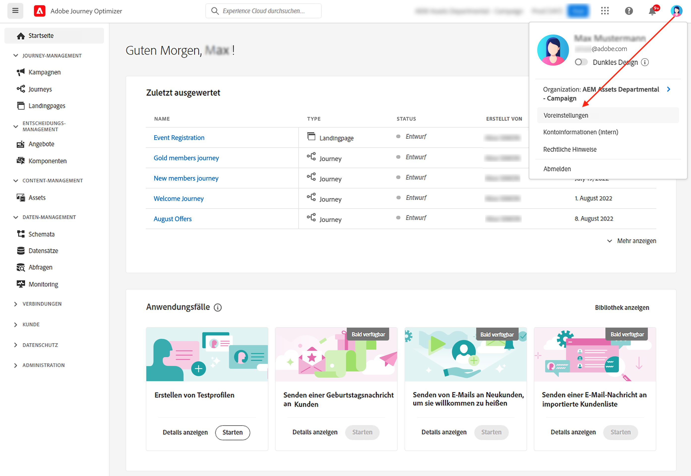

# Benutzeroberfläche {#cjm-user-interface}

Stellen Sie eine Verbindung mit [Adobe Experience Cloud](https://experience.adobe.com) her und navigieren Sie zu [!DNL Journey Optimizer].

Die wichtigsten Konzepte bei der Verwendung der Benutzeroberfläche gelten auch für Adobe Experience Platform. Weitere Informationen finden Sie in der [Dokumentation zu Adobe Experience Platform](https://experienceleague.adobe.com/docs/experience-platform/landing/platform-ui/ui-guide.html?lang=de#adobe-experience-platform-ui-guide){target="_blank"}.

Die in der Benutzeroberfläche verfügbaren Komponenten und Funktionen hängen von Ihren [Berechtigungen](../administration/permissions.md) und Ihrem [Lizenzierungspaket](https://helpx.adobe.com/de/legal/product-descriptions/adobe-journey-optimizer.html){target="_blank"} ab. Wenden Sie sich bei Fragen an Ihren Adobe Customer Success Manager.

>[!NOTE]
>
>Die vorliegende Dokumentation wird entsprechend den Änderungen an der Benutzeroberfläche des Produkts regelmäßig aktualisiert. Manche Screenshots können jedoch geringfügig von der Ihrer Benutzeroberfläche abweichen.

## Linke Navigation {#left-nav}

Mithilfe der Links auf der linken Seite können Sie auf [!DNL Journey Optimizer]-Funktionen zugreifen.

>[!NOTE]
>
>Die verfügbaren Funktionen hängen evtl. von Ihren Berechtigungen und Ihrer Lizenzvereinbarung ab.

Unten finden Sie die vollständige Liste der verfügbaren Dienste und Funktionen, die Sie in der linken Navigation finden, sowie Links zu den entsprechenden Hilfeseiten.

**Startseite**

Die Startseite von [!DNL Journey Optimizer] enthält wichtige Links und Ressourcen für den Start. Die Liste **[!UICONTROL Zuletzt ausgewertet]** enthält Verknüpfungen zu den kürzlich erstellten Ereignissen und Journeys. Diese Liste zeigt die Erstellungs- und Änderungsdaten sowie den Status an.

**[!UICONTROL JOURNEY-MANAGEMENT]**

* **[!UICONTROL Journeys]**: Erstellen, konfigurieren und orchestrieren Sie Ihre Customer Journeys. [Weitere Informationen](../building-journeys/journey-gs.md#jo-build)

* **[!UICONTROL Landingpages]**: Erstellen, gestalten, testen und veröffentlichen Sie Landingpages. [Weitere Informationen](../landing-pages/get-started-lp.md)

**[!UICONTROL ENTSCHEIDUNGS-MANAGEMENT]**

* **[!UICONTROL Angebote]**: Greifen Sie über dieses Menü auf Ihre aktuellen Quellen und Datensätze zu. Verwenden Sie diesen Abschnitt, um Angebote zu erstellen. [Weitere Informationen](../offers/offer-library/creating-personalized-offers.md)

* **[!UICONTROL Komponenten]**: Erstellen Sie Platzierungen, Regeln und Tags. [Weitere Informationen](../offers/offer-library/key-steps.md)

**[!UICONTROL CONTENT-MANAGEMENT]**

* **[!UICONTROL Assets]**: [!DNL Adobe Experience Manager Assets Essentials] ist ein zentralisiertes Repository von Assets, die Sie Ihren Nachrichten hinzufügen können. [Weitere Informationen](../email/assets-essentials.md)

**[!UICONTROL DATEN-MANAGEMENT]**

* **[!UICONTROL Schemata]**: Verwenden Sie Adobe Experience Platform, um Experience Data Model-(XDM-)Schemata auf einer interaktiven visuellen Arbeitsfläche zu erstellen und zu verwalten, die als Schema-Editor bezeichnet wird. [Weitere Informationen](../data/get-started-schemas.md)

* **[!UICONTROL Datensätze]**: Alle Daten, die in Adobe Experience Platform aufgenommen werden, bleiben als Datensätze im Data Lake erhalten. Ein Datensatz ist ein Konstrukt zur Datenspeicherung und -verwaltung, in dem Daten (in der Regel) in einer Tabelle erfasst werden, die ein Schema (Spalten) und Felder (Zeilen) beinhaltet. [Weitere Informationen](../data/get-started-datasets.md)

* **[!UICONTROL Abfragen]**: Verwenden Sie den Abfrage-Service von Adobe Experience Platform, um Abfragen zu schreiben und auszuführen, zuvor ausgeführte Abfragen anzuzeigen und auf Abfragen zuzugreifen, die von Benutzern in Ihrem Unternehmen gespeichert wurden. [Weitere Informationen](../data/get-started-queries.md)

* **[!UICONTROL Überwachung]**: Verwenden Sie dieses Menü, um die Datenaufnahme in der Benutzeroberfläche von Adobe Experience Platform zu überwachen. [Weitere Informationen](https://experienceleague.adobe.com/docs/experience-platform/ingestion/quality/monitor-data-ingestion.html?lang=de){target="_blank"}

**[!UICONTROL VERBINDUNGEN]**

* **[!UICONTROL Quellen]**: Verwenden Sie dieses Menü, um Daten aus einer Vielzahl von Quellen aufzunehmen, z. B. aus Adobe-Programmen, Cloud-basierten Datenspeichern, Datenbanken und anderen. Sie können eingehende Daten strukturieren, beschriften und erweitern. [Weitere Informationen](get-started-sources.md)

**[!UICONTROL KUNDIN ODER KUNDE]**

* **[!UICONTROL Segmente]**: Erstellen und verwalten Sie Segmentdefinitionen für Adobe Experience Platform und nutzen Sie diese in Ihren Journeys. [Weitere Informationen](../segment/about-segments.md)

* **[!UICONTROL Profile]**: Das Echtzeit-Kundenprofil erstellt eine ganzheitliche Sicht auf Ihre einzelnen Kunden und führt Daten aus mehreren Kanälen (Online-, Offline-, CRM- und Drittanbieter-Daten) zusammen. [Weitere Informationen](../segment/get-started-profiles.md)

* **[!UICONTROL Identitäten]**: Der Adobe Experience Platform Identity Service verwaltet die geräte- und kanalübergreifende, nahezu in Echtzeit ausgeführte Identifizierung Ihrer Kunden in einem sogenannten Identitätsdiagramm innerhalb von Adobe Experience Platform. [Weitere Informationen](../segment/get-started-identity.md)

**[!UICONTROL ADMINISTRATION]**

* **[!UICONTROL Journey-Administration]**: Verwenden Sie dieses Menü, um [Ereignisse](../event/about-events.md), [Datenquellen](../datasource/about-data-sources.md) und [Aktionen](../action/action.md) zu konfigurieren, die Sie in Ihren Journeys verwenden können.

* **[!UICONTROL Sandboxes]**: Adobe Experience Platform stellt Sandboxes bereit, die eine einzelne Instanz in separate virtuelle Umgebungen aufteilen, um die Entwicklung und Weiterentwicklung von Programmen für digitale Erlebnisse zu erleichtern. [Weitere Informationen](../administration/sandboxes.md)

* **[!UICONTROL Warnhinweise]** – In der Benutzeroberfläche können Sie einen Verlauf der empfangenen Warnungen anhand von Metriken anzeigen, die von Adobe Experience Platform Observability Insights bereitgestellt wurden. Über die Benutzeroberfläche können Sie auch verfügbare Warnhinweisregeln anzeigen, aktivieren und deaktivieren. [Weitere Informationen](https://experienceleague.adobe.com/docs/experience-platform/observability/alerts/overview.html?lang=de){target="_blank"}

## Produktinterne Anwendungsfälle {#in-product-uc}

Von der [!DNL Adobe Journey Optimizer]-Startseite aus bieten Produktanwendungsfälle eine schnelle Grundlage, um eine Customer Journey zu erstellen.

Verfügbare Anwendungsfälle:

* **Erstellen von Testprofilen** mithilfe unserer CSV-Vorlage, um personalisierte Nachrichten und Journeys zu testen. [Auf dieser Seite](../segment/creating-test-profiles.md#use-case-1) erfahren Sie, wie Sie diesen Anwendungsfall implementieren.
* **Senden von Geburtstagsnachrichten an Kunden**, um Ihren Kunden automatisch eine E-Mail zu senden, die ihnen zum Geburtstag gratuliert. (in Kürze verfügbar)
* **Senden von E-Mails an neue Kunden**, um bis zu zwei E-Mails zu versenden, die neu registrierte Kunden willkommen heißen. (in Kürze verfügbar)
* **Senden von Push-Benachrichtigungen an eine importierte Liste von Kunden**, um schnell eine Push-Benachrichtigung an eine Liste von Kunden zu senden, die aus einer CSV-Datei importiert wurden. (in Kürze verfügbar)

Um mehr über die einzelnen Anwendungsfälle zu erfahren, klicken Sie auf den Link **[!UICONTROL Details anzeigen]**.

Um einen Anwendungsfall auszuführen, klicken Sie auf die Schaltfläche **[!UICONTROL Starten]**.

Sie können über die Schaltfläche **[!UICONTROL Anwendungsfallbibliothek anzeigen]** auf ausgeführte Anwendungsfälle zugreifen.

## Hilfe und Support {#find-help}

Über den unteren Bereich der Startseite können Sie auf die wichtigsten Hilfeseiten von Adobe Journey Optimizer zugreifen.

Verwenden Sie das Symbol **Hilfe**, um auf Hilfeseiten zuzugreifen, den Support zu kontaktieren und Feedback zu geben. Über das Suchfeld können Sie Hilfeartikel und Videos suchen.

Verwenden Sie auf jeder Seite kontextbezogene Hilfe-Schaltflächen, um mehr über eine Funktion zu erfahren, und blättern Sie in der **[!DNL Adobe Experience League]**-Dokumentation.

## Sprachvoreinstellungen {#language-pref}

Die Benutzeroberfläche ist in den folgenden Sprachen verfügbar:

* Englisch
* Französisch
* Deutsch
* Italienisch
* Spanisch
* Portugiesisch (Brasilianisch)
* Japanisch
* Koreanisch
* Traditionelles Chinesisch
* Vereinfachtes Chinesisch

Die Standardsprache der Benutzeroberfläche ist die Sprache, die Sie in Ihrem Profil angegeben haben.

Gehen Sie wie folgt vor, um Ihre Sprache zu ändern:

* Klicken Sie in Ihrem Avatar oben rechts auf **Voreinstellungen**.
   
* Klicken Sie dann auf die Sprache, die unter Ihrer E-Mail-Adresse angezeigt wird.
* Wählen Sie Ihre bevorzugte Sprache und klicken Sie auf **Speichern**. Sie können eine zweite Sprache auswählen, falls die von Ihnen verwendete Komponente nicht in Ihrer ersten Sprache lokalisiert ist.
   
