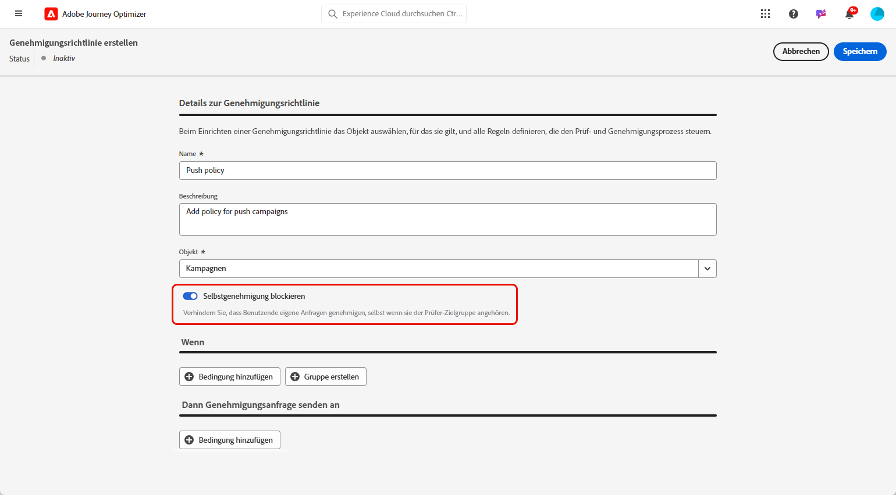
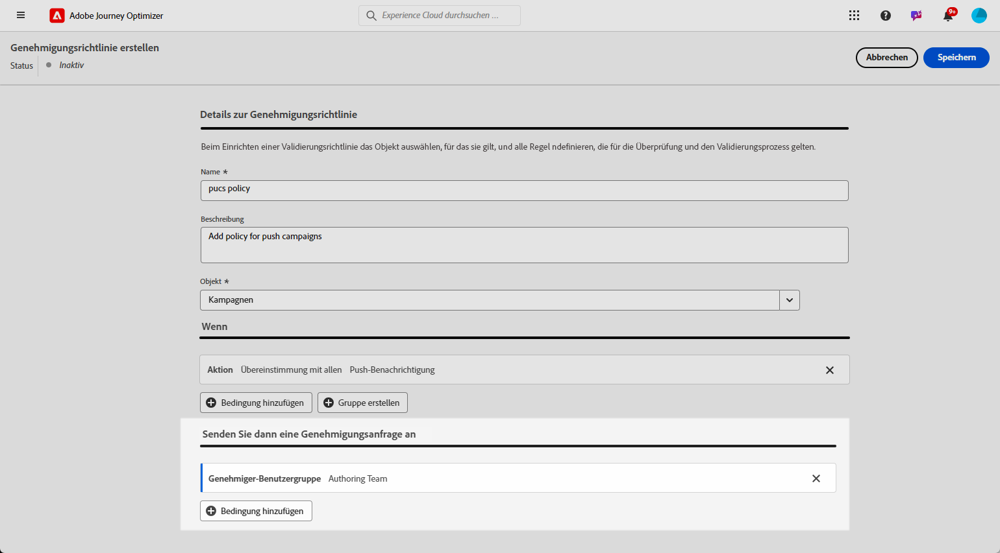
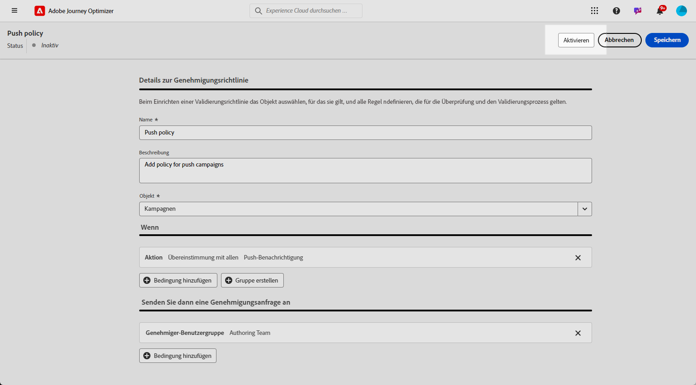
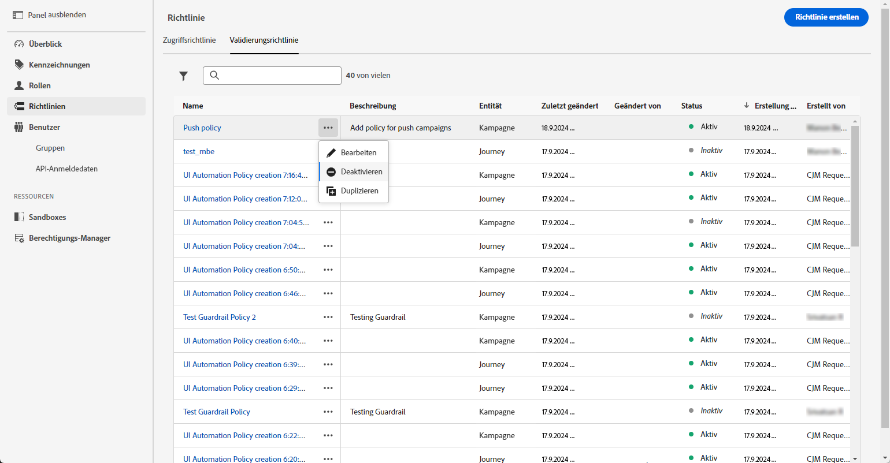

# Erstellen und Verwalten von Genehmigungsrichtlinien {#approval-policies}

>[!CONTEXTUALHELP]
>id="ajo_approval_policy_request_approval"
>title="Anfragen einer Genehmigung"
>abstract="Anfragen einer Genehmigung"

>[!CONTEXTUALHELP]
>id="ajo_approval_policy_request_change"
>title="Änderung anfordern"
>abstract="Änderung anfordern"

>[!NOTE]
>
>Zum Erstellen von Genehmigungsrichtlinien müssen Sie in Adobe Experience Platform über System- oder Produktadministratorberechtigungen verfügen. [Weitere Informationen](https://experienceleague.adobe.com/de/docs/experience-platform/access-control/home)

Genehmigungsrichtlinien ermöglichen es Admins, einen Validierungsprozess für Journeys und Kampagnen einzurichten. Dieses System legt spezifische Bedingungen fest, die bestimmen, ob eine Journey oder Kampagne genehmigt werden muss. Diese Richtlinien können unterschiedlich komplex sein. Sie können einfach vorschreiben, dass alle Kampagnen von einem bestimmten Benutzer oder Team überprüft werden müssen, oder Kriterien auf Grundlage dessen festlegen, wer die Kampagne erstellt hat.

Sie können Validierungsrichtlinien mithilfe flexibler Kriterien wie Tags, Kampagnen-/Journey-Namen, Kanaltypen oder Anfrageninformationen zielgerichtet anpassen. Sie können beispielsweise eine Genehmigung für alle Objekte mit dem Tag „hohes Risiko“ oder für jede Kampagne mit einem bestimmten Namensmuster verlangen.

## Genehmigungsrichtlinien erstellen {#create-policies}

>[!CONTEXTUALHELP]
>id="ajo_permissions_approval_policy"
>title="Neue Genehmigungsrichtlinie"
>abstract="Geben Sie in diesem Bildschirm den Namen ein, wählen Sie den Kontext für die Genehmigungsrichtlinie aus und erstellen Sie dann die Bedingungen, die bestimmen, wer die Genehmigungsanfrage initiieren und wer sie validieren kann."

Gehen Sie wie folgt vor, um eine Genehmigungsrichtlinie zu erstellen:

1. Greifen Sie über das **[!UICONTROL Administration]**-Menü in [!DNL Journey Optimizer] auf **[!UICONTROL Berechtigungen]** und dann auf **[!UICONTROL Richtlinien]**.

   

1. Klicken Sie auf der Registerkarte **[!UICONTROL Genehmigungsrichtlinie]** auf **[!UICONTROL Erstellen]**, wählen Sie **[!UICONTROL Genehmigungsrichtlinie]** aus und klicken Sie auf **[!UICONTROL Bestätigen]**.

1. Geben Sie einen **[!UICONTROL Namen]** und eine **[!UICONTROL Beschreibung]** für die Richtlinie ein.

1. Wählen Sie aus, ob die Richtlinie für **[!UICONTROL Journey]** oder **[!UICONTROL Kampagnen]** gelten soll.

<!--
1. Enable the **[!UICONTROL Block self-approval]** to prevent Journey/Campaign creators from approving their own objects.

    
-->

Sie können nun die Bedingungen verfeinern, um festzulegen, wer die Genehmigungsanfrage initiieren und wer sie validieren kann.

## Festlegen von Bedingungen für Genehmigungsrichtlinien {#conditions}

Genehmigungsrichtlinien bieten flexible Zielgruppenbestimmungsoptionen, die Ihren Governance-Anforderungen entsprechen. Sie können Genehmigungsrichtlinien auf der Grundlage verschiedener Kriterien erstellen, darunter:

* **Kampagnen-/Journey-Namen**: Targeting bestimmter Objekte nach Namen
* **Tags**: Wenden Sie Richtlinien auf alle Kampagnen oder Journey mit einem bestimmten Tag an
* **Kanaltypen**: Genehmigung für bestimmte Aktionen erforderlich (E-Mail, SMS, Push ush.)
* **Kampagnentypen**: Legen Sie unterschiedliche Regeln für ([- und API-ausgelöste Kampagnen fest](../campaigns/get-started-with-campaigns.md#campaign-types)
* **Anfragende**: Definieren von Richtlinien basierend darauf, wer die Kampagne oder den Journey erstellt

Gehen Sie wie folgt vor, um die mit einer Genehmigungsrichtlinie verknüpften Bedingungen zu definieren:

1. Greifen Sie auf Ihre **[!UICONTROL Genehmigungsrichtlinie]** zu.

1. Klicken Sie im Menü **[!UICONTROL Wenn]** auf **[!UICONTROL Bedingung hinzufügen]**, um festzulegen, welches Objekt oder welche Benutzerin bzw. welcher Benutzer eine Genehmigungsanfrage auslöst.

1. Wählen Sie die entsprechende **[!UICONTROL Kategorie]**, **[!UICONTROL Übereinstimmungsregel]** und **[!UICONTROL Optionen]** aus.

   Zum Beispiel „Wenn die Aktion mit einer Briefpost übereinstimmt“ oder „Wenn der Benutzername des Anforderers mit John Doe übereinstimmt“.

   

   +++ Weitere Informationen zu verfügbaren Kategorien und Optionen
   <table>
    <tr>
      <th>Kategorie</th>
      <th>Option</th>
    </tr>
    <tr>
      <td rowspan="3">Kampagnentyp</td>
      <td>Geplant (Marketing)</td>
    </tr>
    <tr>
    <td>API-ausgelöst (Marketing)</td>
    </tr>
    <tr>
    <td>API-ausgelöst (Transaktion)</td>
    </tr>
    <tr>
    <td rowspan="8">Aktion</td>
    <td>In-App</td>
    </tr>
    <tr>
    <td>Push-Benachrichtigung</td>
   </tr>
    <tr>
    <td>SMS</td>
    </tr>
    <tr>
    <td>E-Mail</td>
    </tr>
    <tr>
    <td>Direkt-Mail</td>
    </tr>
    <tr>
    <td>Web</td>
    </tr>
    <tr>
    <td>Code-basiert</td>
    </tr>
    <tr>
    <td>Inhaltskarte</td>
    </tr>
    <tr>
    <td>Tags</td>
    <td>Name des Tags zur Organisation Ihrer Zielgruppen </td>
    </tr>
    <tr>
    <td>Objektname</td>
    <td>Name des Objekts</td>
    </tr>
    <tr>
    <td>Benutzername der anfragenden Person</td>
    <td>Name und E-Mail-Adresse des designierten Antragstellers</td>
    </tr>
    <tr>
    <td>Benutzergruppe der anfragenden Person</td>
    <td>Name der Benutzergruppe der designierten Anforderer</td>
    </tr>
    </table>

1. Um weitere Kriterien hinzuzufügen, klicken Sie auf **[!UICONTROL Bedingung hinzufügen]**, um zusätzliche Regeln zu definieren, und wählen Sie entweder **[!UICONTROL Und]** oder **[!UICONTROL Oder]** aus, um anzugeben, wie die Bedingungen miteinander verbunden sind.

1. Klicken Sie im Menü **[!UICONTROL Dann Genehmigungsanfrage senden an]** auf **[!UICONTROL Bedingung hinzufügen]**, um festzulegen, welche Benutzenden die Genehmigungsanfrage annehmen können.

1. Wählen Sie in der Dropdown-Liste **[!UICONTROL Kategorie]** aus, ob Sie eine Benutzergruppe oder einzelne Benutzende auswählen möchten.

1. Wählen Sie dann aus der Dropdown-Liste **[!UICONTROL Option]** die spezifische Benutzergruppe oder spezifische Benutzende aus.

   Die ausgewählte Benutzenden oder die ausgewählte Benutzergruppe sind für die Validierung der Genehmigungsanfrage verantwortlich.

   

1. Um weitere Kriterien hinzuzufügen, klicken Sie auf **[!UICONTROL Bedingung hinzufügen]**, um zusätzliche Regeln zu definieren, und wählen Sie entweder **[!UICONTROL Und]** oder **[!UICONTROL Oder]** aus, um anzugeben, wie die Bedingungen miteinander verbunden sind.

1. Sobald Ihre Richtlinie vollständig konfiguriert ist, klicken Sie auf **[!UICONTROL Speichern]**.

Sie können Ihre Genehmigungsrichtlinie jetzt aktivieren, um sie anzuwenden.

## Aktivieren und Verwalten von Genehmigungsrichtlinien {#activate-policies}

Um Ihre Genehmigungsrichtlinie anwenden zu können, müssen Sie sie aktivieren. Gehen Sie dazu wie folgt vor:

1. Greifen Sie auf Ihre **[!UICONTROL Genehmigungsrichtlinie]** zu.

1. Klicken Sie dann auf **[!UICONTROL Aktivieren]**, um die konfigurierten Bedingungen auf Ihre Umgebung anzuwenden.

   >[!NOTE]
   >
   >Einmal aktivierte Richtlinien können nicht mehr bearbeitet werden. Um Bedingungen zu ändern, deaktivieren Sie die Richtlinie zunächst.

   

1. Öffnen Sie im Menü **[!UICONTROL Richtlinie]** die erweiterten Optionen, um die Richtlinie nach Bedarf zu **[!UICONTROL Bearbeiten]**, zu **[!UICONTROL Deaktivieren]** oder zu **[!UICONTROL Duplizieren]**.

   
