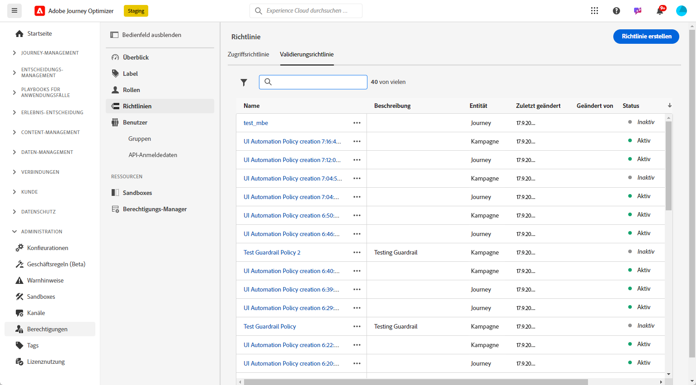

# Erstellen und Verwalten von Genehmigungsrichtlinien {#approval-policies}

>[!CONTEXTUALHELP]
>id="ajo_approval_policy_request_approval"
>title="Anfragen einer Genehmigung"
>abstract="Anfragen einer Genehmigung"

>[!CONTEXTUALHELP]
>id="ajo_approval_policy_request_change"
>title="Änderung anfordern"
>abstract="Änderung anfordern"

>[!NOTE]
>
>Zum Erstellen von Genehmigungsrichtlinien müssen Sie in Adobe Experience Platform über System- oder Produktadministratorberechtigungen verfügen. [Weitere Informationen](https://experienceleague.adobe.com/de/docs/experience-platform/access-control/home)

Genehmigungsrichtlinien ermöglichen es Admins, einen Validierungsprozess für Journeys und Kampagnen einzurichten. Dieses System legt spezifische Bedingungen fest, die bestimmen, ob eine Journey oder Kampagne genehmigt werden muss. Diese Richtlinien können unterschiedlich komplex sein. Sie reichen von der einfachen Anforderung, dass alle Kampagnen von bestimmten Benutzenden oder Teams überprüft werden müssen, bis hin zur Festlegung von Kriterien, die darauf basieren, wer die Kampagne erstellt hat.

Sie können Validierungsrichtlinien mit flexiblen Kriterien wie Tags, Kampagnen-/Journey-Namen, Kanaltypen oder Anfrageninformationen zielgerichtet anpassen. Sie können beispielsweise eine Genehmigung für alle Objekte mit dem Tag „hohes Risiko“ oder für jede Kampagne mit einem bestimmten Namensmuster verlangen.

## Erstellen von Genehmigungsrichtlinien {#create-policies}

>[!CONTEXTUALHELP]
>id="ajo_permissions_approval_policy"
>title="Neue Genehmigungsrichtlinie"
>abstract="Geben Sie in diesem Bildschirm den Namen ein, wählen Sie den Kontext für die Genehmigungsrichtlinie aus und erstellen Sie dann die Bedingungen, die bestimmen, wer die Genehmigungsanfrage initiieren und wer sie validieren kann."

>[!CONTEXTUALHELP]
>id="ajo_approval_policy_self_approval"
>title="Selbstgenehmigung blockieren"
>abstract="Aktivieren Sie diese Option, um Benutzer daran zu hindern, ihre eigenen Genehmigungsanfragen zu genehmigen, selbst wenn sie zu einer Benutzergruppe oder Rolle gehören, die als Prüfer festgelegt wurde."

Gehen Sie wie folgt vor, um eine Genehmigungsrichtlinie zu erstellen:

1. Greifen Sie über das Menü **[!UICONTROL Administration]** in [!DNL Journey Optimizer] auf **[!UICONTROL Berechtigungen]** und dann auf **[!UICONTROL Richtlinien]** zu.

   

1. Klicken Sie auf der Registerkarte **[!UICONTROL Genehmigungsrichtlinie]** auf **[!UICONTROL Erstellen]**, wählen Sie **[!UICONTROL Genehmigungsrichtlinie]** aus und klicken Sie auf **[!UICONTROL Bestätigen]**.

1. Geben Sie einen **[!UICONTROL Namen]** und eine **[!UICONTROL Beschreibung]** für die Richtlinie ein.

1. Wählen Sie aus, ob die Richtlinie für **[!UICONTROL Journey]** oder **[!UICONTROL Kampagnen]** gelten soll.

1. Aktivieren Sie die Option **[!UICONTROL Selbstvalidierung blockieren]**, um zu verhindern, dass Erstellende von Journeys oder Kampagnen ihre eigenen Objekte genehmigen.

   

Sie können nun die Bedingungen verfeinern, um festzulegen, wer die Genehmigungsanfrage initiieren und wer sie validieren kann.

## Festlegen von Bedingungen für Genehmigungsrichtlinien {#conditions}

Genehmigungsrichtlinien bieten flexible Targeting-Optionen, die Ihren Governance-Anforderungen entsprechen. Sie können Genehmigungsrichtlinien auf der Grundlage verschiedener Kriterien erstellen, darunter:

* **Kampagnen-/Journey-Namen:** Sprechen Sie bestimmte Objekte mit dem Namen an
* **Tags:** Wenden Sie Richtlinien auf alle Kampagnen oder Journeys mit einem bestimmten Tag an
* **Kanaltypen:** Fordern Sie eine Genehmigung für bestimmte Aktionen an (E-Mail, SMS, Push usw.)
* **Kampagnentypen:** Legen Sie unterschiedliche Regeln für [durch Aktionen und API ausgelöste Kampagnen](../campaigns/get-started-with-campaigns.md#campaign-types) fest
* **Anfragende:** Definieren Sie Richtlinien basierend darauf, wer die Kampagne oder Journey erstellt

Gehen Sie wie folgt vor, um die mit einer Genehmigungsrichtlinie verknüpften Bedingungen zu definieren:

1. Greifen Sie auf Ihre **[!UICONTROL Genehmigungsrichtlinie]** zu.

1. Klicken Sie im Menü **[!UICONTROL Wenn]** auf **[!UICONTROL Bedingung hinzufügen]**, um festzulegen, welches Objekt oder welche Benutzerin bzw. welcher Benutzer eine Genehmigungsanfrage auslöst.

1. Wählen Sie die entsprechende **[!UICONTROL Kategorie]**, **[!UICONTROL Übereinstimmungsregel]** und **[!UICONTROL Optionen]** aus.

   Zum Beispiel „wenn Aktion mit Direkt-Mail übereinstimmt“ oder „wenn Benutzername der anfragenden Person mit Max Mustermann übereinstimmt“.

   

   +++ Weitere Informationen zu verfügbaren Kategorien und Optionen
   <table>
    <tr>
      <th>Kategorie</th>
      <th>Option</th>
    </tr>
    <tr>
      <td rowspan="3">Kampagnentyp</td>
      <td>Geplant (Marketing)</td>
    </tr>
    <tr>
    <td>API-ausgelöst (Marketing)</td>
    </tr>
    <tr>
    <td>API-ausgelöst (Transaktion)</td>
    </tr>
    <tr>
    <td rowspan="8">Aktion</td>
    <td>In-App</td>
    </tr>
    <tr>
    <td>Push-Benachrichtigung</td>
   </tr>
    <tr>
    <td>SMS</td>
    </tr>
    <tr>
    <td>E-Mail</td>
    </tr>
    <tr>
    <td>Direkt-Mail</td>
    </tr>
    <tr>
    <td>Web</td>
    </tr>
    <tr>
    <td>Code-basiert</td>
    </tr>
    <tr>
    <td>Inhaltskarte</td>
    </tr>
    <tr>
    <td>Tags</td>
    <td>Name des Tags zur Organisation Ihrer Zielgruppen </td>
    </tr>
    <tr>
    <td>Objektname</td>
    <td>Name des Objekts</td>
    </tr>
    <tr>
    <td>Benutzername der anfragenden Person</td>
    <td>Name und E-Mail-Adresse der anfragenden Person</td>
    </tr>
    <tr>
    <td>Benutzergruppe der anfragenden Person</td>
    <td>Name der Benutzergruppe der anfragenden Personen</td>
    </tr>
    </table>

1. Um weitere Kriterien hinzuzufügen, klicken Sie auf **[!UICONTROL Bedingung hinzufügen]**, um zusätzliche Regeln zu definieren, und wählen Sie entweder **[!UICONTROL Und]** oder **[!UICONTROL Oder]** aus, um anzugeben, wie die Bedingungen miteinander verbunden sind.

1. Klicken Sie im Menü **[!UICONTROL Dann Genehmigungsanfrage senden an]** auf **[!UICONTROL Bedingung hinzufügen]**, um festzulegen, welche Benutzenden die Genehmigungsanfrage annehmen können.

1. Wählen Sie in der Dropdown-Liste **[!UICONTROL Kategorie]** aus, ob Sie eine Benutzergruppe oder einzelne Benutzende auswählen möchten.

1. Wählen Sie dann aus der Dropdown-Liste **[!UICONTROL Option]** die spezifische Benutzergruppe oder spezifische Benutzende aus.

   Die ausgewählte Benutzenden oder die ausgewählte Benutzergruppe sind für die Validierung der Genehmigungsanfrage verantwortlich.

   

1. Um weitere Kriterien hinzuzufügen, klicken Sie auf **[!UICONTROL Bedingung hinzufügen]**, um zusätzliche Regeln zu definieren, und wählen Sie entweder **[!UICONTROL Und]** oder **[!UICONTROL Oder]** aus, um anzugeben, wie die Bedingungen miteinander verbunden sind.

1. Sobald Ihre Richtlinie vollständig konfiguriert ist, klicken Sie auf **[!UICONTROL Speichern]**.

Sie können Ihre Genehmigungsrichtlinie jetzt aktivieren, um sie anzuwenden.

## Aktivieren und Verwalten von Genehmigungsrichtlinien {#activate-policies}

Um Ihre Genehmigungsrichtlinie anwenden zu können, müssen Sie sie aktivieren. Gehen Sie dazu wie folgt vor:

1. Greifen Sie auf Ihre **[!UICONTROL Genehmigungsrichtlinie]** zu.

1. Klicken Sie dann auf **[!UICONTROL Aktivieren]**, um die konfigurierten Bedingungen auf Ihre Umgebung anzuwenden.

   >[!NOTE]
   >
   >Einmal aktivierte Richtlinien können nicht mehr bearbeitet werden. Um Bedingungen zu ändern, deaktivieren Sie die Richtlinie zunächst.

   

1. Öffnen Sie im Menü **[!UICONTROL Richtlinie]** die erweiterten Optionen, um die Richtlinie nach Bedarf zu **[!UICONTROL Bearbeiten]**, zu **[!UICONTROL Deaktivieren]** oder zu **[!UICONTROL Duplizieren]**.

   
