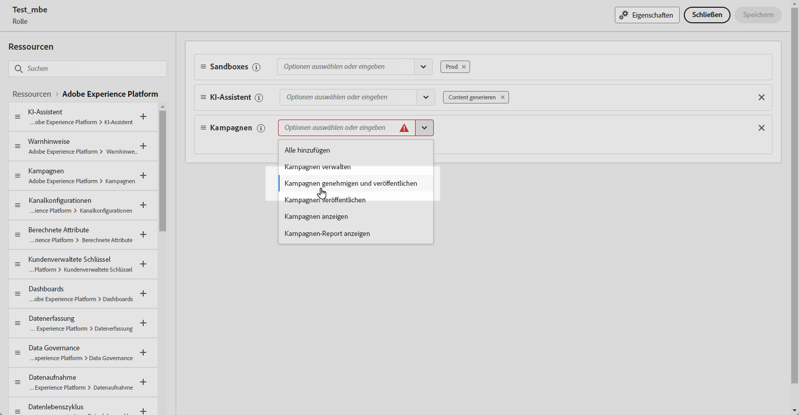
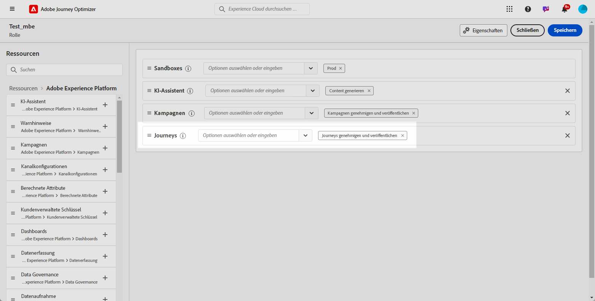
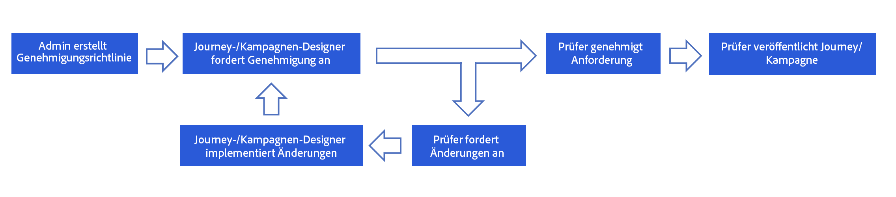
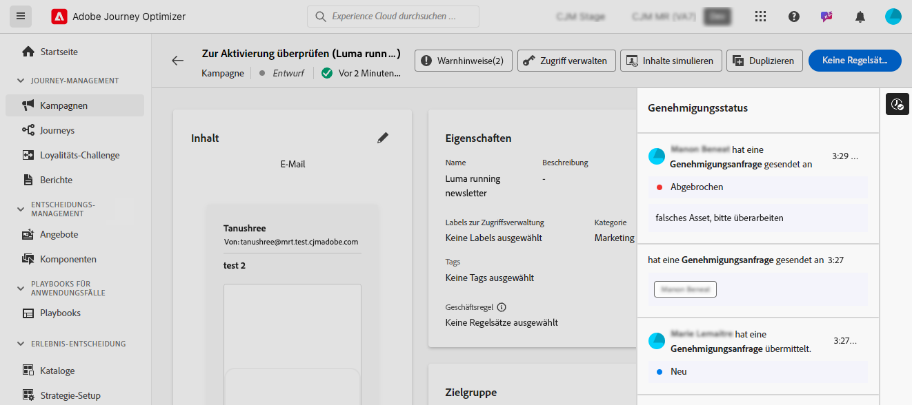

# Erste Schritte mit Journey- und Kampagnengenehmigungen {#send-proofs}

## Erste Schritte mit Genehmigungsrichtlinien {#gs}

Mit [!DNL Journey Optimizer] können Sie einen Validierungsprozess einrichten, mit dem Marketing-Teams sicherstellen können, dass Kampagnen und Journey von den entsprechenden Stakeholdern geprüft und abgemeldet werden, bevor sie live geschaltet werden.

Genehmigungsrichtlinien führen einen strukturierten Workflow direkt in der Benutzeroberfläche ein. Dadurch entfällt die Notwendigkeit externer Medien wie E-Mail oder Aufgaben-Management-Tools und es wird sichergestellt, dass alle Genehmigungen zentral verwaltet und verfolgt werden.

Darüber hinaus bietet diese Funktion eine verbesserte Kontrolle über die Veröffentlichung Ihrer Journeys und Kampagnen: Durch den in Journey Optimizer eingebetteten Genehmigungsprozess bleiben Kampagnen und Journeys während der Überprüfung in einem „gesperrten“ Status, sodass keine Änderungen oder unbeabsichtigten Aktivierungen vorgenommen werden können, bevor alle erforderlichen Genehmigungen erteilt wurden.

## Voraussetzungen {#prerequisites}

Bevor Sie beginnen, stellen Sie sicher, dass die folgenden Berechtigungen konfiguriert wurden.

Um Journey und Kampagnen zu genehmigen und zu veröffentlichen, müssen Benutzenden die Berechtigungen **Genehmigen und veröffentlichen** und **Journey genehmigen und**) gewährt werden. [Weitere Informationen](../administration/permissions.md)

+++  Erfahren Sie, wie Sie genehmigungsbezogene Berechtigungen zuweisen

1. Gehen Sie im Produkt **Berechtigungen** zur Registerkarte **Rollen** und wählen Sie die gewünschte **Rolle** aus.

1. Klicken Sie auf **Bearbeiten**, um die Berechtigungen zu ändern.

1. Fügen Sie die Ressource **Kampagnen** hinzu und wählen Sie dann **Kampagnen genehmigen und veröffentlichen** aus dem Dropdown-Menü aus.

   {zoomable="yes"}

1. Fügen Sie die Ressource **Journey** hinzu und wählen Sie dann **Journeys genehmigen und veröffentlichen** aus dem Dropdown-Menü aus.

   {zoomable="yes"}

1. Klicken Sie auf **Speichern**, um die Änderungen anzuwenden.

Die Berechtigungen aller Benutzenden, die dieser Rolle bereits zugewiesen sind, werden automatisch aktualisiert.

1. Um diese Rolle neuen Benutzenden zuzuweisen, navigieren Sie im Dashboard **Rollen** zur Registerkarte **Benutzer** und klicken Sie auf **Benutzer hinzufügen**.

1. Geben Sie den Namen und die E-Mail-Adresse der Benutzerin oder des Benutzers ein oder wählen Sie aus der Liste aus und klicken Sie dann auf **Speichern**.

1. Wenn die Benutzerin bzw. der Benutzer vorher noch nicht erstellt wurde, lesen Sie [diese Dokumentation](https://experienceleague.adobe.com/de/docs/experience-platform/access-control/abac/permissions-ui/users).

Die Benutzerin oder der Benutzer erhält eine E-Mail mit Anweisungen zum Zugriff auf Ihre Instanz.

+++

## Überblick über den Genehmigungsprozess {#process}

Der globale Genehmigungsprozess sieht folgendermaßen aus:

{zoomable="yes"}

1. **Einrichtung von Genehmigungsrichtlinien**

   Ein Administrator erstellt eine Validierungsrichtlinie und definiert Bedingungen, unter denen die Richtlinie auf Journey oder Kampagnen angewendet werden soll. Sie können beispielsweise eine Validierungsrichtlinie erstellen, die erfordert, dass alle von einem bestimmten Benutzer erstellten geplanten Kampagnen vor der Aktivierung genehmigt werden. [Informationen zur Erstellung von Genehmigungsrichtlinien](approval-policies.md)

1. **Einreichung von Kampagnen/Journeys zur Genehmigung**

   Die Kampagnen-/Journey-Ersteller erstellen eine Journey oder Kampagne und reichen sie zur Genehmigung ein. Die Kampagne/Journey wechselt in den Status „Wird überprüft“. In diesem Status können keine Änderungen vorgenommen werden, es sei denn, die Anfrage wird abgebrochen. [Informationen zum Anfordern einer Genehmigung](request-approval.md)

   >[!NOTE]
   >
   >Kampagnen und Journeys müssen nur dann zur Genehmigung eingereicht werden, wenn eine Genehmigungsrichtlinie vorhanden ist. Wenn keine solche Richtlinie zutrifft, können erstellende Personen die Kampagne oder Journey direkt veröffentlichen, ohne dass eine Genehmigung erforderlich ist.

1. **Überprüfung und Genehmigung**

   Die genehmigenden Personen, die in der Genehmigungsrichtlinie für die Journey oder Kampagne definiert sind, erhalten eine Benachrichtigung. Sie können den Journey- oder Kampagneninhalt, die Zielgruppe und die Einstellungen überprüfen. Wenn Änderungen erforderlich sind, fordern die genehmigenden Personen diese an und setzen die Kampagne für Revisionen auf „Entwurf“ zurück. Wenn sie bereit sind, können sie die Journey oder Kampagne aktivieren und starten. [Informationen zur Überprüfung und Genehmigung einer Anfrage](review-approve-request.md)

## Überwachen von Genehmigungsanfragen {#monitor}

Sie können alle Genehmigungs- und Änderungsanfragen überwachen, die für eine bestimmte Journey oder Kampagne eingereicht wurden. Klicken Sie dazu oben rechts auf der Journey-Arbeitsfläche oder am Bildschirm zur Kampagnenüberprüfung auf das Symbol **[!UICONTROL Audit-Protokoll anzeigen]**.

## Weitere Ressourcen

* **[Erstellen von Genehmigungsrichtlinien](approval-policies.md)** – Erfahren Sie, wie Sie Genehmigungsrichtlinien einrichten, um Überprüfungs-Workflows für Kampagnen und Journeys durchzusetzen.
* **[Genehmigung von Anfragen](request-approval.md)** – Verstehen Sie, wie Sie Inhalte zur Genehmigung einreichen und den Genehmigungsstatus verfolgen.
* **[Prüfen und Genehmigen von Anfragen](review-approve-request.md)** – Erfahren Sie, wie Sie als genehmigende Person Anfragen überprüfen, genehmigen oder ablehnen können.
* **[Simulieren mit Beispieleingaben](simulate-sample-input.md)** – Erfahren Sie, wie Sie Inhalte mithilfe von Beispielprofildaten testen und validieren können.
