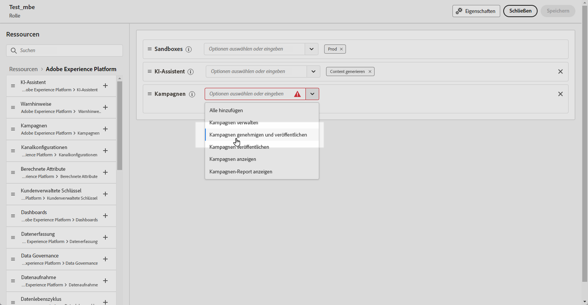
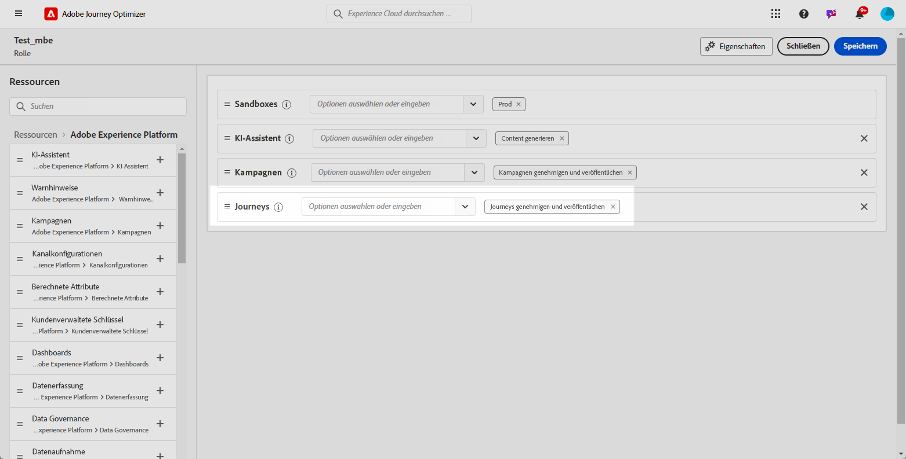
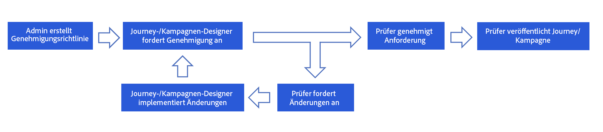
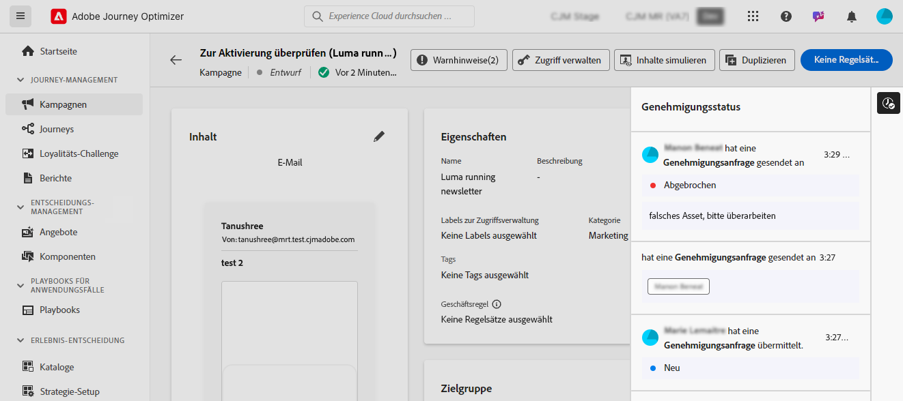

# Erste Schritte mit Journey- und Kampagnengenehmigungen {#send-proofs}

## Erste Schritte mit Genehmigungsrichtlinien {#gs}

Mit [!DNL Journey Optimizer] können Sie einen Genehmigungsprozess einrichten, mit dem Marketing-Teams sicherstellen können, dass Kampagnen und Journeys vor ihrer Live-Schaltung von den jeweiligen Stakeholderinnen und Stakeholdern geprüft und genehmigt werden.

Genehmigungsrichtlinien führen einen strukturierten Workflow direkt in der Benutzeroberfläche ein. Dadurch entfällt die Notwendigkeit externer Medien wie E-Mail oder Aufgaben-Management-Tools und es wird sichergestellt, dass alle Genehmigungen zentral verwaltet und verfolgt werden.

Darüber hinaus bietet diese Funktion eine verbesserte Kontrolle über die Veröffentlichung Ihrer Journeys und Kampagnen: Durch den in Journey Optimizer eingebetteten Genehmigungsprozess bleiben Kampagnen und Journeys während der Überprüfung in einem „gesperrten“ Status, sodass keine Änderungen oder unbeabsichtigten Aktivierungen vorgenommen werden können, bevor alle erforderlichen Genehmigungen erteilt wurden.

## Voraussetzungen {#prerequisites}

Bevor Sie beginnen, stellen Sie sicher, dass die folgenden Berechtigungen konfiguriert wurden.

Um auf Journeys und Kampagnen zugreifen sowie diese genehmigen und veröffentlichen zu können, müssen Benutzende über die Berechtigungen **Kampagnen genehmigen und veröffentlichen** und **Journeys genehmigen und veröffentlichen** verfügen. [Weitere Informationen](../administration/permissions.md)

+++  Weitere Informationen zum Zuweisen von genehmigungsbezogenen Berechtigungen

1. Gehen Sie im Produkt **Berechtigungen** zur Registerkarte **Rollen** und wählen Sie die gewünschte **Rolle** aus.

1. Klicken Sie auf **Bearbeiten**, um die Berechtigungen zu ändern.

1. Fügen Sie die Ressource **Kampagnen** hinzu und wählen Sie dann **Kampagnen genehmigen und veröffentlichen** aus dem Dropdown-Menü aus.

   {zoomable="yes"}

1. Fügen Sie die Ressource **Journey** hinzu und wählen Sie dann **Journeys genehmigen und veröffentlichen** aus dem Dropdown-Menü aus.

   {zoomable="yes"}

1. Klicken Sie auf **Speichern**, um die Änderungen anzuwenden.

Die Berechtigungen aller Benutzenden, die dieser Rolle bereits zugewiesen sind, werden automatisch aktualisiert.

1. Um diese Rolle neuen Benutzenden zuzuweisen, navigieren Sie im Dashboard **Rollen** zur Registerkarte **Benutzer** und klicken Sie auf **Benutzer hinzufügen**.

1. Geben Sie den Namen und die E-Mail-Adresse der Benutzerin oder des Benutzers ein oder wählen Sie aus der Liste aus und klicken Sie dann auf **Speichern**.

1. Wenn die Benutzerin bzw. der Benutzer vorher noch nicht erstellt wurde, lesen Sie [diese Dokumentation](https://experienceleague.adobe.com/de/docs/experience-platform/access-control/abac/permissions-ui/users).

Die Benutzerin oder der Benutzer erhält eine E-Mail mit Anweisungen zum Zugriff auf Ihre Instanz.

+++

## Überblick über den Genehmigungsprozess {#process}

Der globale Genehmigungsprozess sieht folgendermaßen aus:

{zoomable="yes"}

1. **Einrichtung von Genehmigungsrichtlinien**

   Eine bzw. ein Admin erstellt eine Genehmigungsrichtlinie, in der die Bedingungen definiert werden, unter denen die Richtlinie auf Journeys oder Kampagnen angewendet werden soll. Sie können beispielsweise eine Genehmigungsrichtlinie erstellen, die es erfordert, dass alle von einer bestimmten Person erstellten geplanten Kampagnen vor der Aktivierung genehmigt werden. [Informationen zur Erstellung von Genehmigungsrichtlinien](approval-policies.md)

1. **Einreichung von Kampagnen/Journeys zur Genehmigung**

   Die Erstellenden von Kampagnen/Journeys erstellen eine Journey oder Kampagne und reichen sie zur Genehmigung ein. Die Kampagne/Journey wechselt in den Status „Wird überprüft“. In diesem Status können keine Änderungen vorgenommen werden, es sei denn, die Anfrage wird abgebrochen. [Informationen zum Anfordern einer Genehmigung](request-approval.md)

   >[!NOTE]
   >
   >Kampagnen und Journeys müssen nur dann zur Genehmigung eingereicht werden, wenn eine Genehmigungsrichtlinie vorhanden ist. Wenn keine solche Richtlinie zutrifft, können erstellende Personen die Kampagne oder Journey direkt veröffentlichen, ohne dass eine Genehmigung erforderlich ist.

1. **Überprüfung und Genehmigung**

   Die genehmigenden Personen, die in der Genehmigungsrichtlinie für die Journey oder Kampagne definiert sind, erhalten eine Benachrichtigung. Sie können den Journey- oder Kampagneninhalt, die Zielgruppe und die Einstellungen überprüfen. Wenn Änderungen erforderlich sind, fordern die genehmigenden Personen diese an und setzen die Kampagne für Revisionen auf „Entwurf“ zurück. Wenn sie bereit sind, können sie die Journey oder Kampagne aktivieren und starten. [Informationen zur Überprüfung und Genehmigung einer Anfrage](review-approve-request.md)

## Überwachen von Genehmigungsanfragen {#monitor}

Sie können alle Genehmigungs- und Änderungsanfragen überwachen, die für eine bestimmte Journey oder Kampagne eingereicht wurden. Klicken Sie dazu oben rechts auf der Journey-Arbeitsfläche oder am Bildschirm zur Kampagnenüberprüfung auf das Symbol **[!UICONTROL Audit-Protokoll anzeigen]**.

## Häufig gestellte Fragen {#faq}

+++Muss ich für jede Kampagne oder Journey eine Genehmigungsrichtlinie erstellen?

Nein. Genehmigungsrichtlinien sind bedingt. Sie müssen nur dann eine Richtlinie erstellen, wenn Sie die Überprüfung für eine bestimmte Gruppe an Kampagnen oder Journeys erzwingen möchten (z. B. für alle geplanten Kampagnen, die von einem bestimmten Team erstellt wurden). Wenn für eine Kampagne oder Journey keine Richtlinie gilt, können die Erstellenden sie direkt veröffentlichen, ohne eine Genehmigung anzufordern.

+++

+++Was passiert, wenn die genehmigende Person nicht verfügbar ist?

Die Anfrage bleibt im Status „Wird geprüft“, bis eine genehmigende Person tätig wird. Sie können die Anfrage abbrechen (das Element in den Status „Entwurf“ zurücksetzen) und erneut übermitteln, sobald die richtige genehmigende Person verfügbar ist. Admins können außerdem die Genehmigungsrichtlinie aktualisieren, um weitere genehmigende Personen hinzuzufügen.

+++

+++Kann ich eine Kampagne oder Journey bearbeiten, während die Genehmigung aussteht?

Nein. Nach der Übermittlung zur Genehmigung befindet sich die Kampagne oder Journey im gesperrten Status „Wird geprüft“. Um Änderungen vorzunehmen, muss die erstellende oder eine genehmigende Person die Anfrage zuerst abbrechen. Das Element wird in den Status „Entwurf“ zurückgesetzt und kann vor dem erneuten Übermitteln bearbeitet werden.

+++

+++Ich sehe die Berechtigung „Genehmigen und veröffentlichen“ in der Dropdown-Liste nicht. Was sollte ich überprüfen?

Stellen Sie zunächst sicher, dass Sie die richtige Ressource hinzufügen. Für die Berechtigung **Kampagnen genehmigen und veröffentlichen** muss die Ressource **Kampagnen** zur Rolle hinzugefügt werden und für **Journeys genehmigen und veröffentlichen** ist die Ressource **Journeys** erforderlich. Beide müssen separat hinzugefügt werden. [Weitere Informationen zum Zuweisen von genehmigungsbezogenen Berechtigungen](#prerequisites)

+++

+++Wie bestimmt [!DNL Journey Optimizer], welche Genehmigungsrichtlinie angewendet wird, wenn mehr als eine Richtlinie zutreffen könnte?

Wenn mehrere aktive Genehmigungsrichtlinien auf dieselbe Journey oder Kampagne angewendet werden können, hat die Richtlinie, die **zuletzt aktiviert wurde** Vorrang. Die in dieser Richtlinie definierten Benutzergruppen genehmigender Personen sind diejenigen, die benachrichtigt werden und die Anfrage verwalten.

[Weitere Informationen](approval-policies.md#multiple-policies)

+++

+++Kann eine anfragende Person, die mehreren Benutzergruppen angehört, auswählen, welcher Gruppe die Genehmigungsanfrage gesendet wird?

Nein. Anfragende Personen können nicht manuell auswählen, welche Benutzergruppe die Genehmigungsanfrage erhält oder weiterleitet. Die Benutzergruppen, die in der angewendeten Genehmigungsrichtlinie angegeben sind, werden entsprechend [Richtlinienpriorität](approval-policies.md#multiple-policies) automatisch benachrichtigt.

+++

## Zusätzliche Ressourcen

* **[Erstellen von Genehmigungsrichtlinien](approval-policies.md)** – Erfahren Sie, wie Sie Genehmigungsrichtlinien einrichten, um Überprüfungs-Workflows für Kampagnen und Journeys durchzusetzen.
* **[Genehmigung von Anfragen](request-approval.md)** – Verstehen Sie, wie Sie Inhalte zur Genehmigung einreichen und den Genehmigungsstatus verfolgen.
* **[Prüfen und Genehmigen von Anfragen](review-approve-request.md)** – Erfahren Sie, wie Sie als genehmigende Person Anfragen überprüfen, genehmigen oder ablehnen können.
* **[Simulieren mit Beispieleingaben](simulate-sample-input.md)** – Erfahren Sie, wie Sie Inhalte mithilfe von Beispielprofildaten testen und validieren können.
