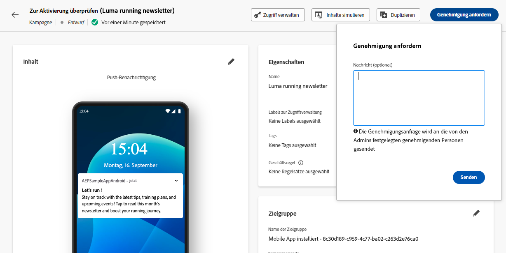
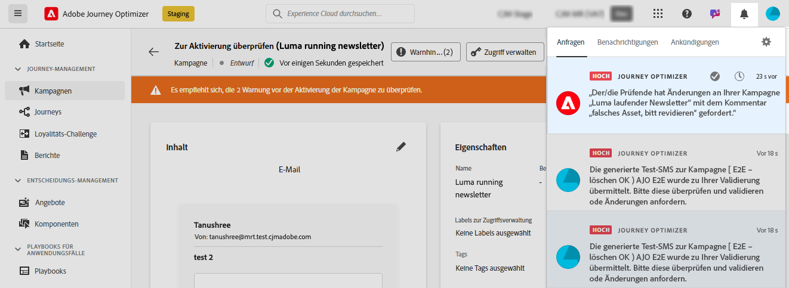

# Anfragen einer Genehmigung {#request-approval}

Der Zugriff auf den Genehmigungs-Workflow hängt vom jeweiligen Anwendungsfall ab:

* **Keine aktive Genehmigungsrichtlinie vorhanden**

   * **Kampagnen**: Wenn keine Genehmigungsrichtlinie für das Kampagnenobjekt in einer Sandbox aktiv ist, wird in Kampagnen die Schaltfläche **[!UICONTROL Aktivieren]** angezeigt, mit der Sie sie ohne Genehmigung aktivieren können.

   * **Journeys**: Wenn keine Genehmigungsrichtlinie für das Journey-Objekt aktiv ist, wird in Journeys die Schaltfläche **[!UICONTROL Veröffentlichen]** angezeigt, mit der Sie sie direkt veröffentlichen können.

* **Aktive Genehmigungsrichtlinien vorhanden**

   * **Kampagnen**: Wenn eine oder mehrere aktive Genehmigungsrichtlinien für das Kampagnenobjekt in einer Sandbox vorhanden sind, wird für alle Kampagnen in dieser Sandbox die Schaltfläche **[!UICONTROL Genehmigung anfordern]** angezeigt.
Wenn beim Klicken auf die Schaltfläche **[!UICONTROL Genehmigung anfordern]** keine Genehmigungsrichtlinie für das ausgewählte Objekt gilt, wird der Workflow für die automatische Genehmigung ausgelöst.

   * **Journeys**: Wenn eine oder mehrere aktive Genehmigungsrichtlinien für das Journey-Objekt in einer Sandbox vorhanden sind, wird für alle Journeys die Schaltfläche **[!UICONTROL Genehmigung anfordern]** angezeigt.
Wenn beim Klicken auf die Schaltfläche **[!UICONTROL Genehmigung anfordern]** keine Genehmigungsrichtlinie für das ausgewählte Objekt gilt, wird der Workflow für die automatische Genehmigung ausgelöst.

## Genehmigungsanforderung senden

Nachdem Sie die Kampagne oder Journey erstellt haben, klicken Sie auf die Schaltfläche **[!UICONTROL Genehmigung anfordern]**. Dadurch wird geprüft, ob es in Ihrer Sandbox eine aktive Genehmigungsrichtlinie gibt, die für die Kampagne oder Journey gilt.

* Wenn eine gültige Genehmigungsrichtlinie gefunden wird, wird Ihre Kampagne oder Journey zur Überprüfung gesendet.

* Wenn nach dem Klicken auf die Schaltfläche **[!UICONTROL Genehmigung anfordern]** keine Genehmigungsrichtlinie für die Kampagne oder die Journey gilt, wird die Kampagne bzw. die Journey automatisch genehmigt und entweder aktiviert oder veröffentlicht.

Der Bereich **[!UICONTROL Genehmigung anfordern]** wird geöffnet. Geben Sie ggf. eine Nachricht für die genehmigende(n) Person(en) ein und klicken Sie auf **[!UICONTROL Senden]**, um Ihre Anfrage zu übermitteln.

Während sich die Kampagne oder Journey im Status **[!UICONTROL In Überprüfung]** befindet, haben Sie die Möglichkeit, die Genehmigungsanfrage zu stornieren. Wenn Sie auf die Schaltfläche **[!UICONTROL Anfrage stornieren]** klicken, kehrt die Kampagne oder Journey in die Entwurfsphase zurück, und die prüfenden Personen erhalten eine Benachrichtigung, dass die Anfrage storniert wurde. Sie können dann die erforderlichen Änderungen vornehmen und die Kampagne oder Journey erneut zur Genehmigung einreichen.

## Genehmigungsanforderungen verwalten

Nachdem die Genehmigungsanforderung an die genehmigenden Personen gesendet wurde, können diese sie überprüfen und entweder die Journey/Kampagne aktivieren, um sie live zu schalten, oder bei Bedarf Änderungen anfordern. [Erfahren Sie, wie Sie eine Anfrage überprüfen und genehmigen](review-approve-request.md)

Wenn die genehmigenden Personen Änderungen beantragen, werden Sie durch eine E-Mail und eine Journey Optimizer-Benachrichtigung benachrichtigt, die Sie durch Klicken auf das Glockensymbol oben rechts im Bildschirm auf der Registerkarte **[!UICONTROL Anfragen]** aufrufen können.

Öffnen Sie die Änderungsanforderung über die E-Mail oder die Benachrichtigung, um auf die Journey oder Kampagne zuzugreifen und die gewünschten Änderungen vorzunehmen. Wenn Ihre Journey/Kampagne zur erneuten Prüfung bereit ist, senden Sie eine neue Genehmigungsanfrage über die Schaltfläche **[!UICONTROL Genehmigung anfordern]**.
