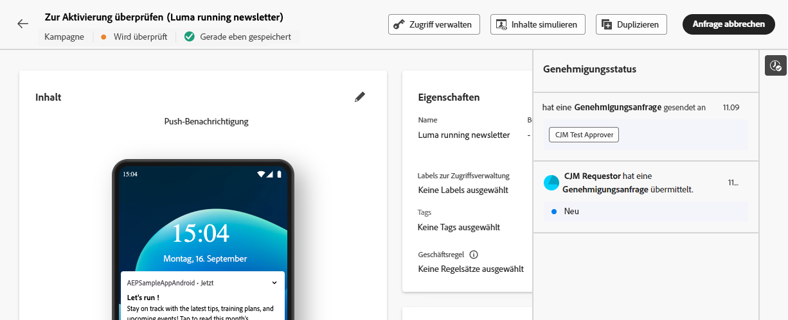

# Anfordern einer Genehmigung  {#request-approval}

Wenn der Genehmigungs-Workflow für Ihre Organisation aktiviert wurde, werden Sie feststellen, dass die Schaltflächen **[!UICONTROL Aktivieren]** und **[!UICONTROL Veröffentlichen]** in den Workflows „Kampagne erstellen“ und „Journey erstellen“ nicht mehr verfügbar sind. Diese Schaltflächen wurden durch die Schaltfläche **[!UICONTROL Genehmigung anfordern]** ersetzt.

Nachdem Sie die Kampagne oder Journey erstellt haben, müssen Sie auf die Schaltfläche **[!UICONTROL Genehmigung anfordern]** klicken. Dadurch wird geprüft, ob es in Ihrer Sandbox eine aktive Genehmigungsrichtlinie gibt, die für die Kampagne oder Journey gilt. Wenn eine entsprechende Genehmigungsrichtlinie gefunden wird, beginnt der Genehmigungsprozess. Wenn keine entsprechende Genehmigungsrichtlinie vorhanden ist, wird die Kampagne oder Journey automatisch genehmigt und entweder aktiviert oder veröffentlicht.

Der Bereich **[!UICONTROL Genehmigung anfordern]** wird geöffnet. Geben Sie ggf. eine Nachricht für die genehmigende(n) Person(en) ein und klicken Sie auf **[!UICONTROL Senden]**, um Ihre Anfrage zu übermitteln.

Während sich die Kampagne oder Journey im Status **[!UICONTROL In Überprüfung]** befindet, haben Sie die Möglichkeit, die Genehmigungsanfrage zu stornieren. Wenn Sie auf die Schaltfläche **[!UICONTROL Anfrage stornieren]** klicken, kehrt die Kampagne oder Journey in die Entwurfsphase zurück, und die prüfenden Personen erhalten eine Benachrichtigung, dass die Anfrage storniert wurde. Sie können dann die erforderlichen Änderungen vornehmen und die Kampagne oder Journey erneut zur Genehmigung einreichen.

Sobald die Genehmigungsanfrage an die genehmigenden Personen gesendet wurde, können diese sie überprüfen und entweder die Journey/Kampagne aktivieren, um sie live zu schalten, oder bei Bedarf Änderungen anfordern. [Erfahren Sie, wie Sie eine Anfrage überprüfen und genehmigen](review-approve-request.md)

Wenn die genehmigenden Personen Änderungen beantragen, werden Sie durch eine E-Mail und eine Journey Optimizer-Benachrichtigung benachrichtigt, die Sie durch Klicken auf das Glockensymbol oben rechts im Bildschirm auf der Registerkarte **[!UICONTROL Anfragen]** aufrufen können.

Öffnen Sie die Änderungsanforderung über die E-Mail oder die Benachrichtigung, um auf die Journey oder Kampagne zuzugreifen und die gewünschten Änderungen vorzunehmen. Wenn Ihre Journey/Kampagne zur erneuten Prüfung bereit ist, senden Sie eine neue Genehmigungsanfrage über die Schaltfläche **[!UICONTROL Genehmigung anfordern]**.
