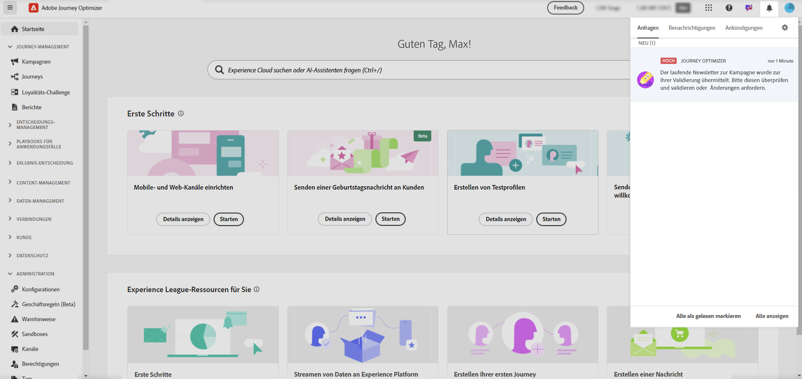
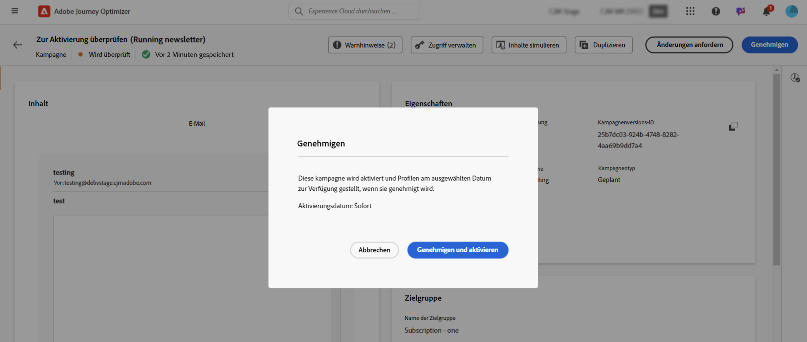
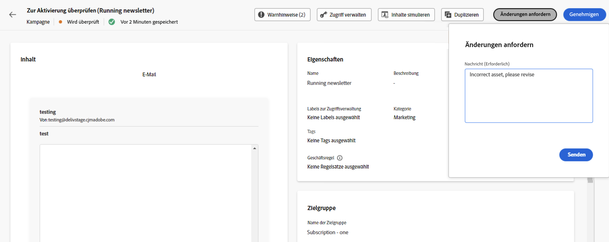

# Überprüfen und Genehmigen einer Anfrage {#approve-requests}

Falls für eine Journey oder Kampagne eine Genehmigungsrichtlinie gilt, muss sie zur Genehmigung vorgelegt werden, damit sie veröffentlicht werden kann. Zu diesem Zweck sendet der Ersteller der Journey/Kampagne eine Anfrage an die in der Validierungsrichtlinie definierten Genehmiger, und die Journey/Kampagne erhält den Status **[!UICONTROL In Überprüfung]**.

Wenn Sie als genehmigende Person ausgewählt wurden, werden Sie durch eine E-Mail und eine Journey Optimizer-Benachrichtigung benachrichtigt, auf die Sie zugreifen können, wenn Sie auf das Glockensymbol oben rechts im Bildschirm auf der Registerkarte **[!UICONTROL Anfragen]** klicken.

Um die Journey/Kampagne zu überprüfen, öffnen Sie sie über die E-Mail oder den Warnhinweis und überprüfen Sie ihre Einstellungen wie Zielgruppe, Inhalt oder Einstellungen.
Danach können Sie entweder [die Journey/Kampagne genehmigen und veröffentlichen](#approve) oder [Änderungen anfordern, bevor Sie sie aktivieren](#changes).

>[!NOTE]
>
>Die Überprüfung einer Kampagne ist ein schreibgeschützter Vorgang: Sie können alle Einstellungen einsehen, aber keine Maßnahmen ergreifen.
>
>Vergewissern Sie sich, dass Sie über die erforderlichen Berechtigungen verfügen, bevor Sie eine Journey oder Kampagne überprüfen.

## Genehmigen und Veröffentlichen einer Journey/Kampagne {#approve}

Wenn eine Journey oder Kampagne bereit ist, live geschaltet zu werden, können Sie sie genehmigen, indem Sie auf die Schaltfläche **[!UICONTROL Genehmigen]** klicken.

Klicken Sie im sich öffnenden Fenster auf **[!UICONTROL Genehmigen und aktivieren]**, um die Journey/Kampagne live zu schalten.

## Beantragen von Änderungen an einer Journey/Kampagne {#changes}

Wenn Änderungen an einer zur Validierung versendeten Journey oder Kampagne erforderlich sind, können Sie eine Anfrage an die erstellende Person senden, damit diese die erforderlichen Änderungen vornimmt.

Klicken Sie dazu auf die Schaltfläche **[!UICONTROL Änderungen anfordern]**. Geben Sie in dem sich öffnenden Fenster eine Nachricht mit den Details Ihrer Anfrage ein und klicken auf **[!UICONTROL Senden]** um Ihre Anfrage abzusenden.

Nach dem Absenden der Anfrage wird die erstellende Person, die die Journey/Kampagne erstellt hat, durch eine E-Mail und eine Benachrichtigung von Journey Optimizer informiert. Die Kampagne kehrt in den Status „Entwurf“ zurück. Sobald die Änderungen integriert wurden, kann der Ersteller der Journey/Kampagne sie erneut zur Genehmigung einreichen.

>[!NOTE]
>
> Wenn Sie keine Validierungsbenachrichtigung per E-Mail erhalten, müssen Sie Ihre Abonnementvoreinstellungen in Ihren Experience Cloud-Profilen aktualisieren. [Weitere Informationen](https://experienceleague.adobe.com/de/docs/core-services/interface/features/account-preferences)
