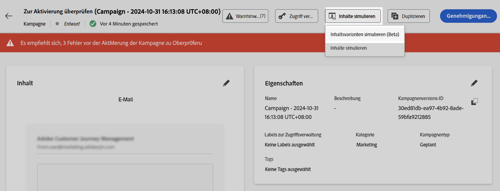
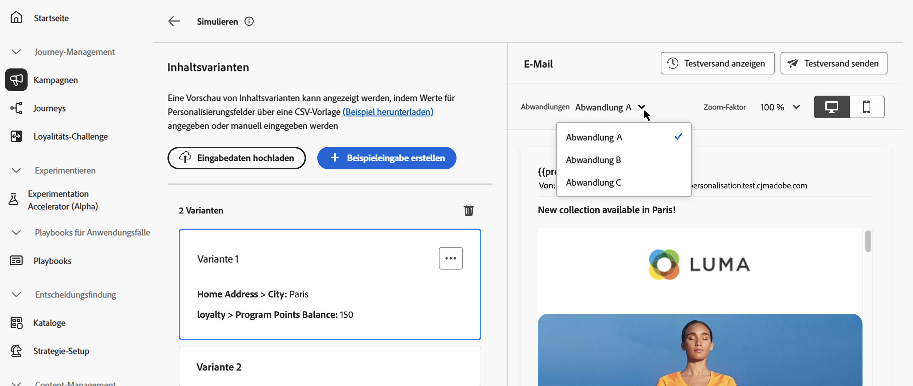
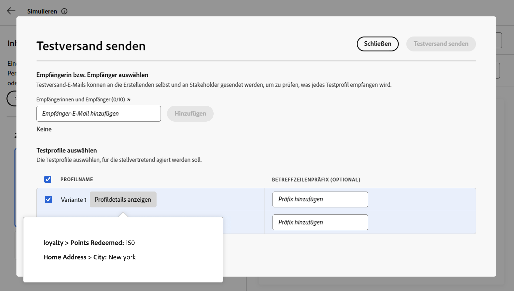
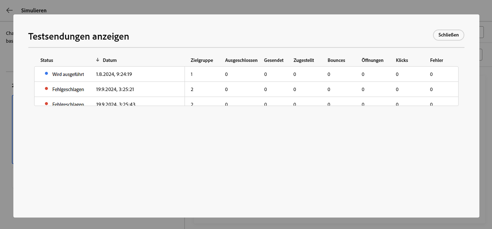

# Simulieren von Inhaltsvarianten {#custom-profiles}

>[!CONTEXTUALHELP]
>id="ajo_simulate_sample_profiles"
>title="Simulationen mit Beispieleingaben"
>abstract="Auf diesem Bildschirm können Sie Inhaltsvarianten testen, indem Sie sie automatisch mit KI generieren, Werte über eine CSV- oder JSON-Vorlage hinzufügen, manuell eingeben oder Testprofile verwenden."

Wenn Ihr Inhalt Personalisierung oder bedingte Logik enthält, müssen Sie überprüfen, ob er für jeden Empfängertyp korrekt gerendert wird, bevor Sie ihn senden.

Das Erlebnis **[!UICONTROL Inhaltsvarianten simulieren]** in [!DNL Journey Optimizer] löst dies, indem Sie mehrere Varianten Ihres Inhalts von einem einzigen Bildschirm aus testen können, automatisch mit KI generiert, manuell eingegeben, aus einer Datei importiert oder auf der Grundlage wiederverwendbarer simulierter Benutzer. Sie können eine Vorschau davon anzeigen, wie jede Variante gerendert wird, und einen Testversand durchführen, ohne zuvor persistente Profile in Adobe Experience Platform zu erstellen.

Klicken Sie in Ihrem Inhalt auf **[!UICONTROL Inhalt simulieren]**, um ein einzelnes Erlebnis zu öffnen, in dem Sie:

* **Varianten automatisch generieren** mithilfe von KI Personalisierungs- und bedingte Verzweigungen abdecken
* **Varianten manuell hinzufügen** oder aus einer CSV- oder JSON-Datei
* **Verwenden von simulierten Benutzern** um eine Vorschau anzuzeigen und einen Testversand mit gespeicherten, wiederverwendbaren Testdaten durchzuführen
* **Vorschau** Rendering und **E-Mail-Testversand durchführen** für ausgewählte Varianten

Alle Attribute, die in Ihrem Inhalt für die Personalisierung verwendet werden, werden automatisch erkannt. Eine Variante ist eine Version des Inhalts mit unterschiedlichen Werten für die Attribute.

>[!NOTE]
>
>Varianten dienen nur zu Testzwecken für Ihre aktuellen Inhalte. Sie werden nicht in Adobe Experience Platform, sondern in Ihrer Benutzersitzung im Browser gespeichert, d. h., sie werden nicht angezeigt, wenn Sie sich abmelden oder von einem anderen Gerät aus arbeiten.

## Leitlinien und Einschränkungen {#limitations}

Bevor Sie mit dem Testen Ihrer Inhalte unter Verwendung von Beispiel-Eingabedaten beginnen, sollten Sie die folgenden Leitlinien und Voraussetzungen berücksichtigen.

* **Kanäle**: Eine Simulation von Inhaltsvarianten ist verfügbar für:

   * die Kanäle E-Mail, SMS und Push-Benachrichtigungen;
   * alle eingehenden Kanäle (Web, Code-basiertes Erlebnis, In-App, Inhaltskarten);
   * Orchestrierte Kampagnen.

* **Unterstützte Funktionen**: Inhaltsvarianten können mit [!DNL Journey Optimizer]-Funktionen für mehrsprachige Inhalte und Inhaltsexperimente verwendet werden. Auf diese Weise können Sie Nachrichten in mehreren Sprachen testen und den Inhalt durch Experimentieren optimieren.

  Sie können auch Inhaltsvarianten nutzen, um Ihre Inhaltsvorlagen zu testen.

  >[!NOTE]
  >
  >Zurzeit sind Inbox-Rendering- und Spam-Berichte im aktuellen Erlebnis nicht verfügbar. Um diese Funktionen zu verwenden, klicken Sie auf **[!UICONTROL Inhalt simulieren]** und wählen Sie dann **[!UICONTROL Inhalt simulieren (AEP-Profile)]** aus dem Dropdown-Menü aus, um auf die vorherige Benutzeroberfläche zuzugreifen.

* **Attribute**: Sowohl Profil- als auch kontextuelle Attribute werden unterstützt.

* **Datentypen** - Bei der Eingabe von Daten für Varianten werden nur die folgenden Datentypen unterstützt: Zahl (Ganzzahl und Dezimalzahl), Zeichenfolge, Boolescher Wert und Datentyp. Bei allen anderen Datentypen wird eine Fehlermeldung angezeigt.

* **Anzahl der**: Sie können bis zu 30 Varianten hinzufügen, um Ihren Inhalt zu testen, entweder mithilfe einer Datei, manuell oder durch automatische Generierung. Bei Verwendung der automatischen KI-Generierung werden maximal 20 Varianten generiert.

## Inhaltsvarianten erstellen

Um Varianten für Ihren Inhalt zu erstellen, klicken Sie auf die Schaltfläche **[!UICONTROL Inhalt simulieren]**.



Sie können Varianten wie folgt erstellen:

* [Varianten manuell oder aus einer Datei &#x200B;](#profiles).
* [Varianten automatisch generieren](#auto-generate-variants) mit KI.
* [Auswahl von Varianten aus vorhandenen simulierten Benutzern](#simulated-users).

Sobald Ihre Varianten erstellt sind, können Sie [Vorschau Ihres Inhalts anzeigen und Testsendungen durchführen](#preview-proofs).

### Varianten manuell oder aus einer Datei hinzufügen {#profiles}

Beim Zugriff auf das Erlebnis „Inhaltsvarianten“ werden alle in Ihren Inhalten verwendeten Personalisierungsfelder automatisch erkannt und in einer leeren Variante angezeigt.

Wenn Ihre E-Mail beispielsweise zwei Personalisierungsfelder „Vorname“ und „Stadt“ enthält, werden diese in der Liste angezeigt. Zunächst werden keine Werte eingegeben und im Vorschaufenster wird kein personalisierter Inhalt angezeigt.


Sie können Varianten manuell hinzufügen oder aus einer Datei hochladen.

+++ Varianten manuell hinzufügen

Um den Wert der Standardvariante zu bearbeiten, klicken Sie auf die Schaltfläche **[!UICONTROL Bearbeiten]**, um benutzerdefinierte Werte für jedes Personalisierungsfeld anzugeben. Der Vorschaubereich wird aktualisiert und zeigt an, wie Ihr Inhalt mit den eingegebenen Werten gerendert wird.

Um eine neue Variante hinzuzufügen, klicken Sie auf die Schaltfläche **[!UICONTROL Beispiel erstellen]**. Es wird eine neue leere Variante angezeigt, die alle erkannten Personalisierungsfelder enthält. Sie können die neue Variante nach Bedarf bearbeiten.


+++

+++ Hinzufügen von Varianten aus einer Datei

Sie können eine Datei mit vordefinierten Varianten und Werten hochladen, um den Prozess zu beschleunigen.

1. Klicken Sie auf die **[!UICONTROL Daten hochladen]**, um den Bildschirm „Datei-Upload“ zu öffnen.
1. Wählen Sie **[!UICONTROL Beispiel herunterladen]**, um eine CSV-, JSON- oder JSONLINES-Dateivorlage herunterzuladen.
1. Öffnen Sie die Vorlagendatei und geben Sie die gewünschten Werte für jedes Profilattribut ein. Die Vorlage enthält eine Spalte für jedes Profilattribut, das in Ihrem Inhalt zur Personalisierung verwendet wird.

   Beispiel für JSON-Syntax:

   ```json
   {
   "profile": {
       "attributes": {
       "person": {
           "name": {
               "lastName": "Doe",
               "firstName": "John"
               }
           }
       }
   }
   }
   ```

1. Wenn Ihre Datei fertig ist, wählen Sie **[!UICONTROL Bestätigen]** aus, um sie zu laden. Nach dem Hochladen wird der Liste für jeden Eintrag in der Datei eine neue Variante hinzugefügt.

+++

### Inhaltsvarianten automatisch generieren {#auto-generate-variants}

[!DNL Journey Optimizer] können eine KI-basierte Simulation verwenden, um automatisch eine Inhaltsvariante zu generieren, sodass Sie Ihre Personalisierungslogik validieren können, ohne Varianten von Hand zu erstellen. Beim Rendern von Inhalten für die Simulation oder das Proofing analysiert das System Ihre Inhalte, identifiziert Personalisierungsfelder und ersetzt sie durch aussagekräftige Werte für eine nahezu realistische Vorschau.

Um eine Variante automatisch zu generieren, klicken Sie auf die Schaltfläche **[!UICONTROL Generieren]** und warten Sie, bis das System die Variante generiert. Überprüfen Sie die generierte Variante in der Variantenliste und ihr Rendering.


>[!NOTE]
>
>Die Generierung erzeugt eine einzelne Variante. Durch Klicken **[!UICONTROL Generieren]** werden alle in der Liste vorhandenen Inhaltsvarianten, einschließlich manuell oder aus einer Datei hinzugefügter, durch eine einzige generierte Variante ersetzt.

### Auswahl von Varianten aus simulierten Benutzern {#simulated-users}

In **[!UICONTROL Inhaltsvarianten simulieren]** können Sie Ihre Varianten auf **simulierten Benutzern“**. Simulierte Benutzende sind temporäre, profilähnliche Entitäten, die zum Testen ohne die Verwendung persistenter Profile in Adobe Experience Platform erstellt werden. Im Gegensatz zu Varianten, die nur für die aktuelle Browser-Sitzung hinzugefügt wurden, werden simulierte Benutzende gespeichert und können in allen Journey und von anderen Benutzenden wiederverwendet werden.

Die simulierten Benutzenden werden über die Journey-Funktion **[!UICONTROL Simulation]** erstellt und verwaltet. Eine vollständige Anleitung zum Erstellen, Speichern und Wiederverwenden finden Sie unter [Erstellen und Verwalten simulierter Benutzer](../building-journeys/simulate-journey.md#test-users).

Nachdem die simulierten Benutzer erstellt wurden, können Sie sie zur Vorschau Ihres Inhalts verwenden. Gehen Sie dazu wie folgt vor:

1. Klicken Sie auf **[!UICONTROL Schaltfläche „Varianten]**&quot;.
1. Wählen Sie in der Liste der vorhandenen simulierten Benutzer die gewünschten Benutzer aus und klicken Sie dann auf **[!UICONTROL Auswählen]**.

   

1. Die ausgewählten simulierten Benutzer werden Ihrer Liste der Inhaltsvarianten hinzugefügt, in der Sie eine Vorschau Ihres Inhalts mit ihren Attributwerten anzeigen können. Sie können die Werte einer Variante zum Testen auch manuell bearbeiten, aber diese Änderungen werden nicht an den simulierten Benutzer zurückgespeichert.

## Vorschau von Inhalten und Durchführen von Testsendungen {#preview-proofs}

Sobald Varianten hinzugefügt wurden, können Sie diese verwenden, um im rechten Bereich eine Vorschau Ihres Inhalts anzuzeigen und E-Mail-Testsendungen durchzuführen.

### Vorschau von Inhaltsvarianten {#preview}

Um eine Vorschau Ihrer Inhalte mit einer Variante anzuzeigen, wählen Sie die entsprechende Variante aus der Liste aus, um die Inhalte im Vorschaufenster mit den für diese Variante eingegebenen Informationen zu aktualisieren.

Im folgenden Beispiel haben wir zwei Varianten für die E-Mail-Betreffzeile hinzugefügt:

| Auswahl von Variante 1 | Auswahl von Variante 2 |
|----------|-------------|
|  |  |

<!--
For multilingual content and experimentation, a dropdown is available to switch between the different language variants or treatments.


-->

### Durchführen von Testsendungen {#proofs}

Mit Journey Optimizer können Sie Testsendungen an E-Mail-Adressen durchführen und dabei die Identität einer oder mehrerer Varianten annehmen, die Sie im Simulationsbildschirm hinzugefügt haben. Gehen Sie dazu wie folgt vor:

1. Vergewissern Sie sich, dass Varianten zum Testen Ihrer Inhalte hinzugefügt wurden, und klicken Sie auf die Schaltfläche **[!UICONTROL Testversand durchführen]**.

1. Geben Sie im Feld **[!UICONTROL Empfänger]** die E-Mail-Adresse ein, an die Sie den Testversand durchführen möchten, und klicken Sie dann auf **[!UICONTROL Hinzufügen]**. Wiederholen Sie den Vorgang, um den Testversand an zusätzliche E-Mail-Adressen zu senden. Sie können bis zu 10 Empfängerinnen und Empfänger für den Testversand hinzufügen.

1. Wählen Sie im unteren Bereich des Bildschirms die Variante aus, die Sie für den Testversand verwenden möchten. Sie können mehrere Varianten auswählen. In diesem Fall enthält die E-Mail so viele Testsendungen wie ausgewählte Varianten.

   Weitere Informationen zu einer Variante erhalten Sie über die Verknüpfung **[!UICONTROL Profilinformationen anzeigen]**. So können Sie die auf dem vorherigen Bildschirm eingegebenen Informationen für die verschiedenen Varianten anzeigen.

   

1. Klicken Sie auf die Schaltfläche **[!UICONTROL Testversand durchführen]**, um den Testversand zu beginnen.

1. Um den Testversand zu verfolgen, klicken Sie im Bildschirm „Inhalt simulieren“ auf die Schaltfläche **[!UICONTROL Testsendungen anzeigen]**.


