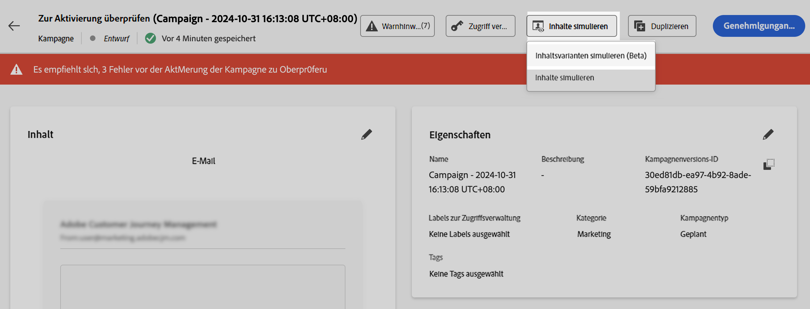

# Automatische Generierung von Inhaltsvarianten (Beta){#auto-generate-variants}

>[!AVAILABILITY]
>
>Diese Funktion befindet sich derzeit in der **Private Beta**-Phase und ist in Ihrer Umgebung möglicherweise nicht verfügbar. Wenden Sie sich an den Adobe-Support, um Zugriff zu erhalten.

[!DNL Journey Optimizer] führt eine KI-gestützte Simulation ein, mit der sich automatisch verschiedene Varianten generieren lassen, damit Sie Ihren Inhalt testen können. Diese Funktion reduziert die Notwendigkeit, Varianten manuell zu erstellen, was die Validierung der Personalisierungslogik in komplexen Vorlagen erleichtert.

Beim Rendern von Inhalten für die Simulation oder das Proofing analysiert das System Ihre Inhalte und identifiziert alle Personalisierungs-Token und Verzweigungsregeln. Es ersetzt Personalisierungs-Token durch aussagekräftige Werte, die für eine nahezu realistische Vorschau des endgültigen Inhalts sorgen.

Stellen Sie sich eine E-Mail-Vorlage für Finanzdienstleistungen mit Verzweigungslogik vor, die auf **Investorentyp**, **Altersgruppe**, **Familienstand**, **Verifizierung der Steuernummer** und **Standort** basiert. Ohne Generierung von Varianten müssten Sie Dutzende von Varianten manuell erstellen, um alle Pfade validieren zu können. Mit automatisch generierten Varianten erzeugt das System repräsentative Varianten, die diese Bedingungen automatisch abdecken.  Jede generierte Variante wird im Vorschaubereich gerendert und zeigt genau an, welche Blöcke und Bedingungen angewendet werden.

## Generieren von Inhaltsvarianten

Gehen Sie wie folgt vor, um Varianten für Ihren Inhalt zu generieren und eine Vorschau anzuzeigen:

1. Öffnen Sie Ihren Inhalt und wählen Sie **[!UICONTROL Inhalt simulieren]** / **[!UICONTROL Inhaltsvarianten simulieren]**.

   

2. Klicken Sie auf die Schaltfläche **[!UICONTROL Generieren]**.

   

3. [!DNL Journey Optimizer] generiert basierend auf erkannten Attributen automatisch Varianten.

4. Überprüfen Sie im linken Bereich die Liste der generierten Varianten und wählen Sie eine Variante aus, um ihr personalisiertes Rendering im Vorschaubereich anzuzeigen.

>[!NOTE]
>
>Diese Funktion funktioniert auf die gleiche Weise wie die standardmäßige Funktion „Inhaltsvarianten simulieren“. Weitere Informationen zur Simulation von Inhaltsvarianten und den zugehörigen Leitlinien und Einschränkungen finden Sie in diesem Abschnitt: [Simulieren von Inhaltsvarianten](../test-approve/simulate-sample-input.md).
