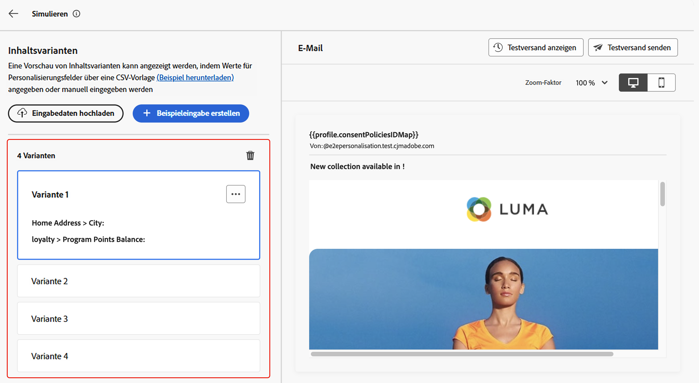
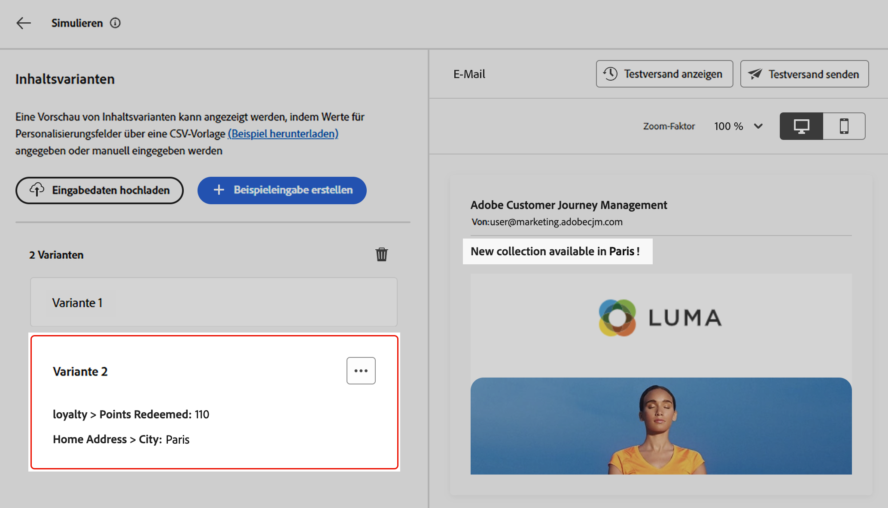
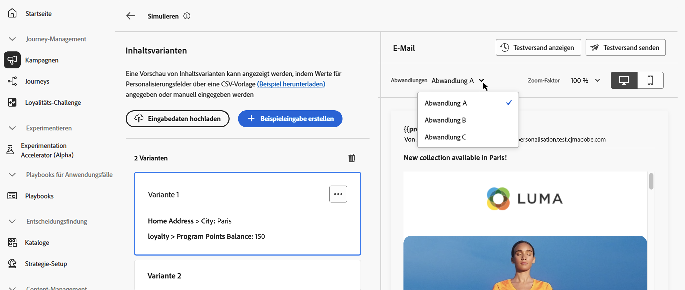

# Inhaltsvarianten simulieren {#custom-profiles}

>[!CONTEXTUALHELP]
>id="ajo_simulate_sample_profiles"
>title="Simulationen mit Beispieleingaben"
>abstract="Auf diesem Bildschirm können Sie verschiedene Varianten Ihrer Inhalte testen, indem Sie Werte für Personalisierungsfelder über eine CSV- oder JSON-Vorlage bereitstellen oder die Werte manuell eingeben."

Mit Journey Optimizer können Sie verschiedene Varianten Ihres Inhalts anhand von Beispieleingabedaten, die aus einer CSV- oder JSON-Datei hochgeladen oder manuell hinzugefügt wurden, in der Vorschau anzeigen.

Alle Attribute, die in Ihrem Inhalt für die Personalisierung verwendet werden, werden automatisch vom System erkannt und können für Ihre Tests verwendet werden, um mehrere Varianten zu erstellen. Eine Variante bezieht sich auf eine Version des Inhalts mit unterschiedlichen Werten für die zugehörigen Attribute.

>[!NOTE]
>
>Varianten dienen nur als Testzwecke für Ihre aktuellen Inhalte. Sie werden nicht in Adobe Experience Platform gespeichert, sondern in Ihrer Benutzerbrowsersitzung, d. h. sie werden nicht angezeigt, wenn Sie sich abmelden oder von einem anderen Gerät aus arbeiten.

## Leitlinien und Einschränkungen {#limitations}

Bevor Sie mit dem Testen Ihrer Inhalte unter Verwendung von Beispiel-Eingabedaten beginnen, sollten Sie die folgenden Leitlinien und Voraussetzungen berücksichtigen.

* **Kanäle** - Die Simulation von Inhaltsvarianten ist nur für die Kanäle E-Mail, SMS und Push-Benachrichtigungen verfügbar.

* **Unterstützte Funktionen** - Inhaltsvarianten können mit [!DNL Journey Optimizer] Funktionen für mehrsprachige Inhalte und Inhaltsexperimente verwendet werden. Auf diese Weise können Sie Nachrichten in mehreren Sprachen testen und den Inhalt durch Experimentieren optimieren.

  Sie können auch Inhaltsvarianten nutzen, um Ihre Inhaltsvorlagen zu testen.

  >[!NOTE]
  >
  >Zurzeit sind Inbox Rendering und Spam-Berichte in der aktuellen Version nicht verfügbar:. Um diese Funktionen zu verwenden, wählen Sie in Ihrem Inhalt die Schaltfläche **[!UICONTROL Inhalt simulieren]** aus, um auf die vorherige Benutzeroberfläche zuzugreifen.

* **Attribute** - Sowohl Profil- als auch Kontextattribute werden unterstützt.

* **Datentypen** - Bei der Eingabe von Daten für Varianten werden nur die folgenden Datentypen unterstützt: Zahl (Ganzzahl und Dezimalzahl), Zeichenfolge, Boolescher Wert und Datentyp. Bei allen anderen Datentypen wird eine Fehlermeldung angezeigt.

* **Anzahl der Varianten** - Sie können bis zu 30 Varianten hinzufügen, um Ihren Inhalt zu testen, entweder mithilfe einer Datei oder manuell.

## Hinzufügen und Vorschau von Inhaltsvarianten

Um Varianten für Ihren Inhalt zu erstellen und eine Vorschau davon anzuzeigen, klicken Sie auf die Schaltfläche **[!UICONTROL Inhalt simulieren]** und wählen Sie **[!UICONTROL Inhaltsvarianten simulieren]**.


Die wichtigsten Schritte zum Testen Ihrer Inhalte sind:

1. **Varianten hinzufügen** - Fügen Sie bis zu 30 Varianten mit Beispieleingabedaten hinzu, indem Sie entweder eine Datei hochladen oder Daten manuell hinzufügen. [Erfahren Sie, wie Sie Varianten hinzufügen](#profiles)
1. **Vorschau von Inhaltsvarianten** - Überprüfen Sie die Vorschau Ihres Inhalts mithilfe der verschiedenen Varianten. [Erfahren Sie, wie Sie eine Vorschau Ihrer Inhalte anzeigen können](#preview)
1. **E-Mail-Testsendungen durchführen** - Senden Sie für E-Mail-Inhalte mithilfe der verschiedenen Varianten bis zu 10 Testsendungen an E-Mail-Adressen. [Durchführen eines Testversands](#proofs)

### Hinzufügen von Varianten {#profiles}

Beim Zugriff auf das Erlebnis „Inhaltsvarianten“ werden alle in Ihren Inhalten verwendeten Personalisierungsfelder automatisch erkannt und in einer Liste leerer Varianten angezeigt.

Wenn Ihre E-Mail beispielsweise zwei Personalisierungsfelder „Stadt“ und „Guthaben an Programmpunkten“ enthält, werden diese in der Liste angezeigt. Zunächst werden keine Werte eingegeben und im Vorschaufenster wird kein personalisierter Inhalt angezeigt.



So bearbeiten Sie den Wert einer Variante:

1. Klicken Sie auf die Schaltfläche mit den Auslassungspunkten neben der Variante.
1. Wählen Sie **[!UICONTROL Bearbeiten]** aus, um benutzerdefinierte Werte für jedes Personalisierungsfeld anzugeben.
1. Der Vorschaubereich wird aktualisiert und zeigt an, wie Ihr Inhalt mit den eingegebenen Werten gerendert wird.

Hinzufügen einer neuen Variante:

1. Klicken Sie auf die Schaltfläche **[!UICONTROL Beispieleingabe erstellen]**.
1. Es wird eine neue leere Variante angezeigt, die alle erkannten Personalisierungsfelder enthält.
1. Bearbeiten Sie die neue Variante nach Bedarf.


Sie können auch eine Datei mit vordefinierten Varianten und Werten hochladen, um den Prozess zu beschleunigen.

1. Klicken Sie **[!UICONTROL Beispiel herunterladen]**, um eine Dateivorlage herunterzuladen.
1. Wählen Sie ein Dateiformat aus: CSV, JSON oder JSONLINES.
1. Öffnen Sie die Vorlagendatei und geben Sie die gewünschten Werte für jedes Profilattribut ein. Die Vorlage enthält eine Spalte für jedes Profilattribut, das in Ihrem Inhalt zur Personalisierung verwendet wird.

   Beispiel für JSON-Syntax:

   ```
   {
   "profile": {
       "attributes": {
       "person": {
           "name": {
               "lastName": "Doe",
               "firstName": "John"
               }
           }
       }
   }
   }
   ```

1. Wenn Ihre Datei fertig ist, klicken Sie auf **[!UICONTROL Eingabedaten hochladen]**, um sie zu laden.
1. Nach dem Hochladen wird der Liste für jeden Eintrag in der Datei eine neue Variante hinzugefügt.

   

Nachdem Varianten hinzugefügt wurden, können Sie sie verwenden, um eine Vorschau Ihres Inhalts im rechten Bereich anzuzeigen und E-Mail-Testsendungen durchzuführen.

### Vorschau von Inhaltsvarianten {#preview}

Um eine Vorschau Ihres Inhalts mit einer Variante anzuzeigen, wählen Sie die entsprechende Variante aus der Liste aus, um den Inhalt im Vorschaubereich mit den für diese Variante eingegebenen Informationen zu aktualisieren.

Im folgenden Beispiel haben wir zwei Varianten für die E-Mail-Betreffzeile hinzugefügt:

| Auswahl von Variante 1 | Auswahl von Variante 2 |
|----------|-------------|
|  |  |

Für mehrsprachige Inhalte und Experimente steht eine Dropdown-Liste zur Verfügung, über die zwischen den verschiedenen Sprachvarianten oder Behandlungen gewechselt werden kann.



Sie können eine Variante jederzeit entfernen, indem Sie auf die Schaltfläche mit den drei Punkten in der oberen rechten Ecke klicken und **[!UICONTROL Entfernen]** auswählen. Um Informationen für eine Variante zu bearbeiten, klicken Sie auf die Schaltfläche mit den drei Punkten und wählen **[!UICONTROL Bearbeiten]** aus.

### Durchführen eines Testversands {#proofs}

Mit Journey Optimizer können Sie Testsendungen an E-Mail-Adressen durchführen und dabei die Identität einer oder mehrerer Varianten annehmen, die Sie im Simulationsbildschirm hinzugefügt haben. Gehen Sie dazu wie folgt vor:

1. Vergewissern Sie sich, dass Varianten zum Testen Ihrer Inhalte hinzugefügt wurden, und klicken Sie auf die Schaltfläche **[!UICONTROL Testversand durchführen]**.

1. Geben Sie im Feld **[!UICONTROL Empfänger]** die E-Mail-Adresse ein, an die Sie den Testversand durchführen möchten, und klicken Sie dann auf **[!UICONTROL Hinzufügen]**. Wiederholen Sie den Vorgang, um den Testversand an zusätzliche E-Mail-Adressen zu senden. Sie können bis zu 10 Empfängerinnen und Empfänger für den Testversand hinzufügen.

1. Wählen Sie im unteren Bereich des Bildschirms die Variante aus, die Sie für den Testversand verwenden möchten. Sie können mehrere Varianten auswählen. In diesem Fall enthält die E-Mail so viele Testsendungen wie ausgewählte Varianten.

   Weitere Informationen zu einer Variante erhalten Sie über die Verknüpfung **[!UICONTROL Profilinformationen anzeigen]**. So können Sie die auf dem vorherigen Bildschirm eingegebenen Informationen für die verschiedenen Varianten anzeigen.

   

1. Klicken Sie auf die Schaltfläche **[!UICONTROL Testversand durchführen]**, um den Testversand zu beginnen.

1. Um den Testversand zu verfolgen, klicken Sie im Bildschirm „Inhalt simulieren“ auf die Schaltfläche **[!UICONTROL Testsendungen anzeigen]**.


