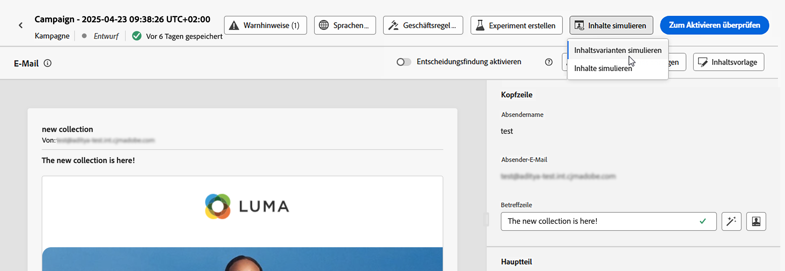

# Testen von Inhalten mit Beispieleingabedaten (Beta) {#custom-profiles}

>[!CONTEXTUALHELP]
>id="ajo_simulate_sample_profiles"
>title="Simulationen mit Beispieleingaben"
>abstract="Auf diesem Bildschirm können Sie verschiedene Varianten Ihrer Inhalte testen, indem Sie Werte für Personalisierungsfelder über eine CSV- oder JSON-Vorlage bereitstellen oder die Werte manuell eingeben."

>[!AVAILABILITY]
>
>Diese Funktionen stehen derzeit allen Kunden als öffentliche Beta-Version zur Verfügung.

Mit Journey Optimizer können Sie verschiedene Varianten Ihres Inhalts testen, indem Sie eine Vorschau davon anzeigen und Testsendungen mithilfe von Beispieleingabedaten durchführen, die aus einer CSV- oder JSON-Datei hochgeladen oder manuell hinzugefügt wurden. Alle Profilattribute, die in Ihren Inhalten für die Personalisierung verwendet werden, werden automatisch vom System erkannt und können für Ihre Tests zur Erstellung mehrerer Varianten verwendet werden.

>[!NOTE]
>
>Derzeit ist die Simulation von Inhaltsvarianten nur für die Kanäle E-Mail, SMS und Push-Benachrichtigung verfügbar.

Um auf dieses Erlebnis zuzugreifen, klicken Sie auf die Schaltfläche **[!UICONTROL Inhalt simulieren]** und wählen Sie **[!UICONTROL Inhaltsvarianten simulieren (Beta)]**.

Die wichtigsten Schritte zum Testen Ihrer Inhalte sind:

1. Fügen Sie bis zu 30 Varianten mit Beispieleingabedaten hinzu, entweder durch Hochladen einer Datei oder durch manuelles Hinzufügen von Daten. [Erfahren Sie, wie Sie Varianten hinzufügen](#profiles)
1. Überprüfen Sie die Vorschau Ihres Inhalts mit den verschiedenen Varianten. [Erfahren Sie, wie Sie eine Vorschau Ihrer Inhalte anzeigen können](#preview)
1. Für E-Mail-Inhalte können Sie mit den verschiedenen Varianten bis zu 10 Testsendungen an E-Mail-Adressen durchführen. [Durchführen eines Testversands](#proofs)

## Leitlinien und Einschränkungen {#limitations}

Bevor Sie mit dem Testen Ihrer Inhalte unter Verwendung von Beispiel-Eingabedaten beginnen, sollten Sie die folgenden Leitlinien und Voraussetzungen berücksichtigen.

* Derzeit sind Tests mit Beispieleingabedaten nur für die Kanäle E-Mail, SMS und Push-Benachrichtigung verfügbar. Das Erlebnis kann nicht über die Schaltfläche „Inhalt simulieren“ im E-Mail-Designer aufgerufen werden.
* Die folgenden Funktionen sind im aktuellen Erlebnis nicht verfügbar: Inbox-Rendering, Spam-Berichte, mehrsprachige Inhalte und Inhaltsexperimente. Um diese Funktionen zu verwenden, wählen Sie in Ihrem Inhalt die Schaltfläche **[!UICONTROL Inhalt simulieren]** aus, um auf die vorherige Benutzeroberfläche zuzugreifen.
* Derzeit werden nur Profilattribute unterstützt. Wenn in Ihren Inhalten kontextbezogene Attribute zur Personalisierung verwendet werden, können Sie Ihre Inhalte nicht mit diesen Attributen testen.
* Bei der Dateneingabe für Ihre Varianten werden nur die folgenden Datentypen unterstützt: Zahl (Ganzzahl und Dezimalzahl), Zeichenkette, boolescher Wert und Datum. Bei allen anderen Datentypen wird eine Fehlermeldung angezeigt.

## Hinzufügen von Varianten {#profiles}

Sie können bis zu 30 Varianten hinzufügen, um Ihren Inhalt zu testen, entweder mithilfe einer Datei oder manuell.

>[!NOTE]
>
>Die hinzugefügten Varianten dienen nur zu Testzwecken für Ihre aktuellen Inhalte. Die werden nicht in Adobe Experience Platform gespeichert, sondern in Ihrer Browser-Benutzersitzung, d. h. sie werden nicht angezeigt, wenn Sie sich abmelden oder von einem anderen Gerät aus arbeiten.

### Variante mithilfe einer Datei hinzufügen {#file}

Gehen Sie wie folgt vor, um eine Variante aus einer Datei hinzuzufügen:

1. Klicken Sie auf den Link **[!UICONTROL Beispiel herunterladen]** , um eine Dateivorlage abzurufen, und wählen Sie dann das Dateiformat aus, das Sie verwenden möchten (CSV, JSON oder JSONLINES).

1. Klicken Sie auf **[!UICONTROL Herunterladen]** und speichern Sie dann die Vorlage am gewünschten Speicherort.

1. Öffnen Sie die Datei und füllen Sie die Vorlage entsprechend Ihren Anforderungen aus. Die Vorlage enthält eine Spalte für jedes Profilattribut, das in Ihrem Inhalt zur Personalisierung verwendet wird.

1. Wenn Ihre Datei fertig ist, klicken Sie auf **[!UICONTROL Eingabedaten hochladen]** , um sie zum Testen Ihres Inhalts zu laden.

1. Nach dem Hochladen der Datei wird im linken Bereich für jede Zeile der Datei ein Feld hinzugefügt. Jedes Feld enthält alle Profilattribute, die in Ihrem Inhalt für die Personalisierung verwendet werden. Sie können nun die Varianten verwenden, um Ihre Inhalte im rechten Bereich in der Vorschau anzuzeigen und Testsendungen durchzuführen.

   

### Varianten manuell hinzufügen {#manual}

Gehen Sie wie folgt vor, um eine Variante manuell hinzuzufügen:

1. Klicken Sie auf die Schaltfläche **[!UICONTROL Beispieleingabe erstellen]** .

   Im linken Bereich wird ein Feld mit allen Profilattributen hinzugefügt, die in Ihrem Inhalt zur Personalisierung verwendet werden.

1. Füllen Sie die Beispieleingabedaten für die Variante aus und klicken Sie auf **[!UICONTROL Speichern]**.

   

1. Sobald Varianten hinzugefügt wurden, können Sie diese verwenden, um im rechten Bereich eine Vorschau Ihres Inhalts anzuzeigen und Testsendungen durchzuführen.

## Vorschau Ihrer Inhaltsvarianten {#preview}

Für eine Vorschau Ihrer Inhalte mit einer der Varianten wählen Sie das entsprechende Kästchen zur Aktualisierung der Inhaltsvorschau im rechten Bereich mit den für diese Variante eingegebenen Informationen aus.

Sie können eine Variante jederzeit entfernen, indem Sie auf die Schaltfläche mit den drei Punkten in der oberen rechten Ecke klicken und **[!UICONTROL Entfernen]** auswählen. Um Informationen für eine Variante zu bearbeiten, klicken Sie auf die Schaltfläche mit den drei Punkten und wählen **[!UICONTROL Bearbeiten]** aus.

## Durchführen eines Testversands {#proofs}

Mit Journey Optimizer können Sie Testsendungen an E-Mail-Adressen durchführen und dabei die Identität einer oder mehrerer Varianten annehmen, die Sie im Simulationsbildschirm hinzugefügt haben. Gehen Sie dazu wie folgt vor:

1. Vergewissern Sie sich, dass Varianten zum Testen Ihrer Inhalte hinzugefügt wurden, und klicken Sie auf die Schaltfläche **[!UICONTROL Testversand durchführen]**.

1. Geben Sie im Feld **[!UICONTROL Empfänger]** die E-Mail-Adresse ein, an die Sie den Testversand durchführen möchten, und klicken Sie dann auf **[!UICONTROL Hinzufügen]**. Wiederholen Sie den Vorgang, um den Testversand an zusätzliche E-Mail-Adressen zu senden. Sie können bis zu 10 Empfängerinnen und Empfänger für den Testversand hinzufügen.

1. Wählen Sie im unteren Bereich des Bildschirms die Variante aus, die Sie für den Testversand verwenden möchten. Sie können mehrere Varianten auswählen. In diesem Fall enthält die E-Mail so viele Testsendungen wie ausgewählte Varianten.

   Weitere Informationen zu einer Variante erhalten Sie über die Verknüpfung **[!UICONTROL Profilinformationen anzeigen]**. So können Sie die auf dem vorherigen Bildschirm eingegebenen Informationen für die verschiedenen Varianten anzeigen.

   

1. Klicken Sie auf die Schaltfläche **[!UICONTROL Testversand durchführen]**, um den Testversand zu beginnen.

1. Um den Testversand zu verfolgen, klicken Sie im Bildschirm „Inhalt simulieren“ auf die Schaltfläche **[!UICONTROL Testsendungen anzeigen]**.

