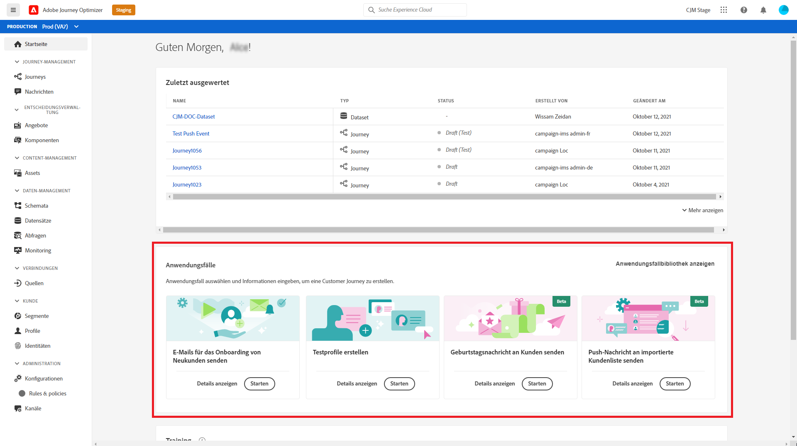
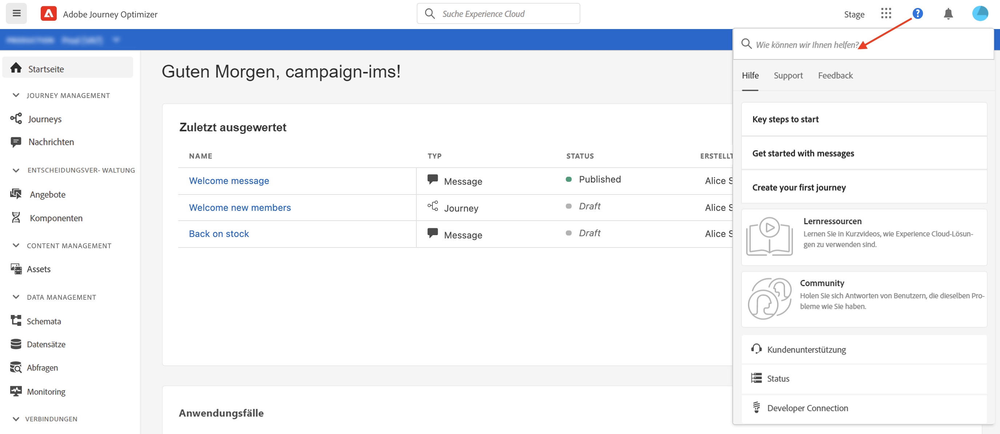

# Benutzeroberfläche {#cjm-user-interface}

Sobald die Verbindung zu [Adobe Experience Cloud](http://experience.adobe.com) hergestellt ist, navigieren Sie zu [!DNL Journey Optimizer].

>[!NOTE]
>
>* Die wichtigsten Konzepte bei der Verwendung der Benutzeroberfläche gelten auch für Adobe Experience Platform. Weitere Informationen finden Sie in der [Dokumentation zu Adobe Experience Platform](https://experienceleague.adobe.com/docs/experience-platform/landing/platform-ui/ui-guide.html?lang=de#adobe-experience-platform-ui-guide){target=&quot;_blank&quot;}.
   >
   >
* Die vorliegende Dokumentation wird entsprechend den Änderungen an der Benutzeroberfläche des Produkts regelmäßig aktualisiert. Manche Screenshots können jedoch geringfügig von der Ihrer Benutzeroberfläche abweichen.
   >
   > 
* Die in der Benutzeroberfläche verfügbaren Komponenten und Funktionen hängen von Ihren Berechtigungen und Ihrem Lizenzierungspaket ab. Wenden Sie sich bei Fragen an Ihren Adobe Customer Success Manager.

## Linke Navigation

Durchsuchen Sie die Funktionen mithilfe der Links auf der linken Seite.

>[!NOTE]
>
>Die verfügbaren Funktionen hängen von Ihren Berechtigungen und Ihrer Lizenzvereinbarung ab.

Unten finden Sie eine vollständige Liste der Einträge in der linken Leiste sowie die Links zur entsprechenden Dokumentation.

**Startseite**

Die Startseite von [!DNL Journey Optimizer] enthält wichtige Links und Ressourcen für den Start. Die Liste **[!UICONTROL Zuletzt erstellt]** enthält Verknüpfungen zu den kürzlich erstellten oder aktualisierten Nachrichten, Ereignissen und Journeys. Diese Liste zeigt die Erstellungs- und Änderungsdaten sowie den Status an.

**[!UICONTROL JOURNEY-MANAGEMENT]**

* **[!UICONTROL Journeys]**: Erstellen, konfigurieren und orchestrieren Sie Ihre Customer Journey. [Weitere Informationen](building-journeys/journey-gs.md#jo-build)

* **[!UICONTROL Nachrichten]**: Erstellen, entwerfen, testen und veröffentlichen Sie E-Mail- und Push-Nachrichten. [Weitere Informationen](create-message.md)

**[!UICONTROL ENTSCHEIDUNGS-MANAGEMENT]**

* **[!UICONTROL Angebote]**: Greifen Sie über dieses Menü auf Ihre aktuellen Quellen und Datensätze zu. Verwenden Sie diesen Abschnitt, um neue Angebote zu erstellen. [Weitere Informationen](offers/offer-library/creating-personalized-offers.md)

* **[!UICONTROL Komponenten]**: Erstellen Sie Platzierungen, Regeln und Tags. [Weitere Informationen](offers/offer-library/key-steps.md)

**[!UICONTROL CONTENT-MANAGEMENT]**

* **[!UICONTROL Assets]**: [!DNL Adobe Experience Manager Assets Essentials] ist ein zentralisiertes Repository von Assets, die Sie Ihren Nachrichten hinzufügen können. [Weitere Informationen](assets-essentials.md)

**[!UICONTROL DATEN-MANAGEMENT]**

* **[!UICONTROL Schemata]**: Verwenden Sie Adobe Experience Platform, um Experience Data Model-(XDM-)Schemata auf einer interaktiven visuellen Arbeitsfläche zu erstellen und zu verwalten, die als Schema-Editor bezeichnet wird. [Weitere Informationen](get-started-schemas.md)

* **[!UICONTROL Datensätze]**: Alle Daten, die in Adobe Experience Platform aufgenommen werden, bleiben als Datensätze im Data Lake erhalten. Ein Datensatz ist ein Konstrukt zur Datenspeicherung und -verwaltung, in dem Daten (in der Regel) in einer Tabelle erfasst werden, die ein Schema (Spalten) und Felder (Zeilen) beinhaltet. [Weitere Informationen](get-started-datasets.md)

* **[!UICONTROL Abfragen]**: Verwenden Sie den Abfrage-Service von Adobe Experience Platform, um Abfragen zu schreiben und auszuführen, zuvor ausgeführte Abfragen anzuzeigen und auf Abfragen zuzugreifen, die von Benutzern in Ihrem Unternehmen gespeichert wurden. [Weitere Informationen](get-started-queries.md)

* **[!UICONTROL Überwachung]**: Verwenden Sie dieses Menü, um die Datenaufnahme in der Benutzeroberfläche von Adobe Experience Platform zu überwachen. [Weitere Informationen](https://experienceleague.adobe.com/docs/experience-platform/ingestion/quality/monitor-data-ingestion.html?lang=de){target=&quot;_blank&quot;}

**[!UICONTROL VERBINDUNGEN]**

* **[!UICONTROL Quellen]**: Verwenden Sie dieses Menü, um Daten aus verschiedenen Quellen aufzunehmen, z. B. Adobe-Programme, Cloud-basierte Datenspeicher, Datenbanken usw. und eingehende Daten zu strukturieren, zu kennzeichnen und zu optimieren. [Weitere Informationen](get-started-sources.md)

**[!UICONTROL KUNDE]**

* **[!UICONTROL Segmente]**: Erstellen und verwalten Sie Segmentdefinitionen für Adobe Experience Platform und nutzen Sie diese in Ihren Journeys. [Weitere Informationen](segment/about-segments.md)

* **[!UICONTROL Profile]**: Das Echtzeit-Kundenprofil erstellt eine ganzheitliche Sicht auf Ihre einzelnen Kunden und führt Daten aus mehreren Kanälen (Online-, Offline-, CRM- und Drittanbieter-Daten) zusammen. [Weitere Informationen](get-started-profiles.md)

* **[!UICONTROL Identitäten]**: Der Adobe Experience Platform Identity Service verwaltet die geräte- und kanalübergreifende, nahezu in Echtzeit ausgeführte Identifizierung Ihrer Kunden in einem sogenannten Identitätsdiagramm innerhalb von Adobe Experience Platform. [Weitere Informationen](get-started-identity.md)

**[!UICONTROL ADMINISTRATION]**

* **[!UICONTROL Journey-Administration]**: Verwenden Sie dieses Menü, um [Ereignisse](event/about-events.md), [Datenquellen](datasource/about-data-sources.md) und [Aktionen](action/action.md) zu konfigurieren, die Sie in Ihren Journeys verwenden können.

* **[!UICONTROL Sandboxes]**: Adobe Experience Platform stellt Sandboxes bereit, die eine einzelne Instanz in separate virtuelle Umgebungen aufteilen, um die Entwicklung und Weiterentwicklung von Programmen für digitale Erlebnisse zu erleichtern. [Weitere Informationen](administration/sandboxes.md)

## Produktinterne Anwendungsfälle

Sie können [!DNL Adobe Journey Optimizer]-Anwendungsfälle direkt auf der Startseite verwenden und mit nur wenigen Eingaben eine Customer Journey erstellen.

Verfügbare Anwendungsfälle:

* **Erstellen von Testprofilen** mithilfe unserer CSV-Vorlage, um personalisierte Nachrichten und Journeys zu testen. [Auf dieser Seite](building-journeys/creating-test-profiles.md#use-case-1) erfahren Sie, wie Sie dieses Anwendungsbeispiel implementieren.
* **Senden von Geburtstagsnachrichten an Kunden**, um Ihren Kunden automatisch eine E-Mail zu senden, die ihnen zum Geburtstag gratuliert. (in Kürze verfügbar)
* **Senden von E-Mails an neue Kunden**, um bis zu zwei E-Mails zu versenden, die neu registrierte Kunden willkommen heißen. (in Kürze verfügbar)
* **Senden von Push-Benachrichtigungen an eine importierte Liste von Kunden**, um schnell eine Push-Benachrichtigung an eine Liste von Kunden zu senden, die aus einer CSV-Datei importiert wurden. (in Kürze verfügbar)

Klicken Sie auf **[!UICONTROL Details anzeigen]**, um mehr über jeden Anwendungsfall zu erfahren.

Klicken Sie auf die Schaltfläche **[!UICONTROL Starten]**, um den Anwendungsfall zu starten.

Sie können über die Schaltfläche **[!UICONTROL Anwendungsfallbibliothek anzeigen]** auf ausgeführte Anwendungsfälle zugreifen.

## Hilfe und Support

Über den unteren Bereich der Startseite können Sie auf die wichtigsten Hilfeseiten von Adobe Journey Optimizer zugreifen.

Verwenden Sie das Symbol **Hilfe**, um auf Hilfeseiten zuzugreifen, den Support zu kontaktieren und Feedback zu geben. Über das Suchfeld können Sie Hilfeartikel und Videos suchen.

## Unterstützte Browser

Die Benutzeroberfläche von Adobe [!DNL Journey Optimizer] wurde für eine optimale Funktionsweise in der neuesten Version von Google Chrome entwickelt. Bei der Verwendung bestimmter Funktionen in älteren Versionen oder anderen Browsern können Probleme auftreten.

## Sprachvoreinstellungen

Die Benutzeroberfläche ist derzeit in folgenden Sprachen verfügbar:

* Englisch
* Französisch
* Deutsch

Die Standardsprache der Benutzeroberfläche ist die Sprache, die Sie in Ihrem Profil angegeben haben.

Gehen Sie wie folgt vor, um Ihre Sprache zu ändern:

* Klicken Sie in Ihrem Avatar oben rechts auf **Voreinstellungen**.
   
* Klicken Sie dann auf die Sprache, die unter Ihrer E-Mail-Adresse angezeigt wird.
* Wählen Sie Ihre bevorzugte Sprache und klicken Sie auf **Speichern**. Sie können eine zweite Sprache auswählen, falls die von Ihnen verwendete Komponente nicht in Ihrer ersten Sprache lokalisiert ist.
   

## Durchsuchen

Von der gesamten Oberfläche von Adobe Journey Optimizer aus können Sie die Adobe Experience Cloud-Suche in der Mitte der oberen Leiste verwenden, um Assets, Journeys oder Nachrichten in allen Ihren Sandboxes zu finden. Beginnen Sie mit der Eingabe von Inhalten, um die wichtigsten Ergebnisse anzuzeigen.

Drücken Sie die **Eingabetaste**, um auf alle Ergebnisse und Filter zuzugreifen.

## Filterlisten{#section_lgm_hpz_pgb}

In den meisten Listen können Sie über eine Suchleiste nach einem bestimmten Element suchen und Filterkriterien auswählen.

Sie können auf die Filter zugreifen, indem Sie auf das Filtersymbol links oben in der Liste klicken. Mit dem Filtermenü können Sie die angezeigten Elemente anhand unterschiedlicher Kriterien filtern. Sie können festlegen, dass nur die Elemente eines bestimmten Typs oder Status, die von Ihnen erstellten Elemente oder die in den letzten 30 Tagen geänderten Elemente angezeigt werden sollen. Die Optionen unterscheiden sich je nach Kontext.

In der Liste der Journeys können Sie Journeys mit den **[!UICONTROL Status- und Versionsfiltern]** nach Status, Typ und Version filtern. Die folgenden Typen sind möglich: **[!UICONTROL Unitäres Ereignis]**, **[!UICONTROL Segmentqualifikation]**, **[!UICONTROL Segment lesen]**, **[!UICONTROL Geschäftsereignis]** und **[!UICONTROL Burst]**. sSie können festlegen, dass nur Journeys angezeigt werden sollen, die ein bestimmtes Ereignis, eine bestimmte Feldergruppe oder eine bestimmte Aktion aus den **[!UICONTROL Aktivitätsfiltern]** und **[!UICONTROL Datenfiltern]** nutzen. Mit den **[!UICONTROL Veröffentlichungsfiltern]** können Sie ein Veröffentlichungsdatum oder einen Benutzer auswählen. Sie können beispielsweise auswählen, dass die aktuellen Versionen von Live-Journeys, die am Vortag veröffentlicht wurden, angezeigt werden sollen. [Weitere Informationen](building-journeys/using-the-journey-designer.md).

>[!NOTE]
>
>Beachten Sie, dass angezeigte Spalten mithilfe der Konfigurationsschaltfläche oben rechts in den Listen personalisiert werden können. Die Personalisierung wird für jeden Benutzer individuell gespeichert.

Verwenden Sie die Spalten **[!UICONTROL Letzte Aktualisierung]** und **[!UICONTROL Letzte Aktualisierung von]**, um zu überprüfen, wann das letzte Update Ihrer Journey erfolgt ist und wer es gespeichert hat.

In den Konfigurationsbereichen für Ereignis, Datenquelle und Aktion zeigt das Feld **[!UICONTROL Verwendet in]** die Zahl der Journeys an, die dieses bestimmte Ereignis, diese Feldergruppe oder diese Aktion verwenden. Sie können auf die Schaltfläche **[!UICONTROL Customer Journeys anzeigen]** klicken, um die Liste der entsprechenden Journeys zu öffnen.

In den verschiedenen Listen können Sie grundlegende Aktionen für einzelne Elemente durchführen. Sie können Elemente beispielsweise duplizieren oder löschen.

