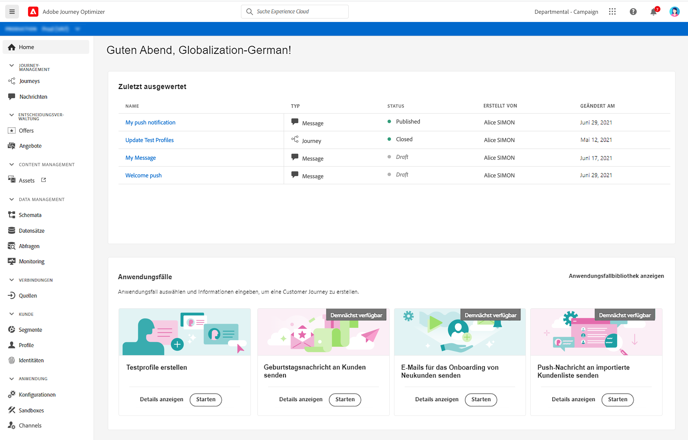
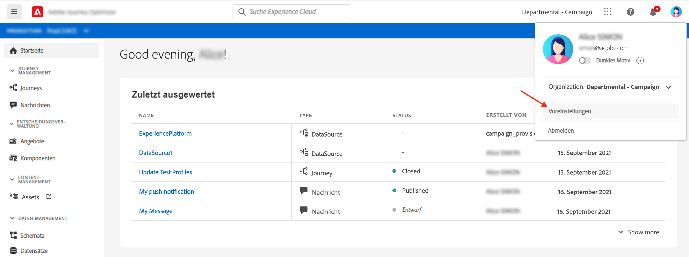
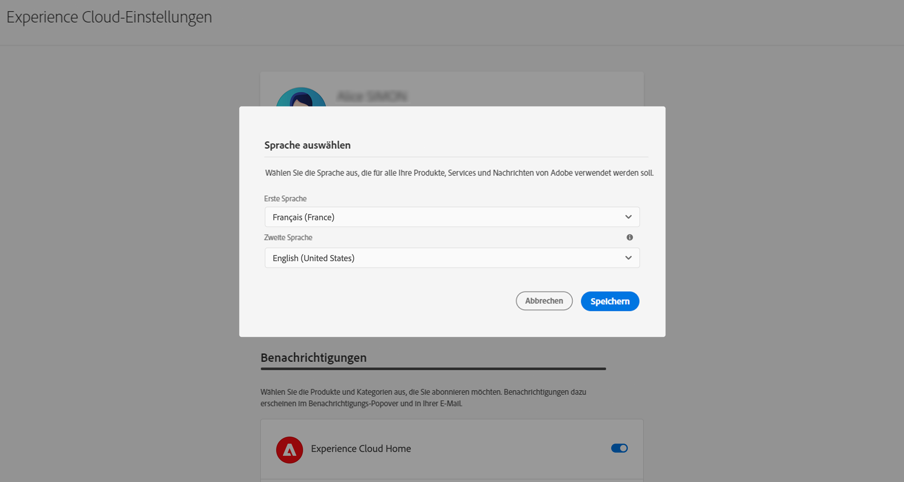
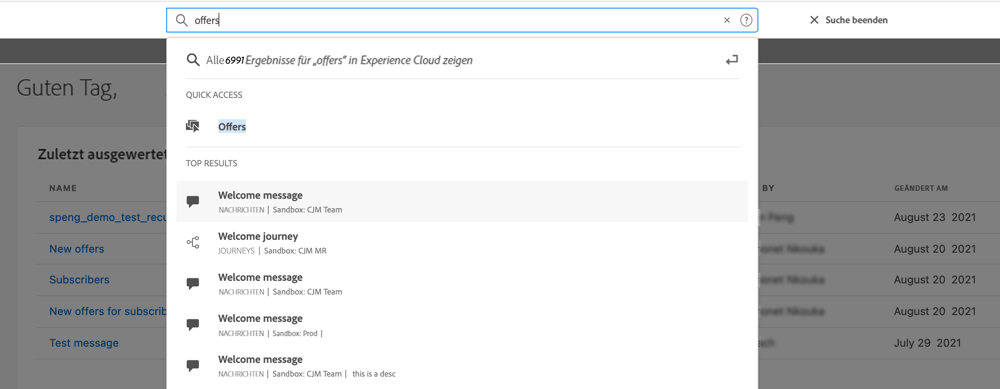
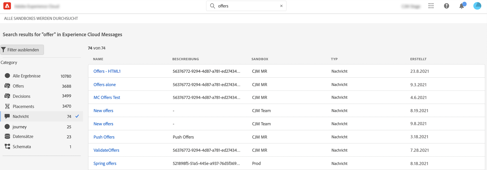
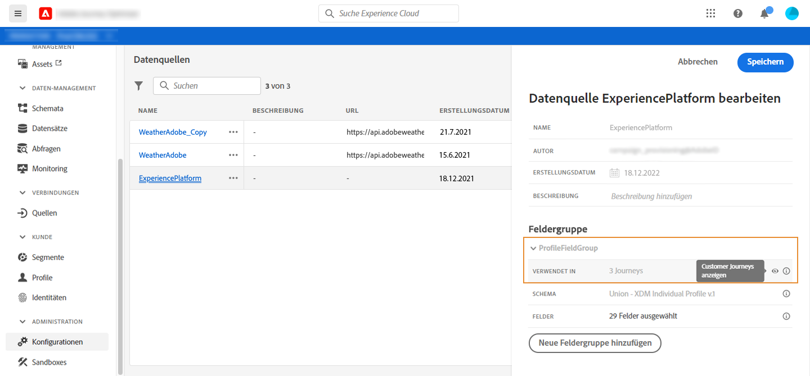
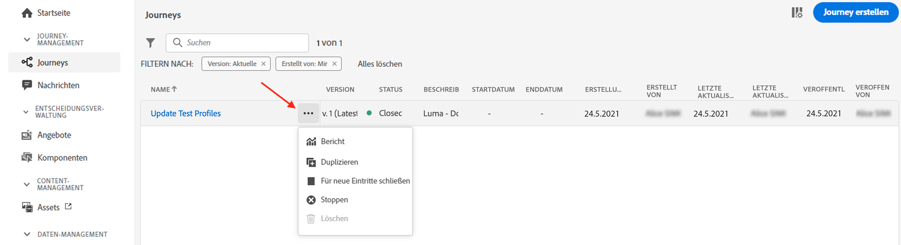
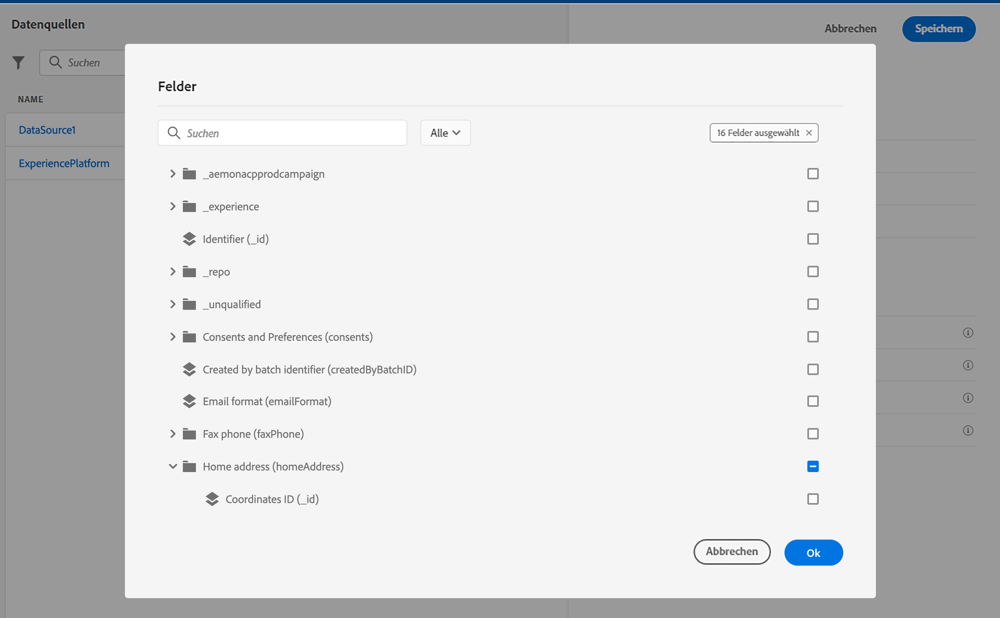

# Benutzeroberfläche {#cjm-user-interface}

Die vorliegende Dokumentation wird entsprechend den Produktänderungen regelmäßig aktualisiert. Manche Screenshots können jedoch geringfügig von der Ihrer Benutzeroberfläche abweichen.

## Arbeitsbereich {#cjm-workspace}

Sobald die Verbindung zu [Adobe Experience Cloud](http://experience.adobe.com) hergestellt ist, navigieren Sie zu [!DNL Journey Optimizer].

>[!NOTE]
>
>Die wichtigsten Konzepte bei der Verwendung der Benutzeroberfläche werden in der Dokumentation von [Adobe Experience Platform](https://experienceleague.adobe.com/docs/experience-platform/landing/platform-ui/ui-guide.html?lang=de#adobe-experience-platform-ui-guide) beschrieben.

Durchsuchen Sie die Funktionen mithilfe der Links auf der linken Seite.

>[!NOTE]
>
>Die verfügbaren Funktionen hängen von Ihren Berechtigungen und Ihrer Lizenzvereinbarung ab.

Unten finden Sie die vollständige Liste der Dienste und Funktionen, die im linken Navigationsbereich verfügbar sind, sowie Links zur zugehörigen Dokumentation.

**Startseite**

Die [!DNL Journey Optimizer]-Startseite enthält wichtige Links und Ressourcen für den Start. Die Liste **[!UICONTROL Zuletzt erstellt]** enthält Verknüpfungen zu den kürzlich erstellten oder aktualisierten Nachrichten, Ereignissen und Journey. Diese Liste zeigt die Erstellungs- und Änderungsdaten sowie den Status an.

**[!UICONTROL JOURNEY-MANAGEMENT]**

* **[!UICONTROL Journeys]**: Erstellen, konfigurieren und orchestrieren Sie Ihre Customer Journey. Weiterführende Informationen finden Sie [in diesem Abschnitt](building-journeys/journey-gs.md#jo-build)

* **[!UICONTROL Nachrichten]**: Erstellen, entwerfen, testen und veröffentlichen Sie E-Mail- und Push-Nachrichten. Weiterführende Informationen finden Sie [in diesem Abschnitt](create-message.md)

**[!UICONTROL ENTSCHEIDUNGS-MANAGEMENT]**

* **[!UICONTROL Angebote]**: Greifen Sie über dieses Menü auf Ihre aktuellen Quellen und Datensätze zu. Verwenden Sie diesen Abschnitt, um neue Angebote zu erstellen. [Weitere Infos](offers/offer-library/creating-personalized-offers.md)

* **[!UICONTROL Komponenten]**: Erstellen Sie Platzierungen, Regeln und Tags. Weiterführende Informationen finden Sie in diesem [Abschnitt](offers/offer-library/key-steps.md)

**[!UICONTROL CONTENT-MANAGEMENT]**

* **[!UICONTROL Assets]**: [!DNL Adobe Experience Manager Assets Essentials] ist ein zentralisiertes Repository von Assets, die Sie Ihren Nachrichten hinzufügen können. Weiterführende Informationen finden Sie in diesem [Abschnitt](assets-essentials.md)

**[!UICONTROL DATEN-MANAGEMENT]**

* **[!UICONTROL Schemata]**: Verwenden Sie Adobe Experience Platform, um Experience Data Model-(XDM-)Schemata auf einer interaktiven visuellen Arbeitsfläche zu erstellen und zu verwalten, die als Schema-Editor bezeichnet wird. [Weitere Informationen finden Sie in dieser Dokumentation](https://experienceleague.adobe.com/docs/experience-platform/xdm/tutorials/create-schema-ui.html?lang=de)

* **[!UICONTROL Datensätze]**: Alle Daten, die in Adobe Experience Platform aufgenommen werden, bleiben als Datensätze im Data Lake erhalten. Ein Datensatz ist ein Konstrukt zur Datenspeicherung und -verwaltung, in dem Daten (in der Regel) in einer Tabelle erfasst werden, die ein Schema (Spalten) und Felder (Zeilen) beinhaltet. [Erfahren Sie in dieser Dokumentation, wie Sie einen Datensatz erstellen und in der Vorschau anzeigen können](https://experienceleague.adobe.com/docs/experience-platform/catalog/datasets/user-guide.html?lang=de)

* **[!UICONTROL Abfragen]**: Verwenden Sie den Abfrage Service von Adobe Experience Platform, um Abfragen zu schreiben und auszuführen, zuvor ausgeführte Abfragen anzuzeigen und auf Abfragen zuzugreifen, die von Benutzern in Ihrem Unternehmen gespeichert wurden. [Weitere Informationen finden Sie in dieser Dokumentation](https://experienceleague.adobe.com/docs/experience-platform/query/ui/overview.html?lang=de)

* **[!UICONTROL Überwachung]**: Verwenden Sie dieses Menü, um die Datenerfassung in der Benutzeroberfläche von Adobe Experience Platform zu überwachen. [Weitere Informationen finden Sie in dieser Dokumentation](https://experienceleague.adobe.com/docs/experience-platform/ingestion/quality/monitor-data-ingestion.html?lang=de)

**[!UICONTROL VERBINDUNGEN]**

* **[!UICONTROL Quellen]**: Verwenden Sie dieses Menü, um Daten aus verschiedenen Quellen aufzunehmen, z. B. Adobe-Programme, Cloud-basierte Datenspeicher, Datenbanken usw., und eingehende Daten zu strukturieren, zu kennzeichnen und zu optimieren. [Weitere Informationen finden Sie in dieser Dokumentation](https://experienceleague.adobe.com/docs/experience-platform/sources/home.html?lang=de)

**[!UICONTROL KUNDE]**

* **[!UICONTROL Segmente]**: Erstellen und verwalten Sie Segmentdefinitionen für Adobe Experience Platform und nutzen Sie diese in Ihren Journeys. Weiterführende Informationen finden Sie auf [dieser Seite](segment/about-segments.md)

* **[!UICONTROL Profile]**: Das Echtzeit-Kundenprofil erstellt eine ganzheitliche Sicht auf Ihre einzelnen Kunden und führt Daten aus mehreren Kanälen (Online-, Offline-, CRM- und Drittanbieter-Daten) zusammen. [Weitere Informationen finden Sie in dieser Dokumentation](https://experienceleague.adobe.com/docs/experience-platform/profile/ui/user-guide.html?lang=de)

* **[!UICONTROL Identitäten]**: Der Adobe Experience Platform Identity Service verwaltet die geräte- und kanalübergreifende, nahezu in Echtzeit ausgeführte Identifizierung Ihrer Kunden in einem so genannten Identitätsdiagramm innerhalb von Adobe Experience Platform. [Erfahren Sie in dieser Dokumentation, wie Sie einen Identitäts-Namespace erstellen](https://experienceleague.adobe.com/docs/experience-platform/identity/namespaces.html?lang=de#manage-namespaces)

**[!UICONTROL ADMINISTRATION]**

* **[!UICONTROL Journey-Administration]**: Verwenden Sie dieses Menü, um [Ereignisse](event/about-events.md), [Datenquellen](datasource/about-data-sources.md) und [Aktionen](action/action.md) zu konfigurieren, die Sie in Ihren Journey verwenden können.

* **[!UICONTROL Sandboxes]**: Adobe Experience Platform stellt Sandboxes bereit, die eine einzelne Instanz in separate virtuelle Umgebungen aufteilen, um die Entwicklung und Weiterentwicklung von Programmen für digitale Erlebnisse zu erleichtern. [Weitere Informationen zu Sandboxen finden Sie in dieser Dokumentation](https://experienceleague.adobe.com/docs/experience-platform/sandbox/ui/user-guide.html?lang=de)

## Browser- und Sprachunterstützung

Die Benutzeroberfläche von Adobe [!DNL Journey Optimizer] wurde für eine optimale Funktionsweise in der neuesten Version von Google Chrome entwickelt. Bei der Verwendung bestimmter Funktionen in älteren Versionen oder anderen Browsern können Probleme auftreten.

Die Benutzeroberfläche ist derzeit in folgenden Sprachen verfügbar:

* Englisch
* Französisch
* Deutsch

Die Standardsprache der Benutzeroberfläche ist die Sprache, die Sie in Ihrem Profil angegeben haben.

Gehen Sie wie folgt vor, um Ihre Sprache zu ändern:

* Klicken Sie oben rechts in Ihrem Avatar auf **Voreinstellungen** .
   
* Klicken Sie dann auf die Sprache, die unter Ihrer E-Mail-Adresse angezeigt wird.
* Wählen Sie Ihre bevorzugte Sprache und klicken Sie auf **Speichern**. Sie können eine zweite Sprache auswählen, falls die von Ihnen verwendete Komponente nicht in Ihrer Muttersprache lokalisiert ist.
   

## Durchsuchen

Verwenden Sie die Adobe Experience Cloud-Suche in der Mitte der oberen Leiste, um Assets, Journey oder Nachrichten über Ihre Sandboxes hinweg zu finden. Beginnen Sie mit der Eingabe des Inhalts, um die wichtigsten Ergebnisse anzuzeigen.

Drücken Sie die **Eingabetaste**, um auf alle Ergebnisse und Filter zuzugreifen.

## Filterlisten{#section_lgm_hpz_pgb}

In den meisten Listen können Sie über eine Suchleiste nach einem bestimmten Element suchen und Filterkriterien auswählen.

Der Zugriff auf Filter erfolgt über das Filtersymbol links oben in der Liste. Mit dem Filtermenü können Sie die angezeigten Elemente anhand unterschiedlicher Kriterien filtern. Sie können festlegen, dass nur die Elemente eines bestimmten Typs oder Status, die von Ihnen erstellten Elemente oder die in den letzten 30 Tagen geänderten Elemente angezeigt werden sollen. Die Optionen unterscheiden sich je nach Kontext.

In der Liste der Journey können Sie Journey anhand ihres Status und ihrer Version aus den **[!UICONTROL Status- und Versionsfiltern]** filtern. Sie können festlegen, dass nur Journey angezeigt werden, die ein bestimmtes Ereignis, eine bestimmte Feldergruppe oder eine bestimmte Aktion aus den **[!UICONTROL Aktivitätsfiltern]** und **[!UICONTROL Datenfilter]** verwenden. Mit den **[!UICONTROL Veröffentlichungsfiltern]** können Sie ein Veröffentlichungsdatum oder einen Benutzer auswählen. Sie können beispielsweise auswählen, dass die aktuellen Versionen von Live-Journeys, die am Vortag veröffentlicht wurden, angezeigt werden sollen. [Weitere Infos](building-journeys/using-the-journey-designer.md).

>[!NOTE]
>
>Beachten Sie, dass angezeigte Spalten mithilfe der Konfigurationsschaltfläche oben rechts in den Listen personalisiert werden können. Die Personalisierung wird für jeden Benutzer individuell gespeichert.

Verwenden Sie die Spalten **[!UICONTROL Letzte Aktualisierung]** und **[!UICONTROL Letzte Aktualisierung von]**, um zu überprüfen, wann das letzte Update Ihrer Journey erfolgt ist und wer es gespeichert hat.

In den Konfigurationsbereichen für Ereignis, Datenquelle und Aktion zeigt das Feld **[!UICONTROL Verwendet in]** die Zahl der Journeys an, die dieses bestimmte Ereignis, diese Feldergruppe oder diese Aktion verwenden. Sie können auf die Schaltfläche **[!UICONTROL Customer Journeys anzeigen]** klicken, um die Liste der entsprechenden Journeys zu öffnen.

In den verschiedenen Listen können Sie grundlegende Aktionen für einzelne Elemente durchführen. Sie können Elemente beispielsweise duplizieren oder löschen.

## Durchsuchen von Adobe Experience Platform-Feldern {#friendly-names-display}

Bei der Definition von [Ereignis-Payload](event/about-creating.md#define-the-payload-fields), [Feldgruppen-Payload](datasource/configure-data-sources.md#define-field-groups) und der Auswahl von Feldern im [Ausdruckseditor](https://experienceleague.adobe.com/docs/journeys/using/building-advanced-conditions-journeys/expressionadvanced.html?lang=de) wird der Anzeigename zusätzlich zum Feldnamen angezeigt. Diese Informationen werden aus der Schemadefinition im Experience-Datenmodell abgerufen.

Wenn beim Einrichten von Schemata Deskriptoren wie „xdm:alternateDisplayInfo“ angegeben werden, werden die Anzeigenamen durch benutzerfreundliche Namen ersetzt. Dies ist besonders beim Arbeiten mit &quot;eVars&quot;und generischen Feldern nützlich. Sie können die Deskriptoren für benutzerfreundliche Namen über einen API-Aufruf konfigurieren. Weitere Informationen finden Sie im [Entwicklerhandbuch zur Schema Registry](https://experienceleague.adobe.com/docs/experience-platform/xdm/api/getting-started.html?lang=de).

Wenn ein benutzerfreundlicher Name verfügbar ist, wird das Feld als `<friendly-name>(<name>)` angezeigt. Ist kein benutzerfreundlicher Name verfügbar, wird der Anzeigename angezeigt, z. B. `<display-name>(<name>)`. Wenn keiner der Namen definiert ist, wird nur der technische Name des Felds `<name>` angezeigt.

>[!NOTE]
>
>Benutzerfreundliche Namen werden nicht abgerufen, wenn Sie Felder aus einer Vereinigungsmenge von Schemata auswählen.

## Barrierefreiheit{#cjm-accessibility}

Hier finden Sie die verschiedenen Tastaturbefehle, die in der Benutzeroberfläche von [!DNL Journey Optimizer] verfügbar sind.

_In der Liste der Journeys, Aktionen, Datenquellen oder Ereignisse:_

* Drücken Sie **c**, um eine neue Journey, Aktion, Datenquelle oder ein neues Ereignis zu erstellen.

_Beim Konfigurieren einer Aktivität in einer Journey:_

Die Arbeitsfläche wird automatisch gespeichert. Oben links in der Arbeitsfläche sehen Sie den Speicherstatus.

* Drücken Sie **Esc**, um den Konfigurationsbereich zu schließen und die vorgenommenen Änderungen zu verwerfen. Dies entspricht der Schaltfläche **[!UICONTROL Abbrechen]**.
* Drücken Sie die **Eingabetaste** oder klicken Sie außerhalb des Bereichs, um den Konfigurationsbereich zu schließen. Änderungen werden gespeichert. Dies entspricht der Schaltfläche **[!UICONTROL OK]**.
* Wenn Sie die Taste **Löschen** oder die **Rücktaste** drücken, können Sie den Löschvorgang durch anschließendes Drücken der **Eingabetaste** bestätigen.

_In Popups:_

* Drücken Sie **Esc**, um sie zu schließen (entspricht der Schaltfläche **[!UICONTROL Abbrechen]**).
* Drücken Sie zum Speichern oder Bestätigen die **Eingabetaste** (entspricht der Schaltfläche **[!UICONTROL OK]** oder **[!UICONTROL Speichern]**).

_Im Ereignis-, Datenquellen- oder Aktionskonfigurationsbereich:_

* Drücken Sie **Esc**, um den Konfigurationsbereich ohne Speichern zu schließen.
* Drücken Sie die **Eingabetaste**, wenn Sie Änderungen speichern und den Konfigurationsbereich schließen möchten.
* Drücken Sie die **Tabulatortaste**, um zwischen den verschiedenen zu konfigurierenden Feldern zu wechseln.

_Im einfachen Ausdruckseditor:_

* Doppelklicken Sie links auf ein Feld, um eine Abfrage hinzuzufügen (entspricht Drag-and-Drop).

_Beim Durchsuchen von XDM-Feldern:_

* Bei Aktivierung eines „Knotens“ werden alle Felder des Knotens ausgewählt.

_In allen Textbereichen:_

* Verwenden Sie die Tastenkombination **Strg-Taste/Befehlstaste+A**, um den Text auszuwählen. In der Payload-Vorschau wird die Payload ausgewählt.

_In einem Bildschirm mit einer Suchleiste:_

* Verwenden Sie die Tastenkombination **Strg-Taste/Befehlstaste+F**, um die Suchleiste auszuwählen.

_In der Arbeitsfläche einer Journey:_

* Verwenden Sie die Tastenkombination **Strg-Taste/Befehlstaste+A**, um alle Aktivitäten auszuwählen.
* Wenn eine oder mehrere Aktivitäten ausgewählt sind, drücken Sie die Taste **Entf** oder die **Rücktaste**, um diese Aktivitäten zu löschen. Dann können Sie die **Eingabetaste** drücken, um den Vorgang im Bestätigungs-Popup zu bestätigen.
* Doppelklicken Sie auf eine Aktivität in der linken Palette, um sie an der ersten verfügbaren Position (von oben nach unten) hinzuzufügen.

_In einer Journey:_

* Drücken Sie **T**, um den Testmodus zu aktivieren/deaktivieren.
* Drücken Sie in einer ereignisbasierten Journey im Testmodus auf **E**, um ein Ereignis auszulösen.
* Wenn in einer segmentbasierten Journey die Option **Jeweils ein Einzelprofil** im Testmodus ausgewählt ist, drücken Sie auf **P**, um ein Ereignis auszulösen.
* Drücken Sie im Testmodus auf **L**, um die Protokolle anzuzeigen.
