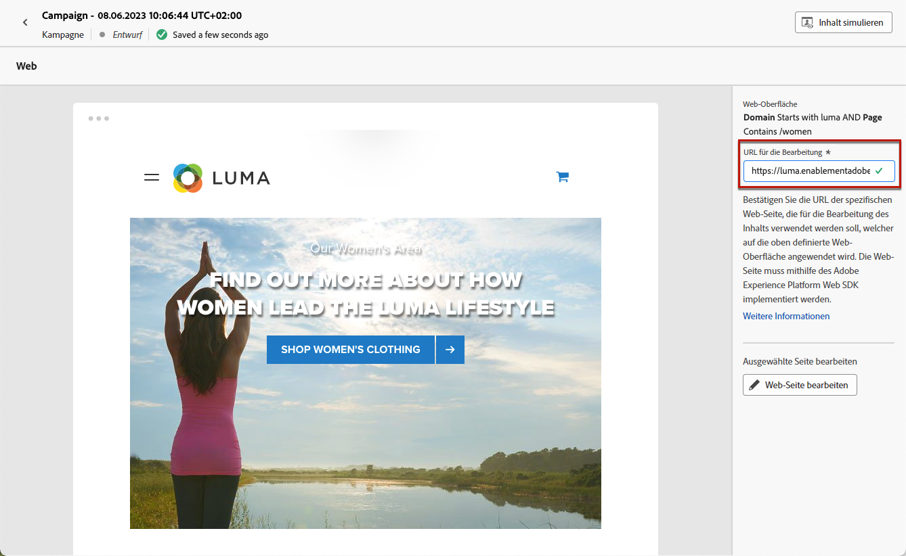
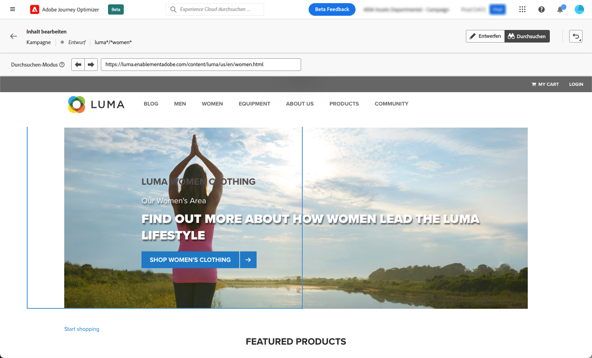
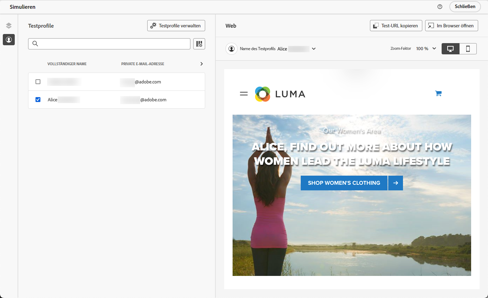

# Verfassen von Web-Seiten {#author-web}

>[!AVAILABILITY]
>
>Die Webkanalfunktion ist derzeit als Beta-Version verfügbar, über die nur Benutzer ausgewählt werden können.

In [!DNL Journey Optimizer] Die Webbearbeitung basiert auf der Chrome-Browsererweiterung Adobe Experience Cloud Visual Helper . [Weitere Informationen](visual-editing-helper.md)

So können Sie auf Webseiten im [!DNL Journey Optimizer] Befolgen Sie die unter [diesem Abschnitt](create-web.md#prerequesites).

## Bearbeiten des Webseiteninhalts {#edit-web-content}

Nachdem Sie eine Webaktion aus der Kampagne erstellt haben, können Sie Ihren Inhalt mit dem Webdesigner bearbeiten. Gehen Sie dazu wie folgt vor.

1. Aus dem **[!UICONTROL Aktion]** im Tab der Kampagne, wählen Sie **[!UICONTROL Inhalt bearbeiten]** , um mit der Erstellung Ihrer Web-Kampagne zu beginnen. [Weitere Informationen](create-web.md#configure-web-campaign)

1. Wenn Sie eine Seitenabgleichregel erstellt haben, müssen Sie jede URL eingeben, die dieser Regel entspricht. Die Änderungen werden auf alle Seiten angewendet, die mit der Regel übereinstimmen.

   >[!NOTE]
   >
   >Wenn Sie eine einzelne URL als Weboberfläche eingegeben haben, ist die zu personalisierende URL bereits ausgefüllt.

   

1. Der Inhalt der Seite wird angezeigt.

   >[!CAUTION]
   >
   >Damit auf die Webseite zugegriffen werden kann, muss sie mithilfe der Variablen [Adobe Experience Platform Web SDK](https://experienceleague.adobe.com/docs/platform-learn/implement-web-sdk/overview.html?lang=de){target=&quot;_blank&quot;}.

1. Klicken **[!UICONTROL Webdesigner öffnen]** , um sie zu bearbeiten. [Weitere Informationen](author-web.md)

   

1. Der Webdesigner wird angezeigt.

   

1. Wählen Sie ein beliebiges Element auf der Arbeitsfläche aus, z. B. Bild, Schaltfläche, Absatz, Text, Container, Überschrift, Link usw. und verwenden:

   * Kontextmenü zur Bearbeitung des Inhalts, des Layouts, der Links oder der Personalisierung usw.

      

   * Die Symbole oben im rechten Bereich zum Bearbeiten, Duplizieren, Löschen oder Ausblenden der einzelnen Elemente.

      

   * Der rechte Bereich, der sich dynamisch entsprechend dem ausgewählten Element ändert. Sie können beispielsweise den Hintergrund, die Typografie, den Rahmen, die Größe, die Position, den Abstand, die Effekte oder Inline-Stile eines Elements bearbeiten.

      

## Verwenden von Inhaltskomponenten {#content-components}

1. Aus dem **[!UICONTROL Komponenten]** auf der linken Seite können Sie die folgenden Komponenten zu Ihrer Webseite hinzufügen und sie nach Bedarf bearbeiten:

   * [Trennlinie](../design/content-components.md#divider)
   * [HTML](../design/content-components.md#HTML)
   * [Bild](../design/content-components.md#image)
   * Überschrift - Die Verwendung dieser Komponente ähnelt der Verwendung der **[!UICONTROL Text]** im E-Mail-Designer. [Weitere Informationen](../design/content-components.md#text)
   * Absatz - Die Verwendung dieser Komponente ähnelt der Verwendung der **[!UICONTROL Text]** im E-Mail-Designer. [Weitere Informationen](../design/content-components.md#text)
   * Link - Erfahren Sie, wie Sie die Formatierung von Links in [diesem Abschnitt](../design/styling-links.md)
   * [Angebotsentscheidung](../design/deliver-personalized-offers.md)

   

1. Bewegen Sie den Mauszeiger auf die Seite und klicken Sie auf die Schaltfläche **[!UICONTROL Einfügen vor]** oder **[!UICONTROL Einfügen nach]** -Schaltfläche, um die Komponente an ein vorhandenes Element auf der Seite anzuhängen.

   

1. Bearbeiten Sie aus dem Container, der für diese Komponente angezeigt wird, den Komponenteninhalt nach Bedarf.

   

1. Passen Sie die Stile an, die über die **[!UICONTROL Container]** -Bereich auf der rechten Seite, z. B. Hintergrund, Textfarbe, Rahmen, Größe, Position usw. abhängig von der ausgewählten Komponente.

   

## Navigieren durch den Webdesigner

### Verwenden von Breadcrumbs

1. Wählen Sie ein beliebiges Element auf der Arbeitsfläche aus.

1. Klicken Sie auf **[!UICONTROL Breadcrumbs erweitern/reduzieren]** auf der linken unteren Bildschirmseite, um Informationen zum ausgewählten Element schnell anzuzeigen.

   

1. Wenn Sie den Mauszeiger über die Breadcrumbs bewegen, wird das entsprechende Element im Editor hervorgehoben.

1. Damit können Sie einfach zu jedem übergeordneten, gleichrangigen oder untergeordneten Element im Visual Editor navigieren.

### Zum Modus &quot;Durchsuchen&quot;wechseln {#browse-mode}

Sie können die Standardeinstellung ersetzen **[!UICONTROL Design]** in den **[!UICONTROL Durchsuchen]** -Modus über die dedizierte Schaltfläche.

Aus dem **[!UICONTROL Durchsuchen]** -Modus können Sie von der ausgewählten Oberfläche, die Sie personalisieren möchten, zur gewünschten Seite navigieren.

Dies ist besonders nützlich, wenn es um Seiten geht, die hinter der Authentifizierung stehen oder von Anfang an nicht über eine bestimmte URL verfügbar sind. Sie können sich beispielsweise authentifizieren, zu Ihrer Kontoseite oder zu Ihrer Warenkorbseite navigieren und dann zurück zu **[!UICONTROL Design]** -Modus, um die Änderungen auf der gewünschten Seite durchzuführen.

### Ändern der Gerätegröße

Sie können die Gerätegröße in eine vordefinierte Größe ändern, z. B. **[!UICONTROL Tablette]** oder **[!UICONTROL Mobilgerät - Querformat]** oder legen Sie eine benutzerdefinierte Größe fest. Geben Sie die gewünschte Anzahl Pixel an, um eine benutzerdefinierte Größe zu definieren.

Sie können auch den Zoomfokus von 25 % auf 400 % ändern.

## Änderungen verwalten {#manage-modifications}

Sie können mühelos alle Komponenten, Anpassungen und Stile verwalten, die Sie Ihrer Webseite hinzugefügt haben.

1. Wählen Sie die **[!UICONTROL Änderungen]** -Schaltfläche, um den entsprechenden Bereich auf der linken Seite anzuzeigen.

   

1. Sie können alle Änderungen überprüfen, die Sie an der Seite vorgenommen haben.

1. Wählen Sie eine unerwünschte Änderung aus und klicken Sie auf das Löschsymbol, um sie zu entfernen.

   

   >[!CAUTION]
   >
   >Gehen Sie beim Löschen einer Aktion mit Vorsicht vor, da sich dies auf nachfolgende Aktionen auswirken kann.

1. Sie können Aktionen auch mithilfe der **[!UICONTROL Rückgängig/Wiederherstellen]** rechts oben auf dem Bildschirm.

   

   Klicken Sie auf die Schaltfläche und halten Sie sie gedrückt, um zwischen der **[!UICONTROL Rückgängig]** und **[!UICONTROL Wiederholen]** Optionen. Klicken Sie dann auf die Schaltfläche selbst, um die gewünschte Aktion anzuwenden.

## Personalisierung und Angebote hinzufügen

Um eine Personalisierung hinzuzufügen, wählen Sie einen Container aus und wählen Sie das Personalisierungssymbol in der angezeigten Kontextmenüleiste aus. Fügen Sie Ihre Änderungen mithilfe des Ausdruckseditors hinzu. [Weitere Informationen](../personalization/personalization-build-expressions.md)

Verwenden Sie die **[!UICONTROL Angebotsentscheidung]** einzufügende Komponente [Angebote](../offers/get-started/starting-offer-decisioning.md) in Ihre Webseiten einfügen. Der Prozess ist derselbe wie bei [Hinzufügen eines Angebots zu einer E-Mail](../design/deliver-personalized-offers.md). Sie nutzt die Entscheidungsverwaltung, um das beste Angebot für Ihre Kunden auszuwählen.

## Webkampagne testen {#test-web-campaign}

Gehen Sie wie folgt vor, um eine Vorschau Ihres geänderten Web-Erlebnisses anzuzeigen.

>[!CAUTION]
>
>Sie müssen über Testprofile verfügen, um simulieren zu können, welche Angebote an sie gesendet werden. Hier erfahren Sie, wie Sie ein [Testprofil erstellen](../segment/creating-test-profiles.md).

1. Wählen Sie entweder aus dem **[!UICONTROL Inhalt bearbeiten]** Bildschirm oder Webdesigner auswählen **[!UICONTROL Inhalt simulieren]**.

   

1. Klicken **[!UICONTROL Verwalten von Testprofilen]** , um ein oder mehrere Testprofile auszuwählen.
1. Es wird eine Vorschau der geänderten Webseite angezeigt.

   

1. Sie können die Test-URL auch kopieren, um sie in einen beliebigen Browser einzufügen oder im Standardbrowser zu öffnen.
