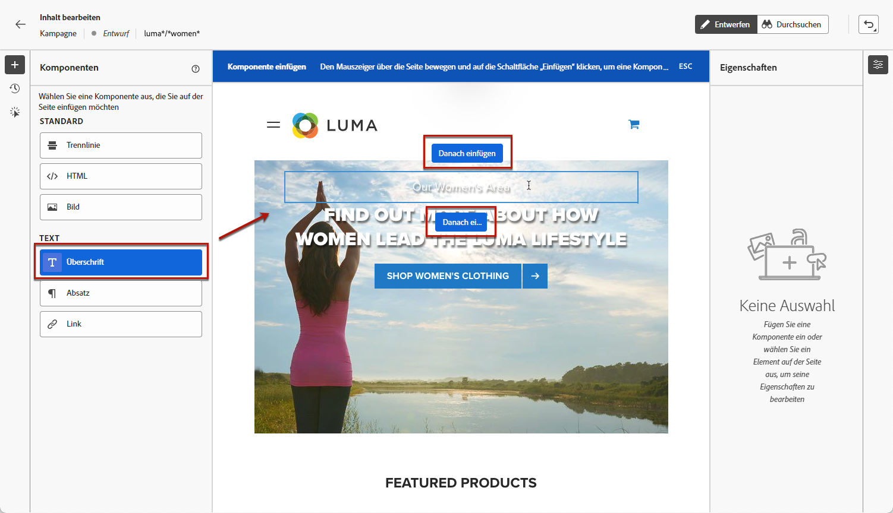
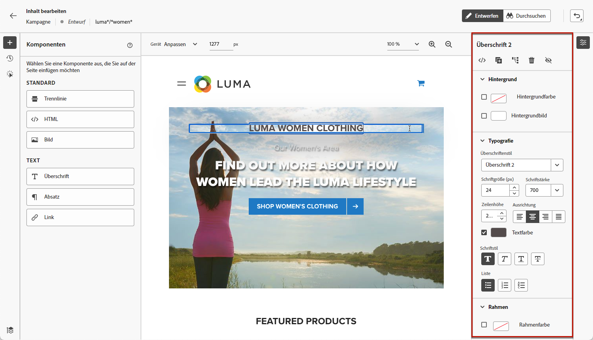
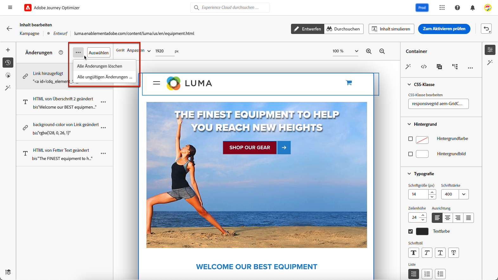
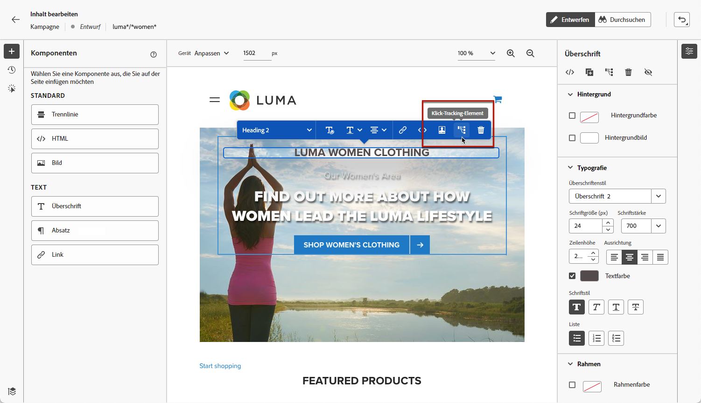

# Verfassen von Web-Seiten {#author-web}

Einmal [Webaktion hinzugefügt](create-web.md#create-web-campaign) in Ihrer Kampagne verwenden, können Sie den Inhalt Ihrer Site mit dem Webdesigner bearbeiten.

In [!DNL Journey Optimizer], wird die Webbearbeitung durch die **Adobe Experience Cloud Visual Helper** Chrome-Browsererweiterung. [Weitere Informationen](web-prerequisites.md#visual-authoring-prerequisites)

>[!CAUTION]
>
>So können Sie auf Webseiten im [!DNL Journey Optimizer] müssen Sie die unter [diesem Abschnitt](web-prerequisites.md).

[In diesem Video erfahren Sie, wie Sie eine Web-Kampagne erstellen](#video)

## Bearbeiten der Inhalte von Web-Seiten {#edit-web-content}

>[!CONTEXTUALHELP]
>id="ajo_web_url_to_edit_surface"
>title="Bestätigen der URL zum Bearbeiten"
>abstract="Bestätigen Sie die URL der spezifischen Web-Seite, die für die Bearbeitung des Inhalts verwendet werden soll, welcher auf die oben definierte Web-Oberfläche angewendet wird. Die Web-Seite muss mithilfe des Adobe Experience Platform Web SDK implementiert werden."
>additional-url="https://experienceleague.adobe.com/docs/platform-learn/implement-web-sdk/overview.html?lang=de" text="Weitere Informationen"

>[!CONTEXTUALHELP]
>id="ajo_web_url_to_edit_rule"
>title="Geben Sie die zu bearbeitende URL ein"
>abstract="Geben Sie die URL einer bestimmten Web-Seite ein, die zum Bearbeiten des Inhalts verwendet werden soll. Sie wird auf alle Seiten angewendet, die der Regel entsprechen. Die Web-Seite muss mithilfe des Adobe Experience Platform Web SDK implementiert werden."
>additional-url="https://experienceleague.adobe.com/docs/platform-learn/implement-web-sdk/overview.html?lang=de" text="Weitere Informationen"

Gehen Sie wie folgt vor, um mit der Erstellung Ihrer Web-Kampagne zu beginnen.

1. Aus dem **[!UICONTROL Aktion]** des [Kampagne](create-web.md#create-web-campaign)auswählen **[!UICONTROL Inhalt bearbeiten]**.<!--change screen with rule-->

   

1. Wenn Sie eine Seitenabgleichungsregel erstellt haben, müssen Sie jede URL eingeben, die dieser Regel entspricht: die Änderungen werden auf alle Seiten angewendet, die mit der Regel übereinstimmen. Der Inhalt der Seite wird angezeigt.

   >[!NOTE]
   >
   >Wenn Sie eine einzelne URL als Web-Oberfläche eingegeben haben, ist die zu personalisierende URL bereits ausgefüllt.

   

   >[!CAUTION]
   >
   >Die Web-Seite muss das [Adobe Experience Platform Web SDK](https://experienceleague.adobe.com/docs/platform-learn/implement-web-sdk/overview.html?lang=de){target="_blank"} enthalten. [Weitere Informationen](web-prerequisites.md#implementation-prerequisites)

1. Klicken **[!UICONTROL Webseite bearbeiten]** , um mit der Bearbeitung zu beginnen. Der Web-Designer wird angezeigt.

   

   >[!NOTE]
   >
   >Wenn Sie versuchen, eine Website zu laden, die nicht geladen werden kann, wird eine Meldung angezeigt, die empfiehlt, die [Visual Editing Helper-Browsererweiterung](#install-visual-editing-helper). Tipps zur Fehlerbehebung finden Sie unter [diesem Abschnitt](web-prerequisites.md#troubleshooting).

1. Wählen Sie ein beliebiges Element auf der Arbeitsfläche aus, z. B. Bild, Schaltfläche, Absatz, Text, Container, Überschrift, Link usw. [Weitere Informationen](#content-components)

1. Verwenden Sie:

   * das Kontextmenü zur Bearbeitung des Inhalts, des Layouts, der Links oder der Personalisierung usw.

      

   * die Symbole oben im rechten Bereich zum Bearbeiten, Duplizieren, Löschen oder Ausblenden der einzelnen Elemente.

      

   * den rechten Bereich, der sich dynamisch entsprechend dem ausgewählten Element ändert. Sie können beispielsweise den Hintergrund, die Typografie, den Rahmen, die Größe, die Position, den Abstand, die Effekte oder Inline-Stile eines Elements bearbeiten.

      

>[!NOTE]
>
>Der Webinhalt-Designer ähnelt größtenteils dem E-Mail-Designer. Weitere Informationen finden Sie unter [Inhaltserstellung mit  [!DNL Journey Optimizer]](../email/get-started-email-design.md).

## Komponenten verwenden {#content-components}

>[!CONTEXTUALHELP]
>id="ajo_web_designer_components"
>title="Komponenten zur Webseite hinzufügen"
>abstract="Sie können Ihrer Web-Seite eine Reihe von Komponenten hinzufügen und diese nach Bedarf bearbeiten."

1. Aus dem **[!UICONTROL Komponenten]** ein Element auf der linken Seite auswählen. Sie können die folgenden Komponenten zu Ihrer Webseite hinzufügen und sie nach Bedarf bearbeiten:

   * [Trennlinie](../email/content-components.md#divider)
   * [HTML](../email/content-components.md#HTML)
   * [Bild](../email/content-components.md#image)
   * Überschrift – die Verwendung dieser Komponente ähnelt der Verwendung der Komponente **[!UICONTROL Text]** im E-Mail-Designer. [Weitere Informationen](../email/content-components.md#text)
   * Absatz – die Verwendung dieser Komponente ähnelt der Verwendung der Komponente **[!UICONTROL Text]** im E-Mail-Designer. [Weitere Informationen](../email/content-components.md#text)
   * Link
   * [Angebotsentscheidung](../email/add-offers-email.md)

   

1. Bewegen Sie den Mauszeiger über die Seite und klicken Sie auf die Schaltfläche **[!UICONTROL Einfügen vor]** oder **[!UICONTROL Einfügen nach]**, um die Komponente an ein vorhandenes Element auf der Seite anzuhängen.

   

   >[!NOTE]
   >
   >Um die Auswahl einer Komponente aufzuheben, klicken Sie auf das **[!UICONTROL ESC]** im dedizierten blauen Banner, das oben auf der Arbeitsfläche angezeigt wird.

1. Bearbeiten Sie die Komponente nach Bedarf direkt im Inhalt Ihrer Seite.

   

1. Passen Sie die im Kontextbereich auf der rechten Seite angezeigten Stile an, z. B. Hintergrund, Textfarbe, Rahmen, Größe, Position usw. - abhängig von der ausgewählten Komponente.

   

## Hinzufügen von Personalisierung und Angeboten

Um eine Personalisierung hinzuzufügen, wählen Sie einen Container aus und klicken Sie auf das Personalisierungssymbol in der angezeigten Kontextmenüleiste. Fügen Sie Ihre Änderungen mithilfe des Ausdruckseditors hinzu. [Weitere Informationen](../personalization/personalization-build-expressions.md)

Verwenden Sie die Komponente **[!UICONTROL Angebotsentscheidung]**, um [Angebote](../offers/get-started/starting-offer-decisioning.md) in Ihre Web-Seiten einzufügen. Der Prozess ist der gleiche wie beim [Hinzufügen eines Angebots zu einer E-Mail](../email/add-offers-email.md). Er nutzt das Entscheidungs-Management, um das beste Angebot für Ihre Kunden auszuwählen.

## Verwalten von Änderungen {#manage-modifications}

>[!CONTEXTUALHELP]
>id="ajo_web_designer_modifications"
>title="Einfaches Verwalten aller Änderungen"
>abstract="Mithilfe dieses Bereichs können Sie alle Anpassungen und Stile, die Sie Ihrer Web-Seite hinzugefügt haben, durchsuchen und verwalten."

Sie können mühelos alle Komponenten, Anpassungen und Stile verwalten, die Sie Ihrer Web-Seite hinzugefügt haben.

1. Wählen Sie die **[!UICONTROL Änderungen]** -Symbol, um den entsprechenden Bereich auf der linken Seite anzuzeigen.

   

1. Sie können alle Änderungen überprüfen, die Sie an der Seite vorgenommen haben.

1. Wählen Sie eine unerwünschte Änderung aus und klicken Sie auf das Löschsymbol, um sie zu entfernen.

   

   >[!CAUTION]
   >
   >Gehen Sie beim Löschen einer Aktion vorsichtig vor, da sich dies auf nachfolgende Aktionen auswirken kann.

1. Verwenden Sie die **[!UICONTROL Mehr Aktionen]** -Schaltfläche oben im **[!UICONTROL Änderungen]** -Bereich, um alle Änderungen gleichzeitig zu löschen.

   

1. Aus dem **[!UICONTROL Mehr Aktionen]** -Menü können Sie auch nur die ungültigen Änderungen löschen, d. h. die Änderungen, die durch andere Änderungen überschrieben wurden. Wenn Sie beispielsweise die Farbe eines Textes ändern und diesen Text dann löschen, wird die Farbänderung ungültig, da der Text nicht mehr vorhanden ist.

1. Sie können Aktionen auch mithilfe der Schaltfläche **[!UICONTROL Rückgängig/Wiederholen]** rechts oben auf dem Bildschirm abbrechen und wiederholen.

   

   Klicken Sie auf die Schaltfläche und halten Sie sie gedrückt, um zwischen den Optionen **[!UICONTROL Rückgängig]** und **[!UICONTROL Wiederholen]** zu wechseln. Klicken Sie dann auf die Schaltfläche selbst, um die gewünschte Aktion anzuwenden.

## Klick-Tracking verwenden {#use-click-tracing}

Mit dieser Funktion im Webdesigner können Sie ein beliebiges Element Ihrer Website auswählen und die Klicks auf dieses Element verfolgen.

Sobald Ihre Kampagne aktiv ist, können Sie die Anzahl der Klicks für jedes Element im Kampagnen-Webbericht überprüfen. Diese Informationen können zur Verbesserung des Benutzererlebnisses auf Ihrer Website nützlich sein. Wenn beispielsweise die Variable [Webberichte](../reports/campaign-global-report.md#web-tab) zeigen, dass viele Benutzer auf ein Element klicken, auf das nicht tatsächlich geklickt werden kann, können Sie diesem Element einen Link hinzufügen.

1. Wählen Sie ein Element auf Ihrer Seite aus und wählen Sie **[!UICONTROL Element verfolgen]** aus dem Kontextmenü aus.

   

   >[!NOTE]
   >
   >Jedes Element, auf das geklickt werden kann oder nicht, kann ausgewählt werden.

1. Die entsprechende verfolgte Aktion wird automatisch im **[!UICONTROL Klickverfolgung]** auf der linken Seite.

   

1. Fügen Sie eine aussagekräftige Bezeichnung hinzu, um alle verfolgten Elemente zu verwalten und sie in den Berichten leicht auffindbar zu machen. Die **[!UICONTROL CSS-Auswahl]** zeigt Informationen zum Auffinden des ausgewählten Elements an.

1. Wiederholen Sie die obigen Schritte, um so viele weitere Elemente wie für das Klick-Tracking auszuwählen. Die entsprechenden Aktionen werden alle im linken Bereich aufgelistet.

   

1. Um das Klick-Tracking für ein Element zu entfernen, wählen Sie das entsprechende Löschsymbol aus.

Sobald Ihre Kampagne aktiv ist, können Sie den Kampagnenbericht überprüfen **[!UICONTROL Web]** um die Anzahl der Impressionen, die Klickrate und die Anzahl der Klicks nach Element zu vergleichen. [Weitere Informationen](../reports/campaign-global-report.md#web-tab)

## Navigieren durch den Web-Designer {#navigate-web-designer}

### Verwenden von Breadcrumbs {#breadcrumbs}

1. Wählen Sie ein beliebiges Element auf der Arbeitsfläche aus.

1. Klicken Sie auf **[!UICONTROL Breadcrumbs erweitern/reduzieren]** auf der linken unteren Bildschirmseite, um Informationen zum ausgewählten Element schnell anzuzeigen.

   

1. Wenn Sie den Mauszeiger über die Breadcrumbs bewegen, wird das entsprechende Element im Editor hervorgehoben.

1. Damit können Sie einfach zu jedem übergeordneten, gleichrangigen oder untergeordneten Element im visuellen Editor navigieren.

### Wechseln in den Durchsuchen-Modus {#browse-mode}

>[!CONTEXTUALHELP]
>id="ajo_web_designer_browse"
>title="Verwenden des Durchsuchen-Modus"
>abstract="Im Durchsuchen-Modus können Sie von der ausgewählten Oberfläche, die Sie personalisieren möchten, direkt zur gewünschten Seite navigieren."

Sie können über die entsprechende Schaltfläche vom Standardmodus **[!UICONTROL Design]** in den **[!UICONTROL Durchsuchen]**-Modus wechseln.

Im **[!UICONTROL Durchsuchen]**-Modus können Sie von der ausgewählten Oberfläche, die Sie personalisieren möchten, zur gewünschten Seite navigieren.

Dies ist besonders nützlich, wenn es um Seiten geht, die sich hinter der Authentifizierung befinden oder nicht von Anfang an über eine bestimmte URL verfügbar sind. Sie können sich beispielsweise authentifizieren, zu Ihrer Kontoseite oder zu Ihrer Warenkorbseite navigieren und dann zurück in den **[!UICONTROL Design]**-Modus wechseln, um die Änderungen auf der gewünschten Seite durchzuführen.

### Ändern der Gerätegröße {#change-device-size}

Sie können die Gerätegröße der Webdesigner-Anzeige in eine vordefinierte Größe ändern, z. B. **[!UICONTROL Tablette]** oder **[!UICONTROL Mobilgerät - Querformat]** oder legen Sie eine benutzerdefinierte Größe fest, indem Sie die gewünschte Anzahl Pixel eingeben.

Sie können auch den Zoom-Fokus ändern – von 25 % bis 400 %.

Die Möglichkeit, die Gerätegröße zu ändern, wurde für responsive Websites entwickelt, die auf verschiedenen Geräten, Fenstern und Bildschirmgrößen gut dargestellt werden. Responsive Websites passen sich automatisch an jede Bildschirmgröße an, einschließlich Desktops, Laptops, Tablets oder Mobiltelefone.

>[!CAUTION]
>
>Sie können ein Web-Erlebnis mit einer bestimmten Gerätegröße bearbeiten. Solange die Selektoren identisch sind, gelten diese Änderungen für alle Größen und Geräte, nicht nur für die Gerätegröße, in der Sie arbeiten. Ebenso werden beim Bearbeiten eines Erlebnisses in der normalen Desktop-Ansicht die Änderungen auf alle Bildschirmgrößen angewendet, nicht nur auf die Desktop-Ansicht.
>
>Zurzeit [!DNL Journey Optimizer] unterstützt keine gerätegrößenspezifischen Seitenänderungen. Das bedeutet, dass Sie, wenn Sie beispielsweise über eine separate mobile Website mit einer separaten Site-Struktur verfügen, die für Ihre mobile Site spezifischen Änderungen in einer anderen Kampagne vornehmen sollten.

## Testen der Web-Kampagne {#test-web-campaign}

>[!CONTEXTUALHELP]
>id="ajo_web_designer_preview"
>title="Vorschau des Web-Erlebnisses"
>abstract="Betrachten Sie in einer Simulation, wie Ihr Web-Erlebnis aussehen wird."

Gehen Sie wie folgt vor, um eine Vorschau Ihres geänderten Web-Erlebnisses anzuzeigen.

>[!CAUTION]
>
>Sie müssen über Testprofile verfügen, um simulieren zu können, welche Angebote an sie gesendet werden. Hier erfahren Sie, wie Sie [Testprofile erstellen](../segment/creating-test-profiles.md).

1. Wählen Sie auf dem Bildschirm zur Inhaltsbearbeitung einer Webkampagne die Option **[!UICONTROL Inhalt simulieren]**.

   <!---->

   

1. Klicken Sie auf **[!UICONTROL Testprofile verwalten]**, um ein oder mehrere Testprofile auszuwählen.
1. Es wird eine Vorschau der geänderten Web-Seite angezeigt.

   

1. Sie können sie auch im Standardbrowser öffnen oder die Test-URL kopieren, um sie in einen beliebigen Browser einzufügen. Auf diese Weise können Sie den Link für Ihr Team und Interessengruppen freigeben, die in der Lage sind, das neue Web-Erlebnis in einem beliebigen Browser in der Vorschau zu betrachten, bevor die Kampagne live geschaltet wird.

   >[!NOTE]
   >
   >Beim Kopieren der Test-URL ist der angezeigte Inhalt derjenige, der für das Testprofil personalisiert wurde, das zum Zeitpunkt der Erstellung der Inhaltsimulation in [!DNL Journey Optimizer].

## Anleitungsvideo{#video}

Das folgende Video zeigt, wie Sie ein Web-Erlebnis mit dem Webdesigner in [!DNL Journey Optimizer] Kampagnen.

>[!VIDEO](https://video.tv.adobe.com/v/3418803/?quality=12&learn=on)
