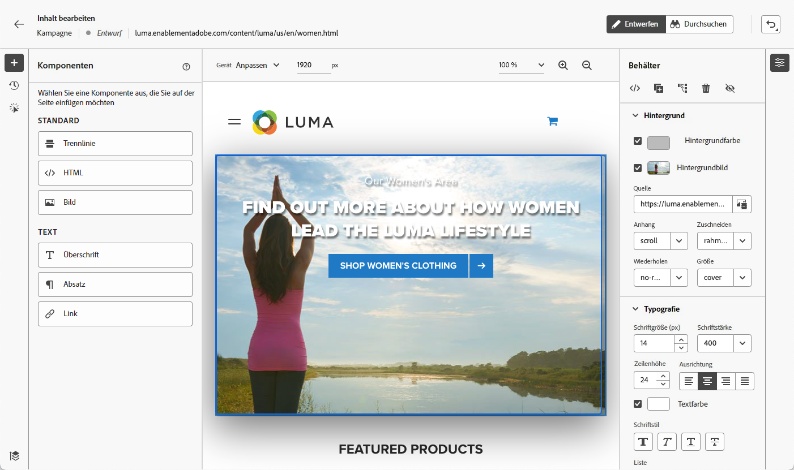

# Verfassen von Web-Seiten {#author-web}

>[!AVAILABILITY]
>
>Die Web-Kanal-Funktion ist derzeit nur als Beta-Version für ausgewählte Benutzerinnen und Benutzer verfügbar.

In [!DNL Journey Optimizer] basiert das Erstellen von Web-Seiten auf der Chrome-Browser-Erweiterung Adobe Experience Cloud Visual Helper . [Weitere Informationen](visual-editing-helper.md)

Um in der Benutzeroberfläche von [!DNL Journey Optimizer] auf Web-Seiten zuzugreifen oder sie dort zu erstellen, folgen Sie den Voraussetzungen in [diesem Abschnitt](create-web.md#prerequesites).

## Bearbeiten der Inhalte von Web-Seiten {#edit-web-content}

>[!CONTEXTUALHELP]
>id="ajo_web_url_to_edit_surface"
>title="Geben Sie die zu bearbeitende URL ein"
>abstract="Geben Sie die URL einer bestimmten Web-Seite ein, die zum Bearbeiten des Inhalts, der auf die oben definierte Web-Oberfläche angewendet wird, verwendet werden soll. Die Web-Seite muss mithilfe des Adobe Experience Platform Web SDK implementiert werden."
>additional-url="https://experienceleague.adobe.com/docs/platform-learn/implement-web-sdk/overview.html?lang=de" text="Weitere Informationen"

>[!CONTEXTUALHELP]
>id="ajo_web_url_to_edit_rule"
>title="Geben Sie die zu bearbeitende URL ein"
>abstract="Geben Sie die URL einer bestimmten Web-Seite ein, die zum Bearbeiten des Inhalts verwendet werden soll. Sie wird auf alle Seiten angewendet, die der Regel entsprechen. Die Web-Seite muss mithilfe des Adobe Experience Platform Web SDK implementiert werden."
>additional-url="https://experienceleague.adobe.com/docs/platform-learn/implement-web-sdk/overview.html?lang=de" text="Weitere Informationen"

<!--Confirm the URL to use for authoring content on the surface. Typically the Authoring URL will be the surface URL itself, but you may include extra parameters if required. The page must include the Adobe Experience Platform Web SDK.-->

Nachdem Sie eine Web-Aktion aus der Kampagne erstellt haben, können Sie Ihre Inhalte mit dem Web-Designer bearbeiten. Gehen Sie dazu wie folgt vor.

>[!CAUTION]
>
>Zugriff auf [!DNL Journey Optimizer], muss Ihre Webseite mithilfe der [Adobe Experience Platform Web SDK](https://experienceleague.adobe.com/docs/platform-learn/implement-web-sdk/overview.html?lang=de){target="_blank"}.

1. Wählen Sie auf der Registerkarte **[!UICONTROL Aktion]** der Kampagne die Option **[!UICONTROL Inhalt bearbeiten]** aus, um mit der Erstellung Ihrer Web-Kampagne zu beginnen.

1. Wenn Sie eine Matching-Regel für Seiten erstellt haben, müssen Sie jede URL eingeben, die dieser Regel entspricht. Die Änderungen werden auf alle Seiten angewendet, die mit der Regel übereinstimmen.

   >[!NOTE]
   >
   >Wenn Sie eine einzelne URL als Web-Oberfläche eingegeben haben, ist die zu personalisierende URL bereits ausgefüllt.

   

1. Der Inhalt der Seite wird angezeigt.

   >[!CAUTION]
   >
   >Die Webseite muss die [Adobe Experience Platform Web SDK](https://experienceleague.adobe.com/docs/platform-learn/implement-web-sdk/overview.html?lang=de){target="_blank"}.

1. Klicken Sie auf **[!UICONTROL Web-Designer öffnen]**, um sie zu bearbeiten. [Weitere Informationen](author-web.md)

   

1. Der Web-Designer wird angezeigt.

   

1. Wählen Sie ein beliebiges Element auf der Arbeitsfläche aus, z. B. Bild, Schaltfläche, Absatz, Text, Container, Überschrift, Link usw. und verwenden Sie:

   * das Kontextmenü zur Bearbeitung des Inhalts, des Layouts, der Links oder der Personalisierung usw.

      

   * die Symbole oben im rechten Bereich zum Bearbeiten, Duplizieren, Löschen oder Ausblenden der einzelnen Elemente.

      

   * den rechten Bereich, der sich dynamisch entsprechend dem ausgewählten Element ändert. Sie können beispielsweise den Hintergrund, die Typografie, den Rahmen, die Größe, die Position, den Abstand, die Effekte oder Inline-Stile eines Elements bearbeiten.

      

## Verwenden von Inhaltskomponenten {#content-components}

>[!CONTEXTUALHELP]
>id="ajo_web_designer_components"
>title="Hinzufügen von Inhaltskomponenten zu einer Web-Seite"
>abstract="Sie können Ihrer Web-Seite eine Reihe von Komponenten hinzufügen und diese nach Bedarf bearbeiten."

1. Aus dem Bedienfeld **[!UICONTROL Komponenten]** auf der linken Seite können Sie die folgenden Komponenten zu Ihrer Web-Seite hinzufügen und sie nach Bedarf bearbeiten:

   * [Trennlinie](../email/content-components.md#divider)
   * [HTML](../email/content-components.md#HTML)
   * [Bild](../email/content-components.md#image)
   * Überschrift – die Verwendung dieser Komponente ähnelt der Verwendung der Komponente **[!UICONTROL Text]** im E-Mail-Designer. [Weitere Informationen](../email/content-components.md#text)
   * Absatz – die Verwendung dieser Komponente ähnelt der Verwendung der Komponente **[!UICONTROL Text]** im E-Mail-Designer. [Weitere Informationen](../email/content-components.md#text)
   * Link – Erfahren Sie in [diesem Abschnitt](../email/styling-links.md), wie Sie Link-Stile definieren.
   * [Angebotsentscheidung](../email/add-offers-email.md)

   

1. Bewegen Sie den Mauszeiger über die Seite und klicken Sie auf die Schaltfläche **[!UICONTROL Einfügen vor]** oder **[!UICONTROL Einfügen nach]**, um die Komponente an ein vorhandenes Element auf der Seite anzuhängen.

   

1. Bearbeiten Sie aus dem Container, der für diese Komponente angezeigt wird, den Komponenteninhalt nach Bedarf.

   

1. Passen Sie die Stile an, die im **[!UICONTROL Container]**-Bereich auf der rechten Seite angezeigt werden, z. B. Hintergrund, Textfarbe, Rahmen, Größe, Position usw., abhängig von der ausgewählten Komponente.

   

## Navigieren durch den Web-Designer

### Verwenden von Breadcrumbs

1. Wählen Sie ein beliebiges Element auf der Arbeitsfläche aus.

1. Klicken Sie auf **[!UICONTROL Breadcrumbs erweitern/reduzieren]** auf der linken unteren Bildschirmseite, um Informationen zum ausgewählten Element schnell anzuzeigen.

   

1. Wenn Sie den Mauszeiger über die Breadcrumbs bewegen, wird das entsprechende Element im Editor hervorgehoben.

1. Damit können Sie einfach zu jedem übergeordneten, gleichrangigen oder untergeordneten Element im visuellen Editor navigieren.

### Wechseln in den Durchsuchen-Modus {#browse-mode}

>[!CONTEXTUALHELP]
>id="ajo_web_designer_browse"
>title="Verwenden des Durchsuchen-Modus"
>abstract="Im Durchsuchen-Modus können Sie von der ausgewählten Oberfläche, die Sie personalisieren möchten, direkt zur gewünschten Seite navigieren."

Sie können über die entsprechende Schaltfläche vom Standardmodus **[!UICONTROL Design]** in den **[!UICONTROL Durchsuchen]**-Modus wechseln.

Im **[!UICONTROL Durchsuchen]**-Modus können Sie von der ausgewählten Oberfläche, die Sie personalisieren möchten, zur gewünschten Seite navigieren.

Dies ist besonders nützlich, wenn es um Seiten geht, die sich hinter der Authentifizierung befinden oder nicht von Anfang an über eine bestimmte URL verfügbar sind. Sie können sich beispielsweise authentifizieren, zu Ihrer Kontoseite oder zu Ihrer Warenkorbseite navigieren und dann zurück in den **[!UICONTROL Design]**-Modus wechseln, um die Änderungen auf der gewünschten Seite durchzuführen.

### Ändern der Gerätegröße

Sie können die Gerätegröße in eine vordefinierte Größe ändern, z. B. **[!UICONTROL Tablet]** oder **[!UICONTROL Mobilgerät – Querformat]**, oder eine benutzerdefinierte Größe festlegen. Geben Sie die gewünschte Anzahl von Pixeln an, um eine benutzerdefinierte Größe zu definieren.

Sie können auch den Zoom-Fokus ändern – von 25 % bis 400 %.

## Verwalten von Änderungen {#manage-modifications}

>[!CONTEXTUALHELP]
>id="ajo_web_designer_modifications"
>title="Einfaches Verwalten aller Änderungen"
>abstract="Mithilfe dieses Bereichs können Sie alle Anpassungen und Stile, die Sie Ihrer Web-Seite hinzugefügt haben, durchsuchen und verwalten."

Sie können mühelos alle Komponenten, Anpassungen und Stile verwalten, die Sie Ihrer Web-Seite hinzugefügt haben.

1. Wählen Sie die Schaltfläche **[!UICONTROL Änderungen]**, um den entsprechenden Bereich auf der linken Seite anzuzeigen.

   

1. Sie können alle Änderungen überprüfen, die Sie an der Seite vorgenommen haben.

1. Wählen Sie eine unerwünschte Änderung aus und klicken Sie auf das Löschsymbol, um sie zu entfernen.

   

   >[!CAUTION]
   >
   >Gehen Sie beim Löschen einer Aktion vorsichtig vor, da sich dies auf nachfolgende Aktionen auswirken kann.

1. Sie können Aktionen auch mithilfe der Schaltfläche **[!UICONTROL Rückgängig/Wiederholen]** rechts oben auf dem Bildschirm abbrechen und wiederholen.

   

   Klicken Sie auf die Schaltfläche und halten Sie sie gedrückt, um zwischen den Optionen **[!UICONTROL Rückgängig]** und **[!UICONTROL Wiederholen]** zu wechseln. Klicken Sie dann auf die Schaltfläche selbst, um die gewünschte Aktion anzuwenden.

## Hinzufügen von Personalisierung und Angeboten

Um eine Personalisierung hinzuzufügen, wählen Sie einen Container aus und klicken Sie auf das Personalisierungssymbol in der angezeigten Kontextmenüleiste. Fügen Sie Ihre Änderungen mithilfe des Ausdruckseditors hinzu. [Weitere Informationen](../personalization/personalization-build-expressions.md)

Verwenden Sie die Komponente **[!UICONTROL Angebotsentscheidung]**, um [Angebote](../offers/get-started/starting-offer-decisioning.md) in Ihre Web-Seiten einzufügen. Der Prozess ist der gleiche wie beim [Hinzufügen eines Angebots zu einer E-Mail](../email/add-offers-email.md). Er nutzt das Entscheidungs-Management, um das beste Angebot für Ihre Kunden auszuwählen.

## Testen der Web-Kampagne {#test-web-campaign}

>[!CONTEXTUALHELP]
>id="ajo_web_designer_preview"
>title="Vorschau des Web-Erlebnisses"
>abstract="Betrachten Sie in einer Simulation, wie Ihr Web-Erlebnis aussehen wird."

Gehen Sie wie folgt vor, um eine Vorschau Ihres geänderten Web-Erlebnisses anzuzeigen.

>[!CAUTION]
>
>Sie müssen über Testprofile verfügen, um simulieren zu können, welche Angebote an sie gesendet werden. Hier erfahren Sie, wie Sie [Testprofile erstellen](../segment/creating-test-profiles.md).

1. Wählen Sie entweder auf dem Bildschirm **[!UICONTROL Inhalt bearbeiten]** oder im Web-Designer **[!UICONTROL Inhalt simulieren]** aus.

   

1. Klicken Sie auf **[!UICONTROL Testprofile verwalten]**, um ein oder mehrere Testprofile auszuwählen.
1. Es wird eine Vorschau der geänderten Web-Seite angezeigt.

   

1. Sie können die Test-URL auch kopieren, um sie in einen beliebigen Browser einzufügen, oder sie im Standard-Browser öffnen.
