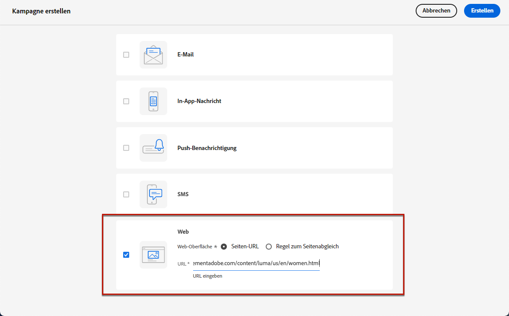
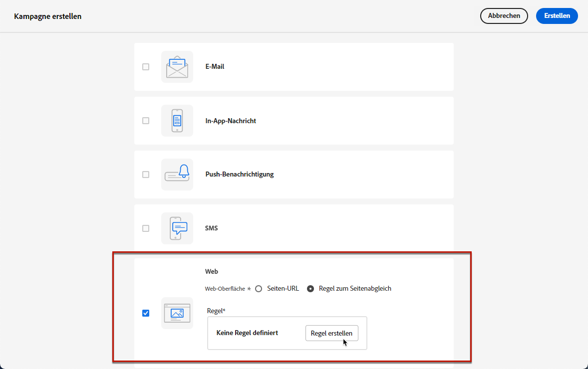
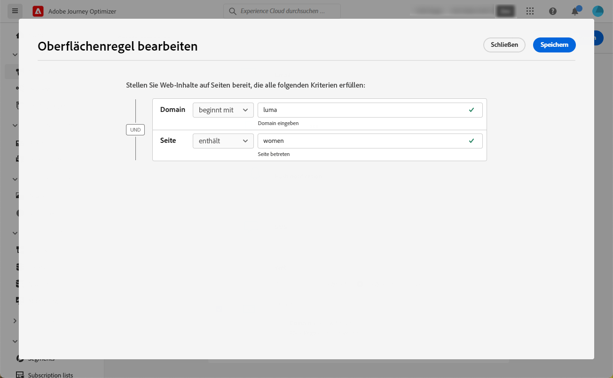
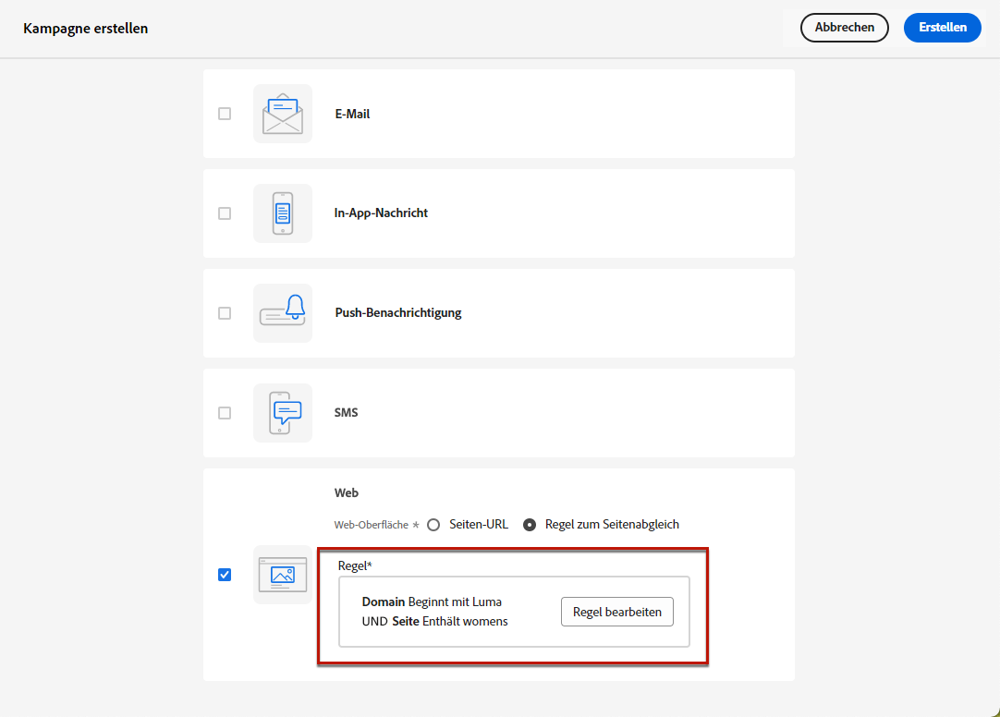
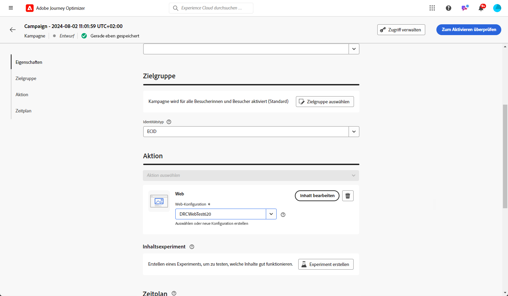
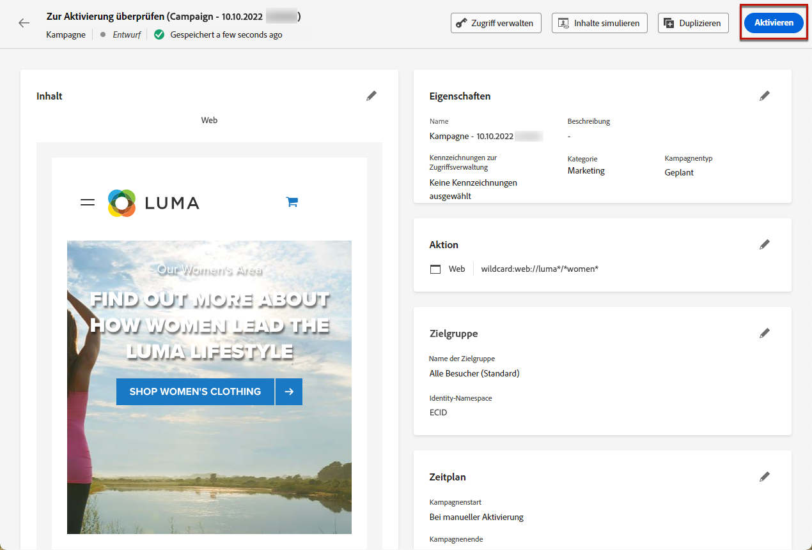
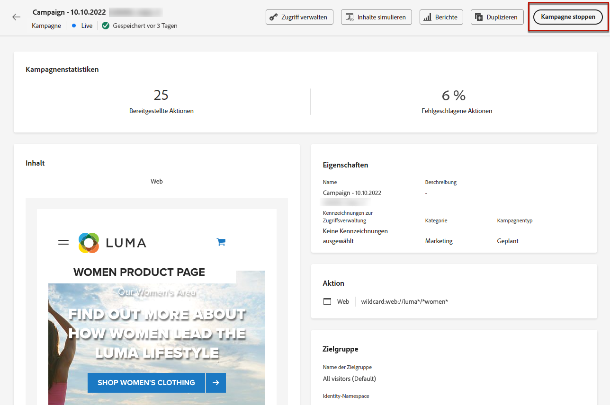

# Erstellen von Web-Erlebnissen {#create-web}

[!DNL Journey Optimizer] ermöglicht es Ihnen, das Web-Erlebnis, das Sie Ihren Kunden über eingehende Web-Kampagnen bereitstellen, zu personalisieren.

>[!CAUTION]
>
>Derzeit können Sie Web-Erlebnisse in [!DNL Journey Optimizer] nur mithilfe von **Kampagnen** erstellen. 

[In diesem Video erfahren Sie, wie Sie eine Web-Kampagne verfassen](#video)

## Erstellen einer Web-Kampagne {#create-web-campaign}

>[!CONTEXTUALHELP]
>id="ajo_web_surface"
>title="Eine Web-Oberfläche definieren"
>abstract="Eine Web-Oberfläche kann einer einzelnen Seiten-URL oder mehreren Seiten entsprechen, sodass inhaltliche Änderungen auf einer oder mehreren Web-Seiten vorgenommen werden können."

>[!CONTEXTUALHELP]
>id="ajo_web_surface_rule"
>title="Erstellen einer Matching-Regel für Seiten"
>abstract="Eine Matching-Regel für Seiten macht es möglich, mehrere URLs, die derselben Regel entsprechen, als Ziel auszuwählen. Dies ist zum Beispiel praktisch, wenn Sie die Änderungen an einem Hero-Banner auf einer ganzen Web-Site anwenden oder oben ein Bild hinzufügen möchten, das auf allen Produktseiten einer Web-Site angezeigt wird."

Gehen Sie wie folgt vor, um mit der Erstellung Ihres Web-Erlebnisses durch eine Kampagne zu beginnen.

>[!NOTE]
>
>Wenn Sie zum ersten Mal ein Web-Erlebnis erstellen, stellen Sie sicher, dass Sie die in [diesem Abschnitt](web-prerequisites.md) beschriebenen Voraussetzungen befolgen.

1. Erstellen einer Kampagne. [Weitere Informationen](../campaigns/create-campaign.md)

1. Wählen Sie die Aktion **[!UICONTROL Web]**.

1. Definieren Sie eine Web-Oberfläche.

   >[!NOTE]
   >
   >Eine Web-Oberfläche ist eine Web-Eigenschaft, die durch eine URL identifiziert wird, über die die Inhalte bereitgestellt werden. Sie kann einer einzelnen Seiten-URL oder mehreren Seiten entsprechen, sodass Sie Änderungen auf einer oder mehreren Web-Seiten vornehmen können.

   Wenn Sie die Änderungen nur auf eine einzelne Seite anwenden möchten, können Sie eine **[!UICONTROL Seiten-URL]** eingeben.

   

1. Sie können aber auch eine **[!UICONTROL Matching-Regel für Seiten]** festlegen, um mehrere URLs als Ziel auszuwählen, die derselben Regel entsprechen. Dies ist zum Beispiel sinnvoll, wenn Sie die Änderungen auf ein Hero-Banner auf einer ganzen Website anwenden oder oben ein Bild hinzufügen möchten, das auf allen Produktseiten einer Web-Site angezeigt wird.

   Wählen Sie dazu **[!UICONTROL Matching-Regel für Seiten]** aus und klicken Sie auf **[!UICONTROL Regel erstellen]**.

   

1. Definieren Sie Ihre Kriterien für die Felder **[!UICONTROL Domain]** und **[!UICONTROL Seite]**.

   Wenn Sie beispielsweise Elemente bearbeiten möchten, die auf allen Damenproduktseiten Ihrer Luma-Website angezeigt werden, wählen Sie **[!UICONTROL Domain]** > **[!UICONTROL Beginnt mit]** > `luma` und **[!UICONTROL Seite]** > **[!UICONTROL Enthält]** > `women`.

   

1. Speichern Sie Ihre Änderungen. Die Regel wird auf dem Bildschirm **[!UICONTROL Kampagne erstellen]** angezeigt.

   

1. Nachdem Sie die Web-Oberfläche definiert haben, klicken Sie auf **[!UICONTROL Erstellen]**.

1. Führen Sie die Schritte zur Erstellung einer Web-Kampagne aus, z. B. die Kampagneneigenschaften, [Audience](../audience/about-audiences.md) und [Zeitplan](../campaigns/create-campaign.md#schedule).

   

Weitere Informationen zur Konfiguration Ihrer Kampagne finden Sie auf [dieser Seite](../campaigns/get-started-with-campaigns.md).

## Aktivieren der Web-Kampagne {#activate-web-campaign}

Nachdem Sie Ihre [Web-Kampagneneinstellungen](#configure-web-campaign) festgelegt und Ihren Inhalt wie gewünscht mit dem [Web-Designer](author-web.md) bearbeitet haben, können Sie Ihre Web-Kampagne überprüfen und aktivieren. Führen Sie dazu folgende Schritte durch.

>[!NOTE]
>
>Sie können vor der Aktivierung auch eine Vorschau des Web-Kampagneninhalts anzeigen. [Weitere Informationen](author-web.md#test-web-campaign)

1. Wählen Sie in Ihrer Web-Kampagne die Option **[!UICONTROL Zur Aktivierung überprüfen]** aus.

1. Überprüfen und bearbeiten Sie bei Bedarf Inhalt, Eigenschaften, Oberfläche, Audience und Zeitplan.

1. Wählen Sie **[!UICONTROL Aktivieren]** aus.

   

   >[!NOTE]
   >
   >Nachdem Sie auf **[!UICONTROL Aktivieren]** geklickt haben, kann es bis zu 15 Minuten dauern, bis Web-Kampagnenänderungen auf Ihrer Website live sind.

Ihre Web-Kampagne geht in den **[!UICONTROL Live]**-Status über und ist nun für die ausgewählte Audience sichtbar. Jeder Empfänger Ihrer Kampagne kann die Änderungen sehen, die Sie Ihrer Website mithilfe des Web-Designers von [!DNL Journey Optimizer] hinzugefügt haben.

>[!NOTE]
>
>Wenn Sie einen Zeitplan für Ihre Web-Kampagne definiert haben, hat sie den Status **[!UICONTROL Geplant]**, bis das Startdatum und die Startzeit erreicht werden.
>
>Wenn Sie eine Web-Kampagne aktivieren, die sich auf dieselben Seiten auswirkt wie eine andere bereits aktive Kampagne, werden alle Änderungen auf Ihre Web-Seiten angewendet.

Weitere Informationen zur Aktivierung von Kampagnen finden Sie in [diesem Abschnitt](../campaigns/review-activate-campaign.md).

## Stoppen einer Web-Kampagne {#stop-web-campaign}

Wenn eine Web-Kampagne live ist, können Sie sie stoppen, um zu verhindern, dass Ihre Änderungen für Ihre Audience sichtbar werden. Führen Sie dazu folgende Schritte durch.

1. Wählen Sie eine Live-Kampagne aus der Liste aus.

1. Wählen Sie im oberen Menü **[!UICONTROL Kampagne stoppen]** aus.

   

1. Die hinzugefügten Änderungen sind dann für die von Ihnen definierte Audience nicht mehr sichtbar.

>[!NOTE]
>
>Nachdem eine Web-Kampagne gestoppt wurde, kann sie nicht mehr bearbeitet oder wieder aktiviert werden. Sie können sie nur duplizieren und dann die duplizierte Kampagne aktivieren.

## Anleitungsvideo{#video}

Im folgenden Video erfahren Sie, wie Sie eine Web-Kampagne erstellen, ihre Eigenschaften konfigurieren, sie überprüfen und veröffentlichen.

>[!VIDEO](https://video.tv.adobe.com/v/3418800/?quality=12&learn=on)