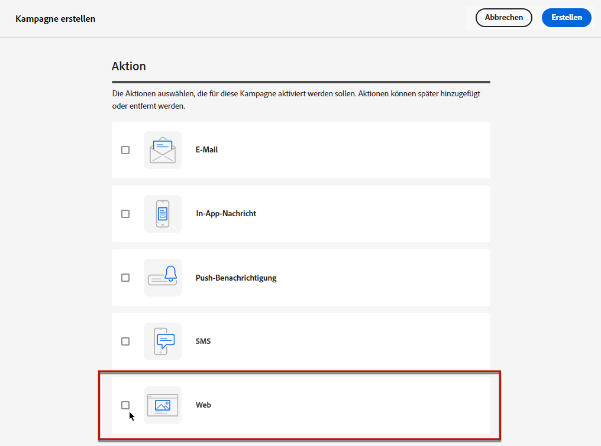
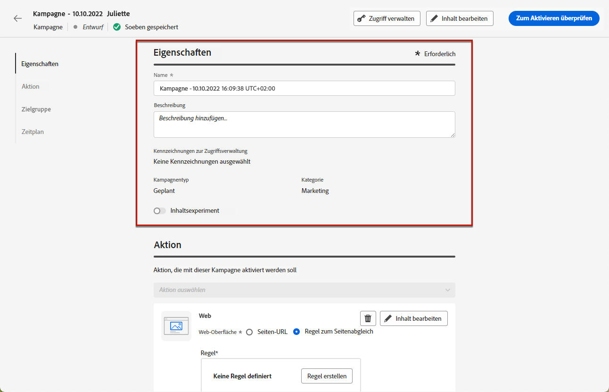
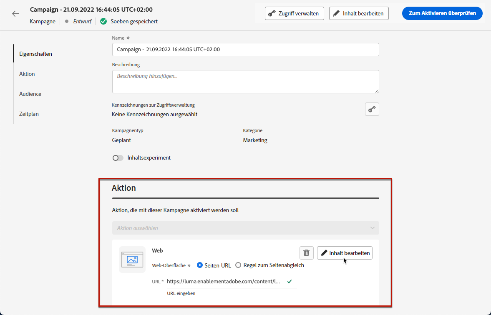
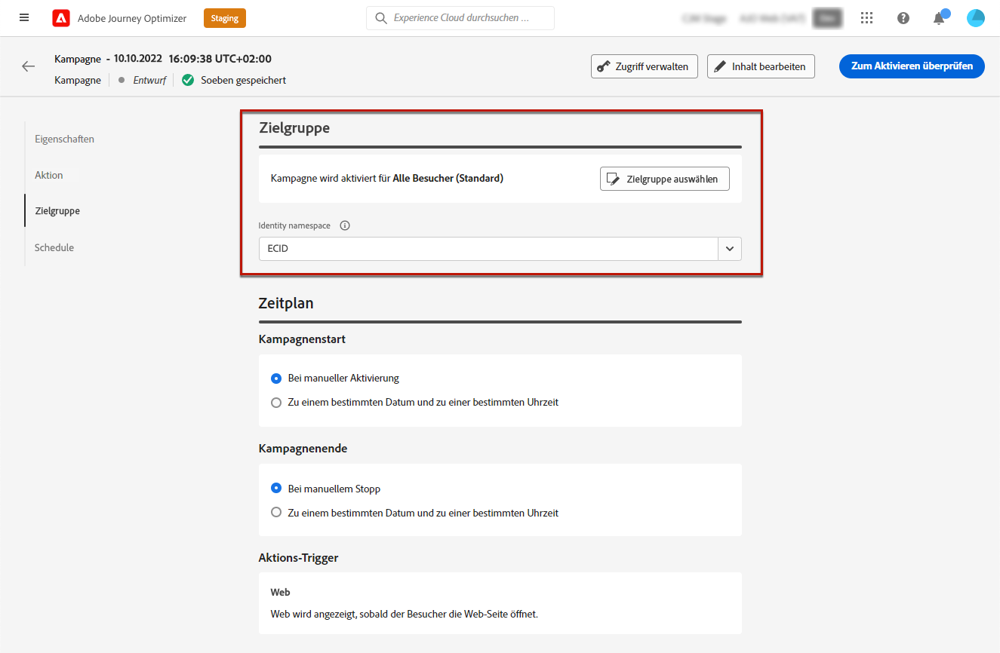
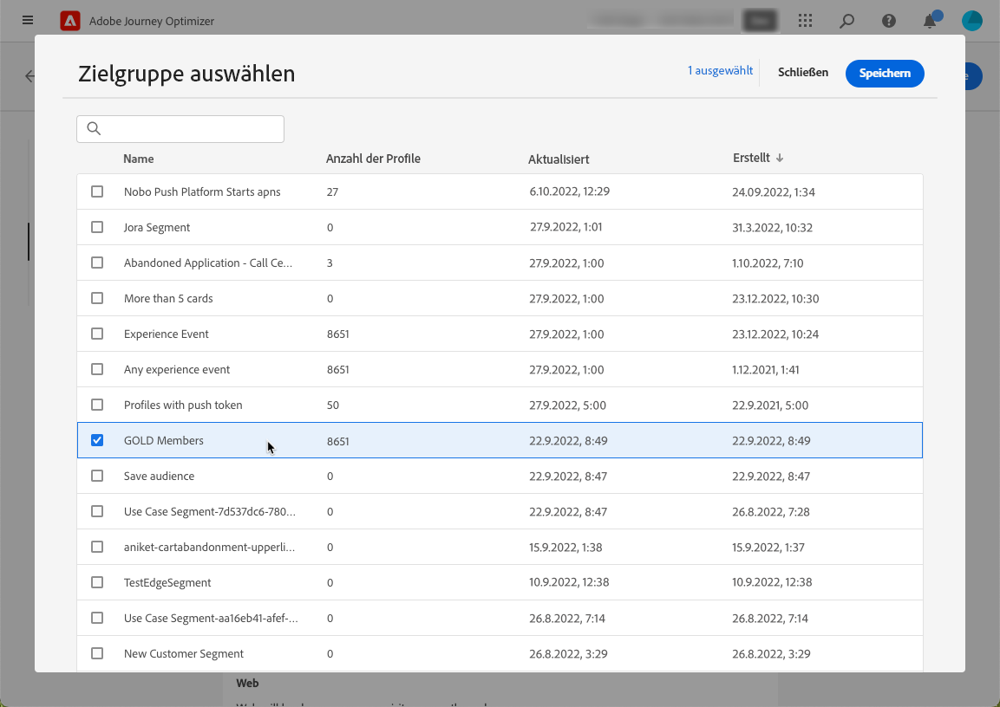
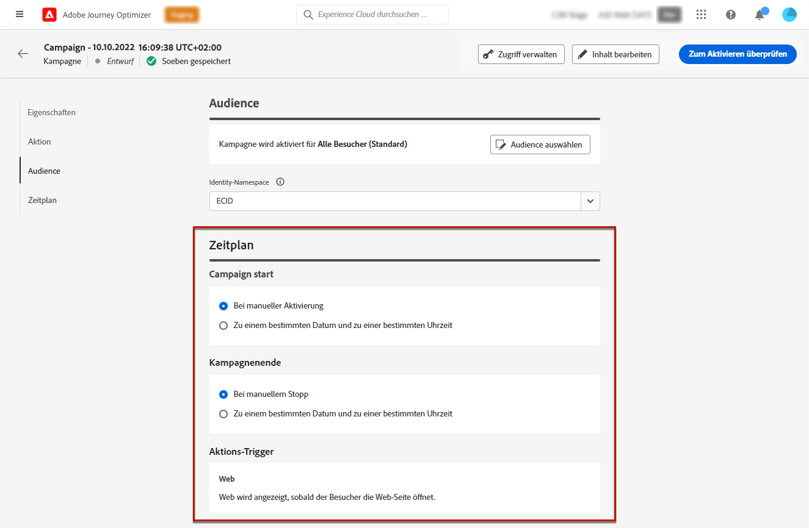
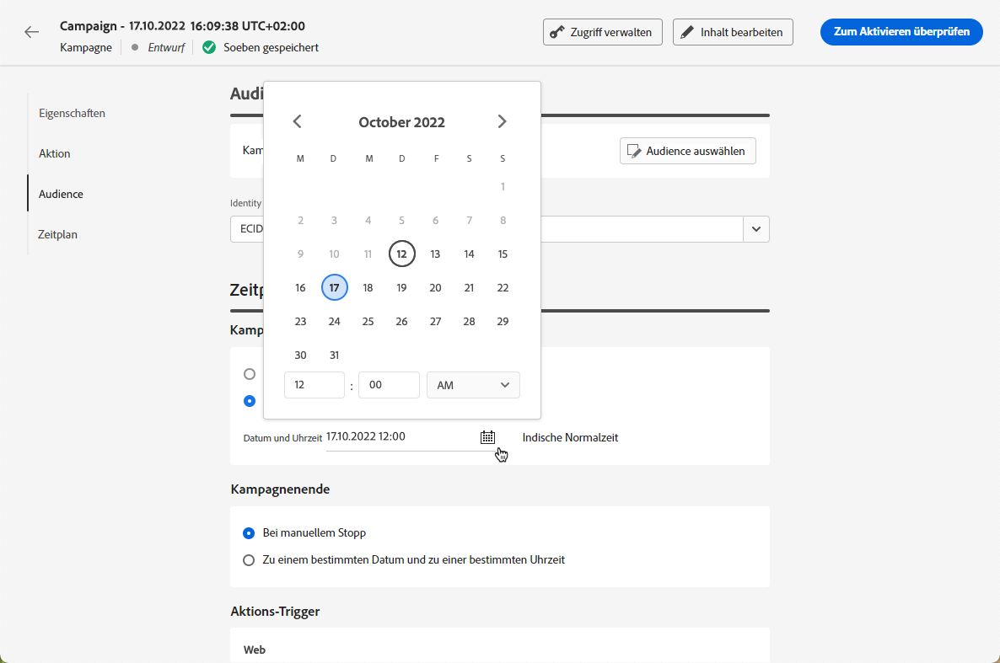
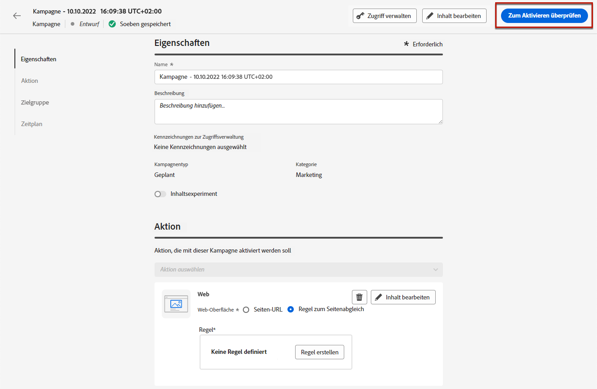

# Erstellen von Web-Erlebnissen {#create-web}

>[!BEGINSHADEBOX]

Inhalt dieser Dokumentation:

* [Erste Schritte mit dem Web-Kanal](get-started-web.md)
* **[Erstellen von Web-Erlebnissen](create-web.md)**
* [Verfassen von Web-Seiten](author-web.md)
* [Visual Editing Helper-Erweiterung](visual-editing-helper.md)
* [Web-Berichte](web-report.md)

>[!ENDSHADEBOX]

[!DNL Journey Optimizer] ermöglicht es Ihnen, das Web-Erlebnis, das Sie Ihren Kunden über eingehende Web-Kampagnen bereitstellen, zu personalisieren.

>[!CAUTION]
>
>Derzeit können Sie Web-Erlebnisse in [!DNL Journey Optimizer] nur mithilfe von **Kampagnen** erstellen. 

## Voraussetzungen {#prerequesites}

Sie müssen folgende Voraussetzungen erfüllen, um Web-Seiten in der Benutzeroberfläche von [!DNL Journey Optimizer] aufzurufen und zu verfassen.

* Um Änderungen an Ihrer Website vorzunehmen, müssen Sie das [Adobe Experience Platform Web SDK](https://experienceleague.adobe.com/docs/platform-learn/implement-web-sdk/overview.html?lang=de){target="_blank"} auf Ihrer Website implementieren.

* Um auf den Web-Designer in [!DNL Journey Optimizer] zuzugreifen, müssen Sie die Browser-Erweiterung [Adobe Experience Cloud Visual Editing Helper](https://chrome.google.com/webstore/detail/adobe-experience-cloud-vi/kgmjjkfjacffaebgpkpcllakjifppnca){target="_blank"} in Chrome herunterladen. [Weitere Informationen](visual-editing-helper.md)

>[!CAUTION]
>
>Google Chrome ist derzeit der einzige Browser, der das Verfassen von Web-Seiten in [!DNL Journey Optimizer] unterstützt.

Damit das Web-Erlebnis ordnungsgemäß bereitgestellt werden kann, müssen die folgenden Einstellungen definiert werden:

* Zur [Datenerfassung in Adobe Experience Platform](https://experienceleague.adobe.com/docs/experience-platform/edge/datastreams/overview.html?lang=de){target="_blank"} muss ein Datenstrom definiert sein. Sie können beispielsweise für den **[!UICONTROL Adobe Experience Platform]**-Service die Optionen **[!UICONTROL Edge-Segmentierung]** und **[!UICONTROL Adobe Journey Optimizer]** aktivieren.

   Dadurch wird sichergestellt, dass die von Journey Optimizer eingehenden Ereignisse korrekt von Adobe Experience Platform Edge verarbeitet werden. [Weitere Informationen](https://experienceleague.adobe.com/docs/experience-platform/edge/datastreams/configure.html?lang=de){target="_blank"}

   

   >[!NOTE]
   >
   >Die Option **[!UICONTROL Adobe Journey Optimizer]** kann nur aktiviert werden, wenn die Option **[!UICONTROL Edge-Segmentierung]** bereits aktiviert ist.

* In [Adobe Experience Platform](https://experienceleague.adobe.com/docs/experience-platform/profile/home.html?lang=de){target="_blank"}, make sure you have one merge policy with the **[!UICONTROL Active-On-Edge Merge Policy]** option enabled. To do this, select a policy under the **[!UICONTROL Customer]** > **[!UICONTROL Profiles]** > **[!UICONTROL Merge Policies]** Experience Platform menu. [Learn more](https://experienceleague.adobe.com/docs/experience-platform/profile/merge-policies/ui-guide.html?lang=de#configure){target="_blank"}

   Diese Zusammenführungsrichtlinie wird von eingehenden Kanälen in [!DNL Journey Optimizer] verwendet, um eingehende Kampagnen auf der Edge korrekt zu aktivieren und zu veröffentlichen. [Weitere Informationen](https://experienceleague.adobe.com/docs/experience-platform/profile/merge-policies/ui-guide.html?lang=de){target="_blank"}

   

## Erstellen einer Web-Kampagne {#create-web-campaign}

>[!CONTEXTUALHELP]
>id="ajo_web_surface"
>title="Eine Web-Oberfläche definieren"
>abstract="Eine Web-Oberfläche kann einer einzelnen Seiten-URL oder mehreren Seiten entsprechen, sodass inhaltliche Änderungen auf einer oder mehreren Web-Seiten vorgenommen werden können."

Gehen Sie wie folgt vor, um mit der Erstellung Ihres Web-Erlebnisses durch eine Kampagne zu beginnen.

1. Erstellen einer Kampagne. [Weitere Informationen](../campaigns/create-campaign.md)

1. Wählen Sie die Aktion **[!UICONTROL Web]**.

   

1. Definieren Sie eine Web-Oberfläche.

   >[!NOTE]
   >
   >Eine Web-Oberfläche ist eine Web-Eigenschaft, die durch eine URL identifiziert wird, über die die Inhalte bereitgestellt werden. Sie kann einer einzelnen Seiten-URL oder mehreren Seiten entsprechen, sodass Sie Änderungen auf einer oder mehreren Web-Seiten vornehmen können.

   Wenn Sie die Änderungen nur auf eine einzelne Seite anwenden möchten, können Sie eine **[!UICONTROL Seiten-URL]** eingeben.

   

1. Sie können aber auch eine **[!UICONTROL Matching-Regel für Seiten]** festlegen, um mehrere URLs als Ziel auszuwählen, die derselben Regel entsprechen. Dies ist zum Beispiel sinnvoll, wenn Sie die Änderungen auf ein Hero-Banner auf einer ganzen Website anwenden oder oben ein Bild hinzufügen möchten, das auf allen Produktseiten einer Website angezeigt wird.

   Wählen Sie dazu **[!UICONTROL Matching-Regel für Seiten]** aus und klicken Sie auf **[!UICONTROL Regel erstellen]**.

   

1. Definieren Sie Ihre Kriterien für die Felder **[!UICONTROL Domain]** und **[!UICONTROL Seite]**.

   Wenn Sie beispielsweise Elemente bearbeiten möchten, die auf allen Damenproduktseiten Ihrer Luma-Website angezeigt werden, wählen Sie **[!UICONTROL Domain]** > **[!UICONTROL Beginnt mit]** > `luma` und **[!UICONTROL Seite]** > **[!UICONTROL Enthält]** > `women`.

   

1. Speichern Sie Ihre Änderungen. Die Regel wird auf dem Bildschirm **[!UICONTROL Kampagne erstellen]** angezeigt.

   

1. Nachdem Sie die Web-Oberfläche definiert haben, klicken Sie auf **[!UICONTROL Erstellen]**. Jetzt können Sie die Eigenschaften und Einstellungen Ihrer Kampagne konfigurieren.

## Konfigurieren der Web-Kampagne {#configure-web-campaign}

1. In der Registerkarte **[!UICONTROL Eigenschaften]** können Sie den Namen der Kampagne bearbeiten und bei Bedarf eine Beschreibung hinzufügen.

   

1. Um der Web-Kampagne benutzerdefinierte oder grundlegende Datennutzungskennzeichnungen zuzuweisen, klicken Sie auf die Schaltfläche **[!UICONTROL Zugriff verwalten]** am oberen Bildschirmrand. [Weitere Informationen zur Zugriffssteuerung auf Objektebene (OLAC)](../administration/object-based-access.md)

1. Sie können Inhaltsbehandlungen mit Teilen der Audience testen, indem Sie **[!UICONTROL Inhaltsexperiment]** auswählen. So können Sie herausfinden, welche Behandlung in Bezug auf eine bestimmte Metrik am besten abschneidet. [Weitere Informationen](../campaigns/content-experiment.md)

   >[!AVAILABILITY]
   >
   >Die Funktion für **Inhaltsexperimente** ist derzeit nur für ausgewählte Organisationen verfügbar (eingeschränkte Verfügbarkeit). Weitere Informationen erhalten Sie beim Adobe-Support.

1. Klicken Sie in der Registerkarte **[!UICONTROL Aktion]** der Kampagne auf **[!UICONTROL Inhalt bearbeiten]**, um mit dem Verfassen Ihrer Web-Kampagne zu beginnen. [Weitere Informationen](author-web.md)

   

1. In der Registerkarte **[!UICONTROL Audience]** können Sie festlegen, wer Ihre Web-Kampagne sehen kann. Standardmäßig ist die Web-Kampagne für alle Besucher sichtbar.

   

   Sie können aber auch eine bestimmte Audience auswählen. Klicken Sie dazu auf die Schaltfläche **[!UICONTROL Audience auswählen]**, um die Liste der verfügbaren Adobe Experience Platform-Segmente anzuzeigen. [Weitere Informationen zu Segmenten](../segment/about-segments.md)

   >[!NOTE]
   >
   >Für API-ausgelöste Kampagnen muss die Audience über einen API-Aufruf festgelegt werden. [Weitere Informationen](../campaigns/api-triggered-campaigns.md)

   

1. Wählen Sie im Feld **[!UICONTROL Identity-Namespace]** den Namespace aus, der zur Identifizierung der Personen im ausgewählten Segment verwendet werden soll. [Weitere Informationen über Namespaces](../event/about-creating.md#select-the-namespace)

1. Definieren Sie einen **[!UICONTROL Zeitplan]** für Ihre Web-Kampagne. [Weitere Informationen](../campaigns/create-campaign.md#schedule)

   

   Standardmäßig startet sie bei manueller Aktivierung und endet, wenn sie manuell gestoppt wird. Sie können aber auch bestimmte Daten und Uhrzeiten definieren, zu denen Ihre Änderungen sichtbar werden.

   

## Aktivieren der Web-Kampagne {#activate-web-campaign}

Nachdem Sie Ihre [Web-Kampagneneinstellungen](#configure-web-campaign) festgelegt und Ihren Inhalt wie gewünscht mit dem [Web-Designer](author-web.md) bearbeitet haben, können Sie Ihre Web-Kampagne überprüfen und aktivieren. Führen Sie dazu folgende Schritte durch.

>[!NOTE]
>
>Sie können vor der Aktivierung auch eine Vorschau des Web-Kampagneninhalts anzeigen. [Weitere Informationen](author-web.md#test-web-campaign)

1. Wählen Sie in Ihrer Web-Kampagne die Option **[!UICONTROL Zur Aktivierung überprüfen]** aus.

   

1. Überprüfen und bearbeiten Sie bei Bedarf Inhalt, Eigenschaften, Oberfläche, Audience und Zeitplan.

1. Wählen Sie **[!UICONTROL Aktivieren]** aus.

   

   >[!NOTE]
   >
   >Nachdem Sie auf **[!UICONTROL Aktivieren]** geklickt haben, kann es bis zu 15 Minuten dauern, bis Web-Kampagnenänderungen auf Ihrer Website live sind.

Ihre Web-Kampagne geht in den **[!UICONTROL Live]**-Status über und ist nun für die ausgewählte Audience sichtbar. Jeder Empfänger Ihrer Kampagne kann die Änderungen sehen, die Sie Ihrer Website mithilfe des Web-Designers von [!DNL Journey Optimizer] hinzugefügt haben.

>[!NOTE]
>
>Wenn Sie einen Zeitplan für Ihre Web-Kampagne definiert haben, hat sie den Status **[!UICONTROL Geplant]**, bis das Startdatum und die Startzeit erreicht werden.
>
>Wenn Sie eine Web-Kampagne aktivieren, die sich auf dieselben Seiten auswirkt wie eine andere bereits aktive Kampagne, werden alle Änderungen auf Ihre Web-Seiten angewendet.

Weitere Informationen zur Aktivierung von Kampagnen finden Sie in [diesem Abschnitt](../campaigns/review-activate-campaign.md).

## Stoppen einer Web-Kampagne {#stop-web-campaign}

Wenn eine Web-Kampagne live ist, können Sie sie stoppen, um zu verhindern, dass Ihre Änderungen für Ihre Audience sichtbar werden. Führen Sie dazu folgende Schritte durch.

1. Wählen Sie eine Live-Kampagne aus der Liste aus.

1. Wählen Sie im oberen Menü **[!UICONTROL Kampagne stoppen]** aus.

   

1. Die hinzugefügten Änderungen sind dann für die von Ihnen definierte Audience nicht mehr sichtbar.

>[!NOTE]
>
>Nachdem eine Web-Kampagne gestoppt wurde, kann sie nicht mehr bearbeitet oder wieder aktiviert werden. Sie können sie nur duplizieren und dann die duplizierte Kampagne aktivieren.
