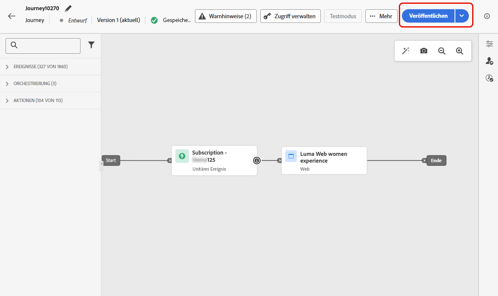

# Erstellen von Web-Erlebnissen {#create-web}

[!DNL Journey Optimizer] ermöglicht es Ihnen, das Web-Erlebnis, das Sie Ihrer Kundschaft bieten, durch eingehende Journeys oder Kampagnen zu personalisieren.

## Hinzufügen eines Web-Erlebnisses über eine Journey oder Kampagne {#create-web-experience}

>[!CONTEXTUALHELP]
>id="ajo_web_surface"
>title="Definieren einer Web-Konfiguration"
>abstract="Eine Web-Konfiguration kann einer einzelnen Seiten-URL oder mehreren Seiten entsprechen, sodass inhaltliche Änderungen auf einer oder mehreren Web-Seiten vorgenommen werden können."

>[!CONTEXTUALHELP]
>id="ajo_web_surface_rule"
>title="Erstellen einer Regel zum Seitenabgleich"
>abstract="Eine Regel zum Seitenabgleich macht es möglich, mehrere URLs, die derselben Regel entsprechen, als Ziel auszuwählen. Dies ist zum Beispiel praktisch, wenn die Änderungen an einem Hero-Banner auf einer ganzen Website angewendet oder oben ein Bild hinzugefügt werden soll, das auf allen Produktseiten einer Website angezeigt wird."

Um mit dem Aufbau Ihres Web-Erlebnisses über eine Kampagne oder eine Journey zu beginnen, folgen Sie den nachstehenden Schritten.

>[!NOTE]
>
>Wenn Sie zum ersten Mal ein Web-Erlebnis erstellen, stellen Sie sicher, dass Sie die in [diesem Abschnitt](web-prerequisites.md) beschriebenen Voraussetzungen befolgen.

>[!BEGINTABS]

>[!TAB Hinzufügen eines Web-Erlebnisses zu einer Journey]

Um einer Journey eine Aktivität **Web** hinzuzufügen, gehen Sie folgendermaßen vor:

1. [Erstellen einer Journey](../building-journeys/journey-gs.md)

1. Beginnen Sie Ihre Journey mit einem [Ereignis](../building-journeys/general-events.md) oder einer Aktivität vom Typ [Zielgruppe lesen](../building-journeys/read-audience.md).

1. Ziehen Sie aus dem Abschnitt **[!UICONTROL Aktionen]** der Palette eine Aktivität **[!UICONTROL Web]** und legen Sie sie ab.

   

   >[!NOTE]
   >
   >Da es sich bei **Web** um eine Aktivität für eingehende Nachrichten handelt, geht sie mit einer 3-tägigen-Aktivität **Warten** einher. [Weitere Informationen](../building-journeys/wait-activity.md#auto-wait-node)

1. Geben Sie einen **[!UICONTROL Titel]** und eine **[!UICONTROL Beschreibung]** für Ihre Nachricht ein.

1. Wählen oder erstellen Sie die [Web-Konfiguration](web-configuration.md), die Sie verwenden möchten.

   

1. Wählen Sie die Schaltfläche **[!UICONTROL Inhalt bearbeiten]** und bearbeiten Sie Ihren Inhalt wie gewünscht mit dem Web-Designer. [Weitere Informationen](edit-web-content.md)

1. Schließen Sie bei Bedarf Ihren Journey-Fluss ab, indem Sie zusätzliche Aktionen oder Ereignisse per Drag-and-Drop verschieben. [Weitere Informationen](../building-journeys/about-journey-activities.md)

1. Sobald Ihr Web-Erlebnis fertig ist, schließen Sie die Konfiguration ab und veröffentlichen Ihre Journey, um sie zu aktivieren. [Weitere Informationen](../building-journeys/publishing-the-journey.md)

Weitere Informationen zur Konfiguration einer Journey finden Sie auf [dieser Seite](../building-journeys/journey-gs.md).

>[!TAB Erstellen einer Web-Kampagne]

Gehen Sie wie folgt vor, um mit der Erstellung Ihres Web-Erlebnisses durch eine Kampagne zu beginnen.

1. Erstellen einer Kampagne. [Weitere Informationen](../campaigns/create-campaign.md)

1. Wählen Sie den Typ der Kampagne aus, die Sie ausführen möchten.

   * **Geplant – Marketing**: die Kampagne wird sofort oder an einem bestimmten Datum ausgeführt. Geplante Kampagnen dienen dem Versand von Marketing-Nachrichten. Sie werden über die Benutzeroberfläche konfiguriert und ausgeführt.

   * **API-ausgelöst – Marketing/Transaktion**: die Kampagne wird mithilfe eines API-Aufrufs ausgeführt.  API-ausgelöste Kampagnen zielen auf den Versand von Nachrichten des Typs „Marketing“ oder „Transaktion“ ab. Beim Typ „Transaktion“ handelt es sich um Nachrichten, die nach einer von einem Kontakt durchgeführten Aktion verschickt werden: Zurücksetzen des Passworts und Verlassen des Warenkorbs. [Erfahren Sie, wie Sie eine Kampagne mithilfe von APIs auslösen](../campaigns/api-triggered-campaigns.md)

1. Führen Sie die Schritte zur Erstellung einer Web-Kampagne aus, z. B. die Kampagneneigenschaften, [Zielgruppe](../audience/about-audiences.md) und [Zeitplan](../campaigns/create-campaign.md#schedule).

1. Wählen Sie die Aktion **[!UICONTROL Web]**.

1. Wählen oder erstellen Sie die Web-Konfiguration. [Weitere Informationen zur Web-Konfiguration](web-configuration.md).

   

1. Klicken Sie auf die Schaltfläche **[!UICONTROL Inhalt bearbeiten]**, um Ihren Inhalt wie gewünscht mit dem Web-Designer zu bearbeiten. [Weitere Informationen](edit-web-content.md)

   <!---->

Weitere Informationen zur Konfiguration Ihrer Kampagne finden Sie auf [dieser Seite](../campaigns/get-started-with-campaigns.md).

➡️ [In diesem Video erfahren Sie, wie Sie eine Webkampagne erstellen](#video)

>[!ENDTABS]

## Testen des Web-Erlebnisses {#test-web-experience}

>[!CONTEXTUALHELP]
>id="ajo_web_designer_preview"
>title="Vorschau des Web-Erlebnisses"
>abstract="Betrachten Sie in einer Simulation, wie Ihr Web-Erlebnis aussehen wird."

Sobald Sie mit dem Web-Designer [das Web-Erlebnis erstellt haben](edit-web-content.md), können Sie mithilfe der Testprofile eine Vorschau der geänderten Web-Seiten anzeigen. Wenn Sie personalisierte Inhalte eingefügt haben, können Sie mithilfe von Testprofildaten überprüfen, wie diese Inhalte angezeigt werden.

Klicken Sie dazu entweder im Bildschirm zur Inhaltsbearbeitung einer Journey oder einer Kampagne auf **[!UICONTROL Inhalt simulieren]** und fügen Sie dann ein Testprofil hinzu, um Ihre Web-Seite mithilfe der Testprofildaten zu überprüfen.

Sie können sie auch im Standard-Browser öffnen oder die Test-URL kopieren, um sie in einen beliebigen Browser einzufügen. Auf diese Weise können Sie den Link für Ihr Team und Ihre Interessensgruppen freigeben, damit sie in der Lage sind, das neue Web-Erlebnis in einem beliebigen Browser in der Vorschau zu betrachten, bevor die Kampagne live geschaltet wird.

>[!NOTE]
>
>Beim Kopieren der Test-URL ist der angezeigte Inhalt derjenige, der für das Testprofil personalisiert wurde, das zum Zeitpunkt der Erstellung der Inhaltsimulation in [!DNL Journey Optimizer] verwendet wurde.

Detaillierte Informationen zur Auswahl von Testprofilen und zur Vorschau Ihres Inhalts finden Sie im Abschnitt [Content-Management](../content-management/preview-test.md).

## Live-Schalten Ihres Web-Erlebnisses {#web-experience-live}

>[!IMPORTANT]
>
> Wenn Ihre Kampagne einer Validierungsrichtlinie unterliegt, müssen Sie eine Validierung anfordern, um Ihre Web-Erlebnisse aktivieren zu können. [Weitere Informationen](../test-approve/gs-approval.md)

Sobald Sie Ihr Web-Erlebnis definiert und Ihre Inhalte wie gewünscht mit dem [Web-Designer](edit-web-content.md#work-with-web-designer) bearbeitet haben, können Sie Ihre Journey oder Kampagne aktivieren, um die Änderungen für Ihre Zielgruppe sichtbar zu machen.

Sie können auch eine Vorschau Ihrer Web-Erlebnis-Inhalte anzeigen, bevor Sie sie live schalten. [Weitere Informationen](#test-web-experience)

>[!NOTE]
>
>Wenn Sie eine Web-Journey/-Kampagne aktivieren, die sich auf dieselben Seiten auswirkt wie eine andere bereits aktive Journey oder Kampagne, werden alle Änderungen auf Ihre Web-Seiten angewendet.
>
>Wenn mehrere Journeys oder Kampagnen dieselben Elemente Ihrer Website aktualisieren, hat die Journey/Kampagne mit der höchsten Priorität Vorrang.

### Veröffentlichen einer Web-Journey {#activate-web-journey}

Gehen Sie wie folgt vor, um Ihr Web-Erlebnis von einer Journey live zu stellen.

1. Stellen Sie sicher, dass Ihre Journey gültig ist und kein Fehler vorliegt. [Weitere Informationen](../building-journeys/troubleshooting.md#checking-for-errors-before-testing)

1. Wählen Sie in der Journey im Dropdown-Menü oben rechts die Option **[!UICONTROL Veröffentlichen]** aus.

   

   >[!NOTE]
   >
   >Weitere Informationen zum Veröffentlichen von Journeys finden Sie [in diesem Abschnitt](../building-journeys/publishing-the-journey.md).

Ihre Web-Journey erhält den Status **[!UICONTROL Live]** und ist jetzt schreibgeschützt. Alle Empfängerinnen und Empfänger Ihrer Journey können die Änderungen sehen, die Sie an Ihrer Website vorgenommen haben.

>[!NOTE]
>
>Nachdem Sie auf **[!UICONTROL Veröffentlichen]** geklickt haben, kann es bis zu 15 Minuten dauern, bis die Änderungen live auf Ihrer Website verfügbar sind.

### Aktivieren einer Web-Kampagne {#activate-web-campaign}

Nachdem Sie Ihre Web-Kampagneneinstellungen festgelegt und Ihren Inhalt wie gewünscht mit dem [Web-Designer](edit-web-content.md#work-with-web-designer) bearbeitet haben, können Sie Ihre Web-Kampagne überprüfen und aktivieren. Führen Sie dazu folgende Schritte durch.

1. Wählen Sie in Ihrer Web-Kampagne die Option **[!UICONTROL Zur Aktivierung überprüfen]** aus.

1. Überprüfen und bearbeiten Sie bei Bedarf Inhalt, Eigenschaften, Konfiguration, Zielgruppe und Zeitplan.

1. Wählen Sie **[!UICONTROL Aktivieren]** aus.

   

   >[!NOTE]
   >
   >Weitere Informationen zur Aktivierung von Kampagnen finden Sie in [diesem Abschnitt](../campaigns/review-activate-campaign.md).

Ihre Web-Kampagne geht in den **[!UICONTROL Live]**-Status über und ist nun für die ausgewählte Zielgruppe sichtbar. Alle Empfängerinnen und Empfänge Ihrer Kampagne können die Änderungen sehen, die Sie an Ihrer Website vorgenommen haben.

>[!NOTE]
>
>Nachdem Sie auf **[!UICONTROL Aktivieren]** geklickt haben, kann es bis zu 15 Minuten dauern, bis Web-Kampagnenänderungen auf Ihrer Website live sind.
>
>Wenn Sie einen Zeitplan für Ihre Web-Kampagne definiert haben, hat sie den Status **[!UICONTROL Geplant]**, bis das Startdatum und die Startzeit erreicht werden.

## Stoppen einer Web-Journey oder Kampagne {#stop-web-experience}

Wenn eine Web-Journey oder Kampagne live ist, können Sie diese stoppen, um zu verhindern, dass Ihre Zielgruppe Ihre Änderungen sieht. Führen Sie dazu folgende Schritte durch.

1. Wählen Sie eine Live-Journey oder -Kampagne aus der entsprechenden Liste aus.

1. Führen Sie je nach Fall die entsprechende Aktion aus:

   * Wählen Sie im oberen Menü der Kampagne **[!UICONTROL Kampagne stoppen]**.

     

   * Klicken Sie im oberen Menü der Journey auf die Schaltfläche **[!UICONTROL Mehr]** und wählen Sie **[!UICONTROL Stoppen]**.

     

1. Die hinzugefügten Änderungen werden für die von Ihnen definierte Zielgruppe nicht mehr sichtbar sein.

>[!NOTE]
>
>Sobald eine Web-Journey oder Kampagne gestoppt wurde, können Sie diese nicht mehr bearbeiten oder erneut aktivieren. Sie können sie nur duplizieren und die duplizierte Journey/Kampagne aktivieren.

## Anleitungsvideo{#video}

Im folgenden Video erfahren Sie, wie Sie eine Web-Kampagne erstellen, ihre Eigenschaften konfigurieren, sie überprüfen und veröffentlichen.

>[!VIDEO](https://video.tv.adobe.com/v/3418800/?quality=12&learn=on)