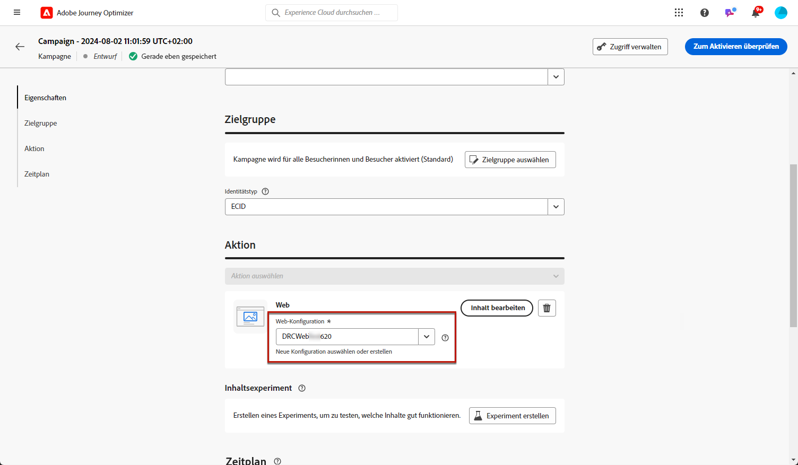

# Erstellen von Web-Erlebnissen {#create-web}

Mit [!DNL Journey Optimizer] können Sie das Web-Erlebnis personalisieren, das Sie Ihren Kunden über eingehende Journey oder Kampagnen bereitstellen.

## Hinzufügen eines Web-Erlebnisses über eine Journey oder eine Kampagne {#create-web-experience}

>[!CONTEXTUALHELP]
>id="ajo_web_surface"
>title="Definieren einer Web-Konfiguration"
>abstract="Eine Web-Konfiguration kann einer einzelnen Seiten-URL oder mehreren Seiten entsprechen, sodass inhaltliche Änderungen auf einer oder mehreren Web-Seiten vorgenommen werden können."

>[!CONTEXTUALHELP]
>id="ajo_web_surface_rule"
>title="Erstellen einer Regel zum Seitenabgleich"
>abstract="Eine Regel zum Seitenabgleich macht es möglich, mehrere URLs, die derselben Regel entsprechen, als Ziel auszuwählen. Dies ist zum Beispiel praktisch, wenn die Änderungen an einem Hero-Banner auf einer ganzen Website angewendet oder oben ein Bild hinzugefügt werden soll, das auf allen Produktseiten einer Website angezeigt wird."

Gehen Sie wie folgt vor, um mit der Erstellung Ihres Web-Erlebnisses durch eine Kampagne oder eine Journey zu beginnen.

>[!NOTE]
>
>Wenn Sie zum ersten Mal ein Web-Erlebnis erstellen, stellen Sie sicher, dass Sie die in [diesem Abschnitt](web-prerequisites.md) beschriebenen Voraussetzungen befolgen.

>[!BEGINTABS]

>[!TAB Hinzufügen eines Web-Erlebnisses zu einer Journey]

Gehen Sie wie folgt vor, um eine **Web** -Aktivität zu einer Journey hinzuzufügen:

1. [Erstellen Sie eine Journey](../building-journeys/journey-gs.md).

1. Beginnen Sie Ihre Journey mit einem [Ereignis](../building-journeys/general-events.md) oder einer Aktivität vom Typ [Zielgruppe lesen](../building-journeys/read-audience.md).

1. Ziehen Sie eine **[!UICONTROL Web]** -Aktivität aus dem Bereich **[!UICONTROL Aktionen]** der Palette.

   

   >[!NOTE]
   >
   >Da es sich bei **Web** um eine Aktivität vom Typ &quot;Inbound Message&quot; handelt, ist diese mit einer 3-tägigen **Warten** -Aktivität ausgestattet. [Weitere Informationen](../building-journeys/wait-activity.md#auto-wait-node)

1. Geben Sie einen **[!UICONTROL Titel]** und eine **[!UICONTROL Beschreibung]** für Ihre Nachricht ein.

1. Wählen Sie die zu verwendende [Webkonfiguration](web-configuration.md) aus oder erstellen Sie sie.

   

1. Wählen Sie die Schaltfläche **[!UICONTROL Inhalt bearbeiten]** aus und bearbeiten Sie den Inhalt nach Bedarf mit dem Webdesigner. [Weitere Informationen](edit-web-content.md)

1. Schließen Sie bei Bedarf Ihren Journey-Fluss ab, indem Sie zusätzliche Aktionen oder Ereignisse per Drag-and-Drop verschieben. [Weitere Informationen](../building-journeys/about-journey-activities.md)

1. Sobald Ihr Web-Erlebnis fertig ist, schließen Sie die Konfiguration ab und veröffentlichen Sie Ihre Journey, um sie zu aktivieren. [Weitere Informationen](../building-journeys/publishing-the-journey.md)

Weitere Informationen zur Konfiguration einer Journey finden Sie auf [dieser Seite](../building-journeys/journey-gs.md).

>[!TAB Erstellen einer Web-Kampagne]

Gehen Sie wie folgt vor, um mit der Erstellung Ihres Web-Erlebnisses durch eine Kampagne zu beginnen.

1. Erstellen einer Kampagne. [Weitere Informationen](../campaigns/create-campaign.md)

1. Wählen Sie den Typ der Kampagne aus, die Sie ausführen möchten.

   * **Geplant – Marketing**: die Kampagne wird sofort oder an einem bestimmten Datum ausgeführt. Geplante Kampagnen dienen dem Versand von Marketing-Nachrichten. Sie werden über die Benutzeroberfläche konfiguriert und ausgeführt.

   * **API-ausgelöst – Marketing/Transaktion**: die Kampagne wird mithilfe eines API-Aufrufs ausgeführt.  API-gesteuerte Kampagnen zielen darauf ab, entweder Marketing- oder Transaktionsnachrichten zu senden, d. h. Nachrichten, die aufgrund einer von einer Person durchgeführten Aktion gesendet werden: Kennwortrücksetzung, Warenkorbkauf usw. [Erfahren Sie, wie Sie eine Kampagne mithilfe von APIs auslösen](../campaigns/api-triggered-campaigns.md)

1. Führen Sie die Schritte zur Erstellung einer Web-Kampagne aus, z. B. die Kampagneneigenschaften, [Zielgruppe](../audience/about-audiences.md) und [Zeitplan](../campaigns/create-campaign.md#schedule).

1. Wählen Sie die Aktion **[!UICONTROL Web]**.

1. Wählen oder erstellen Sie die Webkonfiguration. [Weitere Informationen zur Web-Konfiguration](web-configuration.md).

   

1. Klicken Sie auf die Schaltfläche **[!UICONTROL Inhalt bearbeiten]** , um den Inhalt mit dem Webdesigner nach Bedarf zu bearbeiten. [Weitere Informationen](edit-web-content.md)

   <!---->

Weitere Informationen zur Konfiguration Ihrer Kampagne finden Sie auf [dieser Seite](../campaigns/get-started-with-campaigns.md).

➡️ [Erfahren Sie in diesem Video, wie Sie eine Webkampagne erstellen](#video)

>[!ENDTABS]

## Testen des Web-Erlebnisses {#test-web-experience}

>[!CONTEXTUALHELP]
>id="ajo_web_designer_preview"
>title="Vorschau des Web-Erlebnisses"
>abstract="Betrachten Sie in einer Simulation, wie Ihr Web-Erlebnis aussehen wird."

Sobald Sie mit dem Web-Designer [das Web-Erlebnis erstellt haben](edit-web-content.md), können Sie mithilfe der Testprofile eine Vorschau der geänderten Web-Seiten anzeigen. Wenn Sie personalisierte Inhalte eingefügt haben, können Sie mithilfe von Testprofildaten überprüfen, wie diese Inhalte angezeigt werden.

Klicken Sie dazu entweder auf dem Bildschirm zur Inhaltsbearbeitung oder im Bildschirm zur Inhaltsbearbeitung auf **[!UICONTROL Inhalt simulieren]** und fügen Sie dann ein Testprofil hinzu, um Ihre Webseite mithilfe der Testprofildaten zu überprüfen.

Sie können sie auch im Standard-Browser öffnen oder die Test-URL kopieren, um sie in einen beliebigen Browser einzufügen. Auf diese Weise können Sie den Link für Ihr Team und Ihre Interessensgruppen freigeben, damit sie in der Lage sind, das neue Web-Erlebnis in einem beliebigen Browser in der Vorschau zu betrachten, bevor die Kampagne live geschaltet wird.

>[!NOTE]
>
>Beim Kopieren der Test-URL ist der angezeigte Inhalt derjenige, der für das Testprofil personalisiert wurde, das zum Zeitpunkt der Erstellung der Inhaltsimulation in [!DNL Journey Optimizer] verwendet wurde.

Detaillierte Informationen zur Auswahl von Testprofilen und zur Vorschau Ihres Inhalts finden Sie im Abschnitt [Content-Management](../content-management/preview-test.md).

## Web-Erlebnis live schalten {#web-experience-live}

>[!IMPORTANT]
>
> Wenn Ihre Kampagne einer Validierungsrichtlinie unterliegt, müssen Sie eine Validierung anfordern, um Ihre Web-Erlebnisse aktivieren zu können. [Weitere Informationen](../test-approve/gs-approval.md)

Nachdem Sie Ihr Web-Erlebnis definiert und Ihren Inhalt mit dem [Web-Designer](edit-web-content.md#work-with-web-designer) nach Bedarf bearbeitet haben, können Sie Ihre Journey oder Kampagne aktivieren, um Ihre Änderungen für Ihre Zielgruppe sichtbar zu machen.

Sie können auch eine Vorschau Ihrer Web-Erlebnisinhalte anzeigen, bevor Sie sie aktivieren. [Weitere Informationen](#test-web-experience)

>[!NOTE]
>
>Wenn Sie eine Web-Journey/Kampagne aktivieren, die sich auf dieselben Seiten auswirkt wie eine andere Journey oder Kampagne, die bereits live ist, werden alle Änderungen auf Ihre Webseiten angewendet.
>
>Wenn mehrere Journey oder Kampagnen dieselben Elemente Ihrer Website aktualisieren, hat die Journey/Kampagne mit der höchsten Priorität Vorrang.

### Publish einer Web-Journey {#activate-web-journey}

Gehen Sie wie folgt vor, um Ihr Web-Erlebnis von einer Journey live zu machen.

1. Stellen Sie sicher, dass Ihre Journey gültig ist und kein Fehler vorliegt. [Weitere Informationen](../building-journeys/troubleshooting.md#checking-for-errors-before-testing)

1. Wählen Sie auf der Journey die Option **[!UICONTROL Publish]** aus, die sich oben rechts in der Dropdown-Liste befindet.

   

   >[!NOTE]
   >
   >Weitere Informationen zum Veröffentlichen von Journey finden Sie in [diesem Abschnitt](../building-journeys/publishing-the-journey.md).

Ihre Web-Journey erhält den Status **[!UICONTROL Live]** und ist jetzt schreibgeschützt. Jeder Empfänger Ihrer Journey kann die Änderungen sehen, die Sie zu Ihrer Website hinzugefügt haben.

>[!NOTE]
>
>Nachdem Sie auf **[!UICONTROL Publish]** geklickt haben, kann es bis zu 15 Minuten dauern, bis die Änderungen live auf Ihrer Website verfügbar sind.

### Aktivieren einer Webkampagne {#activate-web-campaign}

Nachdem Sie Ihre Webkampagneneinstellungen definiert und Ihren Inhalt mit dem [Webdesigner](edit-web-content.md#work-with-web-designer) bearbeitet haben, können Sie Ihre Webkampagne überprüfen und aktivieren. Führen Sie dazu folgende Schritte durch.

1. Wählen Sie in Ihrer Web-Kampagne die Option **[!UICONTROL Zur Aktivierung überprüfen]** aus.

1. Überprüfen und bearbeiten Sie bei Bedarf Inhalt, Eigenschaften, Konfiguration, Zielgruppe und Zeitplan.

1. Wählen Sie **[!UICONTROL Aktivieren]** aus.

   

   >[!NOTE]
   >
   >Weitere Informationen zur Aktivierung von Kampagnen finden Sie in [diesem Abschnitt](../campaigns/review-activate-campaign.md).

Ihre Web-Kampagne geht in den **[!UICONTROL Live]**-Status über und ist nun für die ausgewählte Zielgruppe sichtbar. Jeder Empfänger Ihrer Kampagne kann die Änderungen sehen, die Sie Ihrer Website hinzugefügt haben.

>[!NOTE]
>
>Nachdem Sie auf **[!UICONTROL Aktivieren]** geklickt haben, kann es bis zu 15 Minuten dauern, bis Web-Kampagnenänderungen auf Ihrer Website live sind.
>
>Wenn Sie einen Zeitplan für Ihre Web-Kampagne definiert haben, hat sie den Status **[!UICONTROL Geplant]**, bis das Startdatum und die Startzeit erreicht werden.

## Eine Web-Journey oder -Kampagne stoppen {#stop-web-experience}

Wenn eine Web-Journey oder Kampagne live ist, können Sie sie stoppen, um zu verhindern, dass Ihre Zielgruppe Ihre Änderungen sieht. Führen Sie dazu folgende Schritte durch.

1. Wählen Sie eine Live-Journey oder Kampagne aus der entsprechenden Liste aus.

1. Führen Sie die entsprechende Aktion entsprechend Ihrem Fall aus:

   * Wählen Sie im oberen Kampagnenmenü die Option **[!UICONTROL Kampagne stoppen]**.

     

   * Klicken Sie im oberen Menü auf die Schaltfläche **[!UICONTROL Mehr]** und wählen Sie **[!UICONTROL Stoppen]** aus.

     

1. Die von Ihnen hinzugefügten Änderungen sind für die von Ihnen definierte Zielgruppe nicht mehr sichtbar.

>[!NOTE]
>
>Nachdem eine Web-Journey oder Kampagne angehalten wurde, können Sie sie nicht mehr bearbeiten oder erneut aktivieren. Sie können sie nur duplizieren und die duplizierte Journey/Kampagne aktivieren.

## Anleitungsvideo{#video}

Im folgenden Video erfahren Sie, wie Sie eine Web-Kampagne erstellen, ihre Eigenschaften konfigurieren, sie überprüfen und veröffentlichen.

>[!VIDEO](https://video.tv.adobe.com/v/3418800/?quality=12&learn=on)