# Webinhalt bearbeiten {#edit-web-content}

Nachdem Sie eine [Web-Aktion](create-web.md#create-web-campaign) zu Ihrer Kampagne hinzugefügt haben, können Sie den Inhalt Ihrer Site mit dem Web-Designer bearbeiten.

[In diesem Video erfahren Sie, wie Sie eine Web-Kampagne verfassen](#video)

In [!DNL Journey Optimizer] basiert das Erstellen von Web-Seiten auf der Chrome-Browser-Erweiterung **Adobe Experience Cloud Visual Helper**. [Weitere Informationen](web-prerequisites.md#visual-authoring-prerequisites)

>[!CAUTION]
>
>Um in der Benutzeroberfläche von [!DNL Journey Optimizer] auf Web-Seiten zuzugreifen oder sie dort zu erstellen, müssen Sie den Voraussetzungen in [diesem Abschnitt](web-prerequisites.md) folgen.

In den folgenden Abschnitten erfahren Sie mehr zu den einzelnen Themen:

* [Verwalten von Änderungen](manage-web-modifications.md)

* [Webkampagnen überwachen](monitor-web-campaigns.md)

## Arbeiten mit dem Webdesigner {#work-with-web-designer}

>[!CONTEXTUALHELP]
>id="ajo_web_url_to_edit_surface"
>title="Bestätigen der URL zum Bearbeiten"
>abstract="Bestätigen Sie die URL der spezifischen Web-Seite, die für die Bearbeitung des Inhalts verwendet werden soll, welcher auf die oben definierte Web-Oberfläche angewendet wird. Die Web-Seite muss mithilfe des Adobe Experience Platform Web SDK implementiert werden."
>additional-url="https://experienceleague.adobe.com/docs/platform-learn/implement-web-sdk/overview.html?lang=de" text="Weitere Informationen"

>[!CONTEXTUALHELP]
>id="ajo_web_url_to_edit_rule"
>title="Geben Sie die zu bearbeitende URL ein"
>abstract="Geben Sie die URL einer bestimmten Web-Seite ein, die zum Bearbeiten des Inhalts verwendet werden soll. Sie wird auf alle Seiten angewendet, die der Regel entsprechen. Die Web-Seite muss mithilfe des Adobe Experience Platform Web SDK implementiert werden."
>additional-url="https://experienceleague.adobe.com/docs/platform-learn/implement-web-sdk/overview.html?lang=de" text="Weitere Informationen"

Gehen Sie wie folgt vor, um mit der Erstellung Ihrer Web-Kampagne zu beginnen.

1. Wählen Sie auf der Registerkarte **[!UICONTROL Aktion]** der [Kampagne](create-web.md#create-web-campaign) die Option **[!UICONTROL Inhalt bearbeiten]** aus.<!--change screen with rule-->

   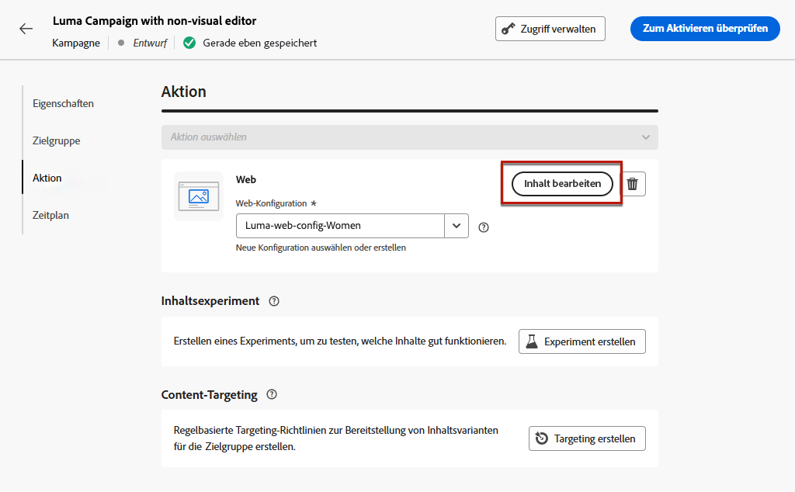

1. Wenn Sie eine Matching-Regel für Seiten erstellt haben, müssen Sie jede URL eingeben, die dieser Regel entspricht: Die Änderungen werden auf allen Seiten angewandt, die mit der Regel übereinstimmen. Der Inhalt der Seite wird angezeigt.

   >[!NOTE]
   >
   >Wenn Sie eine einzelne URL als Web-Oberfläche eingegeben haben, ist die zu personalisierende URL bereits ausgefüllt.

   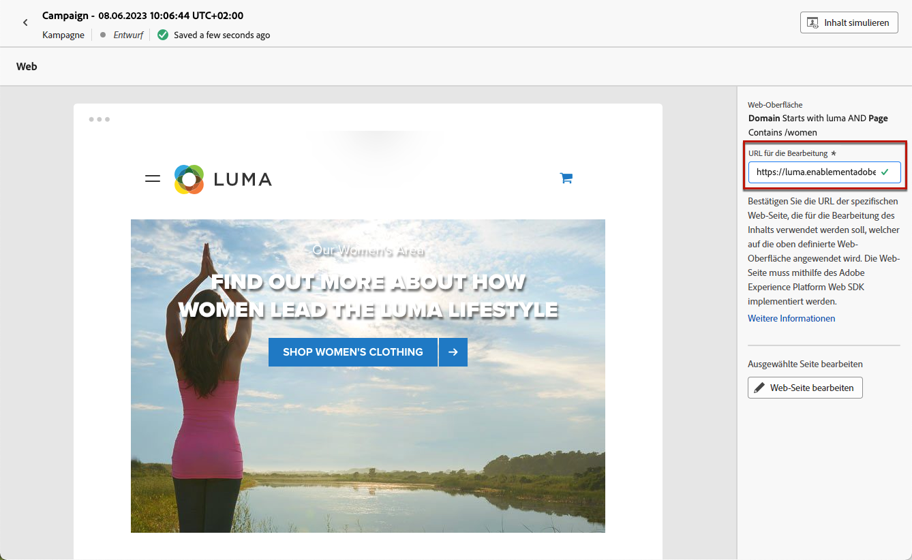

   >[!CAUTION]
   >
   >Die Web-Seite muss das [Adobe Experience Platform Web SDK](https://experienceleague.adobe.com/docs/platform-learn/implement-web-sdk/overview.html?lang=de){target="_blank"} enthalten. [Weitere Informationen](web-prerequisites.md#implementation-prerequisites)

1. Klicken Sie auf **[!UICONTROL Web-Seite bearbeiten]**, um mit dem Erstellen zu beginnen. Der Web-Designer wird angezeigt.

   

   >[!NOTE]
   >
   >Wenn Sie versuchen, eine Web-Site zu laden, die sich nicht laden lässt, wird eine Meldung mit dem Vorschlag angezeigt, die Browser-Erweiterung [Visual Editing Helper](#install-visual-editing-helper) zu installieren. Tipps zur Fehlerbehebung finden Sie in [diesem Abschnitt](web-prerequisites.md#troubleshooting).

1. Wählen Sie ein beliebiges Element auf der Arbeitsfläche aus, z. B. Bild, Schaltfläche, Absatz, Text, Container, Überschrift, Link usw. [Weitere Informationen](#content-components)

1. Verwenden Sie:

   * das Kontextmenü zur Bearbeitung des Inhalts, des Layouts, der Links oder der Personalisierung usw.

     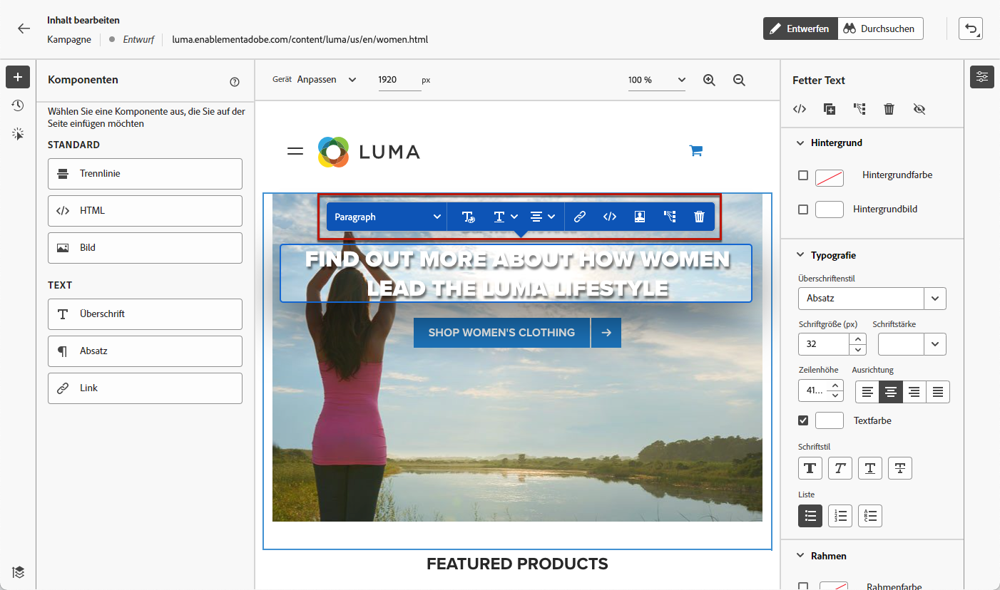

   * die Symbole oben im rechten Bereich zum Bearbeiten, Duplizieren, Löschen oder Ausblenden der einzelnen Elemente.

     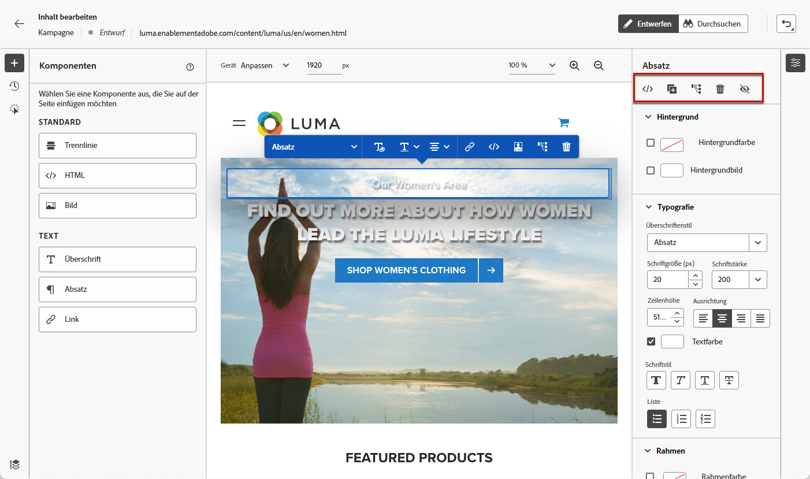

   * den rechten Bereich, der sich dynamisch entsprechend dem ausgewählten Element ändert. Sie können beispielsweise den Hintergrund, die Typografie, den Rahmen, die Größe, die Position, den Abstand, die Effekte oder Inline-Stile eines Elements bearbeiten.

     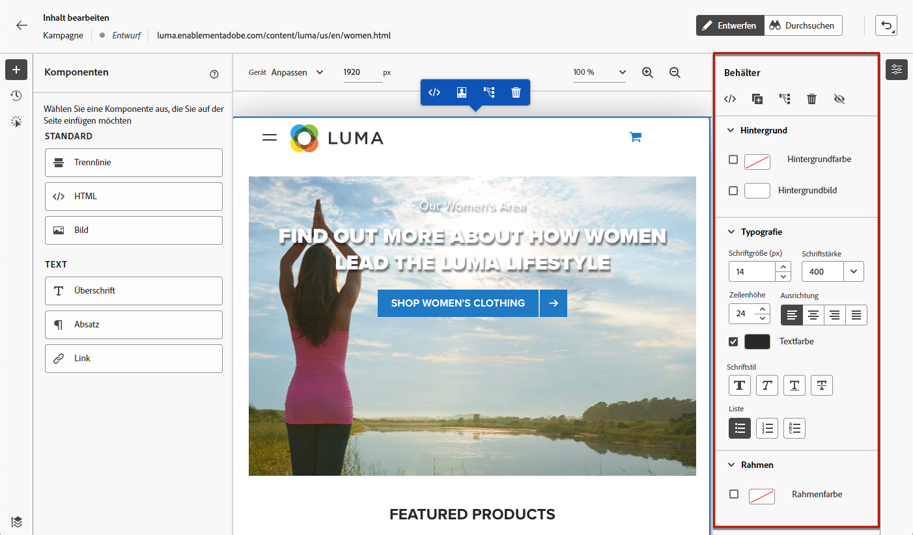

>[!NOTE]
>
>Der Web-Content-Designer ähnelt größtenteils E-Mail-Designer. Weitere Informationen finden Sie unter [Inhaltserstellung mit  [!DNL Journey Optimizer]](../email/get-started-email-design.md).

## Verwenden von Komponenten {#content-components}

>[!CONTEXTUALHELP]
>id="ajo_web_designer_components"
>title="Hinzufügen von Komponenten zu einer Web-Seite"
>abstract="Sie können Ihrer Web-Seite eine Reihe von Komponenten hinzufügen und diese nach Bedarf bearbeiten."

1. Wählen Sie im Bereich **[!UICONTROL Komponenten]** auf der linken Seite ein Element aus. Sie können Ihrer Web-Seite die folgenden Komponenten hinzufügen und diese nach Bedarf bearbeiten:

   * [Trennlinie](../email/content-components.md#divider)
   * [HTML](../email/content-components.md#HTML)
   * [Bild](../email/content-components.md#image)
   * Überschrift – die Verwendung dieser Komponente ähnelt der Verwendung der Komponente **[!UICONTROL Text]** im E-Mail-Designer. [Weitere Informationen](../email/content-components.md#text)
   * Absatz – die Verwendung dieser Komponente ähnelt der Verwendung der Komponente **[!UICONTROL Text]** im E-Mail-Designer. [Weitere Informationen](../email/content-components.md#text)
   * Link
   * [Angebotsentscheidung](../email/add-offers-email.md)

   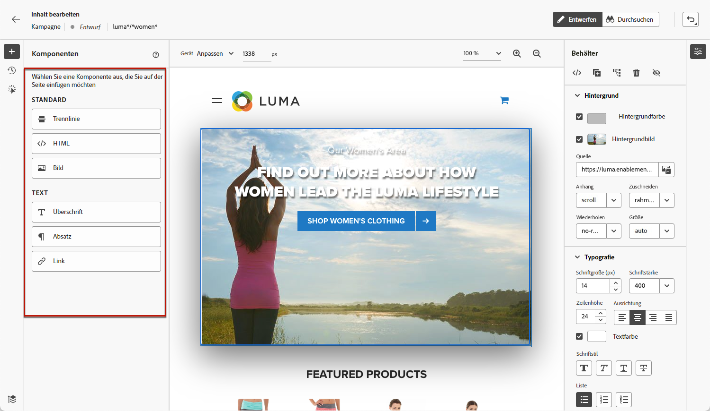

1. Bewegen Sie den Mauszeiger über die Seite und klicken Sie auf die Schaltfläche **[!UICONTROL Einfügen vor]** oder **[!UICONTROL Einfügen nach]**, um die Komponente an ein vorhandenes Element auf der Seite anzuhängen.

   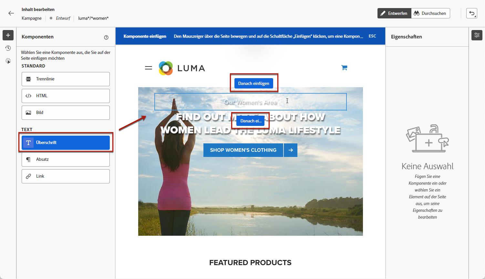

   >[!NOTE]
   >
   >Um die Auswahl einer Komponente aufzuheben, klicken Sie auf die Schaltfläche **[!UICONTROL ESC]** im kontextuellen blauen Banner, das oben auf der Arbeitsfläche angezeigt wird.

1. Bearbeiten Sie die Komponente nach Bedarf direkt im Inhalt Ihrer Seite.

   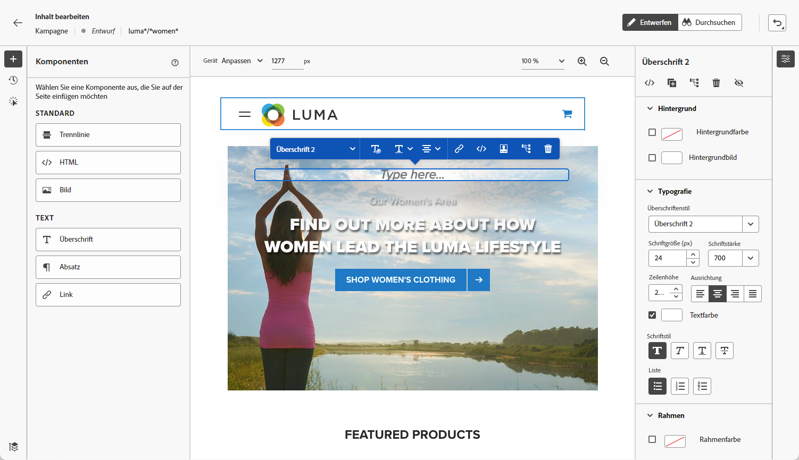

1. Passen Sie die Stile an, die im kontextuellen Bereich auf der rechten Seite angezeigt werden, z. B. Hintergrund, Textfarbe, Rahmen, Größe, Position usw., - abhängig von der ausgewählten Komponente.

   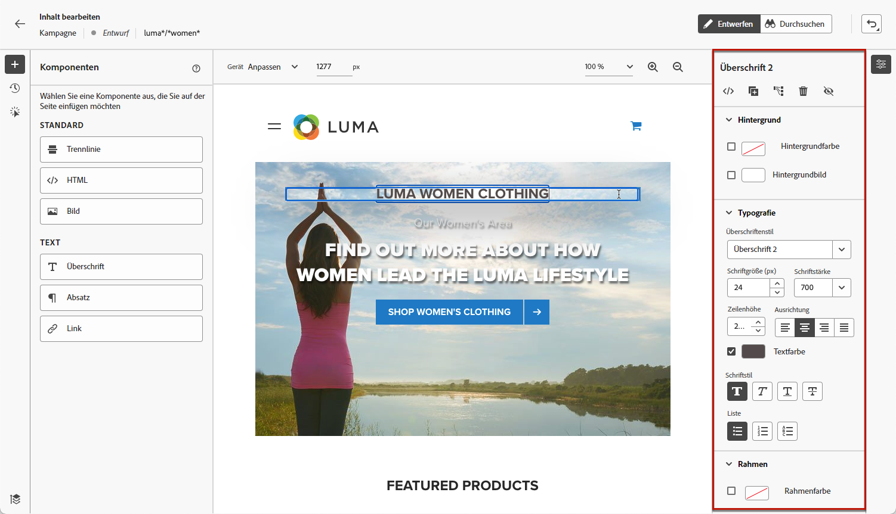

## Hinzufügen von Personalisierung und Angeboten

Um eine Personalisierung hinzuzufügen, wählen Sie einen Container aus und klicken Sie auf das Personalisierungssymbol in der angezeigten Kontextmenüleiste. Fügen Sie Ihre Änderungen mithilfe des Ausdruckseditors hinzu. [Weitere Informationen](../personalization/personalization-build-expressions.md)

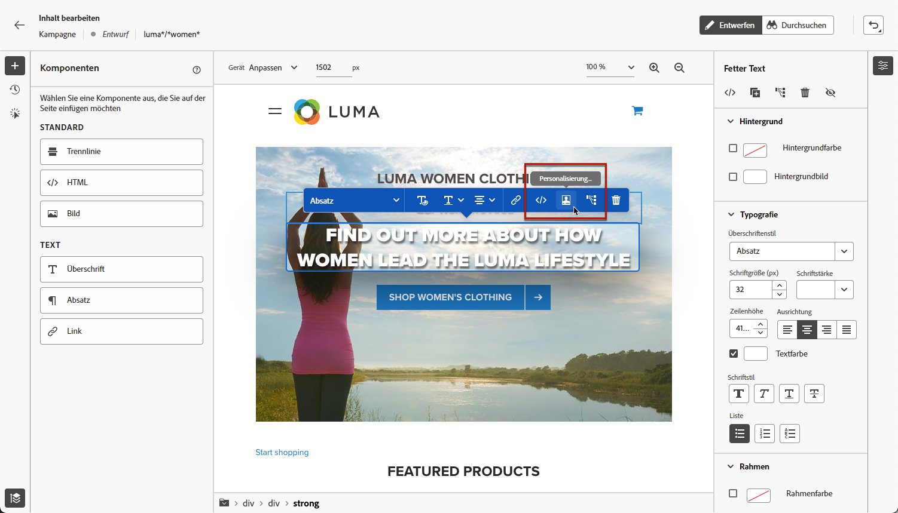

Verwenden Sie die Komponente **[!UICONTROL Angebotsentscheidung]**, um [Angebote](../offers/get-started/starting-offer-decisioning.md) in Ihre Web-Seiten einzufügen. Der Prozess ist der gleiche wie beim [Hinzufügen eines Angebots zu einer E-Mail](../email/add-offers-email.md). Er nutzt das Entscheidungs-Management, um das beste Angebot für Ihre Kunden auszuwählen.

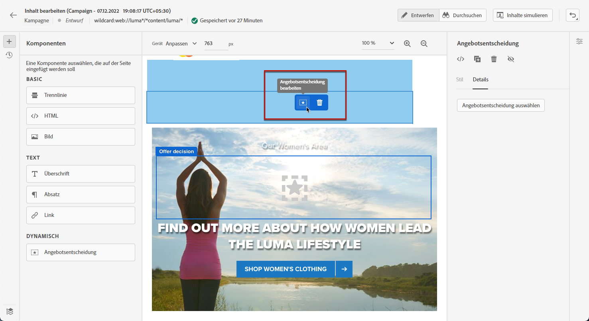

## Navigieren durch den Web-Designer {#navigate-web-designer}

In diesem Abschnitt werden die verschiedenen Methoden zum Navigieren durch den Webdesigner beschrieben. Informationen zum Anzeigen und Verwalten der Änderungen, die zu Ihrem Web-Erlebnis hinzugefügt wurden, finden Sie unter [diesem Abschnitt](manage-web-modifications.md).

### Verwenden von Breadcrumbs {#breadcrumbs}

1. Wählen Sie ein beliebiges Element auf der Arbeitsfläche aus.

1. Klicken Sie auf **[!UICONTROL Breadcrumbs erweitern/reduzieren]** auf der linken unteren Bildschirmseite, um Informationen zum ausgewählten Element schnell anzuzeigen.

   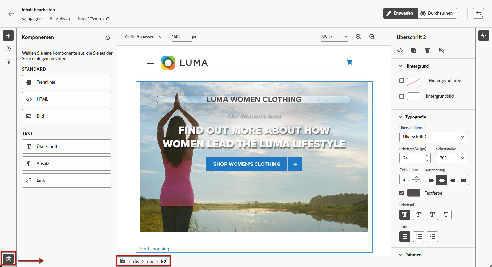

1. Wenn Sie den Mauszeiger über die Breadcrumbs bewegen, wird das entsprechende Element im Editor hervorgehoben.

1. Damit können Sie einfach zu jedem übergeordneten, gleichrangigen oder untergeordneten Element im visuellen Editor navigieren.

### Wechseln in den Durchsuchen-Modus {#browse-mode}

>[!CONTEXTUALHELP]
>id="ajo_web_designer_browse"
>title="Verwenden des Durchsuchen-Modus"
>abstract="Im Durchsuchen-Modus können Sie von der ausgewählten Oberfläche, die Sie personalisieren möchten, direkt zur gewünschten Seite navigieren."

Sie können über die entsprechende Schaltfläche vom Standardmodus **[!UICONTROL Design]** in den **[!UICONTROL Durchsuchen]**-Modus wechseln.

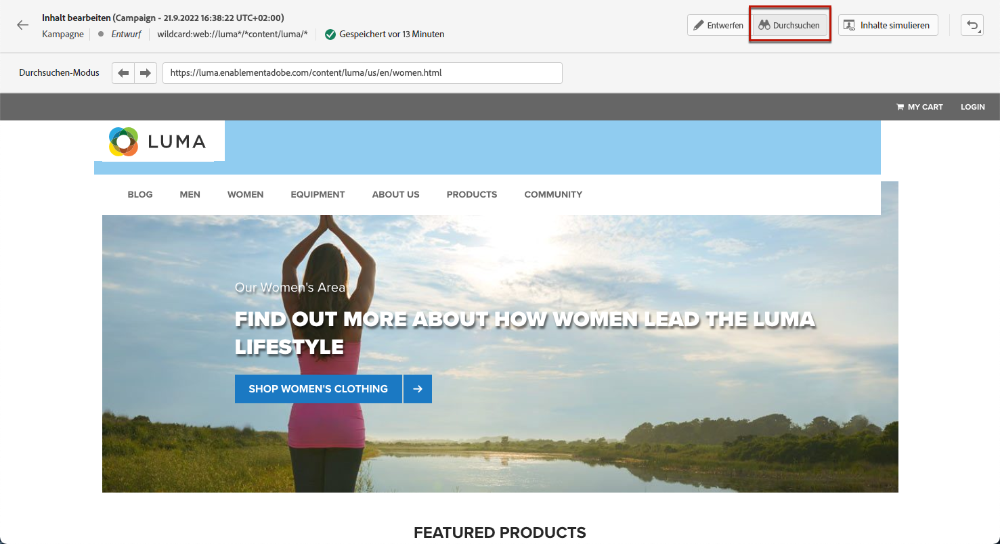

Im **[!UICONTROL Durchsuchen]**-Modus können Sie von der ausgewählten Oberfläche, die Sie personalisieren möchten, zur gewünschten Seite navigieren.

Dies ist besonders nützlich, wenn es um Seiten geht, die sich hinter der Authentifizierung befinden oder nicht von Anfang an über eine bestimmte URL verfügbar sind. Sie können sich beispielsweise authentifizieren, zu Ihrer Kontoseite oder zu Ihrer Warenkorbseite navigieren und dann zurück in den **[!UICONTROL Design]**-Modus wechseln, um die Änderungen auf der gewünschten Seite durchzuführen.

Verwenden **[!UICONTROL Durchsuchen]** -Modus können Sie auch bei der Erstellung von Einzelseitenanwendungen durch alle Ansichten Ihrer Website navigieren. [Weitere Informationen](web-spa.md)

### Ändern der Gerätegröße {#change-device-size}

Sie können die Gerätegröße der Web-Designer-Anzeige in eine vordefinierte Größe ändern, z. B. **[!UICONTROL Tablet]** oder **[!UICONTROL Mobilgeräte – Querformat]**. Legen Sie alternativ eine benutzerdefinierte Größe fest, indem Sie die gewünschte Pixelanzahl eingeben.

Sie können auch den Zoom-Fokus ändern – von 25 % bis 400 %.

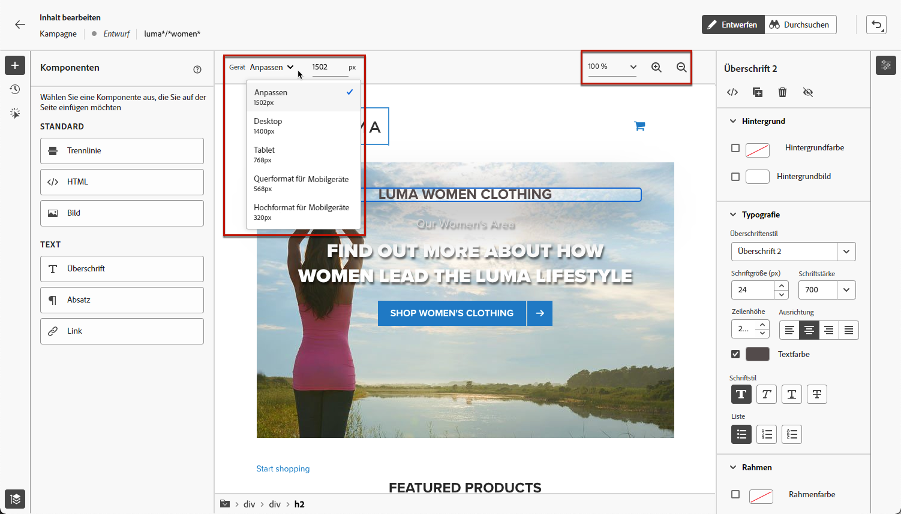

Die Möglichkeit, die Gerätegröße zu ändern, wurde für responsive Web-Sites entwickelt, die auf verschiedenen Geräten, Fenstern und Bildschirmgrößen gut dargestellt werden. Responsive Web-Sites passen sich automatisch an jede Bildschirmgröße an, einschließlich Desktops, Laptops, Tablets oder Mobiltelefone.

>[!CAUTION]
>
>Sie können ein Web-Erlebnis mit einer bestimmten Gerätegröße bearbeiten. Solange die Selektoren identisch sind, gelten diese Änderungen für alle Größen und Geräte, nicht nur für die Gerätegröße, in der Sie arbeiten. Gleichermaßen werden bei der Bearbeitung eines Erlebnisses in der normalen Desktop-Ansicht die Änderungen auf alle Bildschirmgrößen angewendet, nicht nur auf die Desktop-Ansicht.
>
>Zurzeit unterstützt [!DNL Journey Optimizer] keine Seitenänderungen für bestimmte Gerätegrößen. Wenn Sie also beispielsweise über eine separate mobile Web-Site mit einer separaten Site-Struktur verfügen, müssen Sie die für Ihre mobile Site spezifischen Änderungen in einer anderen Kampagne vornehmen.

## Anleitungsvideo{#video}

Das folgende Video zeigt, wie Sie ein Web-Erlebnis mit dem Web-Designer in [!DNL Journey Optimizer]-Kampagnen erstellen.

>[!VIDEO](https://video.tv.adobe.com/v/3418803/?quality=12&learn=on)