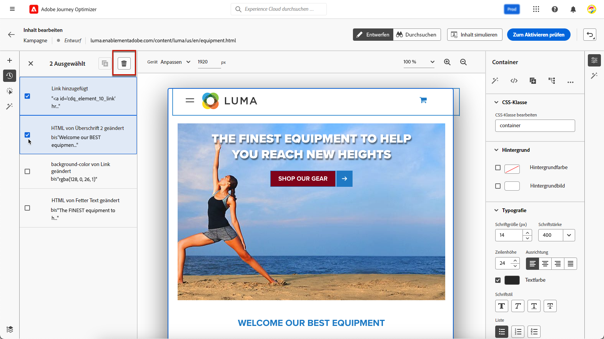
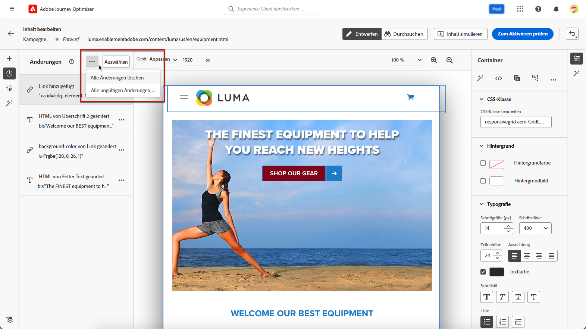
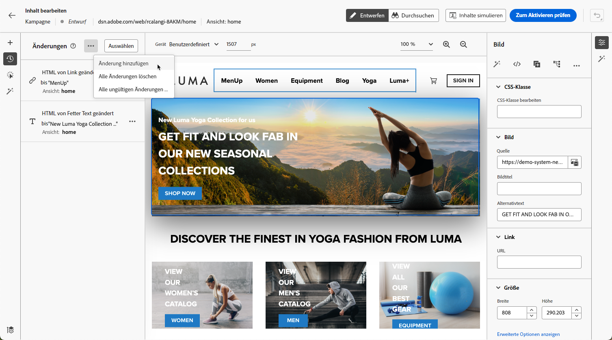
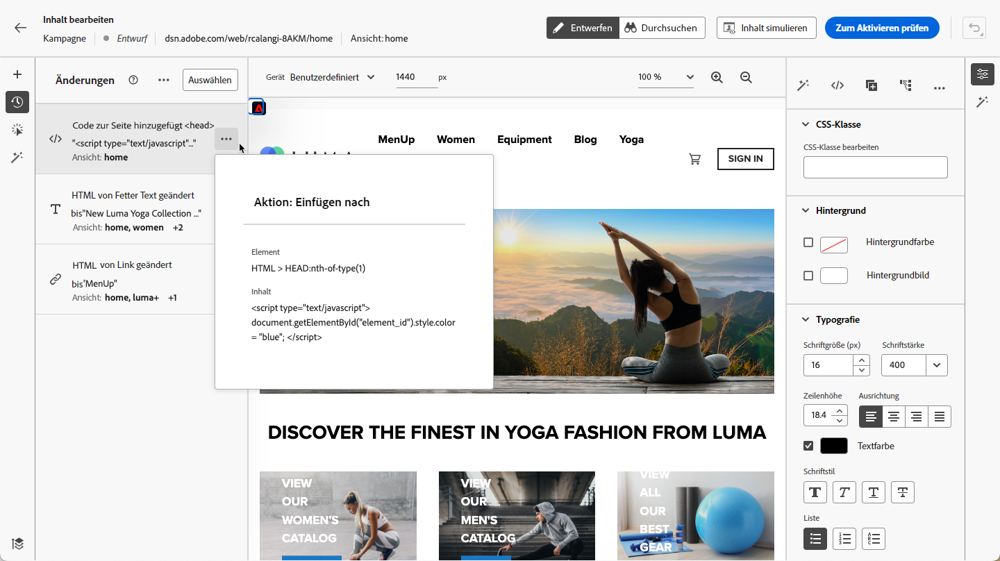
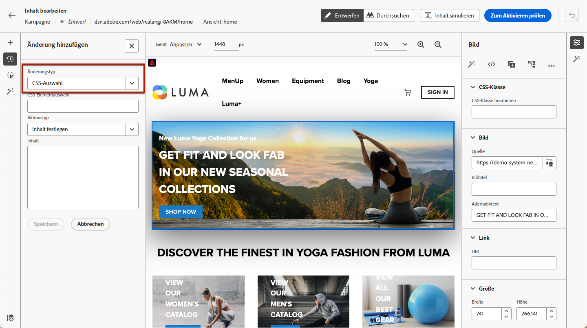
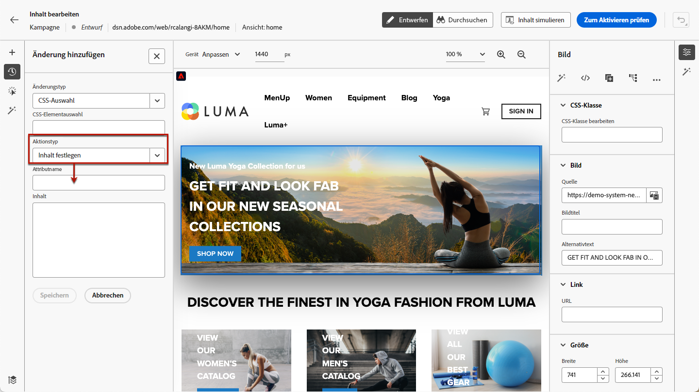
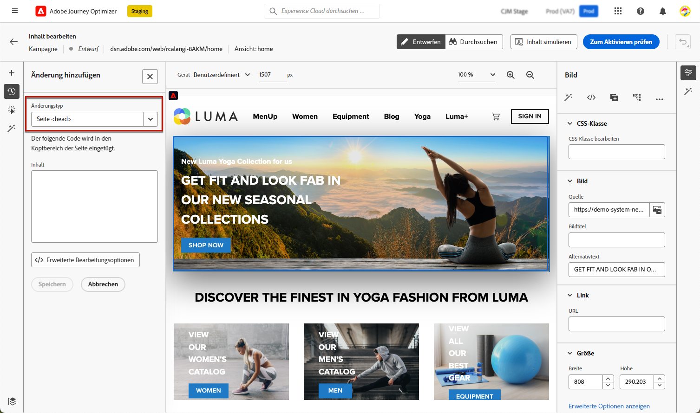
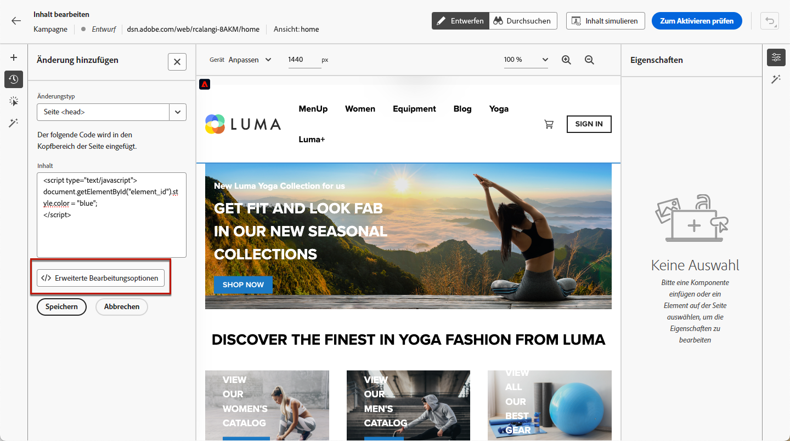

# Verwalten von Web-Änderungen {#manage-web-modifications}

>[!CONTEXTUALHELP]
>id="ajo_web_designer_modifications"
>title="Einfaches Verwalten aller Änderungen"
>abstract="Mithilfe dieses Bereichs können Sie alle Anpassungen und Stile, die Sie Ihrer Web-Seite hinzugefügt haben, durchsuchen und verwalten."

Sie können mühelos alle Komponenten, Anpassungen und Stile verwalten, die Sie Ihrer Web-Seite hinzugefügt haben. Sie können Änderungen auch direkt über den dedizierten Bereich hinzufügen.

## Arbeiten mit dem Bereich „Änderungen“ {#use-modifications-pane}

1. Wählen Sie das Symbol **[!UICONTROL Änderungen]** aus, um den entsprechenden Bereich auf der linken Seite anzuzeigen.

   

1. Sie können alle Änderungen überprüfen, die Sie an der Seite vorgenommen haben.

1. Wählen Sie eine unerwünschte Änderung aus, klicken Sie auf die Schaltfläche **[!UICONTROL Mehr Aktionen]** und wählen Sie die Option **[!UICONTROL Änderung löschen]**, um sie zu entfernen.

   

   >[!CAUTION]
   >
   >Gehen Sie beim Löschen einer Aktion vorsichtig vor, da sich dies auf nachfolgende Aktionen auswirken kann.

1. Um mehrere Änderungen gleichzeitig zu löschen, klicken Sie auf die Schaltfläche **[!UICONTROL Auswählen]** am oberen Rand des Bereichs **[!UICONTROL Änderungen]**, überprüfen Sie dann die gewünschten Änderungen und klicken Sie anschließend auf das Symbol **[!UICONTROL Löschen]**.

   

1. Verwenden Sie die Schaltfläche **[!UICONTROL Mehr Aktionen]** oben im Bereich **[!UICONTROL Änderungen]**, um alle Änderungen gleichzeitig zu löschen.

   

1. Sie können auch nur die ungültigen Änderungen löschen, d. h. die Änderungen, die durch andere Änderungen überschrieben wurden. Wenn Sie beispielsweise die Farbe eines Textes ändern und diesen Text dann löschen, wird die Farbänderung ungültig, da der Text nicht mehr vorhanden ist.

1. Sie können Aktionen auch mithilfe der Schaltfläche **[!UICONTROL Rückgängig/Wiederholen]** rechts oben auf dem Bildschirm abbrechen und wiederholen.

   

   Klicken Sie auf die Schaltfläche und halten Sie sie gedrückt, um zwischen den Optionen **[!UICONTROL Rückgängig]** und **[!UICONTROL Wiederholen]** zu wechseln. Klicken Sie dann auf die Schaltfläche selbst, um die gewünschte Aktion anzuwenden.

## Hinzufügen von Änderungen über den dedizierten Bereich {#add-modifications}

Bei der Bearbeitung einer Seite mit dem Web-Designer können Sie neue Änderungen direkt aus dem Bereich **[!UICONTROL Änderungen]** in den Inhalt übernehmen, ohne dass eine Komponente ausgewählt und über die Web-Designer-Oberfläche bearbeitet werden muss. Führen Sie dazu folgende Schritte durch.

1. Klicken Sie im Bereich **[!UICONTROL Änderungen]** auf die Schaltfläche **[!UICONTROL Mehr Aktionen]**.

1. Wählen Sie **[!UICONTROL Eine Änderung hinzufügen]** aus.

   

1. Wählen Sie den Änderungstyp aus:

   * **[!UICONTROL CSS-Auswahl]** – [Weitere Informationen](#css-selector)
   * **[!UICONTROL Seite`<Head>`]** – [Weitere Informationen](#page-head)

1. Geben Sie den Inhalt ein und **[!UICONTROL Speichern]** Sie die Änderungen.

1. Klicken Sie auf die Schaltfläche **[!UICONTROL Mehr Aktionen]** neben der Änderung und wählen Sie **[!UICONTROL Info]** aus, um die Details anzuzeigen.

   

### CSS-Auswahl {#css-selector}

Um eine Typänderung der **CSS-Auswahl** hinzuzufügen, gehen Sie wie folgt vor.

1. Wählen Sie **[!UICONTROL CSS-Auswahl]** als Änderungstyp aus.

1. Das Feld **[!UICONTROL CSS-Element-Auswahl]** hilft dabei, die HTML-Elemente (oder Knoten in der DOM-Struktur) zu finden und auszuwählen, auf die Änderungen angewendet werden sollen. <!--specify the desired CSS element that you want to modify.-->

   

1. Wählen Sie einen Aktionstyp aus (**[!UICONTROL Inhalt festlegen]** oder **[!UICONTROL Attribut festlegen]**) und geben Sie die erforderlichen Informationen/Inhalte ein.

   * **[!UICONTROL Inhalt festlegen]**: Geben Sie den Inhalt an, der in das von dem Feld **[!UICONTROL CSS-Element-Auswahl]** ermittelte Element eingefügt werden soll.

   * **[!UICONTROL Attribut festlegen]**: Geben Sie ein Attribut an, das mit der aktuellen CSS-Auswahl verknüpft werden soll, damit diese Auswahl dann auch über dieses Attribut identifiziert werden kann. Geben Sie dazu einen Namen in das Feld **[!UICONTROL Attributname]** und einen Wert in das Feld **[!UICONTROL Inhalt]** ein. Wenn das Attribut bereits vorhanden ist, wird der Wert aktualisiert. Andernfalls wird ein neues Attribut mit dem angegebenen Namen und Wert hinzugefügt.

     

### Seite `<head>` {#page-head}

>[!CONTEXTUALHELP]
>id="ajo_web_designer_head"
>title="Hinzufügen von benutzerdefiniertem Code"
>abstract="Das HEAD-Element ist ein Container für Metadaten und wird zwischen dem HTML-Tag und dem BODY-Tag platziert. Nur SCRIPT- und STYLE-Elemente hinzufügen. Das Hinzufügen von DIV-Tags und anderen Elementen kann dazu führen, dass die verbleibenden HEAD-Elemente in den BODY springen."

Sie können benutzerdefinierten Code mithilfe des Änderungstyps **[!UICONTROL Seite`<head>`]** hinzufügen.

Das `<head>`-Element ist ein Container für Metadaten (Daten über Daten) und wird zwischen dem `<html>`-Tag und dem `<body>`-Tag platziert. In diesem Fall wartet der Code nicht darauf, dass der Hauptteil oder die Seite geladen wird, sondern er wird zu Beginn des Seitenladevorgangs ausgeführt.

Das `<head>`-Element wird häufig verwendet, um oben auf der Seite JavaScript- oder CSS-Code hinzuzufügen. Die Auswahlen für nachfolgende visuelle Aktionen hängen von den auf dieser Registerkarte hinzugefügten HTML-Elementen ab.

Um eine Typänderung der **Seite`<head>`** hinzuzufügen,gehen Sie wie folgt vor.

1. Wählen Sie **[!UICONTROL Seite`<head>`]** als Änderungstyp.

   

1. Fügen Sie Ihren benutzerspezifischen Code im Feld **[!UICONTROL Inhalt]** hinzu.

   >[!CAUTION]
   >
   >Sie können nur `<script>`- und `<style>`-Elemente zum Abschnitt `<head>` hinzufügen. Das Hinzufügen von `<div>`-Tags und anderen Elementen kann dazu führen, dass die verbleibenden `<head>`-Elemente in den Abschnitt `<body>` springen. 

1. Klicken Sie auf die Schaltfläche **[!UICONTROL Erweiterte Bearbeitungsoptionen]**. Der Ausdruckseditor wird geöffnet.

   

   Sie können den Ausdruckseditor von [!DNL Journey Optimizer] mit allen Personalisierungs- und Bearbeitungsfunktionen nutzen. [Weitere Informationen](../personalization/personalization-build-expressions.md)

#### Beispiele für benutzerdefinierten Code {#custom-code-examples}

Sie können den Änderungstyp **[!UICONTROL Seite`<head>`]** verwenden, um:

* Inline-JavaScript zu verwenden oder eine Verknüpfung zu einer externen JavaScript-Datei herzustellen.

  So ändern Sie beispielsweise die Farbe eines Elements:

  ```
  <script type="text/javascript">
  document.getElementById("element_id").style.color = "blue";
  </script>
  ```

* Konfigurieren Sie einen Inline-Stil oder erstellen Sie eine Verknüpfung zu einem externen Stylesheet.

  So definieren Sie beispielsweise eine Klasse für ein Überlagerungselement:

  ```
  <style>
  .overlay
  { position: absolute; top:0; left: 0; right: 0; bottom: 0; background: red; }
  </style>
  ```

#### Best Practices für benutzerspezifischen Code {#custom-code-best-practices}

+++ **Schließen Sie den benutzerspezifischen Code immer in ein Element ein.**

Beispiel:

```
<script>
// Code goes here
</script>
```

Falls Änderungen erforderlich sind, nehmen Sie sie in diesem Container vor.

Wenn Sie den benutzerdefinierten Code nicht mehr benötigen, lassen Sie diesen Container einfach leer, entfernen Sie ihn jedoch nicht. Dadurch wird sichergestellt, dass andere Erlebnisänderungen nicht beeinflusst werden.

+++

+++ **Führen Sie keine „document.write“-Aktionen in Skripten mit benutzerdefiniertem Code durch.**

Skripts werden asynchron ausgeführt. Dies verursacht oft, dass „document.write“-Aktionen an der falschen Stelle einer Seite erscheinen. Die Verwendung von „document.write“ in Skripten, die in benutzerspezifischem Code erstellt wurden, ist nicht zu empfehlen.

+++

+++ **Wenn Sie ein Element erstellen und es dann ändern, löschen Sie nicht das ursprüngliche Element.**

Jede Änderung erstellt ein neues Element im Bedienfeld **[!UICONTROL Änderungen]**. Da die zweite Aktion Element 1 bearbeitet, kann in der Aktion nichts mehr geändert werden, wenn Sie Element 1 löschen. Daher funktioniert die Änderung nicht mehr.

+++

+++ **Gehen Sie vorsichtig vor, wenn Sie den Änderungstyp**[!UICONTROL  Seite `<head>`]**für zwei Kampagnen verwenden, die Auswirkungen auf dieselbe URL haben.**

Wenn Sie den Änderungstyp **[!UICONTROL Seite`<head>`]** für zwei Kampagnen verwenden, die Auswirkungen auf dieselbe URL haben, wird das JavaScript von beiden Kampagnen in die Seite eingefügt. [!DNL Journey Optimizer] bestimmt automatisch die Reihenfolge der bereitgestellten Inhalte. Stellen Sie sicher, dass der Code nicht von der Platzierung abhängig ist. Es obliegt Ihnen, sicherzustellen, dass keine Konflikte im Code vorhanden sind.

+++
