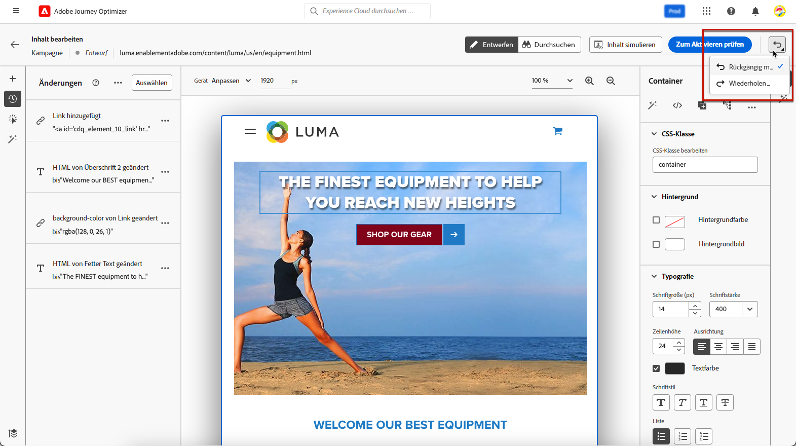

# Webänderungen verwalten {#manage-web-modifications}

>[!CONTEXTUALHELP]
>id="ajo_web_designer_modifications"
>title="Einfaches Verwalten aller Änderungen"
>abstract="Mithilfe dieses Bereichs können Sie alle Anpassungen und Stile, die Sie Ihrer Web-Seite hinzugefügt haben, durchsuchen und verwalten."

Sie können mühelos alle Komponenten, Anpassungen und Stile verwalten, die Sie Ihrer Web-Seite hinzugefügt haben. Sie können Änderungen auch direkt über den dedizierten Bereich hinzufügen.

## Arbeiten mit dem Bereich Änderungen {#use-modifications-pane}

1. Wählen Sie das Symbol **[!UICONTROL Änderungen]** aus, um den entsprechenden Bereich auf der linken Seite anzuzeigen.

   

1. Sie können alle Änderungen überprüfen, die Sie an der Seite vorgenommen haben.

1. Wählen Sie eine unerwünschte Änderung aus und klicken Sie auf das Löschsymbol, um sie zu entfernen.

   

   >[!CAUTION]
   >
   >Gehen Sie beim Löschen einer Aktion vorsichtig vor, da sich dies auf nachfolgende Aktionen auswirken kann.

1. Verwenden Sie die Schaltfläche **[!UICONTROL Mehr Aktionen]** oben im Bereich **[!UICONTROL Änderungen]**, um alle Änderungen gleichzeitig zu löschen.

   

1. Über das Menü **[!UICONTROL Mehr Aktionen]** können Sie auch nur die ungültigen Änderungen löschen, d. h. die Änderungen, die durch andere Änderungen überschrieben wurden. Wenn Sie beispielsweise die Farbe eines Textes ändern und diesen Text dann löschen, wird die Farbänderung ungültig, da der Text nicht mehr vorhanden ist.

1. Sie können Aktionen auch mithilfe der Schaltfläche **[!UICONTROL Rückgängig/Wiederholen]** rechts oben auf dem Bildschirm abbrechen und wiederholen.

   

   Klicken Sie auf die Schaltfläche und halten Sie sie gedrückt, um zwischen den Optionen **[!UICONTROL Rückgängig]** und **[!UICONTROL Wiederholen]** zu wechseln. Klicken Sie dann auf die Schaltfläche selbst, um die gewünschte Aktion anzuwenden.
