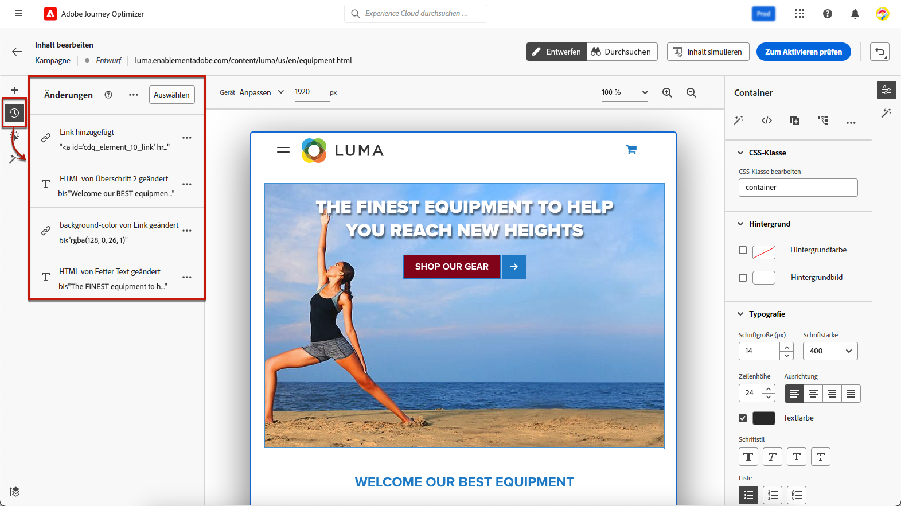
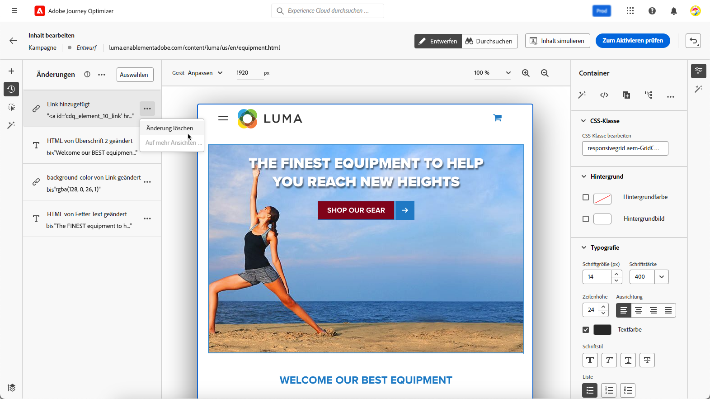

# Webänderungen verwalten {#manage-web-modifications}

>[!CONTEXTUALHELP]
>id="ajo_web_designer_modifications"
>title="Einfaches Verwalten aller Änderungen"
>abstract="Mithilfe dieses Bereichs können Sie alle Anpassungen und Stile, die Sie Ihrer Web-Seite hinzugefügt haben, durchsuchen und verwalten."

Sie können mühelos alle Komponenten, Anpassungen und Stile verwalten, die Sie Ihrer Web-Seite hinzugefügt haben. Sie können Änderungen auch direkt über den dedizierten Bereich hinzufügen.

## Arbeiten mit dem Bereich Änderungen {#use-modifications-pane}

1. Wählen Sie das Symbol **[!UICONTROL Änderungen]** aus, um den entsprechenden Bereich auf der linken Seite anzuzeigen.

   

1. Sie können alle Änderungen überprüfen, die Sie an der Seite vorgenommen haben.

1. Wählen Sie eine unerwünschte Änderung aus und klicken Sie auf **[!UICONTROL Änderung löschen]** Option aus der **[!UICONTROL Mehr Aktionen]** -Schaltfläche, um sie zu entfernen.

   

   >[!CAUTION]
   >
   >Gehen Sie beim Löschen einer Aktion vorsichtig vor, da sich dies auf nachfolgende Aktionen auswirken kann.

1. Um mehrere Änderungen gleichzeitig zu löschen, klicken Sie auf die **[!UICONTROL Auswählen]** -Schaltfläche am oberen Rand des **[!UICONTROL Änderungen]** , überprüfen Sie die Änderungen Ihrer Wahl und klicken Sie auf die Schaltfläche **[!UICONTROL Löschen]** Symbol.

   

1. Verwenden Sie die Schaltfläche **[!UICONTROL Mehr Aktionen]** oben im Bereich **[!UICONTROL Änderungen]**, um alle Änderungen gleichzeitig zu löschen.

   

1. Sie können auch nur die ungültigen Änderungen löschen, d. h. die Änderungen, die durch andere Änderungen überschrieben wurden. Wenn Sie beispielsweise die Farbe eines Textes ändern und diesen Text dann löschen, wird die Farbänderung ungültig, da der Text nicht mehr vorhanden ist.

1. Sie können Aktionen mit dem **[!UICONTROL Rückgängig/Wiederherstellen]** rechts oben auf dem Bildschirm.

   

   Klicken Sie auf die Schaltfläche und halten Sie sie gedrückt, um zwischen den Optionen **[!UICONTROL Rückgängig]** und **[!UICONTROL Wiederholen]** zu wechseln. Klicken Sie dann auf die Schaltfläche selbst, um die gewünschte Aktion anzuwenden.

## Hinzufügen von Änderungen aus dem dedizierten Bereich {#add-modifications}

Bei der Bearbeitung einer Seite mit dem Webdesigner können Sie neue Änderungen direkt aus dem **[!UICONTROL Änderungen]** -Bereich - ohne dass eine Komponente ausgewählt und über die Web-Designer-Oberfläche bearbeitet werden muss. Führen Sie dazu folgende Schritte durch.

1. Aus dem **[!UICONTROL Änderungen]** auf das **[!UICONTROL Mehr Aktionen]** Schaltfläche.

1. Auswählen **[!UICONTROL Hinzufügen einer Änderung]**.

   

1. Wählen Sie den Änderungstyp aus:

   * **[!UICONTROL CSS-Selektor]** - [Weitere Infos](#css-selector)
   * **[!UICONTROL Seite`<Head>`]** - [Weitere Infos](#page-head)

1. Geben Sie Ihren Inhalt ein und **[!UICONTROL Speichern]** Ihre Änderungen.

1. Klicken Sie auf **[!UICONTROL Mehr Aktionen]** Schaltfläche neben Ihrer Änderung und wählen Sie **[!UICONTROL Info]** , um die Details anzuzeigen.

   

### CSS-Auswahl {#css-selector}

So fügen Sie eine **CSS-Selektor** Typänderungen, führen Sie die folgenden Schritte aus.

1. Auswählen **[!UICONTROL CSS-Selektor]** als Änderungstyp.

1. Die **[!UICONTROL CSS-Element-Selektor]** -Feld hilft Ihnen dabei, die HTML-Elemente (oder Knoten im DOM-Baum) zu finden und auszuwählen, auf die Sie Änderungen anwenden möchten. <!--specify the desired CSS element that you want to modify.-->

   

1. Wählen Sie einen Aktionstyp aus (**[!UICONTROL Inhalt festlegen]** oder **[!UICONTROL Attribut festlegen]**) und geben Sie die erforderlichen Informationen/Inhalte ein.

   * **[!UICONTROL Inhalt festlegen]**: Geben Sie den Inhalt an, der in das von der **[!UICONTROL CSS-Element-Selektor]** -Feld.

   * **[!UICONTROL Attribut festlegen]**: Geben Sie ein Attribut an, das mit dem aktuellen CSS-Selektor verknüpft werden soll, damit dieser Selektor dann auch über dieses Attribut identifiziert werden kann. Geben Sie dazu einen Namen in das **[!UICONTROL Attributname]** und einen Wert im **[!UICONTROL Inhalt]** -Feld. Wenn das Attribut bereits vorhanden ist, wird der Wert aktualisiert. Andernfalls wird ein neues Attribut mit dem angegebenen Namen und Wert hinzugefügt.

     

### Seite `<head>` {#page-head}

>[!CONTEXTUALHELP]
>id="ajo_web_designer_head"
>title="Hinzufügen von benutzerdefiniertem Code"
>abstract="Das HEAD-Element ist ein Container für Metadaten und wird zwischen dem HTML-Tag und dem BODY-Tag platziert. Fügen Sie nur SCRIPT- und STYLE-Elemente hinzu. Das Hinzufügen von DIV-Tags und anderen Elementen kann dazu führen, dass verbleibende HEAD-Elemente in den BODY springen."

Sie können benutzerdefinierten Code mithilfe der **[!UICONTROL Seite`<head>`]** Änderungstyp.

Die `<head>` -Element ist ein Container für Metadaten (Daten zu Daten) und wird zwischen der `<html>` und `<body>` -Tag. In diesem Fall wartet der Code nicht auf das Laden des Hauptteils oder der Seite - er wird zu Beginn des Seitenladevorgangs ausgeführt.

Die `<head>` -Element wird häufig verwendet, um oben auf der Seite JavaScript- oder CSS-Code hinzuzufügen. Selektoren für nachfolgende visuelle Aktionen hängen von den auf dieser Registerkarte hinzugefügten HTML-Elementen ab.

So fügen Sie eine **Seite`<head>`** Typänderungen, führen Sie die folgenden Schritte aus.

1. Auswählen **[!UICONTROL Seite`<head>`]** als Änderungstyp.

   

1. Fügen Sie Ihren benutzerspezifischen Code in der **[!UICONTROL Inhalt]** ankreuzen.

   >[!CAUTION]
   >
   >Sie können `<script>` und `<style>` -Elemente `<head>` Abschnitt. Das Hinzufügen von `<div>`-Tags und anderen Elementen kann dazu führen, dass die verbleibenden `<head>`-Elemente in den Abschnitt `<body>` springen. 

1. Klicken Sie auf **[!UICONTROL Erweiterte Bearbeitungsoptionen]** Schaltfläche. Der Ausdruckseditor wird geöffnet.

   

   Sie können die [!DNL Journey Optimizer] Ausdruckseditor mit allen Personalisierungs- und Bearbeitungsfunktionen. [Weitere Informationen](../personalization/personalization-build-expressions.md)

#### Beispiele für benutzerdefinierten Code {#custom-code-examples}

Sie können die **[!UICONTROL Seite`<head>`]** Änderungstyp zu:

* Verwenden Sie Inline-JavaScript oder verknüpfen Sie mit einer externen JavaScript-Datei.

  So ändern Sie beispielsweise die Farbe eines Elements:

  ```
  <script type="text/javascript">
  document.getElementById("element_id").style.color = "blue";
  </script>
  ```

* Konfigurieren Sie einen Inline-Stil oder einen Link zu einem externen Stylesheet.

  So definieren Sie beispielsweise eine Klasse für ein Überlagerungselement:

  ```
  <style>
  .overlay
  { position: absolute; top:0; left: 0; right: 0; bottom: 0; background: red; }
  </style>
  ```

#### Best Practices für benutzerspezifischen Code {#custom-code-best-practices}

+++ **Schließen Sie den benutzerspezifischen Code immer in ein Element ein.**

Beispiel:

```
<script>
// Code goes here
</script>
```

Falls Änderungen erforderlich sind, nehmen Sie in diesem Container Änderungen vor.

Wenn Sie den benutzerdefinierten Code nicht mehr benötigen, lassen Sie diesen Container einfach leer, entfernen Sie ihn jedoch nicht. Dadurch wird sichergestellt, dass andere Erlebnisänderungen nicht betroffen sind.

+++

+++ **Führen Sie keine document.write-Aktionen in Skripten mit benutzerdefiniertem Code durch.**

Skripts werden asynchron ausgeführt. Dies führt häufig dazu, dass document.write -Aktionen an der falschen Stelle auf Ihrer Seite angezeigt werden. Die Verwendung von document.write in Skripten, die in benutzerdefiniertem Code erstellt wurden, wird nicht empfohlen.

+++

+++ **Wenn Sie ein Element erstellen und es dann ändern, löschen Sie nicht das ursprüngliche Element.**

Jede Änderung erstellt ein neues Element im **[!UICONTROL Änderungen]** Bedienfeld. Da die zweite Aktion Element 1 ändert, kann bei der Löschung von Element 1 nichts mehr geändert werden, sodass die Änderung nicht mehr funktioniert.

+++

+++ **Gehen Sie bei der Verwendung von**[!UICONTROL  Seite `<head>`]**Änderungstyp für zwei Kampagnen mit Auswirkungen auf dieselbe URL.**

Wenn Sie die **[!UICONTROL Seite`<head>`]** -Änderungstyp für zwei Kampagnen, die dieselbe URL beeinflussen, wird das JavaScript von beiden Kampagnen in die Seite eingefügt. [!DNL Journey Optimizer] bestimmt automatisch die Reihenfolge der bereitgestellten Inhalte. Stellen Sie sicher, dass der Code nicht von der Platzierung abhängig ist. Es liegt an Ihnen sicherzustellen, dass es keine Konflikte im Code gibt.

+++
