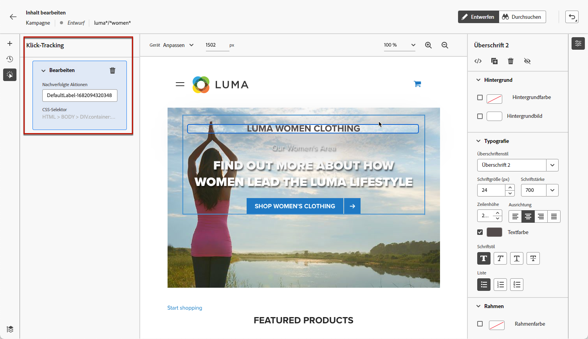
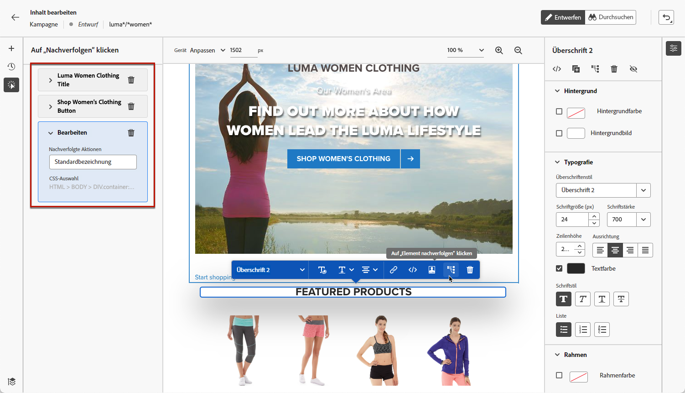

# Überwachen Ihrer Web-Kampagnen {#monitor-web-campaigns}

## Überprüfen der Web-Berichte {#check-web-reports}

Sobald Ihre Kampagne live ist, können Sie die Registerkarte **[!UICONTROL Web]** der Kampagnenberichte überprüfen, um Elemente wie die Anzahl der Impressionen, die Klickrate und die Anzahl der Interaktionen mit Ihrer Web-Seite zu vergleichen. Erfahren Sie mehr über den Web-[Live-Bericht](../reports/campaign-live-report.md#web-tab) und den [globalen Bericht](../reports/campaign-global-report.md#web-tab) der Kampagne.

Um die Überwachung von Web-Erlebnissen weiter zu verbessern, können Sie auch die Klicks auf ein bestimmtes Element Ihrer Website verfolgen. Auf diese Weise können Sie die Anzahl der Klicks auf dieses Element in den Web-Berichten anzeigen. [Weitere Informationen](#use-click-tracing)

## Verwenden von Klick-Tracking {#use-click-tracing}

Mit dem Web-Designer können Sie ein beliebiges Element Ihrer Website auswählen und die Klicks auf dieses Element verfolgen.

Diese Informationen können zur Verbesserung des Benutzererlebnisses auf Ihrer Web-Site nützlich sein. Wenn beispielsweise die [Web-Berichte](../reports/campaign-global-report.md#web-tab) zeigen, dass häufig auf ein Element geklickt wurde, auf das eigentlich nicht geklickt werden kann, können Sie diesem Element einen Link hinzufügen.

1. Wählen Sie ein Element auf Ihrer Seite und dann **[!UICONTROL Klick-Tracking für Element]** aus dem Kontextmenü aus.

   

   >[!NOTE]
   >
   >Jedes Element kann ausgewählt werden, unabhängig davon, ob es klickbar ist.

1. Die entsprechende verfolgte Aktion wird automatisch im Bereich **[!UICONTROL Klick-Tracking]** auf der linken Seite angezeigt.

   

1. Fügen Sie eine aussagekräftige Bezeichnung hinzu, um alle verfolgten Elemente zu verwalten und sie in den Berichten leicht auffindbar zu machen. Das Feld **[!UICONTROL CSS-Auswahl]** zeigt Informationen zum Auffinden des ausgewählten Elements an.

1. Wiederholen Sie die obigen Schritte, um nach Bedarf weitere Elemente für das Klick-Tracking auszuwählen. Die entsprechenden Aktionen werden alle im linken Bereich aufgelistet.

   

1. Um das Klick-Tracking für ein Element zu entfernen, wählen Sie das entsprechende Löschsymbol aus.

Sobald Ihre Kampagne aktiv ist, können Sie die Anzahl der Klicks für jedes Element im Web-[Live-Bericht](../reports/campaign-live-report.md#web-tab) und im [globalen Bericht](../reports/campaign-global-report.md#web-tab) der Kampagne überprüfen.
