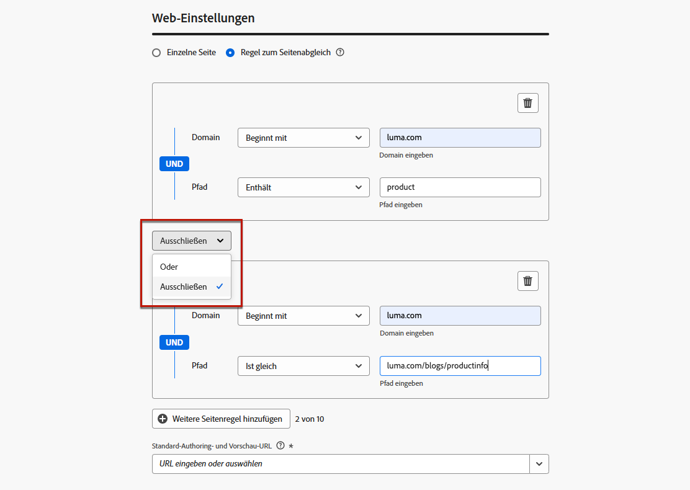

# Konfigurieren Ihrer Web-Erlebnisse {#web-configuration}

## Erstellen einer Web-Kanalkonfiguration {#create-web-configuration}

Eine Web-Konfiguration ist eine Web-Eigenschaft, die durch eine URL identifiziert wird, über die die Inhalte bereitgestellt werden. Sie kann einer einzelnen Seiten-URL oder mehreren Seiten entsprechen, sodass Sie Änderungen auf einer oder mehreren Web-Seiten vornehmen können.

Gehen Sie wie folgt vor, um eine Web-Kanalkonfiguration zu erstellen.

1. Rufen Sie das Menü **[!UICONTROL Kanäle]** > **[!UICONTROL Allgemeine Einstellungen]** > **[!UICONTROL Kanalkonfigurationen]** auf, und klicken Sie dann auf **[!UICONTROL Kanalkonfiguration erstellen]**.

   

1. Geben Sie einen Namen und eine Beschreibung (optional) für die Konfiguration an.

   >[!NOTE]
   >
   > Namen müssen mit einem Buchstaben (A–Z) beginnen. Ein Name darf nur alphanumerische Zeichen enthalten. Sie können auch die Zeichen Unterstrich `_`, Punkt `.` und Bindestrich `-` verwenden.

1. Um der Konfiguration benutzerdefinierte oder grundlegende Datennutzungskennzeichnungen zuzuweisen, können Sie **[!UICONTROL Zugriff verwalten]** auswählen. [Weitere Informationen zur Zugriffssteuerung auf Objektebene (OLAC)](../administration/object-based-access.md)

1. Wählen Sie den **Web-Kanal** aus.

   

1. Wählen Sie eine **[!UICONTROL Marketing-Aktion]** aus, um Einverständnisrichtlinien mit den Nachrichten zu verknüpfen, die diese Konfiguration verwenden. Es werden alle mit dieser Marketing-Aktion verknüpften Einverständnisrichtlinien genutzt, um die Voreinstellungen Ihrer Kundinnen und Kunden zu respektieren. [Weitere Informationen](../action/consent.md#surface-marketing-actions)

1. Wählen Sie im Abschnitt **[!UICONTROL Web-Einstellungen]** eine der folgenden Optionen aus:

   * **[!UICONTROL Einzelne Seite]**: Wenn Sie die Änderungen ausschließlich auf eine einzelne Seite anwenden möchten, geben Sie eine **[!UICONTROL Seiten-URL]** ein.

   * **[!UICONTROL Regel zum Seitenabgleich]**: Um mehrere URLs als Ziel auszuwählen, die derselben Regel entsprechen, erstellen Sie eine Regel zum Seitenabgleich und geben Sie eine **[!UICONTROL Standard-Authoring- und Vorschau-URL]** ein. [Weitere Informationen](#web-page-matching-rule)

1. Klicken Sie auf **[!UICONTROL Senden]**, um die Änderungen zu speichern.

Sie können diese Konfiguration jetzt beim Verwenden des Web-Kanals in Ihren Kampagnen oder Journeys auswählen.

## Erstellen einer Regel zum Seitenabgleich {#web-page-matching-rule}

>[!CONTEXTUALHELP]
>id="ajo_admin_page_rule"
>title="Erstellen einer Regel zum Seitenabgleich"
>abstract="Erstellen Sie eine Regel zum Seitenabgleich, um eine Gruppe von URLs, die dieselben Kriterien aufweisen, effizient zu verwalten und als Ziel festzulegen. Mit dieser Regel können Sie mehrere URLs unter einer Richtlinie zusammenfassen, wodurch die Anwendung konsistenter Einstellungen und Aktionen auf diesen Seiten vereinfacht wird."

>[!CONTEXTUALHELP]
>id="ajo_admin_default_url"
>title="Definieren einer URL für die Inhaltserstellung und -vorschau"
>abstract="Dieses Feld stellt sicher, dass die von der Regel generierten oder abgeglichenen Seiten über eine bestimmte URL verfügen, die sowohl für die effektive Erstellung als auch die Vorschau von Inhalten erforderlich ist."

Beim Erstellen einer Konfiguration für ein Web- oder [Code-basiertes Erlebnis](../code-based/get-started-code-based.md) können Sie eine **[!UICONTROL Regel zum Seitenabgleich]** erstellen, um mehrere URLs als Ziel festzulegen, die derselben Regel entsprechen. Sie können daher dieselben Inhaltsänderungen auf mehrere Seiten gleichzeitig anwenden.

Sie können beispielsweise die Änderungen an einem Hero-Banner auf einer gesamten Website anwenden oder oben ein Bild hinzufügen, das auf allen Produktseiten einer Website angezeigt wird

1. Wählen Sie beim Konfigurieren Ihres [Web](#web-configuration)- oder [Code-basierten Erlebnisses](../code-based/code-based-configuration.md) die Option **[!UICONTROL Regel zum Seitenabgleich]** aus.

1. Definieren Sie Ihre Kriterien für die Felder **[!UICONTROL Domain]** und **[!UICONTROL Seite]**.

   >[!NOTE]
   >
   >Welche Operatoren verfügbar sind, erfahren Sie in [diesem Abschnitt](#available-operators).

   Wenn Sie beispielsweise Elemente bearbeiten möchten, die auf allen Seiten der Luma-Website mit Produkten für Damen angezeigt werden, wählen Sie **[!UICONTROL Domain]** > **[!UICONTROL Beginnt mit]** > `luma` und **[!UICONTROL Seite]** > **[!UICONTROL Enthält]** > `women`.

   

1. Wenn Ihr Anwendungsfall nicht mit einer Regel modelliert werden kann, können Sie mehrere Regeln hinzufügen. Klicken Sie auf **[!UICONTROL Weitere Seitenregel hinzufügen]** und wiederholen Sie den obigen Schritt.

   >[!NOTE]
   >
   >Sie können bis zu 10 Regeln hinzufügen.

1. Sie können die Operatoren **[!UICONTROL Oder]** oder **[!UICONTROL Ausschließen]** zwischen den verschiedenen Regeln verwenden.

   **[!UICONTROL Ausschließen]** ist nützlich, wenn eine der Seiten, die mit der definierten Regel übereinstimmen, nicht als Ziel ausgewählt werden soll. Sie können beispielsweise alle `luma.com`-Seiten mit `product` als Ziel auswählen, mit Ausnahme der folgenden Seite: `https://luma.com/blogs/productinfo`.

   

1. Geben Sie die **[!UICONTROL Standard-Authoring- und Vorschau-URL]** ein. Dieser Schritt stellt sicher, dass die von der Regel generierten oder abgeglichenen Seiten über eine bestimmte URL für die Erstellung und Vorschau von Inhalten verfügen. 

### Verfügbare Operatoren zum Erstellen von Regeln zum Seitenabgleich {#available-operators}

Beim Erstellen einer [Regel, die mehrere Seiten abgleicht](#web-page-matching-rule), können Sie verschiedene Operatoren in den Abschnitten **[!UICONTROL Domain]** und **[!UICONTROL Pfad]** verwenden, um die gewünschte Regel zu erstellen. Die verfügbaren Operatoren sind unten aufgeführt.

* **Domain**

  | Operator  | Beschreibung  | Beispiele  |
  |---|---|---|
  | Gleich  | Exakte Übereinstimmung mit der Domain.  |
  | Beginnt mit  | Gleicht alle Domains (einschließlich Subdomains) ab, die mit der eingegebenen Zeichenfolge beginnen.  | Beispiel: „Beginnt mit: dev“-> gleicht alle Domains und Subdomains ab, die mit „dev“ beginnen, wie: dev.example.com, dev.products.example.com, developer.example.com  |
  | Endet mit  | Gleicht alle Domains ab (einschließlich Subdomains), die mit der eingegebenen Zeichenfolge enden.   | Beispiel: „Endet mit: example.com“-> gleicht alle Domains und Subdomains ab, die mit „example.com“ enden, wie: stage.example.com, prod.example.com, myexample.com  |
  | Platzhalterabgleich  | Mit dem Operator „Platzhalterabgleich“ können Benutzende einen Platzhalterabgleich in der Mitte der Zeichenfolge definieren, z. B. „dev.*.example.com“. Die Validierungsregeln bestehen darin, dass der Wert einen und nur einen Platzhalter (Sternchen) enthalten darf, wenn der Operator „Platzhalterabgleich“ ist.  | Beispiel: „Platzhalterabgleich: dev.*.example.com“ -> gleicht Domains wie: dev.products.example.com, dev.mytest.products.example.com und dev.blog.example.com ab.  |
  | Beliebige  | Gleicht alle Domains ab: nützlich beim Domain-übergreifenden Testen eines bestimmten Pfads  |

* **Pfad**

<table>
    <thead>
    <tr>
        <th><strong>Operator</th>
        <th><strong>Beschreibung</th>
        <th><strong>Beispiele</th>
    </tr>
    </thead>
    <tbody>
    <tr>
        <td>Gleich</td>
        <td>Exakte Übereinstimmung mit dem Pfad. </td>
        <td></td>
    </tr>
    <tr>
        <td>Beginnt mit</td>
        <td>Gleicht alle Pfade (einschließlich Nebenpfaden) ab, die mit der eingegebenen Zeichenfolge beginnen.</td>
        <td></td>
    </tr>
    <tr>
        <td>Endet mit</td>
        <td>Gleicht alle Pfade (einschließlich Nebenpfaden) ab, die mit der eingegebenen Zeichenfolge enden.</td>
        <td></td>
    </tr>
    <tr>
        <td>Beliebig</td>
        <td>Gleicht alle Pfade ab: nützlich beim Targeting aller Pfade unter einer oder mehreren Domains.</td>
        <td></td>
    </tr>
    <tr>
        <td>Platzhalterabgleich</td>
        <td>Mit dem Operator „Platzhalterabgleich“ können Benutzende einen internen Platzhalterabgleich im Pfad definieren, z. B. „/products/*/detail“.  Das Platzhalterzeichen * in der Komponente Pfad ** gleicht alle Zeichenfolgen ab, bis das erste /-Zeichen gefunden wird.  /*/ gleicht alle Zeichenfolgen ab (einschließlich Nebenpfaden) </td>
        <td>Beispiel: „Wildcard matching: /products/*/detail“, gleicht alle Pfade ab, wie: <ul><li>example.com/products/yoga/detail</li><li>example.com/products/surf/detail</li><li>example.com/products/tennis/detail</li><li>example.com/products/yoga/pants/detail</li></ul>Beispiel: „Matches: /prod*/detail, stimmt mit allen Pfaden überein, wie: <ul><li>example.com/products/detail</li><li>example.com/production/detail</li></ul>Gleicht keine Pfade ab wie: <ul><li>example.com/products/yoga/detail</li></ul></td>
    </tr>
    <tr>
        <td>Enthält</td>
        <td>„Enthält“ wird in einen Platzhalter wie „mystring“ übersetzt und gleicht alle Pfade ab, die diese Zeichenfolge enthalten.</td>
        <td>Beispiel: „Contains: product“ gleicht alle Pfade ab, die das Zeichenfolgenprodukt enthalten, z. B.: <ul><li>example.com/products</li><li>example.com/yoga/perfproduct</li><li>example.com/surf/productdescription</li><li>example.com/home/product/page</li></ul></td>
    </tr>
    </tbody>
</table>
