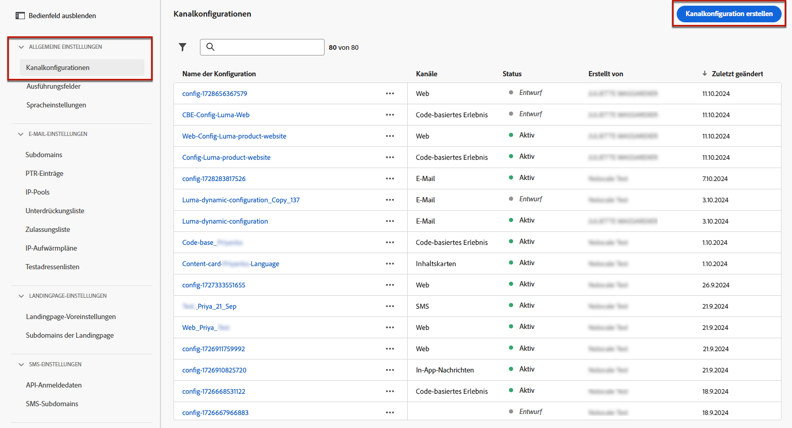
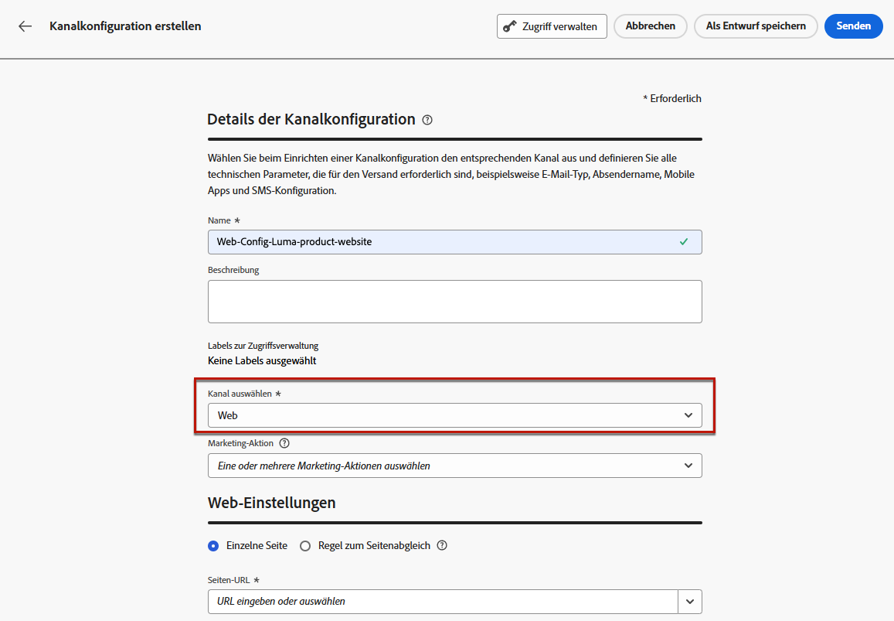

# Webkanalkonfiguration erstellen {#web-configuration}

>[!CONTEXTUALHELP]
>id="ajo_admin_page_rule"
>title="Regel zum Seitenabgleich"
>abstract="Um eine Gruppe von URLs, die dieselben Kriterien aufweisen, effizient zu verwalten und als Ziel festzulegen, erstellen Sie eine Seitenabgleichregel. Mit dieser Regel können Sie mehrere URLs unter einer Richtlinie zusammenfassen, wodurch die Anwendung konsistenter Einstellungen und Aktionen auf diesen Seiten vereinfacht wird."

>[!CONTEXTUALHELP]
>id="ajo_admin_default_url"
>title="Standard-Authoring- und Vorschau-URL"
>abstract="Dieses Feld stellt sicher, dass die von der Regel generierten oder übereinstimmenden Seiten über eine bestimmte URL verfügen, die sowohl für die effektive Erstellung als auch Vorschau von Inhalten erforderlich ist."

Eine Webkonfiguration ist eine Webeigenschaft, die durch eine URL identifiziert wird, über die der Inhalt bereitgestellt wird. Sie kann einer einzelnen Seiten-URL oder mehreren Seiten entsprechen, sodass Sie Änderungen auf einer oder mehreren Web-Seiten vornehmen können.

1. Rufen Sie das Menü **[!UICONTROL Kanäle]** > **[!UICONTROL Allgemeine Einstellungen]** > **[!UICONTROL Kanalkonfigurationen]** auf und klicken Sie dann auf **[!UICONTROL Kanalkonfiguration erstellen]**.

   

1. Geben Sie einen Namen und eine Beschreibung (optional) für die Konfiguration ein.

   >[!NOTE]
   >
   > Namen müssen mit einem Buchstaben (A–Z) beginnen. Ein Name darf nur alphanumerische Zeichen enthalten. Sie können auch die Zeichen Unterstrich `_`, Punkt `.` und Bindestrich `-` verwenden.

1. Um der Konfiguration benutzerdefinierte oder Core-Datennutzungsbezeichnungen zuzuweisen, können Sie **[!UICONTROL Zugriff verwalten]** auswählen. [Weitere Informationen zur Zugriffssteuerung auf Objektebene (OLAC)](../administration/object-based-access.md).

1. Wählen Sie den Kanal **Web** aus.

   

1. Wählen Sie **[!UICONTROL Marketing-Aktion]**(en) aus, um den Nachrichten mithilfe dieser Konfiguration Einwilligungsrichtlinien zuzuordnen. Alle mit der Marketing-Aktion verknüpften Zustimmungsrichtlinien werden verwendet, um die Voreinstellungen Ihrer Kunden zu berücksichtigen. [Weitere Informationen](../action/consent.md#surface-marketing-actions)

1. Wenn Sie die Änderungen nur auf eine einzelne Seite anwenden möchten, können Sie eine **[!UICONTROL Seiten-URL]** eingeben.

1. Sie können aber auch eine **[!UICONTROL Matching-Regel für Seiten]** festlegen, um mehrere URLs als Ziel auszuwählen, die derselben Regel entsprechen. Dies ist zum Beispiel sinnvoll, wenn Sie die Änderungen auf ein Hero-Banner auf einer ganzen Website anwenden oder oben ein Bild hinzufügen möchten, das auf allen Produktseiten einer Web-Site angezeigt wird.

   Wählen Sie dazu **[!UICONTROL Seiten, die der Regel entsprechen]**.

1. Definieren Sie Ihre Kriterien für die Felder **[!UICONTROL Domain]** und **[!UICONTROL Seite]**.

   Wenn Sie beispielsweise Elemente bearbeiten möchten, die auf allen Damenproduktseiten Ihrer Luma-Website angezeigt werden, wählen Sie **[!UICONTROL Domain]** > **[!UICONTROL Beginnt mit]** > `luma` und **[!UICONTROL Seite]** > **[!UICONTROL Enthält]** > `women`.

   

1. Wenn Sie eine **[!UICONTROL Seitenabgleichregel]** erstellt haben, müssen Sie die **Standard**-URL für die Bearbeitung und Vorschau eingeben. Dieser Schritt stellt sicher, dass die von der Regel generierten oder übereinstimmenden Seiten über eine bestimmte URL verfügen, die sowohl für die Inhaltserstellung als auch für die Vorschau verwendet werden kann. Weitere Informationen zur Seitenvergleichsregel finden Sie im Abschnitt [unter ](#web-page-matching-rule).

1. Speichern Sie Ihre Änderungen.

Sie können jetzt Ihre Konfiguration bei Verwendung des Webkanals in Kampagnen oder Journey auswählen.

## Seitenübereinstimmungsregel {#web-page-matching-rule}

Beim Erstellen einer Regel, die mehrere Seiten umfasst, sodass Sie dieselben Inhaltsänderungen auf mehreren Seiten gleichzeitig anwenden können, können Sie verschiedene Operatoren in den Abschnitten **Domäne** und **Pfad** verwenden, um die gewünschte Regel zu erstellen. Bitte überprüfen Sie die verfügbaren Operatoren unten.

Verfügbare Operatoren zum Erstellen von Seitenabgleichungsregeln:

* **Domain**

  | Operator  | Beschreibung  | Beispiele  |
  |---|---|---|
  | Gleich  | genaue Übereinstimmung mit der Domäne.  |
  | Beginnt mit  | Entspricht allen Domänen (einschließlich Subdomänen), die mit der eingegebenen Zeichenfolge beginnen.  | Beispiel: &quot;Beginnt mit: dev&quot;-> stimmt mit allen Domänen und Subdomänen überein, die mit &quot;dev&quot;beginnen, wie: dev.example.com, dev.products.example.com, developer.example.com  |
  | Endet in  | Entspricht allen Domänen (einschließlich Subdomänen), die mit der eingegebenen Zeichenfolge enden.  | Beispiel: &quot;Endet mit: example.com&quot;-> stimmt mit allen Domänen und Subdomänen überein, die mit &quot;example.com&quot;enden, wie: stage.example.com, prod.example.com, myexample.com  |
  | Wildcard-Übereinstimmung  | Mit dem Operator &quot;Wildcard Matching&quot;kann der Benutzer eine Wildcard-Übereinstimmung in der Mitte der Zeichenfolge definieren, z. B. &quot;dev&quot;.*.example.com&quot;. Die Validierungsregeln bestehen darin, dass der Wert einen und nur einen Platzhalter (Sternchen) enthalten darf, wenn der Operator &quot;Wildcard Matching&quot;ist.  | Beispiel: &quot;Wildcard match: dev.*.example.com&quot; -> findet Domänen wie: dev.products.example.com, dev.mytest.products.example.com, dev.blog.example.com  |
  | Alle  | Entspricht allen Domänen - nützlich beim domänenübergreifenden Testen eines bestimmten Pfads  |

* **Pfad**

  | | | |
  |-|-|-|
  | Operator  | Beschreibung  | Beispiele  |
  | Gleich  | Exakte Übereinstimmung mit dem Pfad.  |    |
  | Beginnt mit  | Entspricht allen Pfaden (einschließlich Unterpfaden), die mit der eingegebenen Zeichenfolge beginnen.  |    |
  | Endet in  | Entspricht allen Pfaden (einschließlich Unterpfaden), die mit der eingegebenen Zeichenfolge enden.  |    |
  | Alle  | Entspricht allen Pfaden - nützlich beim Targeting aller Pfade unter einer oder mehreren Domänen.  |    |
  | Wildcard-Übereinstimmung  | Mit dem Operator &quot;Wildcard Matching&quot;kann der Benutzer einen internen Platzhalter im Pfad definieren, z. B. &quot;/products/*/detail&quot;.  Das Platzhalterzeichen * in der Komponente Pfad ** stimmt mit einer beliebigen Zeichenfolge überein, bis das erste / Zeichen gefunden wird.  /*/ stimmt mit jeder Folge von Zeichen überein (einschließlich Unterpfaden)  | Beispiel: &quot;Wildcard match: /products/*/detail&quot;, stimmt mit allen Pfaden überein, wie:  example.com/products/yoga/detail  example.com/products/surf/detail  example.com/products/tennis/detail  example.com/products/yoga/pants/detail   Beispiel: &quot;Stimmt überein mit: /prod*/detail, stimmt mit allen Pfaden überein, wie:  example.com/products/detail  example.com/production/detail   Entspricht nicht Pfaden wie:  example.com/products/yoga/detail  |
  | Enthält  | &quot;contains&quot;wird in einen Platzhalter wie &quot;mystring&quot;übersetzt und stimmt mit allen Pfaden überein, die diese Zeichenfolge enthalten.  | Beispiel: &quot;Enthält: product&quot;, stimmt mit allen Pfaden überein, die das Zeichenfolgenprodukt enthalten, z. B.: example.com/products, example.com/yoga/perfproduct, example.com/surf/productdescription, example.com/home/product/page  |

Wenn Ihr Anwendungsfall nicht mit einer Regel modelliert werden kann, können Sie mehrere Seitenregeln hinzufügen und die Operatoren &quot;Oder&quot;oder &quot;Ausschließen&quot;verwenden. &quot;Ausschließen&quot;ist nützlich, wenn eine der Seiten, die mit der definierten Regel übereinstimmen, nicht als Ziel ausgewählt werden sollte, z. B. alle &quot;example.com&quot;-Seiten, die &quot;product&quot;enthalten, mit Ausnahme der folgenden Seite: `https://example.com/blogs/productinfo`.