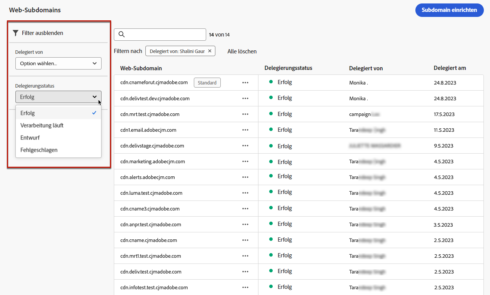
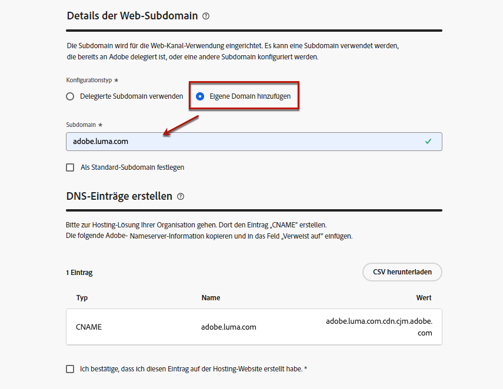
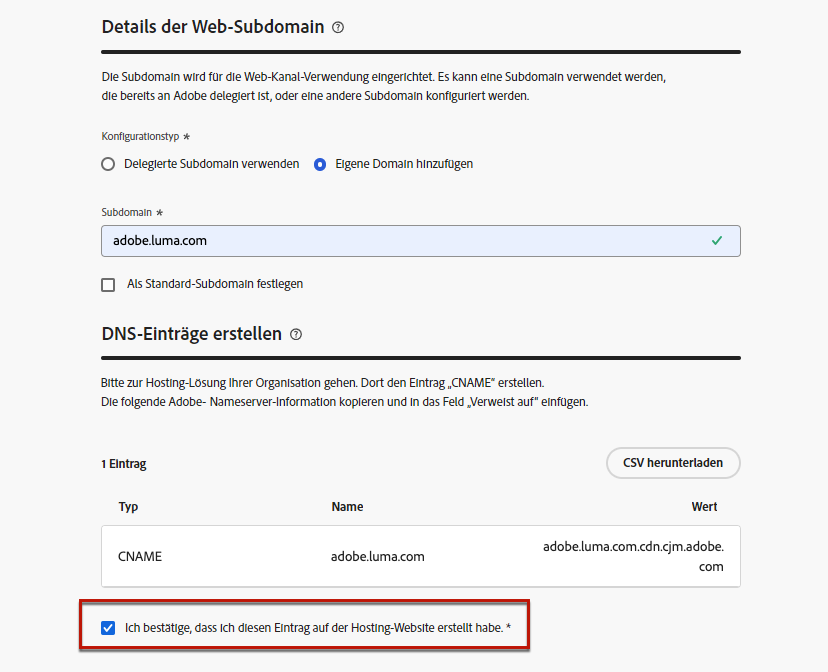

# Konfigurieren von Web-Subdomains {#web-subdomains}

>[!CONTEXTUALHELP]
>id="ajo_admin_subdomain_web_header"
>title="Delegieren einer Web-Subdomain"
>abstract="Die Subdomain wird für die Web-Kanal-Verwendung eingerichtet. Es kann eine Subdomain verwendet werden, die bereits an Adobe delegiert ist, oder eine andere Subdomain konfiguriert werden."

>[!CONTEXTUALHELP]
>id="ajo_admin_subdomain_web"
>title="Delegieren einer Web-Subdomain"
>abstract="Wenn Sie Inhalte aus Adobe Experience Manager Assets zu Ihren Web-Erlebnissen hinzufügen, müssen Sie die Subdomain einrichten, die zum Veröffentlichen dieses Inhalts verwendet wird. Wählen Sie eine der bereits an Adobe delegierten Subdomains aus oder konfigurieren Sie eine neue Subdomain."

>[!CONTEXTUALHELP]
>id="ajo_admin_subdomain_web_default"
>title="Festlegen einer Web-Subdomain"
>abstract="Wählen Sie eine Subdomain aus der Liste der an Adobe delegierten Subdomains aus. Sie können diese Web-Subdomain als Standard festlegen. Es kann jedoch jeweils nur eine Standard-Subdomain verwendet werden."

Wenn Sie beim Erstellen von Web-Erlebnissen Inhalte aus der Bibliothek von [Adobe Experience Manager Assets](../content-management/assets.md) verwenden, müssen Sie die Subdomain einrichten, die zum Veröffentlichen dieses Inhalts verwendet wird.

Sie können eine Subdomain verwenden, die bereits an Adobe delegiert wurde, oder eine andere Subdomain konfigurieren. Weitere Informationen zum Delegieren von Subdomains an Adobe finden Sie in [diesem Abschnitt](../configuration/delegate-subdomain.md).

>[!CAUTION]
>
>Die Konfiguration von Web-Subdomains ist in allen Umgebungen gleich. Daher gilt:
>
>* Um auf Web-Subdomains zuzugreifen und sie zu bearbeiten, benötigen Sie die Berechtigung zum **[!UICONTROL Verwalten von Web-Subdomains]** auf der Produktions-Sandbox.
>
> * Jede Änderung an einer Web-Subdomain wirkt sich auch auf die Produktions-Sandboxes aus.

Sie können mehrere Web-Subdomains erstellen, es wird jedoch nur die **Standard-** Subdomain verwendet. Sie können die Standard-Web-Subdomain ändern, es kann jedoch immer nur eine gleichzeitig verwendet werden.

## Zugriff und Verwaltung von Web-Subdomains {#access-web-subdomains}

1. Navigieren Sie zum Menü **[!UICONTROL Administration]** > **[!UICONTROL Kanäle]** und wählen Sie dann **[!UICONTROL Web-Konfiguration]** > **[!UICONTROL Web-Subdomains]**. Alle mit der aktuellen Sandbox eingerichteten Subdomains werden angezeigt.

   

1. Sie können nach der Person filtern, der jede Subdomain oder einen Delegierungsstatus zugewiesen hat (**[!UICONTROL Entwurf]**, **[!UICONTROL Verarbeitung]**, **[!UICONTROL Erfolg]** oder **[!UICONTROL Fehlgeschlagen]**).

   

1. Das **[!UICONTROL Standard]**-Badge wird neben der Subdomain angezeigt, die derzeit als Standard verwendet wird. Um die Standard-Subdomain zu ändern, wählen Sie **[!UICONTROL Als Standard festlegen]** über die Schaltfläche **[!UICONTROL Weitere Aktionen]** neben der gewünschten Subdomain aus.

   

   >[!NOTE]
   >
   >Sie können die Standard-Web-Subdomain ändern, es kann jedoch immer nur eine gleichzeitig verwendet werden.

## Verwenden einer vorhandenen Subdomain {#web-use-existing-subdomain}

Gehen Sie wie folgt vor, um eine Subdomain zu verwenden, die bereits an Adobe delegiert wurde.

1. Rufen Sie das Menü **[!UICONTROL Administration]** > **[!UICONTROL Kanäle]** auf und wählen Sie dann **[!UICONTROL Web-Konfiguration]** > **[!UICONTROL Web-Subdomains]** aus.

1. Klicken Sie auf **[!UICONTROL Subdomain einrichten]**.

1. Wählen Sie die Option **[!UICONTROL Delegierte Subdomain verwenden]** im Abschnitt **[!UICONTROL Konfigurationstyp]** und wählen Sie eine delegierte Subdomain aus der Liste.

   

   >[!NOTE]
   >
   >Sie können keine Subdomain auswählen, die bereits als Web-Subdomain verwendet wird.

1. Das Präfix, das in Ihrer Web-URL angezeigt wird, wird automatisch hinzugefügt. Es kann nicht geändert werden.

1. Um diese Subdomain als Standard festzulegen, wählen Sie die entsprechende Option aus.

   

   >[!NOTE]
   >
   >Nur die **Standard-** Subdomain wird verwendet.

1. Klicken Sie auf **[!UICONTROL Absenden]**. Die Subdomain erhält den Status **[!UICONTROL Erfolg]**. Sie kann nun für Ihre Web-Erlebnisse verwendet werden.

   >[!NOTE]
   >
   >In sehr seltenen Fällen kann die Einrichtung einer Subdomain fehlschlagen. Sie können dann die **[!UICONTROL fehlgeschlagene]** Subdomain löschen, um die Liste mithilfe der Schaltfläche **[!UICONTROL Löschen]** unter dem Symbol **[!UICONTROL Mehr Aktionen]** zu bereinigen.

## Konfigurieren einer neuen Subdomain {#web-configure-new-subdomain}

>[!CONTEXTUALHELP]
>id="ajo_admin_web_subdomain_dns"
>title="Erstellen des passenden DNS-Eintrags"
>abstract="Um eine neue Web-Subdomain zu konfigurieren, müssen Sie die auf der Journey Optimizer-Benutzeroberfläche angezeigten Adobe-Nameserver-Informationen kopieren und in die Domain-Hosting-Lösung einfügen, um den passenden DNS-Eintrag zu generieren. Sobald die Prüfungen erfolgreich waren, kann die Subdomain verwendet werden, um Inhalte aus der Bibliothek von Adobe Experience Manager Assets zu veröffentlichen."

Gehen Sie wie folgt vor, um eine neue Subdomain zu konfigurieren.

1. Rufen Sie das Menü **[!UICONTROL Administration]** > **[!UICONTROL Channels]** auf und wählen Sie dann **[!UICONTROL Webkonfiguration]** > **[!UICONTROL Web-Subdomains]**.

1. Klicken Sie auf **[!UICONTROL Subdomain einrichten]**.

1. Wählen Sie **[!UICONTROL Eigene Domain hinzufügen]** im Abschnitt **[!UICONTROL Konfigurationstyp]**.

1. Geben Sie die zu delegierende Subdomain an.

   >[!CAUTION]
   >
   >Sie können keine bereits vorhandene Web-Subdomain verwenden.
   >
   >Großbuchstaben sind in Subdomains nicht zulässig.

   

   Es ist nicht zulässig, Adobe eine ungültige Subdomain zuzuweisen. Vergewissern Sie sich, dass Sie eine gültige Subdomain eingeben, die Ihrem Unternehmen gehört, z. B. marketing.ihrunternehmen.com.

   >[!NOTE]
   >
   >Es werden Subdomains mit mehreren Ebenen (derselben übergeordneten Domain) unterstützt. Sie können beispielsweise „web.marketing.meinefirma.com“ verwenden.

1. Um diese Subdomain als Standard festzulegen, wählen Sie die entsprechende Option aus.

   >[!NOTE]
   >
   >Nur die **Standard-** Subdomain wird verwendet.

1. Die Liste der Einträge, die auf Ihren DNS-Servern gespeichert werden sollen, wird angezeigt. Kopieren Sie diesen Datensatz oder laden Sie eine CSV-Datei herunter und navigieren Sie dann zu Ihrer Domain-Hosting-Lösung, um den entsprechenden DNS-Eintrag zu generieren.

1. Stellen Sie sicher, dass in Ihrer Domain-Hosting-Lösung ein DNS-Eintrag generiert wurde. Wenn alles ordnungsgemäß konfiguriert ist, aktivieren Sie die Checkbox „Ich bestätige...“ und klicken Sie dann auf **[!UICONTROL Senden]**.

   

   >[!NOTE]
   >
   >Wenn Sie eine neue Web-Subdomain konfigurieren, verweist sie immer auf einen CNAME-Eintrag.

1. Nachdem die Subdomain-Zuweisung übermittelt wurde, wird die Subdomain in der Liste mit dem Status **[!UICONTROL Verarbeitung läuft]** angezeigt. Weiterführende Informationen zum Status von Subdomains finden Sie in [diesem Abschnitt](../configuration/about-subdomain-delegation.md#access-delegated-subdomains).<!--Same statuses?-->

   >[!NOTE]
   >
   >Bevor Sie diese Subdomain zum Senden von Web-Nachrichten verwenden können, müssen Sie warten, bis Adobe die erforderlichen Prüfungen durchgeführt hat, was bis zu 4 Stunden dauern kann.

1. Sobald die Prüfungen erfolgreich abgeschlossen sind, erhält die Subdomain den Status **[!UICONTROL Erfolg]**. Sie kann zur Erstellung von Oberflächen für Web-Kanäle verwendet werden.

   Beachten Sie, dass die Subdomain als **[!UICONTROL Fehlgeschlagen]** markiert wird, wenn Sie den Validierungseintrag in Ihrer Hosting-Lösung nicht erstellen können.

<!--
Only a subdomain with the **[!UICONTROL Success]** status can be set as default.
You cannot delete a subdomain with the **[!UICONTROL Processing]** status.
-->
