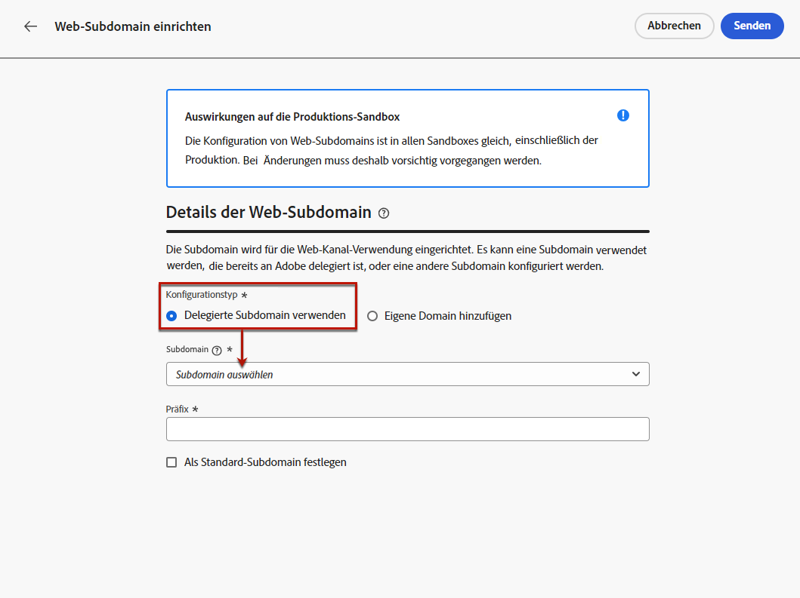

# Konfigurieren von Web-Subdomains {#web-subdomains}

>[!CONTEXTUALHELP]
>id="ajo_admin_subdomain_web_header"
>title="Delegieren einer Web-Subdomain"
>abstract="Die Subdomain wird für die Web-Kanal-Verwendung eingerichtet. Wählen Sie aus den Subdomains aus, die bereits an Adobe delegiert sind."

>[!CONTEXTUALHELP]
>id="ajo_admin_subdomain_web"
>title="Delegieren einer Web-Subdomain"
>abstract="Wenn Sie Inhalte aus Adobe Experience Manager Assets Essentials zu Ihren Web-Erlebnissen hinzufügen, müssen Sie die Subdomain einrichten, die zum Veröffentlichen dieses Inhalts verwendet wird. Wählen Sie unter den bereits an Adobe delegierten Subdomains aus."

>[!CONTEXTUALHELP]
>id="ajo_admin_subdomain_web_default"
>title="Festlegen einer Web-Subdomain"
>abstract="Wählen Sie eine Subdomain aus der Liste der an Adobe delegierten Subdomains aus. Sie können diese Web-Subdomain als Standard festlegen. Es kann jedoch jeweils nur eine Standard-Subdomain verwendet werden."

Wenn Sie beim Erstellen von Web-Erlebnissen Inhalte aus der [Adobe Experience Manager Assets Essentials](../email/assets-essentials.md)-Bibliothek verwenden, müssen Sie die Subdomain einrichten, die zum Veröffentlichen dieses Inhalts verwendet wird.

Wählen Sie dazu die Domain aus der Liste der bereits an Adobe delegierten Subdomains aus. Weitere Informationen zum Delegieren von Subdomains an Adobe finden Sie in [diesem Abschnitt](../configuration/delegate-subdomain.md).

>[!CAUTION]
>
>Die Konfiguration von Web-Subdomains ist in allen Umgebungen gleich. Daher gilt:
>
>* Um auf Web-Subdomains zuzugreifen und sie zu bearbeiten, benötigen Sie die Berechtigung zum **[!UICONTROL Verwalten von Web-Subdomains]** auf der Produktions-Sandbox.
>
> * Jede Änderung an einer Web-Subdomain wirkt sich auch auf die Produktions-Sandboxes aus.

Sie können mehrere Web-Subdomains erstellen, es wird jedoch nur die **Standard-** Subdomain verwendet. Sie können die Standard-Web-Subdomain ändern, es kann jedoch immer nur eine gleichzeitig verwendet werden.

1. Rufen Sie das Menü **[!UICONTROL Administration]** > **[!UICONTROL Kanäle]** auf und wählen Sie dann **[!UICONTROL Web-Konfiguration]** > **[!UICONTROL Web-Subdomains]** aus.

   

1. Klicken Sie auf **[!UICONTROL Subdomain einrichten]**.

1. Wählen Sie aus der Liste eine delegierte Subdomain aus.

   

   >[!NOTE]
   >
   >Sie können keine Subdomain auswählen, die bereits als Web-Subdomain verwendet wird.

1. Das Präfix, das in Ihrer Web-URL angezeigt wird, wird automatisch hinzugefügt. Es kann nicht geändert werden.

1. Um diese Subdomain als Standard festzulegen, wählen Sie die entsprechende Option aus.

   

   >[!NOTE]
   >
   >Nur die **Standard-** Subdomain wird verwendet.

1. Klicken Sie auf **[!UICONTROL Absenden]**. Die Subdomain erhält den Status **[!UICONTROL Erfolg]**. Sie kann nun für Ihre Web-Erlebnisse verwendet werden.

   >[!NOTE]
   >
   >In sehr seltenen Fällen kann die Einrichtung einer Subdomain fehlschlagen. Sie können dann die **[!UICONTROL fehlgeschlagene]** Subdomain löschen, um die Liste mithilfe der Schaltfläche **[!UICONTROL Löschen]** unter dem Symbol **[!UICONTROL Mehr Aktionen]** zu bereinigen.

1. Das **[!UICONTROL Standard]**-Badge wird neben der Subdomain angezeigt, die derzeit als Standard verwendet wird. Um die Standard-Subdomain zu ändern, wählen Sie **[!UICONTROL Als Standard festlegen]** über die Schaltfläche **[!UICONTROL Weitere Aktionen]** neben der gewünschten Subdomain aus.

   

   >[!NOTE]
   >
   >Sie können die Standard-Web-Subdomain ändern, es kann jedoch immer nur eine gleichzeitig verwendet werden.

   <!--Only a subdomain with the **[!UICONTROL Success]** status can be set as default.

    You cannot delete a subdomain with the **[!UICONTROL Processing]** status.-->
