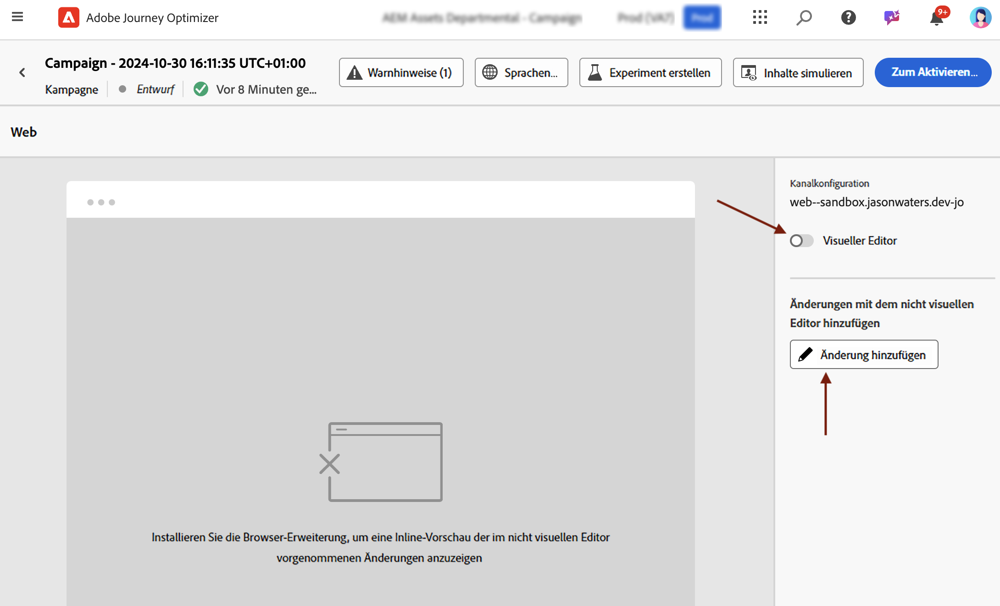
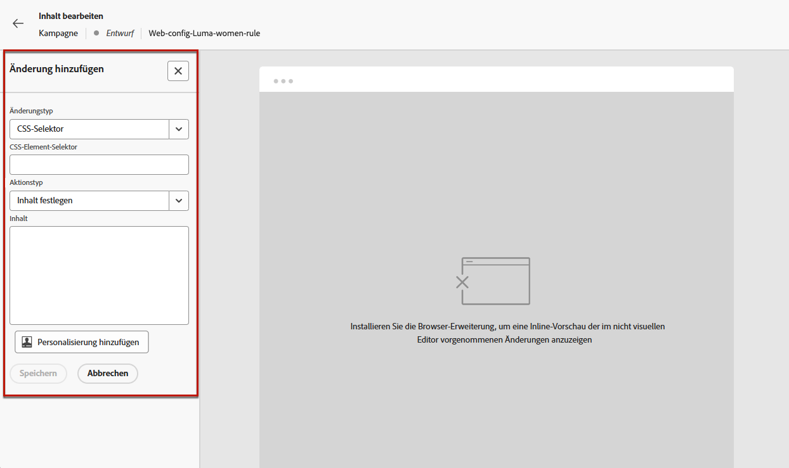
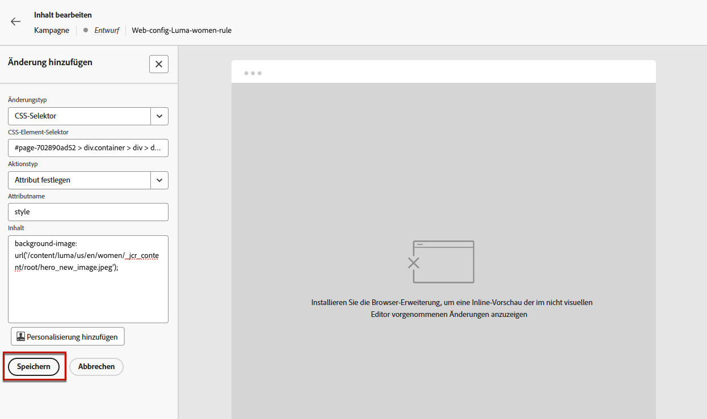
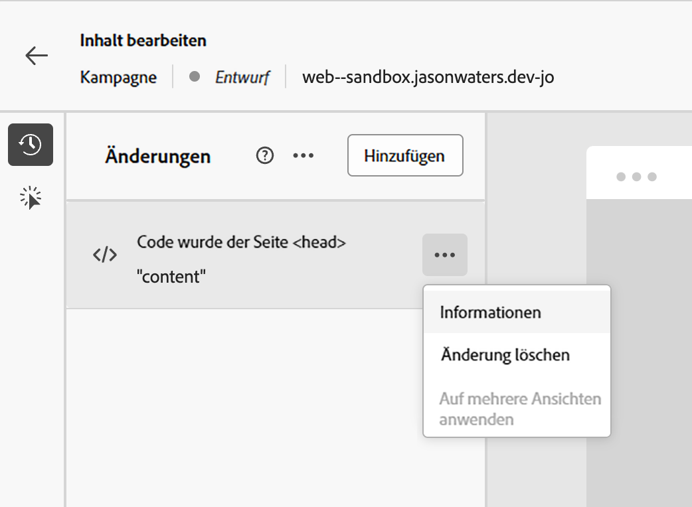

# Verwenden des nicht visuellen Web-Editors {#web-non-visual-editor}

Neben dem visuellen [Web-Designer](web-visual-editor.md) von [!DNL Journey Optimizer] können Sie Änderungen auch mit einem **nicht visuellen Editor** zu Ihren Web-Seiten hinzufügen.

Dies kann nützlich sein, wenn Sie keine Browser-Erweiterungen wie [Adobe Experience Cloud Visual Helper](web-prerequisites.md#visual-authoring-prerequisites) installieren können oder dürfen, die zum Laden Ihrer Seiten in den Web-Designer erforderlich sind.

In bestimmten Fällen kann es auch einfacher sein, einen nicht visuellen Editor zu verwenden, um Änderungen auf eine bestimmte CSS-Auswahl anzuwenden, ohne das Risiko einzugehen, andere Elemente auf einer Web-Seite oder die Seitenstruktur zu ändern.

Gehen Sie wie folgt vor, um Ihre Web-Erlebnisse mit dem nicht visuellen Editor zu erstellen.

1. Heben Sie in der Journey oder in der Kampagne im Bildschirm **[!UICONTROL Inhalt bearbeiten]** die Auswahl für die Option **[!UICONTROL Visueller Editor]** auf.

1. Klicken Sie auf **[!UICONTROL Eine Änderung hinzufügen]**, um mit der Bearbeitung Ihres Web-Inhalts zu beginnen.

   

1. Der nicht visuelle Editor wird angezeigt. Sie können Ihre erste Änderung über den linken Bereich hinzufügen.

   

1. Wählen Sie in der Dropdown-Liste den Änderungstyp aus.

   Es stehen zwei Typen zur Verfügung.  Sie bieten verschiedene Optionen. Weitere Informationen dazu finden Sie unter den folgenden Links:

   * **[!UICONTROL CSS-Auswahl]** – [Weitere Informationen](manage-web-modifications.md#css-selector)
   * **[!UICONTROL Seite`<head>`]** – [Weitere Informationen](manage-web-modifications.md#page-head)

1. Klicken Sie auf die Schaltfläche **[!UICONTROL Personalisierung hinzufügen]**. Der Personalisierungseditor wird geöffnet.

   Sie können den Personalisierungseditor von [!DNL Journey Optimizer] mit allen Personalisierungs- und Bearbeitungsfunktionen nutzen. [Weitere Informationen](../personalization/personalization-build-expressions.md)

1. Geben Sie den Inhalt ein und **[!UICONTROL Speichern]** Sie die Änderungen.

   

1. Ihre erste Änderung wird über dem Bereich **[!UICONTROL Änderungen]** angezeigt.

   Klicken Sie auf die Schaltfläche **[!UICONTROL Mehr Aktionen]** neben der Änderung und wählen Sie **[!UICONTROL Info]** aus, um die Details anzuzeigen. Sie können bei Bedarf auch **[!UICONTROL die Änderung löschen]**.

   {width="50%" align="left"}

   >[!NOTE]
   >
   >Der Bereich **[!UICONTROL Änderungen]** ist identisch mit dem Bereich im [Web-Designer](web-visual-editor.md). Alle Aktionen, die Sie damit ausführen können, sind in [diesem Abschnitt](manage-web-modifications.md#use-modifications-pane) beschrieben.

1. Klicken Sie auf die Schaltfläche **[!UICONTROL Hinzufügen]** über dem Bereich **[!UICONTROL Änderungen]**, um eine weitere Änderung hinzuzufügen, und wiederholen Sie die oben beschriebenen Schritte.

1. Darüber hinaus können Sie ein beliebiges Element Ihrer Web-Seite auswählen und die Klicks auf dieses Element nachverfolgen.  Um das Klick-Tracking zu aktivieren und die Aktionen zu definieren, die nachverfolgt werden sollen, klicken Sie auf das zweite Symbol in der linken Leiste, wie unten dargestellt:

   {width="50%" align="left"}

   Verwenden Sie die Schaltfläche **Komponente hinzufügen**, um eine neue Aktion auszuwählen, die nachverfolgt werden soll. Weitere Informationen zum Klick-Tracking finden Sie in [diesem Abschnitt](monitor-web-experiences.md#use-click-tracking).

1. Klicken Sie auf den Pfeil oben links im Bildschirm, um zum Bearbeitungsbildschirm der Journey oder Kampagne zurückzukehren. Sie können die aktuelle Anzahl der Änderungen sehen und weitere Änderungen hinzufügen.

   

   Sie können bei Bedarf auch zum Web-Designer wechseln. Alle Ihre Änderungen bleiben erhalten.
