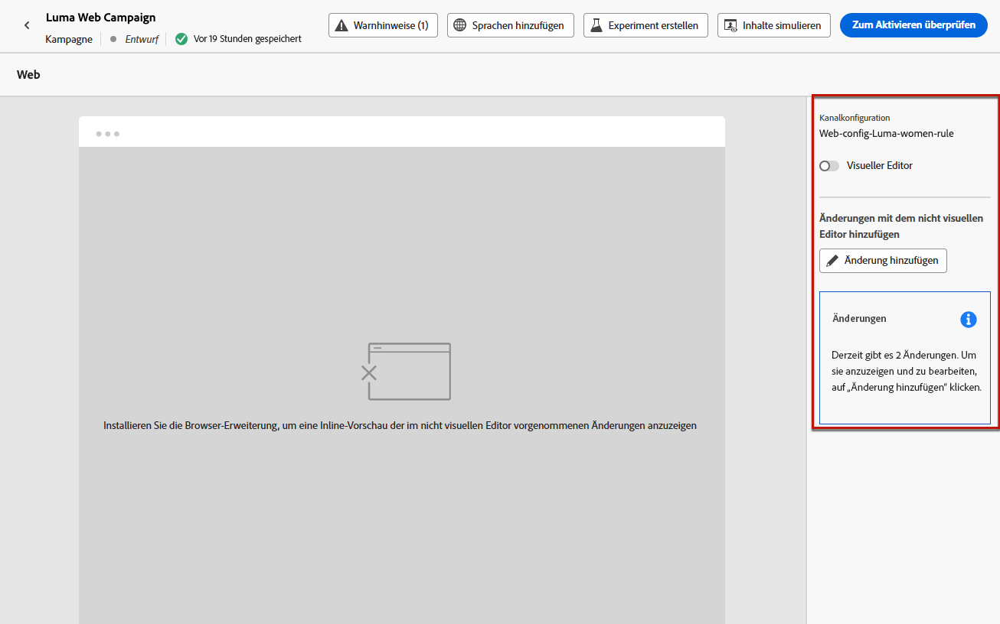

# Verwenden des nicht visuellen Web-Editors {#web-non-visual-editor}

Zusätzlich zum [!DNL Journey Optimizer] visuellen [ Webdesigner](web-visual-editor.md) können Sie Änderungen an Ihren Webseiten auch mit einem **nicht visuellen Editor** hinzufügen.

Dies kann nützlich sein, wenn Sie Browsererweiterungen wie den [Adobe Experience Cloud Visual Helper](web-prerequisites.md#visual-authoring-prerequisites) nicht installieren können oder nicht installieren dürfen, da dies zum Laden Ihrer Seiten in den Webdesigner erforderlich ist.

In bestimmten Fällen kann es auch einfacher sein, einen nicht visuellen Editor zu verwenden, um Änderungen an einem bestimmten CSS-Selektor anzuwenden, ohne das Risiko einzugehen, andere Elemente auf einer Webseite zu ändern oder die Seitenstruktur zu ändern.

Gehen Sie wie folgt vor, um Ihre Web-Erlebnisse mit dem nicht visuellen Editor zu erstellen.

1. Deaktivieren Sie im Bildschirm **[!UICONTROL Inhalt bearbeiten]** auf der Journey oder Kampagne die Option **[!UICONTROL Visual Editor]** .

1. Klicken Sie auf **[!UICONTROL Änderung hinzufügen]** , um mit der Bearbeitung Ihres Webinhalts zu beginnen.

   

1. Der nicht visuelle Editor wird angezeigt. Sie können Ihre erste Änderung über den linken Bereich hinzufügen.

   

1. Wählen Sie in der Dropdown-Liste den Änderungstyp aus.

   Es sind zwei Typen verfügbar. Sie bieten verschiedene Möglichkeiten. Weitere Informationen finden Sie unter den folgenden Links:

   * **[!UICONTROL CSS-Auswahl]** – [Weitere Informationen](manage-web-modifications.md#css-selector)
   * **[!UICONTROL Seite`<head>`]** – [Weitere Informationen](manage-web-modifications.md#page-head)

1. Klicken Sie auf die Schaltfläche **[!UICONTROL Personalisierung hinzufügen]** . Der Personalisierungseditor wird geöffnet.

   Sie können den Personalisierungseditor von [!DNL Journey Optimizer] mit allen Personalisierungs- und Bearbeitungsfunktionen nutzen. [Weitere Informationen](../personalization/personalization-build-expressions.md)

1. Geben Sie den Inhalt ein und **[!UICONTROL Speichern]** Sie die Änderungen.

   

1. Ihre erste Änderung wird über dem Bereich **[!UICONTROL Änderungen]** angezeigt.

   Klicken Sie auf die Schaltfläche **[!UICONTROL Mehr Aktionen]** neben Ihrer Änderung und wählen Sie **[!UICONTROL Info]** aus, um deren Details anzuzeigen. Sie können die Änderung bei Bedarf auch **[!UICONTROL löschen]**.

   {width="50%" align="left"}

   >[!NOTE]
   >
   >Der Bereich **[!UICONTROL Änderungen]** entspricht dem Bereich für den [Webdesigner](web-visual-editor.md). Alle Aktionen, die Sie damit ausführen können, werden in [diesem Abschnitt](manage-web-modifications.md#use-modifications-pane) beschrieben.

1. Klicken Sie auf die Schaltfläche **[!UICONTROL Hinzufügen]** oberhalb des Bereichs **[!UICONTROL Änderungen]**, um eine weitere Änderung hinzuzufügen, und wiederholen Sie die oben beschriebenen Schritte.

1. Darüber hinaus können Sie ein beliebiges Element Ihrer Website auswählen und die Klicks auf dieses Element verfolgen. Um das Klick-Tracking zu aktivieren und die Aktionen zu definieren, die verfolgt werden sollen, klicken Sie auf das zweite Symbol in der linken Leiste, wie unten dargestellt:

   {width="50%" align="left"}

   Verwenden Sie die Schaltfläche **Komponente hinzufügen** , um eine neue zu verfolgende Aktion auszuwählen. Weitere Informationen zur Verwendung von Klick-Tracking finden Sie in [diesem Abschnitt](monitor-web-experiences.md#use-click-tracking).

1. Klicken Sie oben links im Bildschirm auf den Pfeil, um zum Bildschirm zur Journey- oder Kampagnenbearbeitung zurückzukehren. Sie können die aktuelle Anzahl der Änderungen sehen und weitere Änderungen hinzufügen.

   

   Sie können bei Bedarf auch zum Webdesigner wechseln. Alle Ihre Änderungen bleiben erhalten.
