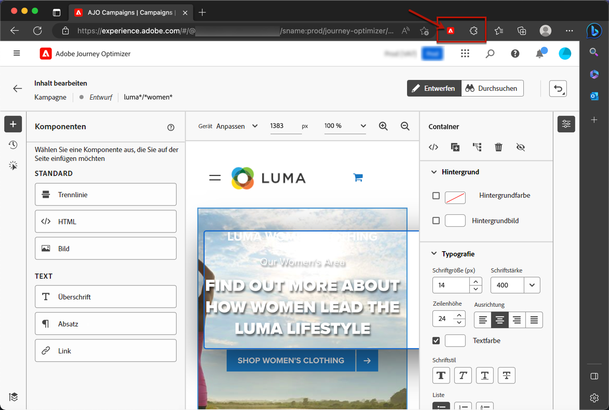

# Voraussetzungen für Webkanäle {#web-prerequisites}

Sie müssen folgende Voraussetzungen erfüllen, um Web-Seiten in der Benutzeroberfläche von [!DNL Journey Optimizer] aufzurufen und zu verfassen.

* Um Änderungen an Ihrer Website hinzuzufügen, benötigen Sie eine bestimmte Implementierung. [Weitere Informationen](#implementation-prerequisites)

* So greifen Sie auf die [!DNL Journey Optimizer] Web Designer, müssen Sie eine bestimmte Google Chrome-Browsererweiterung installiert haben. [Weitere Informationen](#visual-authoring-prerequesites)

* Damit das Web-Erlebnis ordnungsgemäß bereitgestellt werden kann, müssen Sie die Adobe Experience Platform-Einstellungen detailliert definieren [here](#delivery-prerequisites).

## Voraussetzungen für die Implementierung {#implementation-prerequisites}

Derzeit werden zwei Arten von Implementierungen unterstützt, um die Erstellung und Bereitstellung von Webkanalkampagnen in Ihren Webeigenschaften zu ermöglichen:

* Nur Client-seitig - Um Änderungen zu Ihrer Website hinzuzufügen, müssen Sie die [Adobe Experience Platform Web SDK](https://experienceleague.adobe.com/docs/platform-learn/implement-web-sdk/overview.html?lang=de){target="_blank"} auf Ihrer Website.

* Hybridmodus - Sie können den [AEP Edge Network Server-API](https://experienceleague.adobe.com/docs/experience-platform/edge-network-server-api/data-collection/interactive-data-collection.html){target="_blank"} to request for personalization server-side; the response is provided to the Adobe Experience Platform Web SDK to render the modifications client-side. Learn more in the Adobe Experience Platform [Edge Network Server API documentation](https://experienceleague.adobe.com/docs/experience-platform/edge-network-server-api/overview.html?lang=de){target="_blank"}. You can find out more about the hybrid mode and check some implementation samples in [this blog post](https://blog.developer.adobe.com/hybrid-personalization-in-the-adobe-experience-platform-web-sdk-6a1bb674bf41){target="_blank"}.

>[!NOTE]
>
>Die Nur-Server-Implementierung wird derzeit nicht unterstützt.

<!--If the Adobe Experience Platform Web SDK is not yet implemented on the website, a message displays in the web designer suggesting that you install the Visual Editing Helper browser extension and implement the [Web SDK](https://experienceleague.adobe.com/docs/platform-learn/implement-web-sdk/overview.html){target="_blank"}.-->

## Voraussetzungen für visuelles Authoring {#visual-authoring-prerequisites}

<!--In order to rapidly author and preview your web experiences, the Adobe Experience Cloud Visual Editing Helper browser extension for Google Chrome lets you load websites reliably within the Adobe [!DNL Journey Optimizer] web designer.-->

Damit Sie Ihre Webseiten zuverlässig in der [!DNL Journey Optimizer] Webdesigner, Sie müssen über die [Adobe Experience Cloud Visual Editing Helper](https://chrome.google.com/webstore/detail/adobe-experience-cloud-vi/kgmjjkfjacffaebgpkpcllakjifppnca){target="_blank"} Browsererweiterung, die in Ihrem Webbrowser installiert ist.

>[!CAUTION]
>
>Google Chrome und Microsoft Edge sind derzeit die einzigen Browser, die Authoring-Webseiten in [!DNL Journey Optimizer].

### Installieren der Erweiterung Visual Editing Helper {#install-visual-editing-helper}

Gehen Sie wie folgt vor, um die Browsererweiterung Visual Editing Helper herunterzuladen und zu installieren.

1. Öffnen Sie eine neue Registerkarte in Ihrem Browser (Google Chrome oder Microsoft Edge).

1. Navigieren Sie zu [Google Chrome Web Store](https://chrome.google.com/webstore/category/extensions){target="_blank"}.

1. Wenn Sie Microsoft Edge verwenden, wählen Sie **[!UICONTROL Erlauben von Erweiterungen aus anderen Stores]** auf dem oberen Banner. Dadurch können Sie Erweiterungen aus dem Chrome Web Store zu Microsoft Edge hinzufügen.

1. Suchen und navigieren Sie zum [Adobe Experience Cloud Visual Editing Helper](https://chrome.google.com/webstore/detail/adobe-experience-cloud-vi/kgmjjkfjacffaebgpkpcllakjifppnca){target="_blank"} Browsererweiterung.

1. Klicken Sie auf **[!UICONTROL Zu Chrome hinzufügen]** > **[!UICONTROL Erweiterung hinzufügen]**.

   >[!NOTE]
   >
   >Wenn Sie Microsoft Edge verwenden, wird die Erweiterung zu Edge hinzugefügt, auch wenn die Schaltfläche **[!UICONTROL Hinzufügen zu Chrome]**.

1. Stellen Sie sicher, dass die Browsererweiterung Visual Editing Helper in der Symbolleiste Ihres Browsers korrekt aktiviert ist.

   

<!--1. Launch [!DNL Journey Optimizer] in a new tab of your browser with the extension installed.

1. Create a web channel campaign in [!DNL Journey Optimizer]. [Learn how](author-web.md#create-web-campaign)

1. Open the [!DNL Journey Optimizer] web designer to start authoring your web experience. [Learn more](author-web.md)-->

Der Visual Editing Helper von Adobe Experience Cloud wird jetzt automatisch aktiviert, wenn eine Website im [!DNL Journey Optimizer]-Web-Designer geöffnet wird, um die Inhaltserstellung zu unterstützen.

Die Erweiterung verfügt über keine bedingten Einstellungen und verarbeitet alle Einstellungen automatisch, einschließlich der SameSite-Cookie-Einstellungen.

>[!NOTE]
>
>Einige Websites werden möglicherweise aus einem der folgenden Gründe nicht zuverlässig im [!DNL Journey Optimizer]-Web-Designer geöffnet:
>
> * Die Website hat strikte Sicherheitsrichtlinien.
> * Die Website befindet sich in einem iFrame.
> * Die QA- oder Status-Site von Kundinnen und Kunden kann extern nicht abgerufen werden (interne Site).

### Fehlerbehebung beim Laden einer Website {#troubleshooting}

Wenn Sie bei Verwendung des Adobe [!DNL Journey Optimizer]-Web-Designers versuchen, eine Website zu laden, die nicht geladen werden kann, wird eine Meldung angezeigt, die die Installation der [Browser-Erweiterung Visual Editing Helper](#install-visual-editing-helper) empfiehlt.

Wenn die Browser-Erweiterung Visual Editing Helper korrekt installiert ist, die Website jedoch weiterhin nicht geladen werden kann oder sich unerwartet verhält, besteht die Möglichkeit, Ihre Website im Browser zu öffnen und Cookies zu akzeptieren, bevor versucht wird, sie in den [!DNL Journey Optimizer] Webdesigner.

Bei Seiten unter Authentifizierung, wenn die Anmeldeseite nicht geladen werden kann oder wenn Sie nach dem Anmeldeversuch immer noch nicht angemeldet sind:

* Versuchen Sie zunächst, sich in einer neuen Browser-Registerkarte anzumelden, navigieren Sie zur gewünschten Seite, kopieren Sie dann die URL und versuchen Sie, sie im [!DNL Journey Optimizer] Webdesigner.

* Wenn Sie Ihre Website weiterhin nicht in der [!DNL Journey Optimizer] Webdesigner, wenden Sie sich an die Kundenunterstützung von Adobe, um das Problem zu melden, und stellen Sie sicher, dass Sie die fehlerhafte URL angeben.

## Versandvoraussetzungen {#delivery-prerequisites}

Damit das Web-Erlebnis ordnungsgemäß bereitgestellt werden kann, müssen die folgenden Einstellungen definiert werden:

* Zur [Datenerfassung in Adobe Experience Platform](https://experienceleague.adobe.com/docs/experience-platform/edge/datastreams/overview.html?lang=de){target="_blank"} muss ein Datenstrom definiert sein. Sie können beispielsweise für den **[!UICONTROL Adobe Experience Platform]**-Service die Optionen **[!UICONTROL Edge-Segmentierung]** und **[!UICONTROL Adobe Journey Optimizer]** aktivieren.

   Dadurch wird sichergestellt, dass die von Journey Optimizer eingehenden Ereignisse korrekt von Adobe Experience Platform Edge verarbeitet werden. [Weitere Informationen](https://experienceleague.adobe.com/docs/experience-platform/edge/datastreams/configure.html?lang=de){target="_blank"}

   

   >[!NOTE]
   >
   >Die Option **[!UICONTROL Adobe Journey Optimizer]** kann nur aktiviert werden, wenn die Option **[!UICONTROL Edge-Segmentierung]** bereits aktiviert ist.

* In [Adobe Experience Platform](https://experienceleague.adobe.com/docs/experience-platform/profile/home.html?lang=de){target="_blank"}, make sure you have one merge policy with the **[!UICONTROL Active-On-Edge Merge Policy]** option enabled. To do this, select a policy under the **[!UICONTROL Customer]** > **[!UICONTROL Profiles]** > **[!UICONTROL Merge Policies]** Experience Platform menu. [Learn more](https://experienceleague.adobe.com/docs/experience-platform/profile/merge-policies/ui-guide.html?lang=de#configure){target="_blank"}

   Diese Zusammenführungsrichtlinie wird von eingehenden Kanälen in [!DNL Journey Optimizer] verwendet, um eingehende Kampagnen auf der Edge korrekt zu aktivieren und zu veröffentlichen. [Weitere Informationen](https://experienceleague.adobe.com/docs/experience-platform/profile/merge-policies/ui-guide.html?lang=de){target="_blank"}

   

<!--
Branded domains for assets

When authoring web experiences, if you add content coming from the [Adobe Experience Manager Assets Essentials](../email/assets-essentials.md) library, you  must set up the subdomain that will be used to publish this content. [Learn more](web-delegated-subdomains.md)-->

