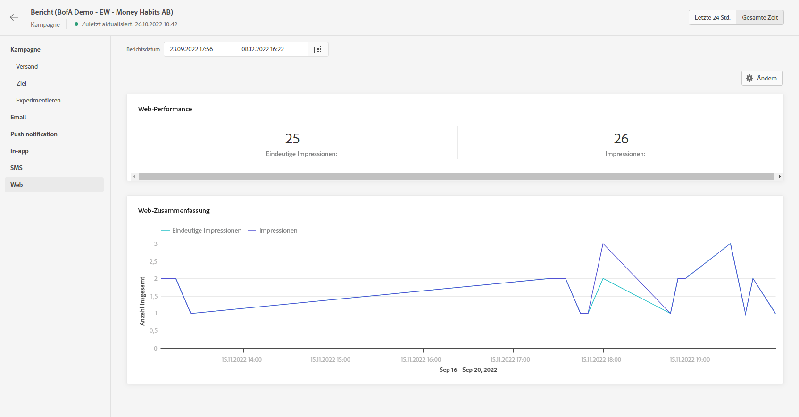

# Web-Bericht {#web-report}

Der Web-Bericht ist im Kampagnenbericht verfügbar.

>[!NOTE]
>
>Die Web-Kanal-Funktion ist derzeit nur als Beta-Version für ausgewählte Benutzerinnen und Benutzer verfügbar.

Die Seite „Kampagnenbericht“ wird mit den folgenden Registerkarten angezeigt:

* [Campaign](../reports/campaign-global-report.md#campaign-live)
* [E-Mail](../reports/campaign-global-report.md#email-live)
* [Push-Benachrichtigung](../reports/campaign-global-report.md#push-live)
* [SMS](../reports/campaign-global-report.md#sms-live)
* [Web](#web-tab)

Der **[!UICONTROL Globale Bericht]** in Campaign ist in verschiedene Widgets unterteilt, die Erfolge und Fehler bei Ihrer Kampagne detailliert beschreiben. Jedes Widget kann bei Bedarf angepasst und gelöscht werden. Weiterführende Informationen dazu finden Sie in diesem [Abschnitt](../reports/global-report.md#modify-dashboard).

Eine detaillierte Liste aller in Adobe Journey Optimizer verfügbaren Metriken finden Sie auf [dieser Seite](../reports/global-report.md#list-of-components-global.md)

## Registerkarte „Web“ {#web-tab}

Die KPIs der **[!UICONTROL Web-Performance]** enthalten die wichtigsten Informationen zur Interaktion Ihrer Besucher mit Ihren Web-Erlebnissen, z. B.:

* **[!UICONTROL Eindeutige Impressions]**: Anzahl der eindeutigen Benutzer, denen das Web-Erlebnis bereitgestellt wurde.

* **[!UICONTROL Impressions]**: Gesamtanzahl der für alle Benutzer bereitgestellten Web-Erlebnisse.

Das Diagramm **[!UICONTROL Web-Zusammenfassung]** zeigt die Entwicklung Ihrer Web-Erlebnisse (Impressions und Eindeutige Impressions) für den betroffenen Zeitraum.
