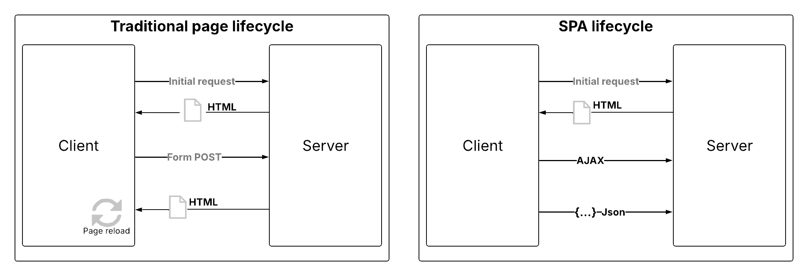

# Implementieren von Single Page Applications (SPAs) {#web-spa-implementation}

Adobe Experience Platform Web SDK bietet umfangreiche Funktionen, mit denen Ihr Unternehmen Personalisierungen auf Client-seitigen Technologien der nächsten Generation durchführen kann, z. B. Single Page Applications (SPAs).

Herkömmliche Websites funktionieren nach „Seiten-zu-Seiten“-Navigationsmodellen, die auch als Mehrseiten-Anwendungen bezeichnet werden. Dabei sind Website-Designs eng an URLs gekoppelt und der Übergang von einer Web-Seite zur anderen erfordert ein Laden der Seite.

Moderne Web-Anwendungen, wie Single Page Applications (SPAs), haben stattdessen ein Modell übernommen, das die schnelle Nutzung der Browser-UI-Rendering unterstützt, die oft unabhängig von Seitenneuladungen ist. Diese Erlebnisse können durch Kundeninteraktionen wie Bildläufe, Klicks und Cursor-Bewegungen ausgelöst werden. Mit der Weiterentwicklung der Paradigmen des modernen Internets funktioniert die Relevanz herkömmlicher generischer Ereignisse, wie z. B. des Seitenladevorgangs, für die Bereitstellung von Personalisierung und Experimenten nicht mehr.



## Vorteile der Verwendung von Web SDK für SPAs {#web-spa-benefits}

Im Folgenden finden Sie einige Vorteile der Verwendung von Web SDK für Ihre Single Page Applications:

* Möglichkeit zur Zwischenspeicherung aller Angebote beim Seitenladen, um mehrere Server-Aufrufe auf einen einzelnen Server-Aufruf zu reduzieren
* Erhebliche Verbesserung des Benutzererlebnisses auf Ihrer Site, da Angebote sofort über den Cache angezeigt werden, ohne dass durch herkömmliche Server-Aufrufe Verzögerungen entstehen.
* Das einmalige Entwicklersetup ermöglicht es Marketing-Experten, Personalisierungs- und Experimentieraktivitäten über den visuellen Adobe Journey Optimizer-Web-Editor in der SPA zu erstellen und auszuführen.

## XDM-Ansichten und Single Page Applications {#web-spa-xdm}

Der Journey Optimizer-Web-Editor nutzt ein Konzept namens _views_.

Ansichten sind eine logische Gruppe visueller Elemente, aus denen sich ein SPA-Erlebnis zusammensetzt. Ein Single Page Application kann daher basierend auf Benutzerinteraktionen als Übergang durch Ansichten anstelle von URLs betrachtet werden. Eine Ansicht kann in der Regel eine gesamte Site, eine einzelne Seite oder gruppierte visuelle Elemente innerhalb einer Seite darstellen.

Um näher zu erläutern, was Ansichten sind, wird im folgenden Beispiel eine hypothetische Online-E-Commerce-Site verwendet.

* Nachdem Sie zur Startseite navigiert sind, fördert ein Hero-Bild saisonale Kollektionen sowie die verschiedenen Produktkataloge, die auf der Website verfügbar sind. In diesem Fall kann eine Ansicht für den gesamten Startbildschirm definiert werden. Diese Ansicht könnte man einfach als „Heimat“ bezeichnen.

  

* Da sich der Kunde mehr für die Produkte interessiert, die das Unternehmen verkauft, entscheidet er sich, auf den **Herren**-Link zu klicken. Ähnlich wie bei der -Startseite kann die gesamte **Men**-Seite als Ansicht definiert werden. Diese Ansicht könnte man „Männer“ nennen.

  

* Da eine Ansicht als ganze Site oder als Gruppe visueller Elemente auf einer Site definiert werden kann, können die vier auf der Produkt-Site angezeigten Produkte gruppiert und als Ansicht betrachtet werden. Diese Ansicht kann als „Produkte“ bezeichnet werden.

  

* Wenn der Kunde entscheidet, auf die Schaltfläche **ALLE HERRENPRODUKTE** zu klicken, um weitere Produkte auf der Website zu erkunden, ändert sich in diesem Fall die Website-URL nicht. Es kann jedoch hier eine Ansicht erstellt werden, die nur die zweite Zeile der angezeigten Produkte darstellt. Der Name der Ansicht kann „products-page-2“ lauten.

* Der Kunde entscheidet sich für den Kauf einiger Produkte auf der Website und geht zum Checkout-Bildschirm über. Der Warenkorbbildschirm selbst kann mit einer Ansicht namens „Warenkorb“ verknüpft werden. Sie können auch eine andere Ansicht innerhalb des Checkout-Bildschirms haben, um die unten empfohlenen Produkte zu verarbeiten.

  

Das Konzept der Ansichten kann noch viel weiter ausgedehnt werden. Dies sind nur einige Beispiele für Ansichten, die auf einer Site definiert werden können.

## Implementieren von XDM-Ansichten {#implement-xdm-views}

XDM-Ansichten können in Adobe Journey Optimizer genutzt werden, um es Marketing-Experten zu ermöglichen, Web-Personalisierungs- und Experimentierkampagnen für SPAs über den visuellen Web-Editor von Journey Optimizer durchzuführen.

Dies erfordert die folgenden Schritte, um eine einmalige Entwicklereinrichtung abzuschließen:

1. Installieren Sie [Adobe Experience Platform Web SDK](https://experienceleague.adobe.com/docs/experience-platform/edge/fundamentals/installing-the-sdk.html?lang=de){target="_blank"} und überprüfen Sie die Seite [Voraussetzungen für Webkanäle](web-prerequisites.md).

2. Bestimmen Sie alle XDM-Ansichten in Ihrer Single Page Application, die Sie personalisieren möchten.

3. Um Inhalte für diese Ansichten bereitzustellen, müssen Sie nach dem Definieren der XDM-Ansichten die `sendEvent()`-Funktion implementieren, wobei `renderDecisions` auf `true` und die entsprechende XDM-Ansicht in Ihrer Einzelseitenanwendung festgelegt ist. Die XDM-Ansicht muss in `xdm.web.webPageDetails.viewName` übergeben werden. In diesem Schritt können Marketing-Fachleute diese Ansichten im Journey Optimizer-Web-Editor erkennen und Inhaltsänderungen für sie anwenden:

```js
 alloy("sendEvent", {
  "renderDecisions": true,
  "xdm": {
   "web": {
    "webPageDetails": {
    "viewName":"home"
   }
  }
 }
});
```

>[!NOTE]
>
>Beim ersten `sendEvent()`-Aufruf werden alle XDM-Ansichten, die für den Endbenutzer gerendert werden sollen, abgerufen und zwischengespeichert. Nachfolgende `sendEvent()` mit übergebenen XDM-Ansichten werden aus dem Cache gelesen und ohne einen Server-Aufruf gerendert.

## Beispiele für `sendEvent()` Funktionen

In diesem Abschnitt werden zwei Beispiele beschrieben, die zeigen, wie die `sendEvent()`-Funktion in React für eine hypothetische E-Commerce-SPA aufgerufen wird.

### Beispiel 1: A/B-Test-Startseite {#web-spa-sample-1}

Das Marketing-Team möchte A/B-Tests auf der gesamten Startseite durchführen.


Um A/B-Tests auf der gesamten Startseite durchzuführen, müssen `sendEvent()` aufgerufen werden, wobei der XDM-`viewName` auf `home` gesetzt sein muss:

```js
function onViewChange() {

  var viewName = window.location.hash; // or use window.location.pathName if router works on path and not hash

  viewName = viewName || 'home'; // view name cannot be empty

  // Sanitize viewName to get rid of any trailing symbols derived from URL

  if (viewName.startsWith('#') || viewName.startsWith('/')) {
    viewName = viewName.substr(1);
  }

  alloy("sendEvent", {
    "renderDecisions": true,

    "xdm": {
      "web": {
        "webPageDetails": {
          "viewName":"home"
        }
      }
    }
  });
}

// react router v4

const history = syncHistoryWithStore(createBrowserHistory(), store);

history.listen(onViewChange);

// react router v3

<Router history={hashHistory} onUpdate={onViewChange} >
```

### Beispiel 2: Personalisierte Produkte {#web-spa-sample-2}

Das Marketing-Team möchte die zweite Produktreihe personalisieren, indem die Farbe des Preisschilds in Rot geändert wird, nachdem ein Benutzer geklickt hat, um alle Men-Produkte zu sehen.


```js
function onViewChange(viewName) {

    alloy("sendEvent", {
        "renderDecisions": true,
        "xdm": {
            "web": {
                "webPageDetails": {
                    "viewName": viewName
                }
            }
        }
    });
}

class Products extends Component {

    render() {
        return (

            <
            button type = "button"
            onClick = {
                this.handleLoadMoreClicked
            } > All Men 's Products</button>
        );
    }

    handleLoadMoreClicked() {
        var page = this.state.page + 1; // assuming page number is derived from component's state
        this.setState({
            page: page
        });
        onViewChange('PRODUCTS-PAGE-' + page);
    }
}
```
