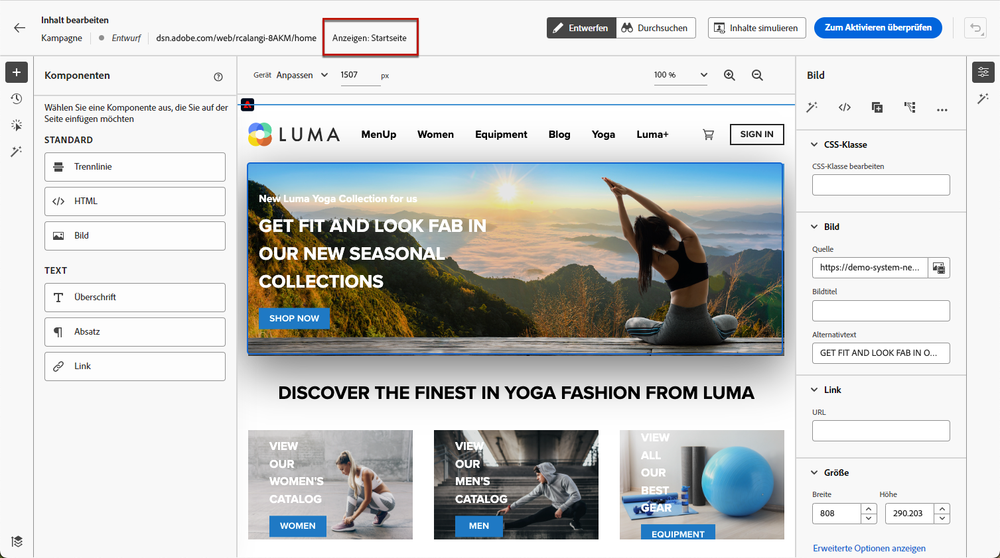
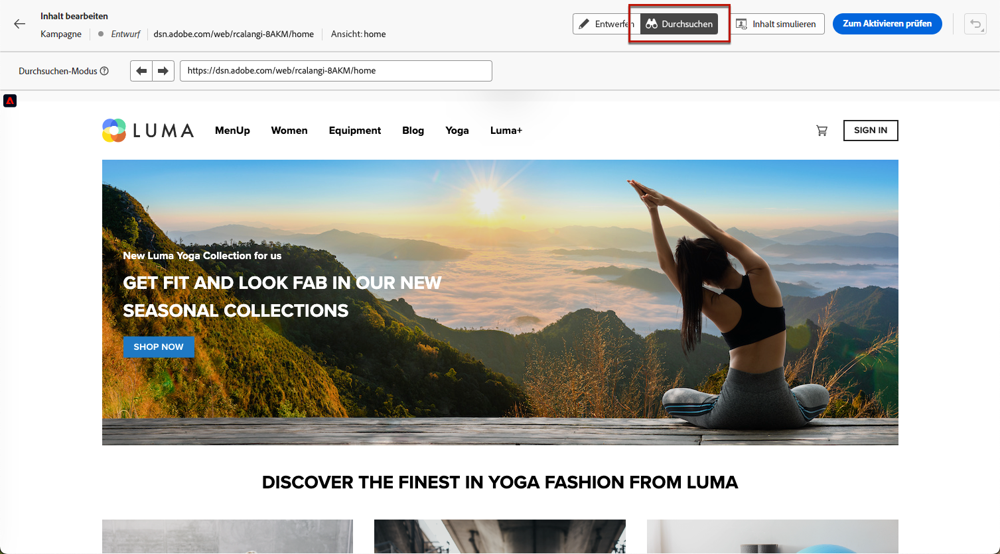
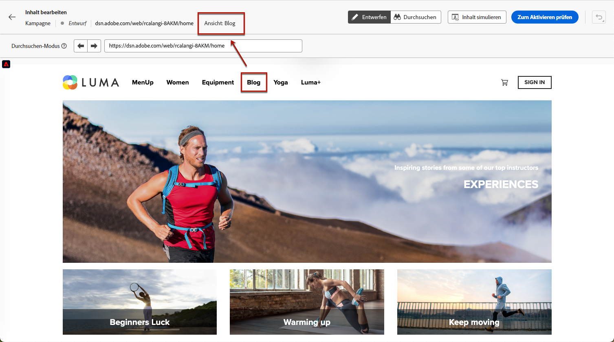
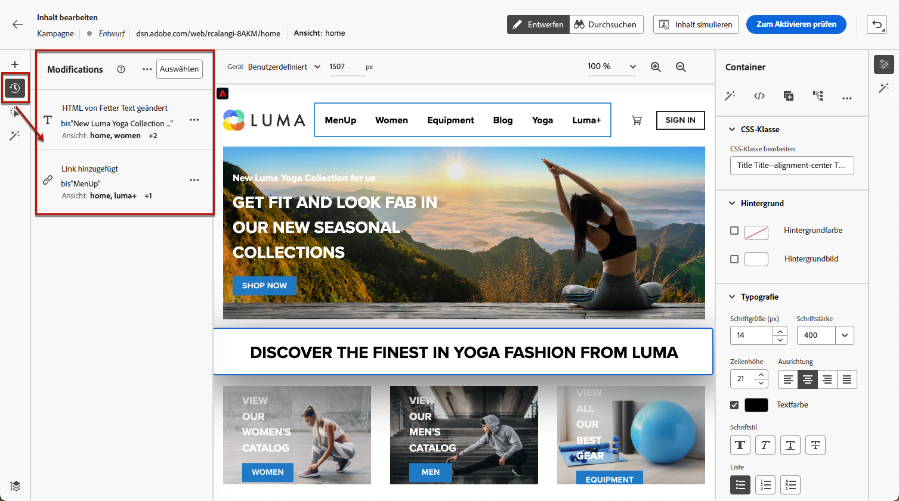
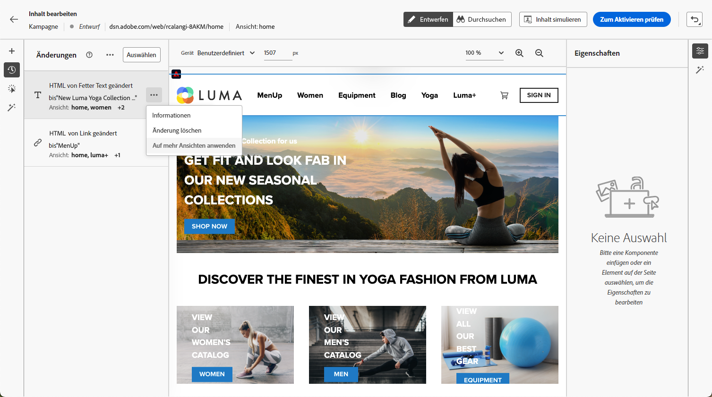
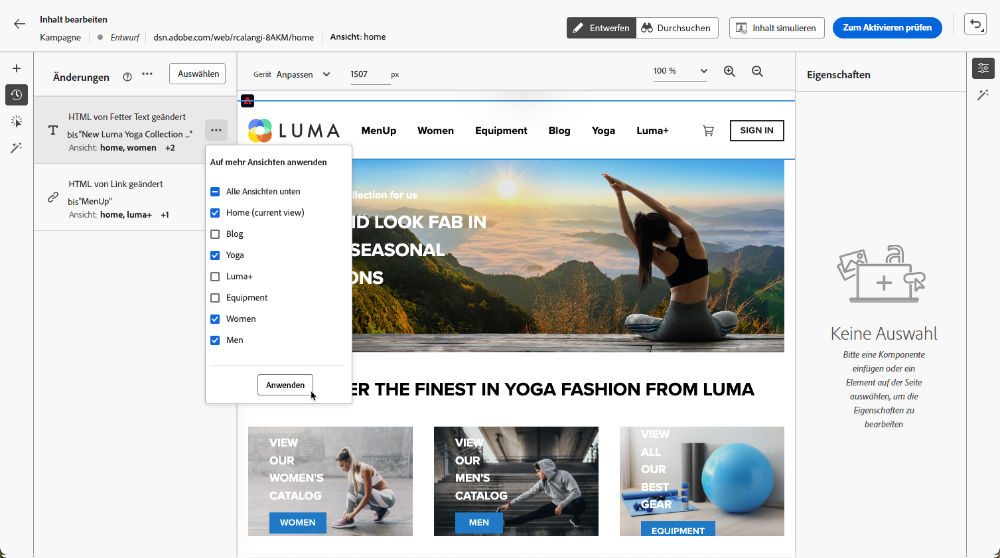
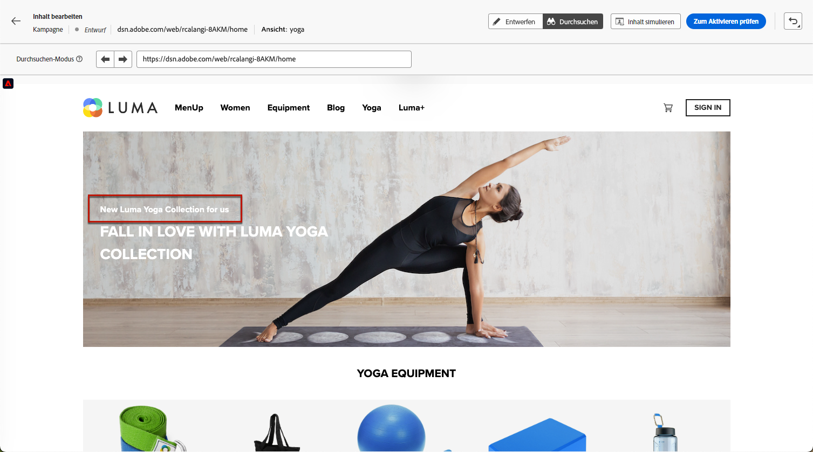

# Erstellen von Einzelseitenanwendungen {#web-author-spas}

## Über Ansichten {#about-views}

>[!CONTEXTUALHELP]
>id="ajo_web_designer_modifications_views"
>title="Anwenden von Änderungen auf ausgewählte Ansichten"
>abstract="Die Änderungen werden nur für ausgewählte Ansichten angewendet. Mit dem Modus **Durchsuchen** können Sie Ansichten entdecken und zu ihnen navigieren. Ist die gewünschte Ansicht nicht verfügbar?"
>additional-url="https://experienceleague.adobe.com/docs/platform-learn/implement-web-sdk/overview.html?lang=de" text="Weitere Informationen"

**Einzelseitenanwendungen** (Single Page Applications, SPAs) können jetzt im visuellen Web-Designer-Editor erstellt werden. Auf diese Weise können Sie auswählen, auf welche **Ansichten** Sie Ihre Änderungen an der Web-Seite anwenden möchten.

[In diesem Video wird erklärt, wie Einzelseitenanwendungen erstellt werden können](#video)

Eine Ansicht kann als ganze Seite oder als Gruppe visueller Elemente auf einer Seite definiert werden, z. B. als Startseite, als gesamte Produktseite oder als Rahmen für Versandvoreinstellungen auf allen Checkout-Seiten.

Ein einmaliges Setup auf Entwicklerseite ist erforderlich, um die Ansichten in der Adobe Experience Platform Web SDK-Implementierung zu definieren. Auf diese Weise können Web-Kampagnen mit Adobe Journey Optimizer auf SPAs erstellt und ausgeführt werden.

## Definieren von Ansichten in der Web SDK-Implementierung {#define-views}

XDM-Ansichten können in Adobe [!DNL Journey Optimizer] genutzt werden, damit Marketing-Fachleute Web-Personalisierungs- und Erlebniskampagnen auf SPAs über den visuellen Web-Editor ausführen können. [Weitere Informationen](web-spa-implementation.md)

Um auf die Ansichten in der Benutzeroberfläche von [!DNL Journey Optimizer] zugreifen und welche erstellen zu können, stellen Sie sicher, dass Sie die in [diesem Abschnitt](web-spa-implementation.md#implement-xdm-views) aufgeführten Schritte befolgen.

## Entdecken von Ansichten im Web-Designer {#discover-views}

Nachdem das Setup des SPAs in der Adobe Experience Platform Web SDK-Implementierung durchgeführt wurde, müssen Sie durch alle Ansichten Ihrer Website navigieren, auf die Sie Änderungen anwenden möchten. Führen Sie dazu folgende Schritte durch.

1. [Erstellen Sie eine Web-Kampagne](create-web.md) und rufen Sie den [Web-Designer](edit-web-content.md) auf.

   Die aktuelle Ansicht wird oben links angezeigt.

   

1. Wechseln Sie in den Modus **[!UICONTROL Durchsuchen]**. [Weitere Informationen](../web/edit-web-content.md#browse-mode)

   

1. Navigieren Sie zwischen den verschiedenen Seiten der Website, um sie alle zu entdecken. Der oben angezeigte Ansichtsname ändert sich, wenn Sie durch eine andere Seite navigieren.

   

## Anwenden von Änderungen auf andere Ansichten {#apply-modifications-views}

Nachdem eine Änderung in einer bestimmten Ansicht hinzugefügt wurde, kann sie auf andere ausgewählte Ansichten angewendet werden. Führen Sie dazu folgende Schritte durch.

>[!CAUTION]
>
>Wenn Sie Ansichten nicht mit dem Modus **[!UICONTROL Durchsuchen]** entdeckt haben, können Sie sie nicht auswählen, um Ihre Änderungen vorzunehmen. [Weitere Informationen](#discover-views)

1. Wählen Sie das Symbol **[!UICONTROL Änderungen]** aus, um den entsprechenden Bereich auf der linken Seite anzuzeigen.

   

1. Wählen Sie eine Änderung aus und klicken Sie auf die Schaltfläche **[!UICONTROL Mehr Aktionen]** neben der Änderung. Wählen Sie **[!UICONTROL Auf mehr Ansichten anwenden]** aus.

   

1. Wählen Sie die Ansichten aus, auf die die Änderungen angewendet werden sollen.

   

1. Klicken Sie auf **[!UICONTROL Übernehmen]**.

1. Wechseln Sie in den Modus **[!UICONTROL Durchsuchen]**, um zu überprüfen, ob die Änderungen auf die gewünschten Seiten angewendet werden.

   

## Anleitungsvideo{#video}

In diesem Video wird Folgendes erklärt:

* Entdecken von SPA-Ansichten im Modus **[!UICONTROL Durchsuchen]**
* Verfassen in der aktuellen Ansicht
* Anwenden von Website-Änderungen auf mehrere Ansichten oder auf alle erkannten Ansichten
* Durchführen von Massenaktionen für Änderungen

>[!VIDEO](https://video.tv.adobe.com/v/3424536/?quality=12&learn=on)
