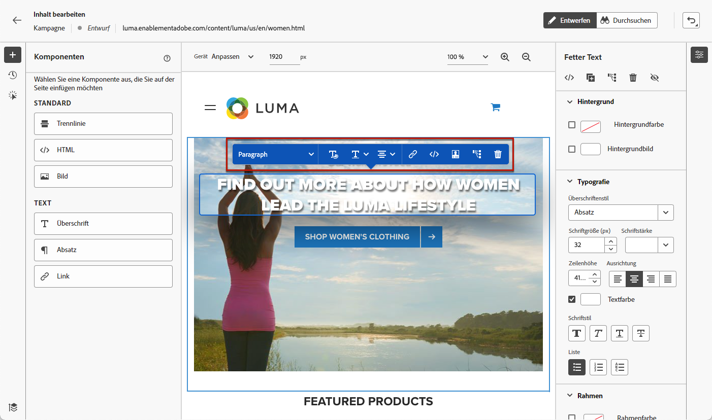
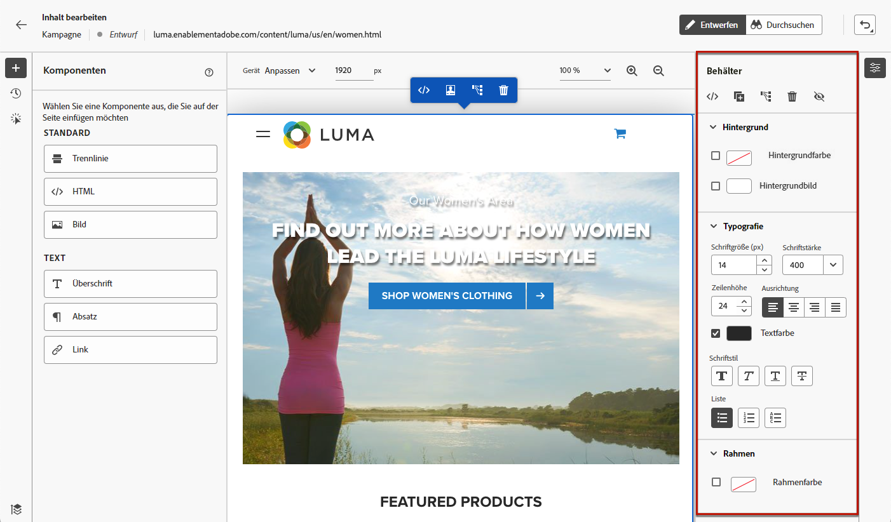
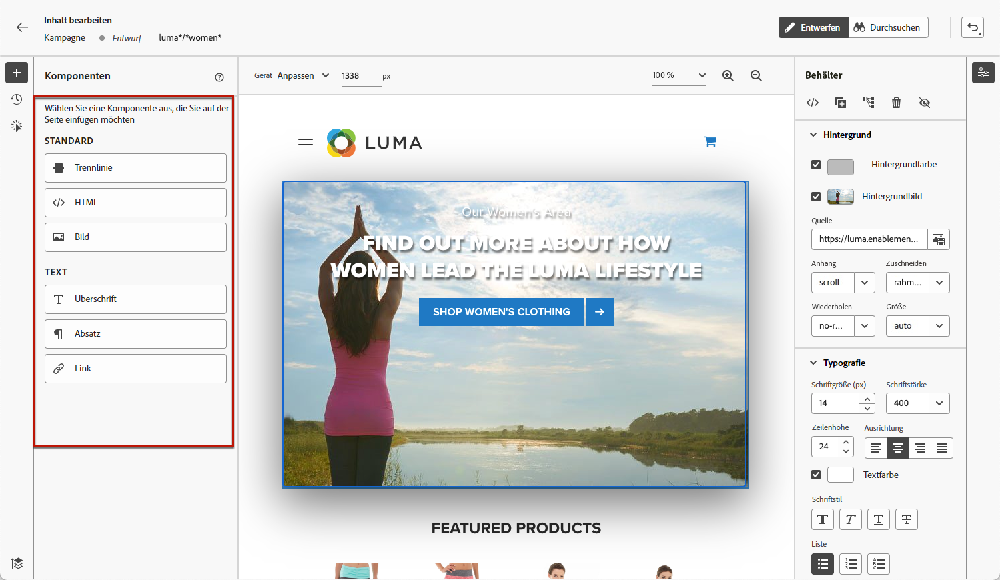
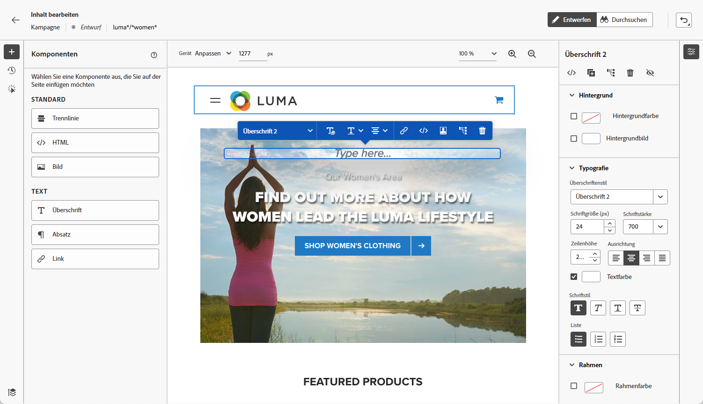
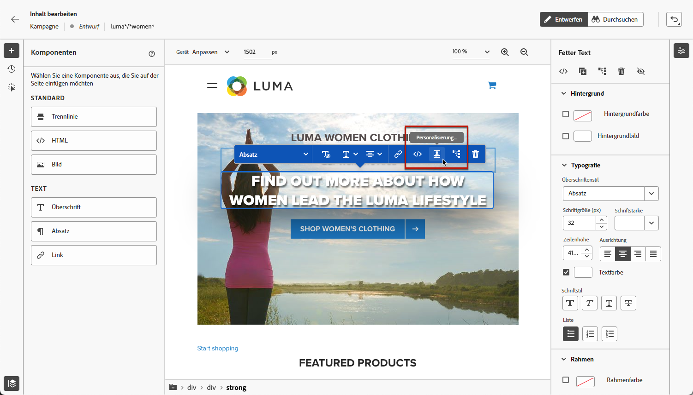
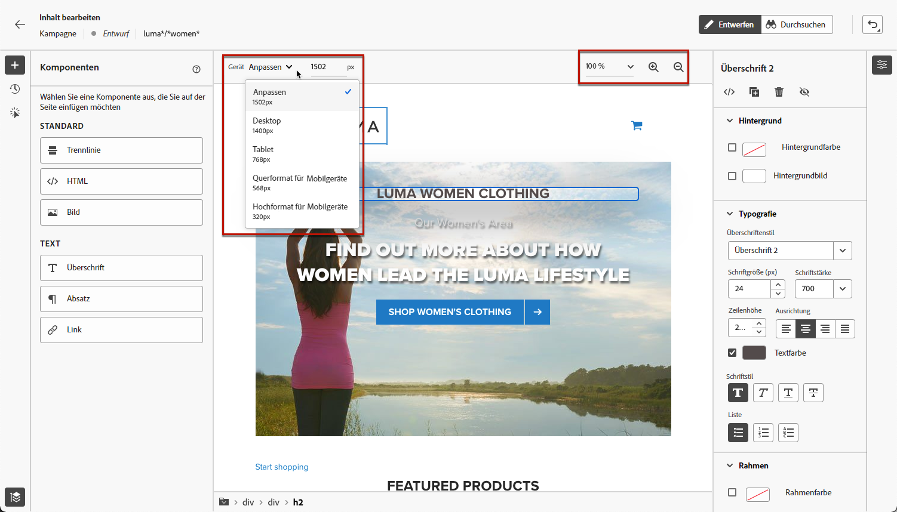

# Arbeiten mit dem Web-Designer {#work-with-web-designer}

<!--
>[!CONTEXTUALHELP]
>id="ajo_web_url_to_edit_surface"
>title="Confirm the URL to edit"
>abstract="Confirm the URL of the specific web page to use for editing the content that will be applied on the web configuration defined above. The web page must be implemented using the Adobe Experience Platform Web SDK."
>additional-url="https://experienceleague.adobe.com/docs/platform-learn/implement-web-sdk/overview.html?lang=de" text="Learn more"

>[!CONTEXTUALHELP]
>id="ajo_web_url_to_edit_rule"
>title="Enter the URL to edit"
>abstract="Enter the URL of a specific web page to use for editing the content that will be applied to all pages matching the rule. The web page must be implemented using Adobe Experience Platform Web SDK."
>additional-url="https://experienceleague.adobe.com/docs/platform-learn/implement-web-sdk/overview.html?lang=de" text="Learn more"
-->

In [!DNL Journey Optimizer] basiert das Erstellen visueller Web-Seiten auf der Chrome-Browser-Erweiterung **Adobe Experience Cloud Visual Helper**. [Weitere Informationen](web-prerequisites.md#visual-authoring-prerequisites)

>[!CAUTION]
>
>Um in der Benutzeroberfläche von [!DNL Journey Optimizer] auf Web-Seiten zuzugreifen oder sie dort zu erstellen, müssen Sie den Voraussetzungen in [diesem Abschnitt](web-prerequisites.md) folgen.

## Erstellen eines Web-Erlebnisses

Gehen Sie wie folgt vor, um mit der Erstellung Ihres Web-Erlebnisses mit dem visuellen Web-Designer zu beginnen.

>[!CAUTION]
>
>Das [Adobe Experience Platform Web SDK](https://experienceleague.adobe.com/docs/platform-learn/implement-web-sdk/overview.html?lang=de){target="_blank"} muss in Ihre Web-Seite integriert sein. [Weitere Informationen](web-prerequisites.md#implementation-prerequisites)

1. Klicken Sie im Bildschirm **[!UICONTROL Inhalt bearbeiten]** auf **[!UICONTROL Webseite bearbeiten]**, um den Web-Designer zu öffnen.

   

   <!---->

   >[!NOTE]
   >
   >Wenn Sie versuchen, eine Web-Site zu laden, die sich nicht laden lässt, wird eine Meldung mit dem Vorschlag angezeigt, die Browser-Erweiterung [Visual Editing Helper](#install-visual-editing-helper) zu installieren. Tipps zur Fehlerbehebung finden Sie in [diesem Abschnitt](web-prerequisites.md#troubleshooting).
   >
   >Sie können Ihre Web-Inhalte auch bearbeiten, ohne den visuellen Editor zu laden. Heben Sie dazu die Auswahl der Option **[!UICONTROL Visueller Editor]** auf, um stattdessen den nicht visuellen Bearbeitungsmodus zu verwenden. [Weitere Informationen](web-non-visual-editor.md)

1. Wählen Sie im Web-Designer ein beliebiges Element auf der Arbeitsfläche aus, z. B. Bild, Schaltfläche, Absatz, Text, Container, Überschrift oder Link.  [Weitere Informationen](#content-components)

1. Um ein Element zu bearbeiten, können Sie Folgendes verwenden:

   * das Kontextmenü zur Bearbeitung des Inhalts, des Layouts, der Links oder der Personalisierung usw.

     

   * die Symbole oben im rechten Bereich zum Bearbeiten, Duplizieren, Löschen oder Ausblenden der einzelnen Elemente.

     

   * den rechten Bereich, der sich dynamisch entsprechend dem ausgewählten Element ändert. Sie können beispielsweise den Hintergrund, die Typografie, den Rahmen, die Größe, die Position, den Abstand, die Effekte oder Inline-Stile eines Elements bearbeiten.

     

>[!NOTE]
>
>Der Web-Content-Designer ähnelt dem E-Mail-Designer größtenteils. Weitere Informationen finden Sie unter [Inhaltserstellung mit [!DNL Journey Optimizer]](../email/get-started-email-design.md).

Nachdem Sie Ihren Web-Inhalt bearbeitet haben, können Sie Ihre Änderungen verwalten. [Weitere Informationen](manage-web-modifications.md)

## Verwenden von Komponenten {#content-components}

>[!CONTEXTUALHELP]
>id="ajo_web_designer_components"
>title="Hinzufügen von Komponenten zu einer Web-Seite"
>abstract="Einer Web-Seite können eine Reihe von Komponenten hinzugefügt werden. Diese können nach Bedarf bearbeitet werden."

1. Wählen Sie im Bereich **[!UICONTROL Komponenten]** auf der linken Seite ein Element aus. Sie können Ihrer Web-Seite die folgenden Komponenten hinzufügen und diese nach Bedarf bearbeiten:

   * [Trennlinie](../email/content-components.md#divider)
   * [HTML](../email/content-components.md#HTML)
   * [Bild](../email/content-components.md#image)
   * Überschrift: Die Verwendung dieser Komponente ähnelt der Verwendung der Komponente **[!UICONTROL Text]** im E-Mail-Designer. [Weitere Informationen](../email/content-components.md#text)
   * Absatz: Die Verwendung dieser Komponente ähnelt der Verwendung der Komponente **[!UICONTROL Text]** im E-Mail-Designer. [Weitere Informationen](../email/content-components.md#text)
   * Link

   

1. Bewegen Sie den Mauszeiger über die Seite und klicken Sie auf die Schaltfläche **[!UICONTROL Einfügen vor]** oder **[!UICONTROL Einfügen nach]**, um die Komponente an ein vorhandenes Element auf der Seite anzuhängen.

   

   >[!NOTE]
   >
   >Um die Auswahl einer Komponente aufzuheben, klicken Sie auf die Schaltfläche **[!UICONTROL ESC]** im kontextuellen blauen Banner, das oben auf der Arbeitsfläche angezeigt wird.

1. Bearbeiten Sie die Komponente nach Bedarf direkt im Inhalt Ihrer Seite.

   

1. Passen Sie die Stile an, die im kontextuellen Bereich auf der rechten Seite angezeigt werden, z. B. Hintergrund, Textfarbe, Rahmen, Größe, Position usw., - abhängig von der ausgewählten Komponente.

   

## Hinzufügen von Personalisierung

Um Personalisierung hinzuzufügen, wählen Sie einen Container aus und klicken Sie auf das Personalisierungssymbol in der angezeigten Kontextmenüleiste. Fügen Sie Ihre Änderungen mithilfe des Personalisierungseditors hinzu. [Weitere Informationen](../personalization/personalization-build-expressions.md)

## Navigieren durch den Web-Designer {#navigate-web-designer}

In diesem Abschnitt werden die verschiedenen Methoden beschrieben, wie Sie durch den Web-Designer navigieren können. Informationen zum Anzeigen und Verwalten der Änderungen, die zu Ihrem Web-Erlebnis hinzugefügt wurden, finden Sie in [diesem Abschnitt](manage-web-modifications.md).

### Verwenden von Breadcrumbs {#breadcrumbs}

1. Wählen Sie ein beliebiges Element auf der Arbeitsfläche aus.

1. Klicken Sie auf **[!UICONTROL Breadcrumbs erweitern/reduzieren]** auf der linken unteren Bildschirmseite, um Informationen zum ausgewählten Element schnell anzuzeigen.

   

1. Wenn Sie den Mauszeiger über die Breadcrumbs bewegen, wird das entsprechende Element im Editor hervorgehoben.

1. Damit können Sie einfach zu jedem übergeordneten, gleichrangigen oder untergeordneten Element im visuellen Editor navigieren.

### Wechseln in den Durchsuchen-Modus {#browse-mode}

>[!CONTEXTUALHELP]
>id="ajo_web_designer_browse"
>title="Verwenden des Durchsuchen-Modus"
>abstract="Im Durchsuchen-Modus kann von der ausgewählten Konfiguration, die personalisiert werden soll, direkt zur gewünschten Seite navigiert werden."

Sie können über die entsprechende Schaltfläche vom Standardmodus **[!UICONTROL Design]** in den **[!UICONTROL Durchsuchen]**-Modus wechseln.

Im Modus **[!UICONTROL Durchsuchen]** können Sie von der ausgewählten Konfiguration, die Sie personalisieren möchten, zur gewünschten Seite navigieren.

Dies ist besonders nützlich, wenn es um Seiten geht, die sich hinter der Authentifizierung befinden oder nicht von Anfang an über eine bestimmte URL verfügbar sind. Sie können sich beispielsweise authentifizieren, zu Ihrer Kontoseite oder zu Ihrer Warenkorbseite navigieren und dann zurück in den **[!UICONTROL Design]**-Modus wechseln, um die Änderungen auf der gewünschten Seite durchzuführen.

Wenn Sie den Modus **[!UICONTROL Durchsuchen]** verwenden, können Sie auch durch alle Ansichten Ihrer Website navigieren, wenn Sie eine Einzelseitenanwendung erstellen. [Weitere Informationen](web-spa.md)

### Ändern der Gerätegröße {#change-device-size}

Sie können die Gerätegröße der Web-Designer-Anzeige in eine vordefinierte Größe ändern, z. B. **[!UICONTROL Tablet]** oder **[!UICONTROL Mobilgeräte – Querformat]**. Legen Sie alternativ eine benutzerdefinierte Größe fest, indem Sie die gewünschte Pixelanzahl eingeben.

Sie können auch den Zoom-Fokus ändern – von 25 % bis 400 %.

Die Möglichkeit, die Gerätegröße zu ändern, wurde für responsive Web-Sites entwickelt, die auf verschiedenen Geräten, Fenstern und Bildschirmgrößen gut dargestellt werden. Responsive Web-Sites passen sich automatisch an jede Bildschirmgröße an, einschließlich Desktops, Laptops, Tablets oder Mobiltelefone.

>[!CAUTION]
>
>Sie können ein Web-Erlebnis mit einer bestimmten Gerätegröße bearbeiten. Solange die Selektoren identisch sind, gelten diese Änderungen für alle Größen und Geräte, nicht nur für die Gerätegröße, mit der Sie arbeiten. Gleichermaßen werden bei der Bearbeitung eines Erlebnisses in der normalen Desktop-Ansicht die Änderungen auf alle Bildschirmgrößen angewendet, nicht nur auf die Desktop-Ansicht.
>
>Zurzeit unterstützt [!DNL Journey Optimizer] keine Seitenänderungen für bestimmte Gerätegrößen. Wenn Sie also beispielsweise über eine separate mobile Web-Site mit einer separaten Site-Struktur verfügen, müssen Sie die für Ihre mobile Site spezifischen Änderungen in einer anderen Kampagne vornehmen.

## Anleitungsvideo{#video}

Das folgende Video zeigt, wie Sie ein Web-Erlebnis mit dem Web-Designer in [!DNL Journey Optimizer]-Kampagnen erstellen.

>[!VIDEO](https://video.tv.adobe.com/v/3418803/?quality=12&learn=on)
