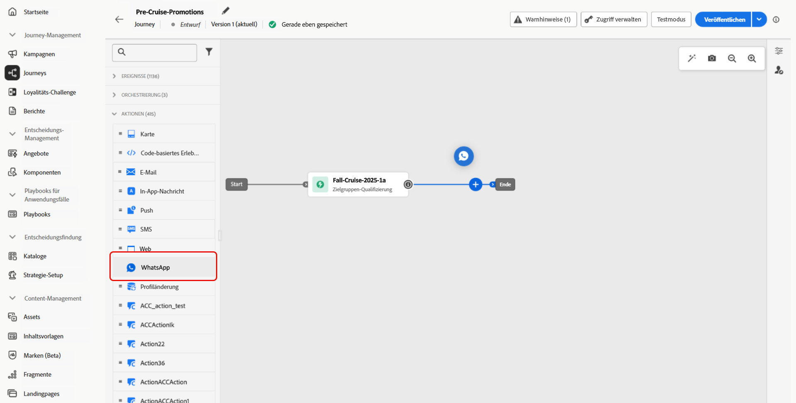

# Erstellen einer WhatsApp-Nachricht {#create-whatsapp}

>[!BEGINSHADEBOX]

**Inhaltsverzeichnis**

* [Erste Schritte mit WhatsApp-Nachrichten](get-started-whatsapp.md)
* [Erste Schritte mit der WhatsApp-Konfiguration](whatsapp-configuration.md)
* **[Erstellen einer WhatsApp-Nachricht](create-whatsapp.md)**
* [Überprüfen und Senden von WhatsApp-Nachrichten](send-whatsapp.md)

>[!ENDSHADEBOX]

Mit Adobe Journey Optimizer können Sie ansprechende Nachrichten auf WhatsApp entwerfen und versenden. Fügen Sie einfach eine WhatsApp-Aktion zu Ihrem Journey oder Ihrer Kampagne hinzu und erstellen Sie Ihren Nachrichteninhalt wie unten beschrieben. Mit Adobe Journey Optimizer können Sie Ihre WhatsApp-Nachrichten vor dem Versand testen, um ein perfektes Rendering, eine genaue Personalisierung und die ordnungsgemäße Konfiguration aller Einstellungen sicherzustellen.

>[!VIDEO](https://video.tv.adobe.com/v/3451621?learn=on)

## Hinzufügen einer WhatsApp-Nachricht {#create-whatsapp-journey-campaign}

Auf den folgenden Registerkarten erfahren Sie, wie Sie eine WhatsApp-Nachricht zu einer Kampagne oder einer Journey hinzufügen.

>[!BEGINTABS]

>[!TAB Hinzufügen einer WhatsApp-Nachricht zu einer Journey]

1. Öffnen Sie Ihren Journey und ziehen Sie per Drag **and-Drop eine** WhatsApp-Aktivität **aus dem Bereich** Aktionen“ der Palette.

   

1. Geben Sie allgemeine Informationen (Titel, Beschreibung, Kategorie) zu Ihrer Nachricht ein und wählen Sie dann die zu verwendende Konfiguration aus.

   Weitere Informationen zur Konfiguration der Journey finden Sie auf [dieser Seite](../building-journeys/journey-gs.md).

   Das Feld **[!UICONTROL Konfiguration]** ist standardmäßig mit der letzten Konfiguration für den Kanal vorausgefüllt, den die Benutzerin oder der Benutzer verwendet hat.

Sie können jetzt mit der Erstellung des Inhalts Ihrer WhatsApp-Nachricht beginnen, indem Sie die Schaltfläche **[!UICONTROL Inhalt bearbeiten]** verwenden, wie unten beschrieben.

>[!TAB Hinzufügen einer WhatsApp-Nachricht zu einer Kampagne]

1. Rufen Sie das Menü **[!UICONTROL Kampagnen]** auf und klicken Sie auf **[!UICONTROL Kampagne erstellen]**.

1. Wählen Sie den Kampagnentyp **Geplant – Marketing** aus.

1. Bearbeiten Sie im Bereich **[!UICONTROL Eigenschaften]** den **[!UICONTROL Titel]** und die **[!UICONTROL Beschreibung]** Ihrer Kampagne.

1. Klicken Sie auf die Schaltfläche **[!UICONTROL Zielgruppe auswählen]**, um die Zielgruppe aus der Liste der verfügbaren Adobe Experience Platform-Zielgruppen zu definieren. [Weitere Informationen](../audience/about-audiences.md).

1. Wählen Sie im Feld **[!UICONTROL Identity-Namespace]** den Namespace aus, der zur Identifizierung der Personen in der ausgewählten Zielgruppe verwendet werden soll. [Weitere Informationen](../event/about-creating.md#select-the-namespace).

1. Wählen Sie im **[!UICONTROL Aktionen]** die Option **[!UICONTROL WhatsApp]** aus und wählen oder erstellen Sie eine neue Konfiguration.

   Weitere Informationen zur WhatsApp-Konfiguration finden Sie auf [dieser Seite](whatsapp-configuration.md).

1. Klicken Sie auf **[!UICONTROL Experiment erstellen]**, um mit der Konfiguration Ihres Inhaltsexperiments zu beginnen und Abwandlungen zu erstellen, deren Performance zu messen und die beste Option für Ihre Zielgruppe zu ermitteln. [Weitere Informationen](../content-management/content-experiment.md)

1. Geben **[!UICONTROL im Abschnitt]** an, ob Sie Klicks auf Links in Ihrer WhatsApp-Nachricht verfolgen möchten.

1. Kampagnen sind so konzipiert, dass sie an einem bestimmten Datum oder in regelmäßigen Abständen ausgeführt werden. Erfahren Sie in [diesem Abschnitt](../campaigns/create-campaign.md#schedule), wie Sie den **[!UICONTROL Zeitplan]** der Kampagne konfigurieren können.

1. Wählen Sie aus dem Menü **[!UICONTROL Aktions-Trigger]** die **[!UICONTROL Häufigkeit]** Ihrer SMS-Nachricht:

   * Einmal
   * Täglich
   * Wöchentlich
   * Monat

Sie können jetzt mit der Erstellung des Inhalts Ihrer WhatsApp-Nachricht beginnen, indem Sie die Schaltfläche **[!UICONTROL Inhalt bearbeiten]** verwenden, wie unten beschrieben.

>[!ENDTABS]

## Definieren von WhatsApp-Inhalten{#whatsapp-content}

>[!IMPORTANT]
>
>Bevor Sie Ihre WhatsApp-Nachricht in Journey Optimizer erstellen, müssen Sie zunächst Ihre Vorlage in Meta erstellen. [Weitere Informationen](https://www.facebook.com/business/help/2055875911147364?id=2129163877102343)

1. Klicken Sie auf dem Bildschirm zur Journey- oder Kampagnenkonfiguration auf die Schaltfläche **[!UICONTROL Inhalt bearbeiten]**, um den Inhalt der WhatsApp-Nachricht zu konfigurieren.

<!--
1. Select **[!UICONTROL Template message]**.
-->

1. Wählen Sie Ihre **Vorlagenkategorie**:

   * Marketing
   * Dienstprogramm
   * Authentifizierung

   [Weitere Informationen zu Vorlagenkategorien](https://developers.facebook.com/docs/whatsapp/updates-to-pricing/new-template-guidelines/#template-category-guidelines)

1. Wählen Sie aus der **WhatsApp** Vorlage“ Ihre zuvor erstellte Vorlage aus, die in Meta entworfen wurde.

   [Erfahren Sie mehr über das Erstellen Ihrer WhatsApp-Vorlagen](https://www.facebook.com/business/help/2055875911147364?id=2129163877102343)

1. Verwenden Sie den Personalisierungseditor, um Ihrer Vorlage eine Personalisierung hinzuzufügen. Sie können jedes Attribut verwenden, z. B. den Profilnamen oder die Stadt.

   Auf der folgenden Seite erfahren Sie mehr über [Personalisierung](../personalization/personalize.md).

1. Verwenden Sie die Schaltfläche **[!UICONTROL Inhalt simulieren]**, um den Inhalt Ihrer WhatsApp-Nachricht, die gekürzten URLs und den personalisierten Inhalt in der Vorschau anzuzeigen. [Weitere Informationen](send-whatsapp.md)

Nachdem Sie Ihre Tests durchgeführt und den Inhalt validiert haben, können Sie Ihre WhatsApp-Nachricht an Ihre Zielgruppe senden. Diese Schritte werden auf [dieser Seite](send-whatsapp.md) im Detail beschrieben.

<!--
* **[!UICONTROL Template message]**: Predefined message imported from Meta into Journey Optimizer. These are intended for sending notifications, alerts, or updates to your customers.

* **[!UICONTROL Response message]**: Message created in Journey Optimizer and sent in reply to customer queries or interactions.

>[!BEGINTABS]

>[!TAB Template message]

1. From the journey or campaign configuration screen, click the **[!UICONTROL Edit content]** button to configure the WhatsApp message content.

1. Select **[!UICONTROL Template message]**.

1. Choose your Template category. [Learn more](https://developers.facebook.com/docs/WhatsApp/updates-to-pricing/new-template-guidelines/)

1. From the **WhatsApp template** drop-down, select your previously created template designed in Meta.

1. Use the personalization editor to define content, add personalization and dynamic content. You can use any attribute, such as the profile name or city for example. You can also define conditional rules. Browse to the following pages to learn more about [personalization](../personalization/personalize.md) and [dynamic content](../personalization/get-started-dynamic-content.md) in the personalization editor.

1. Use the **[!UICONTROL Simulate content]** button to preview your WhatsApp message content, shortened URLs, and personalized content. [Learn more](send-whatsapp.md)

Once you have performed your tests and validated the content, you can send your WhatsApp message to your audience. These steps are detailed in [this page](send-whatsapp.md)

>[!TAB Response message]

1. From the journey or campaign configuration screen, click the **[!UICONTROL Edit content]** button to configure the WhatsApp message content.

1. Select **[!UICONTROL Response message]**.

1. Enter your text in the **[!UICONTROL Body]** field.

1. Use the personalization editor to define content, add personalization and dynamic content. You can use any attribute, such as the profile name or city for example. You can also define conditional rules. Browse to the following pages to learn more about [personalization](../personalization/personalize.md) and [dynamic content](../personalization/get-started-dynamic-content.md) in the personalization editor.

1. Use the **[!UICONTROL Simulate content]** button to preview your WhatsApp message content, shortened URLs, and personalized content. [Learn more](send-whatsapp.md)

Once you have performed your tests and validated the content, you can send your WhatsApp message to your audience. These steps are detailed in [this page](send-whatsapp.md)

>[!ENDTABS]
-->
