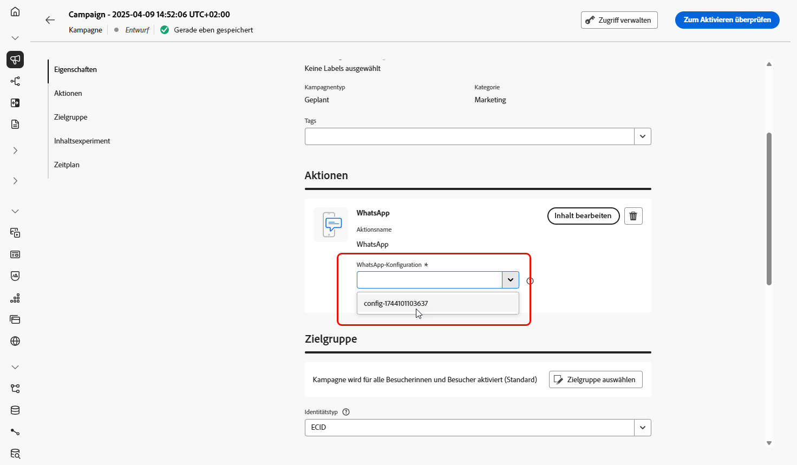
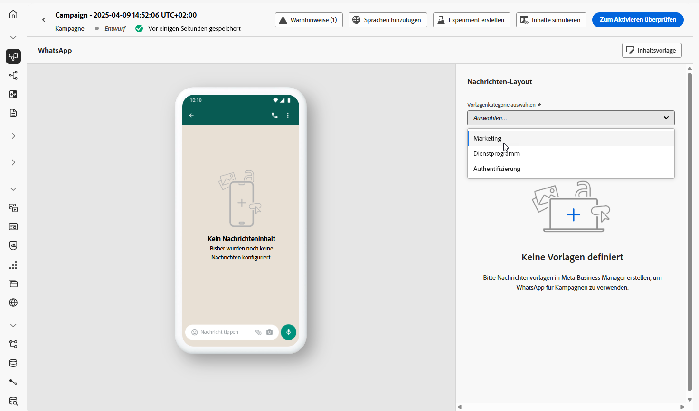
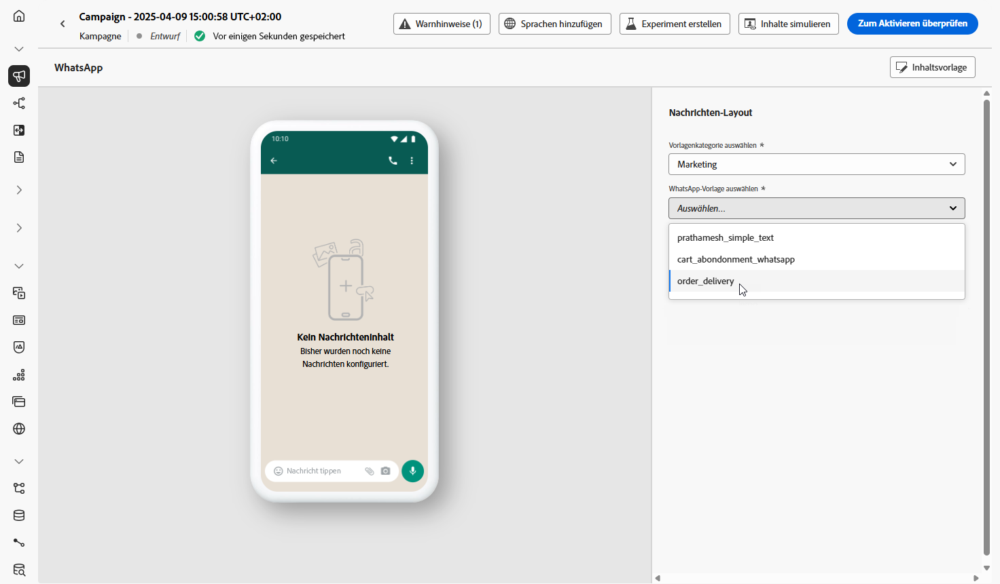
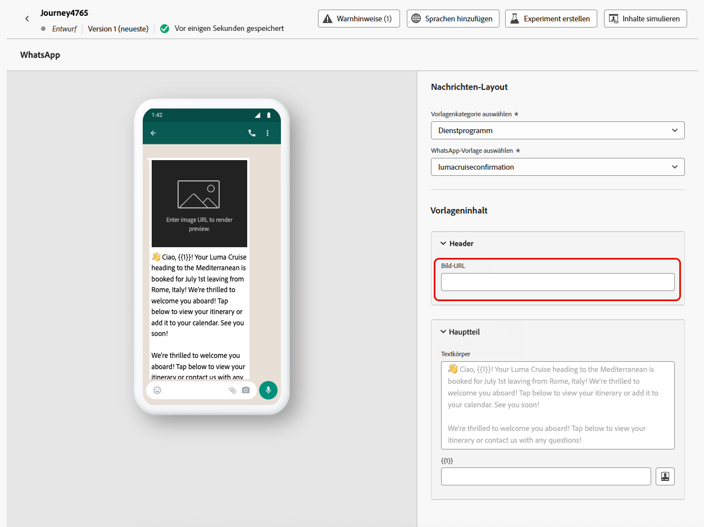
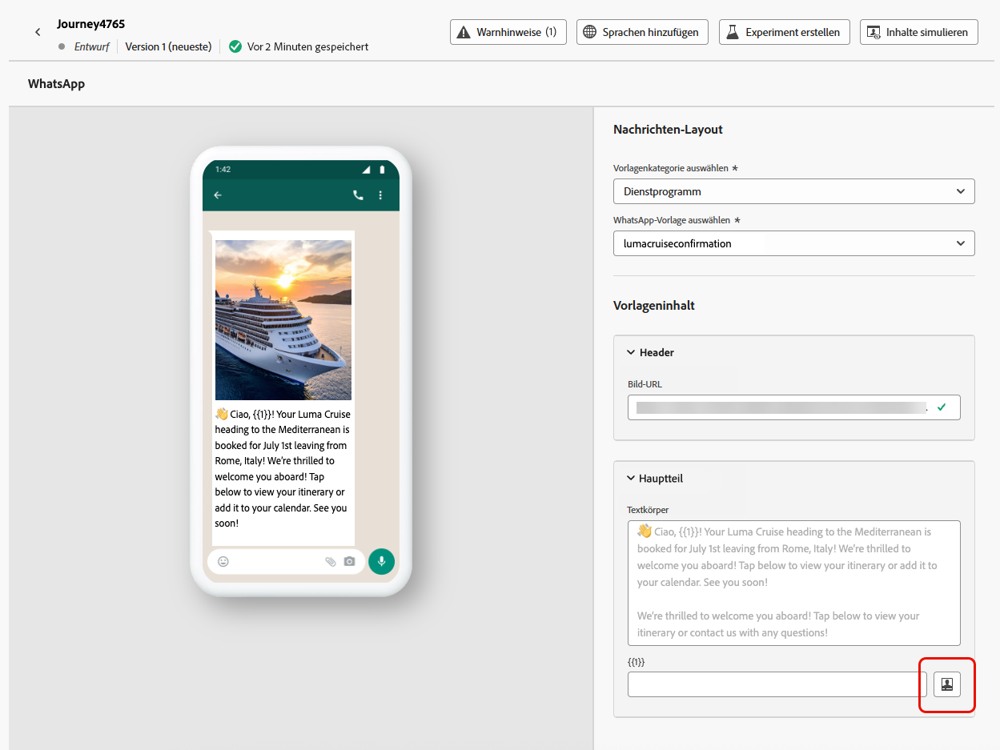

# Erstellen einer WhatsApp-Nachricht {#create-whatsapp}

Mit Adobe Journey Optimizer können Sie ansprechende Nachrichten in WhatsApp entwerfen und versenden. Fügen Sie einfach eine WhatsApp-Aktion zu Ihrer Journey oder Ihrer Kampagne hinzu und erstellen Sie Ihren Nachrichteninhalt wie unten beschrieben. Mit Adobe Journey Optimizer können Sie Ihre WhatsApp-Nachrichten zudem vor dem Versand testen, um ein perfektes Rendering, eine genaue Personalisierung und ordnungsgemäße Konfiguration aller Einstellungen sicherzustellen.

Beachten Sie, dass in Journey Optimizer nur ausgehende Nachrichtenelemente unterstützt werden.

+++ Weitere Informationen zu unterstützten Nachrichtenelementen und CTAs

Die folgenden Nachrichtentypen werden in WhatsApp unterstützt:

| Nachrichtenfunktion | Beschreibung |
|-|-|
| Kopfzeilen | Optionaler Text, der über dem Nachrichtentext angezeigt wird. |
| Text | Unterstützt dynamische Inhalte durch Parameter. |
| Bilder (JPEG, PNG) | Müssen im 8-Bit-RGB- oder -RGBA-Format vorliegen und kleiner als 5 MB sein. |
| Videos | Müssen im 3GPP- oder MP4-Format vorliegen, kleiner als 16 MB sein und über URL gehostet werden. |
| Audio | Nur für Antwortnachrichten verfügbar. Muss im AAC-, AMR-, MP3-, MP4 Audio- oder OGG-Format vorliegen, über eine URL gehostet werden und kleiner als 16 MB sein. |
| Dokumente | Müssen kleiner als 100 MB sein, über eine URL gehostet werden und in einem der folgenden Formate vorliegen: .txt, .xls/.xlsx, .doc/.docx, .ppt/.pptx oder .pdf. |
| Textkörper | Unterstützt dynamische Inhalte durch Parameter. |
| Fußzeilentext | Unterstützt dynamische Inhalte durch Parameter. |

Die folgende CTA-Option ist für Ihre WhatsApp-Nachrichten verfügbar:

| CTA | Beschreibung |
|-|-|
| Besuchen einer Website | Es ist nur eine Schaltfläche zulässig, einschließlich Variablenparametern. |
| Anruf über WhatsApp | Stellt eine Schaltfläche bereit, mit der ein WhatsApp-Chat mit der angegebenen Telefonnummer direkt von der Nachricht aus geöffnet wird. |
| Anrufen einer Telefonnummer | Stellt eine Schaltfläche bereit, mit der ein Telefonanruf an die angegebene Nummer gestartet wird, wenn die Benutzenden darauf tippen. |

+++

## Hinzufügen einer WhatsApp-Nachricht {#create-whatsapp-journey-campaign}

Auf den folgenden Registerkarten finden Sie weitere Informationen dazu, wie Sie eine WhatsApp-Nachricht in einer Kampagne oder Journey hinzufügen können.

>[!BEGINTABS]

>[!TAB Hinzufügen einer WhatsApp-Nachricht zu einer Journey]

1. Öffnen Sie Ihre Journey und ziehen Sie eine **WhatsApp-Aktivität** per Drag-and-Drop aus dem Abschnitt **Aktionen** der Palette.

   

1. Geben Sie allgemeine Informationen (Label, Beschreibung, Kategorie) zu Ihrer Nachricht ein und wählen Sie dann die zu verwendende Konfiguration aus.

   Weitere Informationen zur Konfiguration der Journey finden Sie auf [dieser Seite](../building-journeys/journey-gs.md).

   Das Feld **[!UICONTROL Konfiguration]** ist standardmäßig mit der letzten Konfiguration für den Kanal vorausgefüllt, den die Benutzerin oder der Benutzer verwendet hat.

Sie können jetzt mit der Erstellung des Inhalts Ihrer WhatsApp-Nachricht beginnen, indem Sie auf die Schaltfläche **[!UICONTROL Inhalt bearbeiten]** klicken, wie unten beschrieben.

>[!TAB Hinzufügen einer WhatsApp-Nachricht zu einer Kampagne]

1. Rufen Sie das Menü **[!UICONTROL Kampagnen]** auf und klicken Sie auf **[!UICONTROL Kampagne erstellen]**.

1. Wählen Sie den Kampagnentyp **Geplant – Marketing** aus.

1. Bearbeiten Sie im Bereich **[!UICONTROL Eigenschaften]** den **[!UICONTROL Titel]** und die **[!UICONTROL Beschreibung]** Ihrer Kampagne.

1. Klicken Sie auf die Schaltfläche **[!UICONTROL Zielgruppe auswählen]**, um die Zielgruppe aus der Liste der verfügbaren Adobe Experience Platform-Zielgruppen zu definieren. [Weitere Informationen](../audience/about-audiences.md).

1. Wählen Sie im Feld **[!UICONTROL Identity-Namespace]** den Namespace aus, der zur Identifizierung der Personen in der ausgewählten Zielgruppe verwendet werden soll. [Weitere Informationen](../event/about-creating.md#select-the-namespace).

1. Wählen Sie im Abschnitt **[!UICONTROL Aktionen]** die Option **[!UICONTROL WhatsApp]** und dann eine Konfiguration aus oder erstellen Sie eine neue Konfiguration.

   Weitere Informationen zur WhatsApp-Konfiguration finden Sie auf [dieser Seite](whatsapp-configuration.md).

   

1. Klicken Sie auf **[!UICONTROL Experiment erstellen]**, um mit der Konfiguration Ihres Inhaltsexperiments zu beginnen und Abwandlungen zu erstellen, deren Performance zu messen und die beste Option für Ihre Zielgruppe zu ermitteln. [Weitere Informationen](../content-management/content-experiment.md)

1. Im Abschnitt **[!UICONTROL Aktions-Tracking]** können Sie angeben, ob Sie Klicks auf Links in Ihrer WhatsApp-Nachricht verfolgen möchten.

1. Kampagnen sind so konzipiert, dass sie an einem bestimmten Datum oder in regelmäßigen Abständen ausgeführt werden. Erfahren Sie in [diesem Abschnitt](../campaigns/create-campaign.md#schedule), wie Sie den **[!UICONTROL Zeitplan]** der Kampagne konfigurieren können.

1. Wählen Sie aus dem Menü **[!UICONTROL Aktions-Trigger]** die **[!UICONTROL Häufigkeit]** Ihrer WhatsApp-Nachricht:

   * Einmal
   * Täglich
   * Wöchentlich
   * Monat

Sie können jetzt mit der Erstellung des Inhalts Ihrer WhatsApp-Nachricht beginnen, indem Sie auf die Schaltfläche **[!UICONTROL Inhalt bearbeiten]** klicken, wie unten beschrieben.

>[!ENDTABS]

## Definieren Ihrer WhatsApp-Inhalte{#whatsapp-content}

>[!BEGINSHADEBOX]

Bevor Sie Ihre WhatsApp-Nachricht in Journey Optimizer entwerfen, müssen Sie zunächst Ihre Vorlage in Meta erstellen und gestalten. [Weitere Informationen](https://www.facebook.com/business/help/2055875911147364?id=2129163877102343)

Beachten Sie, dass Ihre WhatsApp-Vorlage zunächst von Meta genehmigt werden muss, bevor sie in Journey Optimizer verwendet werden kann. Dieser Vorgang dauert in der Regel einige Stunden, kann aber auch bis zu 24 Stunden dauern. [Weitere Informationen](https://developers.facebook.com/docs/whatsapp/message-templates/guidelines/#approval-process)

>[!ENDSHADEBOX]

1. Klicken Sie auf dem Bildschirm der Journey- oder Kampagnenkonfiguration auf die Schaltfläche **[!UICONTROL Inhalt bearbeiten]**, um den Inhalt der WhatsApp-Nachricht zu konfigurieren.

<!--
1. Select **[!UICONTROL Template message]**.
-->

1. Wählen Sie Ihre **Vorlagenkategorie**:

   * Marketing
   * Dienstprogramm
   * Authentifizierung

   [Weitere Informationen zu Vorlagenkategorien](https://developers.facebook.com/docs/whatsapp/updates-to-pricing/new-template-guidelines/#template-category-guidelines)

   

1. Wählen Sie aus dem Dropdown **WhatsApp-Vorlage** Ihre zuvor in Meta erstellte Vorlage aus.

   [Weitere Informationen zum Erstellen von WhatsApp-Vorlagen](https://www.facebook.com/business/help/2055875911147364?id=2129163877102343)

   

1. Fügen Sie im Feld **[!UICONTROL Bild-URL]** Medien-URLs hinzu, um eventuelle Platzhalter in Ihrer Vorlage zu ersetzen. Die Vorlagenmedien von Meta sind nur Platzhalter. Damit Bilder, Audio oder Video korrekt angezeigt werden, müssen Sie externe URLs aus Adobe Experience Manager oder anderen Quellen verwenden.

   

1. Verwenden Sie den Personalisierungseditor, um Ihrer Vorlage eine Personalisierung hinzuzufügen. Sie können ein beliebiges Attribut verwenden, wie Profilname oder Stadt.

   Auf der folgenden Seite erfahren Sie mehr über das Thema [Personalisierung](../personalization/personalize.md).

   

1. Verwenden Sie die Schaltfläche **[!UICONTROL Inhalte simulieren]**, um eine Vorschau des Inhalts Ihrer WhatsApp-Nachricht, der gekürzten URLs und der personalisierten Inhalte anzuzeigen. [Weitere Informationen](send-whatsapp.md)

Sobald Sie Ihre Tests durchgeführt und den Inhalt validiert haben, können Sie [Ihre WhatsApp-Nachricht](send-whatsapp.md) an Ihre Zielgruppe senden und die Leistung mit [Reporting](../reports/campaign-global-report-cja.md) überwachen.

<!--
* **[!UICONTROL Template message]**: Predefined message imported from Meta into Journey Optimizer. These are intended for sending notifications, alerts, or updates to your customers.

* **[!UICONTROL Response message]**: Message created in Journey Optimizer and sent in reply to customer queries or interactions.

>[!BEGINTABS]

>[!TAB Template message]

1. From the journey or campaign configuration screen, click the **[!UICONTROL Edit content]** button to configure the WhatsApp message content.

1. Select **[!UICONTROL Template message]**.

1. Choose your Template category. [Learn more](https://developers.facebook.com/docs/WhatsApp/updates-to-pricing/new-template-guidelines/)

1. From the **WhatsApp template** drop-down, select your previously created template designed in Meta.

1. Use the personalization editor to define content, add personalization and dynamic content. You can use any attribute, such as the profile name or city for example. You can also define conditional rules. Browse to the following pages to learn more about [personalization](../personalization/personalize.md) and [dynamic content](../personalization/get-started-dynamic-content.md) in the personalization editor.

1. Use the **[!UICONTROL Simulate content]** button to preview your WhatsApp message content, shortened URLs, and personalized content. [Learn more](send-whatsapp.md)

Once you have performed your tests and validated the content, you can send your WhatsApp message to your audience. These steps are detailed on [this page](send-whatsapp.md)

>[!TAB Response message]

1. From the journey or campaign configuration screen, click the **[!UICONTROL Edit content]** button to configure the WhatsApp message content.

1. Select **[!UICONTROL Response message]**.

1. Enter your text in the **[!UICONTROL Body]** field.

1. Use the personalization editor to define content, add personalization and dynamic content. You can use any attribute, such as the profile name or city for example. You can also define conditional rules. Browse to the following pages to learn more about [personalization](../personalization/personalize.md) and [dynamic content](../personalization/get-started-dynamic-content.md) in the personalization editor.

1. Use the **[!UICONTROL Simulate content]** button to preview your WhatsApp message content, shortened URLs, and personalized content. [Learn more](send-whatsapp.md)

Once you have performed your tests and validated the content, you can send your WhatsApp message to your audience. These steps are detailed on [this page](send-whatsapp.md)

>[!ENDTABS]
-->

## Anleitungsvideo {#video}

Das folgende Video zeigt, wie sich mit Adobe Journey Optimizer eine mehrstufige WhatsApp-Journey erstellen lässt.

+++ Video ansehen

>[!VIDEO](https://video.tv.adobe.com/v/3470291/?captions=ger&learn=on")

+++
