# Erste Schritte bei der WhatsApp-Konfiguration {#whatsapp-config}

Bevor Sie Ihre WhatsApp-Nachricht senden, müssen Sie Ihre Adobe Journey Optimizer-Umgebung konfigurieren und mit Ihrem WhatsApp-Konto verknüpfen. Gehen Sie hierfür wie folgt vor:

1. [Erstellen Ihrer WhatsApp-API-Anmeldedaten](#WhatsApp-credentials)
1. [Erstellen Ihrer WhatsApp-Webhooks](#WhatsApp-webhook)
1. [Erstellen Ihrer WhatsApp-Konfiguration](#WhatsApp-configuration)

Diese Schritte müssen von Adobe Journey Optimizer-[Systemadmins](../start/path/administrator.md) durchgeführt werden.

## Erstellen von WhatsApp-API-Anmeldedaten {#whatsapp-credentials}

1. Navigieren Sie in der linken Leiste zu **[!UICONTROL Administration]** `>` **[!UICONTROL Kanäle]** und wählen Sie das Menü **[!UICONTROL API-Anmeldedaten]** aus. Klicken Sie auf die Schaltfläche **[!UICONTROL Neue API-Anmeldedaten erstellen]**.

1. Konfigurieren Sie Ihre API-Anmeldedaten, wie unten beschrieben:

   * **API-Token**: Geben Sie Ihr API-Token ein. Weitere Informationen finden Sie in der [Meta-Dokumentation](https://developers.facebook.com/blog/post/2022/12/05/auth-tokens/).
   * **Geschäftskonto-ID**: Geben Sie die eindeutige Nummer Ihres Geschäftsportfolios ein. Weitere Informationen finden Sie in der [Meta-Dokumentation](https://www.facebook.com/business/help/1181250022022158?id=180505742745347).

   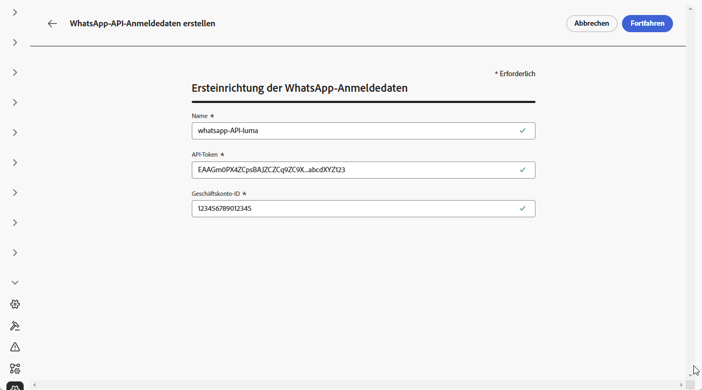

1. Klicken Sie auf **[!UICONTROL Fortfahren]**.

1. Wählen Sie das **WhatsApp-Geschäftskonto**, das mit Ihren WhatsApp-API-Anmeldedaten verbunden werden soll.

   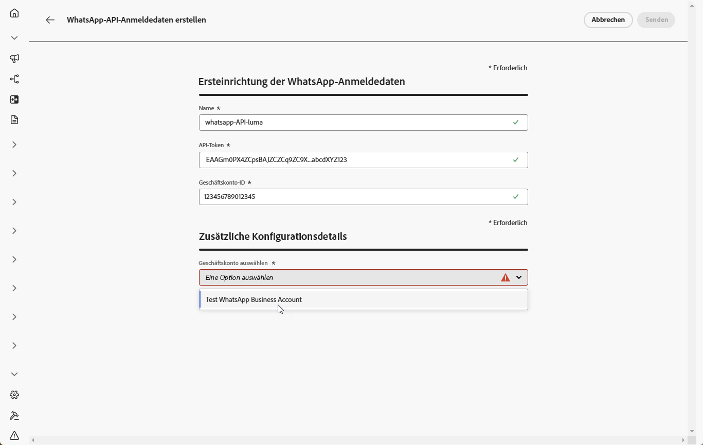

1. Wählen Sie den **Absendernamen** aus, der zum Senden Ihrer WhatsApp-Nachrichten verwendet wird.

1. Ihre Telefonnummerneinstellungen werden automatisch ausgefüllt:

   * **Qualitätsbewertung**: Spiegelt das Kunden-Feedback zu den Nachrichten wider, die in den letzten 24 Stunden gesendet wurden.
      * Grün: hohe Qualität
      * Gelb: mittlere Qualität
      * Rot: geringe Qualität

     Weitere Informationen zur [Qualitätsbewertung](https://www.facebook.com/business/help/766346674749731#)

   * **Durchsatz**: Gibt die Rate an, mit der Ihre Telefonnummer Nachrichten senden kann.

1. Wenn Sie die Konfiguration Ihrer API-Anmeldedaten abgeschlossen haben, klicken Sie auf **[!UICONTROL Senden]**.

Nachdem Sie Ihre API-Anmeldedaten erstellt und konfiguriert haben, müssen Sie nun einen Webhook für WhatsApp-Nachrichten erstellen. [Weitere Informationen](#whatsapp-webhook)

## Erstellen eines Webhook {#WhatsApp-webhook}

>[!CONTEXTUALHELP]
>id="ajo_admin_whatsapp_webhook_inbound_keyword_category"
>title="Kategorie für eingehende Keywords"
>abstract="<b>Opt-in</b>: Sendet Ihre definierte automatische Antwort, wenn Benutzende ein Abonnement abschließen.  <b>Opt-out</b>: Sendet Ihre definierte automatische Antwort, wenn Benutzende ihr Abonnement kündigen.  <b>Hilfe</b>: Sendet Ihre definierte automatische Antwort, wenn Benutzende Hilfe oder Support anfordern.  <b>Standard</b>: sendet Ihre automatische Fallback-Antwort, wenn es keine passenden Keywords gibt."

>[!CONTEXTUALHELP]
>id="ajo_admin_whatsapp_webhook_inbound_keyword"
>title="Eingeben der Keywords"
>abstract="Sie können Keywords definieren, um bestimmte automatische Antworten basierend auf den eingegebenen Nachrichten der Benutzenden auszulösen. Bei Keywords wird nicht zwischen Groß- und Kleinschreibung unterschieden, z. B. werden „stop“ und „STOP“ gleich behandelt."

>[!CONTEXTUALHELP]
>id="ajo_admin_whatsapp_webhook_webhook_url"
>title="Callback-URL"
>abstract="Die Validierungsanfrage und Webhook-Benachrichtigungen für dieses Objekt werden an die angegebene URL gesendet."

>[!CONTEXTUALHELP]
>id="ajo_admin_whatsapp_webhook_verify_token"
>title="Verifizierungs-Token"
>abstract="Das Token, das Meta zurückgibt, um die Callback-URL während des Verifizierungsprozesses zu bestätigen und zu überprüfen."

>[!NOTE]
>
>Ohne angegebene Opt-in- oder Opt-out-Keywords sind standardmäßige Einverständnisnachrichten nicht aktiviert.

Nachdem Ihre API-Anmeldedaten erfolgreich erstellt wurden, besteht der nächste Schritt darin, einen Webhook zu erstellen und Ihre Einstellungen für „eingehend“ zu konfigurieren.

1. Navigieren Sie in der linken Leiste zu **[!UICONTROL Administration]** `>` **[!UICONTROL Kanäle]**, wählen Sie das Menü **[!UICONTROL WhatsApp-Webhooks]** unter **[!UICONTROL WhatsApp-Einstellungen]** aus und klicken Sie auf die Schaltfläche **[!UICONTROL Webhook erstellen]**.

   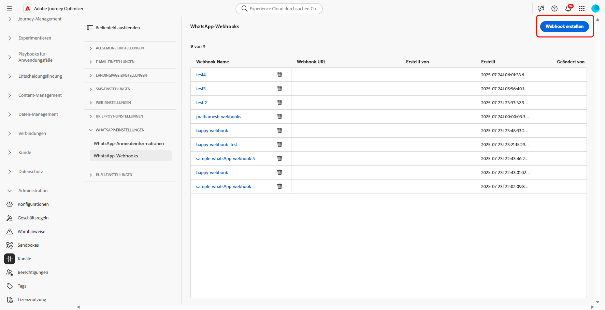

1. Geben Sie einen **[!UICONTROL Namen]** für Ihren Webhook ein.

1. Wählen Sie aus der Dropdown-Liste **[!UICONTROL Konfiguration auswählen]** die zuvor erstellten [API-Anmeldedaten](#whatsapp-credentials) aus.

   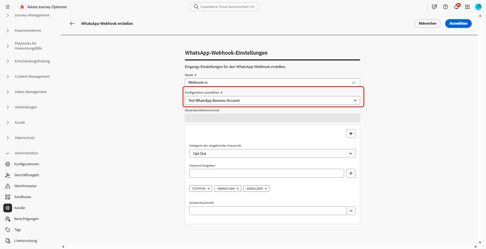

1. Wählen Sie Ihre **[!UICONTROL Kategorie für eingehende Keywords]** aus, z. B.:

   * **[!UICONTROL Opt-in-Keywords]**
   * **[!UICONTROL Opt-out-Keywords]**
   * **[!UICONTROL Hilfe-Keywords]**

1. Geben Sie Ihre **[!UICONTROL Keywords]** ein und klicken Sie auf .

   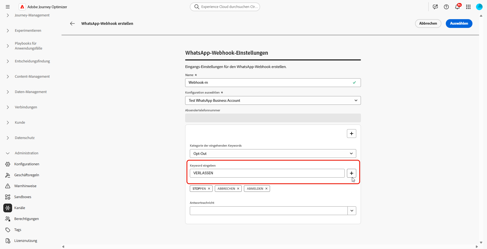

1. Geben Sie im Feld **[!UICONTROL Antwortnachricht]** die Nachricht ein, die jeweils beim Empfang eines konfigurierten Keywords gesendet wird, oder wählen Sie eine vordefinierte Option aus dem Dropdown-Menü aus.

   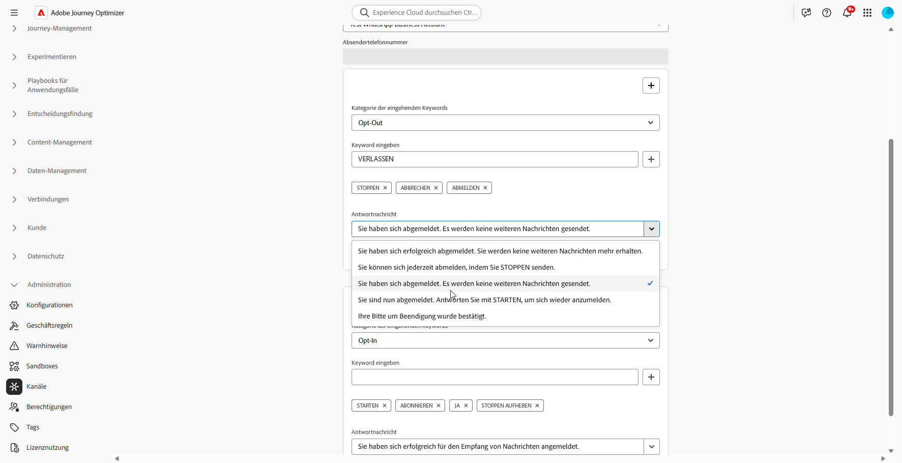

<!--
1. Click **[!UICONTROL View payload editor]** to validate and customize your request payloads. 
    
    You can dynamically personalize your payload using profile attributes, and ensure accurate data is sent for processing and response generation with the help of built-in helper functions.
-->
1. Klicken Sie auf , um ein zusätzliches **[!UICONTROL eingehendes Keyword]** hinzuzufügen.

1. Wenn Sie die Konfiguration Ihres WhatsApp-Webhooks abgeschlossen haben, klicken Sie auf **[!UICONTROL Senden]**.

1. Klicken Sie im Menü **[!UICONTROL Webhooks]** auf , um Ihren Webhook zu löschen.

   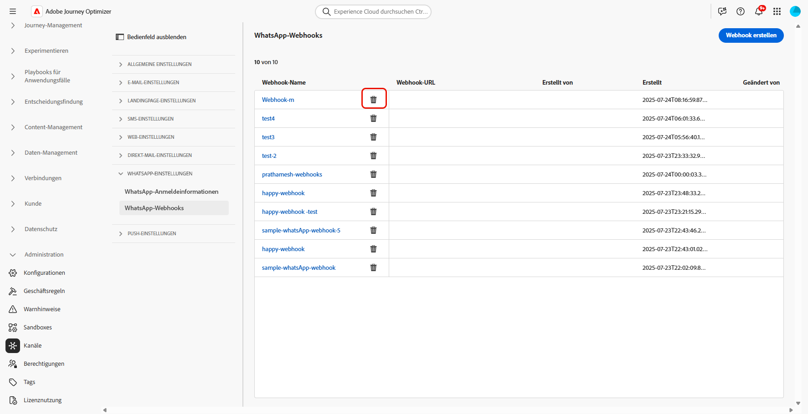

1. Um die vorhandene Konfiguration zu ändern und auf Ihre **[!UICONTROL Webhook-URL]** oder Ihr **[!UICONTROL Webhook-Verifizierungs-Token]** zuzugreifen, suchen Sie den gewünschten Webhook und klicken Sie auf die Option **[!UICONTROL Bearbeiten]**, um die erforderlichen Änderungen vorzunehmen.

1. Kopieren Sie das hier generierte **[!UICONTROL Webhook-Verifizierungs-Token]** und fügen Sie es dann im Rahmen Ihrer Webhook-Einrichtung in die Meta-Benutzeroberfläche ein.

   Ausführliche Anweisungen dazu, wie und wo dieses Verifizierungs-Token hinzugefügt werden kann, finden Sie in der [Meta-Dokumentation](https://developers.facebook.com/docs/graph-api/webhooks/getting-started#configure-webhooks-product).

1. Rufen Sie über Ihren zuvor gesendeten **[!UICONTROL WhatsApp-Webhook]** Ihre neue **[!UICONTROL Webhook-URL]** auf und kopieren Sie sie.

   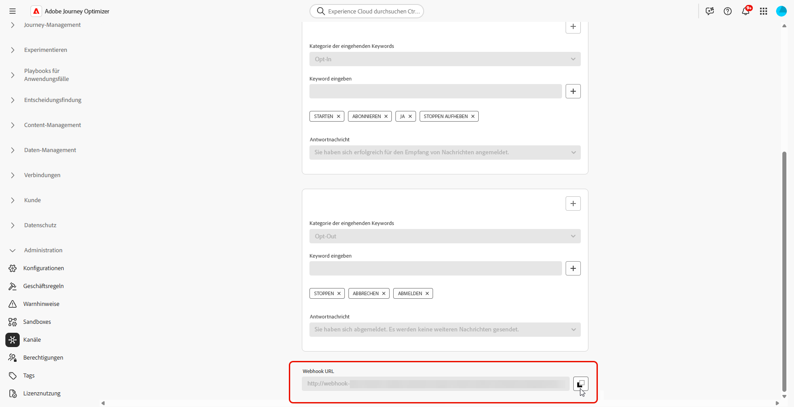

Nachdem Sie Ihren Webhook konfiguriert haben, können Sie Ihre WhatsApp-Konfiguration erstellen.

## Erstellen einer WhatsApp-Konfiguration {#whatsapp-configuration}

1. Navigieren Sie in der linken Leiste zu **[!UICONTROL Administration]** > **[!UICONTROL Kanäle]** und wählen Sie **[!UICONTROL Allgemeine Einstellungen]** > **[!UICONTROL Kanalkonfigurationen]**. Klicken Sie auf die Schaltfläche **[!UICONTROL Kanalkonfiguration erstellen]**.

   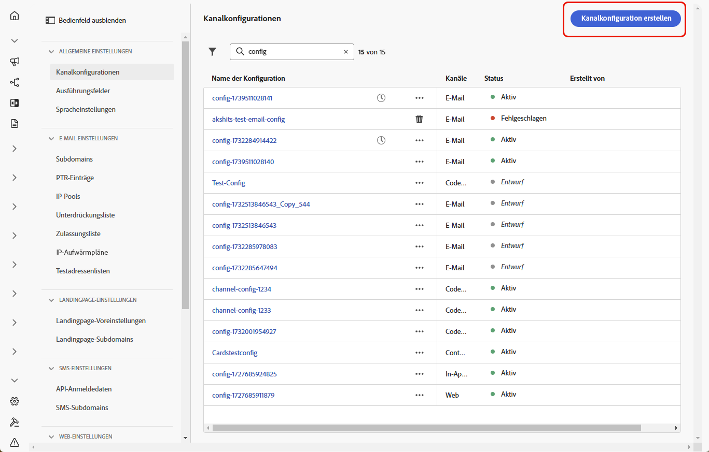

1. Geben Sie einen Namen und eine Beschreibung (optional) für die Konfiguration ein und wählen Sie dann den WhatsApp-Kanal aus.

   >[!NOTE]
   >
   > Namen müssen mit einem Buchstaben (A–Z) beginnen. Ein Name darf nur alphanumerische Zeichen enthalten. Sie können auch die Zeichen Unterstrich `_`, Punkt `.` und Bindestrich `-` verwenden.

1. Wählen Sie **[!DNL WhatsApp]** als Kanal aus.

   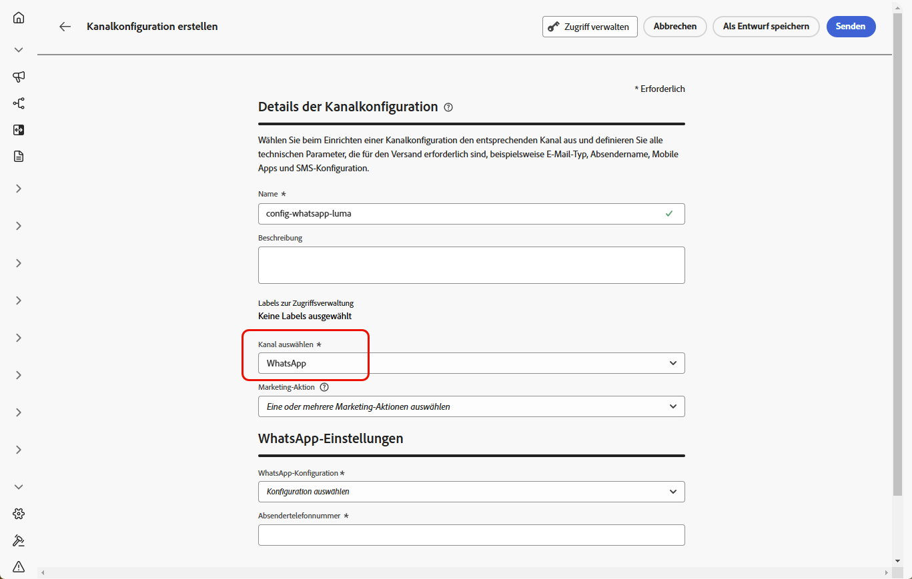

1. Wählen Sie **[!UICONTROL Marketing-Aktion(en)]** aus, um Einverständnisrichtlinien mit den Nachrichten zu verknüpfen, die diese Konfiguration verwenden. Es werden alle mit der Marketing-Aktion verknüpften Einverständnisrichtlinien genutzt, um die Präferenzen Ihrer Kundinnen und Kunden zu respektieren. Weitere Informationen

1. Wählen Sie die zuvor erstellte **[!UICONTROL WhatsApp-API-Konfiguration]** aus.

   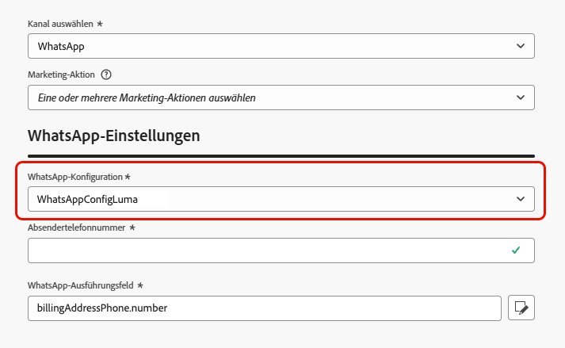

1. Geben Sie den **[!UICONTROL Absendernamen]** ein, den Sie für Ihre Kommunikation verwenden möchten.

1. Nachdem alle Parameter konfiguriert wurden, klicken Sie zur Bestätigung auf **[!UICONTROL Senden]**. Sie können die Kanalkonfiguration auch als Entwurf speichern und ihre Konfiguration später fortsetzen.

1. Nachdem die Kanalkonfiguration erstellt wurde, wird sie in der Liste mit dem Status **[!UICONTROL Verarbeitung läuft]** angezeigt.

   >[!NOTE]
   >
   >In [diesem Abschnitt](../configuration/channel-surfaces.md) erfahren Sie mehr über die möglichen Fehlerursachen, wenn die Prüfungen nicht erfolgreich sind.

1. Sobald die Prüfungen erfolgreich abgeschlossen sind, erhält die Kanalkonfiguration den Status **[!UICONTROL Aktiv]**. Sie kann nun zum Versand von Nachrichten verwendet werden.

Nach der Konfiguration können Sie alle betriebsbereiten Kanalfunktionen wie Nachrichtenbearbeitung, Personalisierung, Linktracking und Berichte nutzen.

Sie können jetzt mit Journey Optimizer WhatsApp-Nachrichten senden.

## Anleitungsvideo {#video}

Im folgenden Video erfahren Sie, wie Sie den WhatsApp-Kanal in Adobe Journey Optimizer einrichten.

+++ Siehe Video

>[!VIDEO](https://video.tv.adobe.com/v/3470268/?learn=on)

+++
